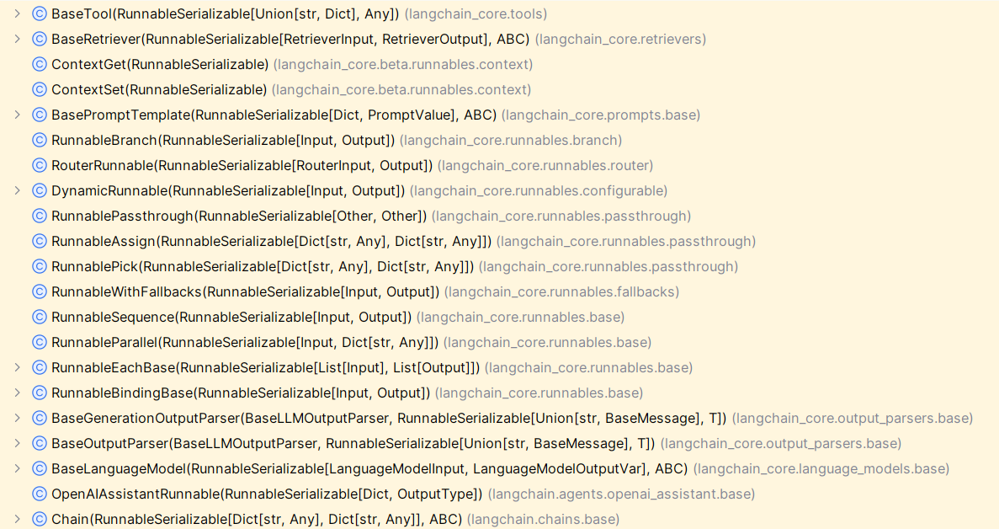
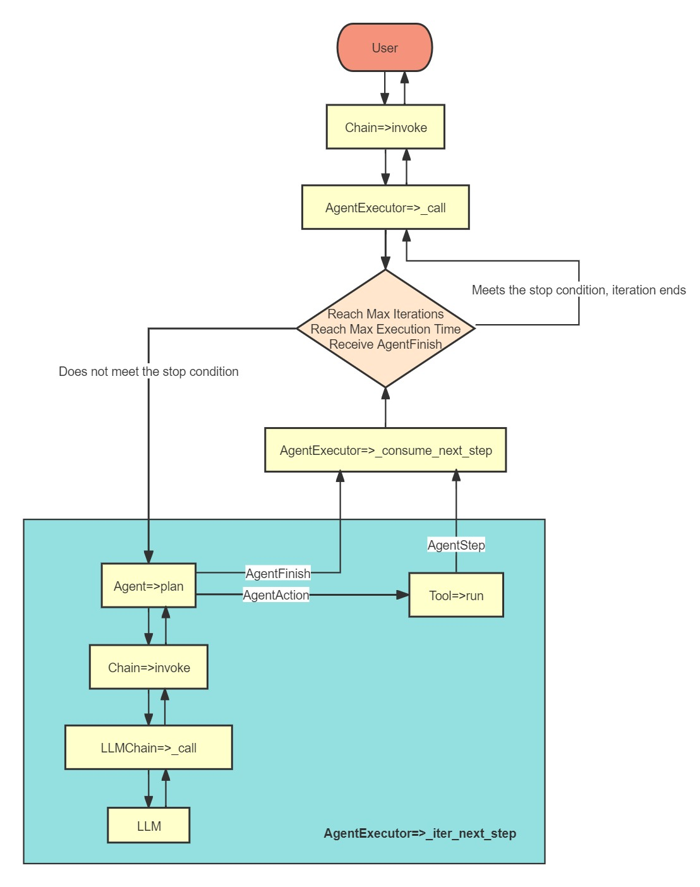

# From the Source Code Perspective, Peering into the Operation Logic of LangChain
  - Base Class of LangChain
  - LCEL and Runnable
  - Chain Source Code
  - AgentExecutor Source Code
<!-- more -->

## 1. Base Class of LangChain
Python's abstract base class is **ABC**, and LangChain's base class is its subclass, **Runnable**。

The inheritance relationship of the base class is shown in the following diagram:


Subclasses of RunnableSerializable are as follows:



Extracting the important classes, we have the following inheritance relationship:
- ABC
  - Runnable
    - Chain
      - AgentExecutor
    - BasePromptTemplate
    - BaseLanguageModel
    - BaseOutputParser    
    - BaseRetriever
    - BaseTool

## 2. LCEL and Runnable
Intuitive understanding:
- Runnable is a component
- LCEL is a way to assemble components into a finished product
### 2.1. LCEL(LangChain Expression Language) 
LCEL is a declarative way to easily combine Runnables into a Chain.

#### 2.1.1. The Way to Compose Runnables
##### 2.1.1.1. Serial(RunnableSequence)
- feature
  - Sequentially calls a series of Runnables
  - The output of one Runnable is used as the input for the next Runnable
- implementation
  - Using the pipe operator '|'
  - Passing a list of runnables to RunnableSequence
```python
from langchain_core.runnables import RunnableLambda

# A RunnableSequence constructed using the `|` operator
sequence = RunnableLambda(lambda x: x + 1) | RunnableLambda(lambda x: x * 2)
sequence.invoke(1) # output 4
sequence.batch([1, 2, 3]) # output [4, 6, 8]
```
##### 2.1.1.2. Parallel(RunnableParallel)
- feature
  - Parallel Runnables have the same input
  - Parallel Runnables each have their own output
- implementation
  - Using a dict
  - Passing a dict to RunnableParallel
```python
from langchain_core.runnables import RunnableLambda

 # A sequence that contains a RunnableParallel constructed using a dict literal
sequence = RunnableLambda(lambda x: x + 1) | {
    'mul_2': RunnableLambda(lambda x: x * 2),
    'mul_5': RunnableLambda(lambda x: x * 5)
}
sequence.invoke(1) # output {'mul_2': 4, 'mul_5': 10}
```
### 2.2. Runnable
#### 2.2.1. What
Runnable is a unit of work that can be invoked, batched, streamed, transformed and composed, meaning it can be assembled into a Chain.
#### 2.2.2. Function
- sync and async support
- batch support
- streaming support
#### 2.2.3. Key Methods
- invoke/ainvoke：an input => an output
- batch/abatch：multiple input => multiple output
- stream/astream：an input => streams output
- astream_log：an input => streams output and selected intermediate results
### 2.3. Subclasses of Runnable
- Chain
  - AgentExecutor
- BasePromptTemplate
- BaseLanguageModel
  - BaseLLM
  - BaseChatModel
- BaseOutputParser    
- BaseRetriever
- BaseTool
### 2.4. Input and output types for subclasses of Runnable
#### 2.4.1. Chain
- invoke
  - input:Dict[str, Any]
  - output:Dict[str, Any]
- \_\_call\_\_
  - input:Union[Dict[str, Any], Any]
  - output:Dict[str, Any]
- run
  - input:Any
  - output:Any
#### 2.4.2. BasePromptTemplate
- invoke
  - input:Dict
  - output:PromptValue
#### 2.4.3. BaseLLM
- invoke
  - input:Union[PromptValue, str, Sequence[BaseMessage]]
  - output:str
#### 2.4.4. BaseChatModel
- invoke
  - input:Union[PromptValue, str, Sequence[BaseMessage]]
  - output:BaseMessage
#### 2.4.5. BaseOutputParser
- invoke
  - input:Union[str, BaseMessage]
  - output:T
#### 2.4.6. BaseRetriever
- invoke
  - input:str
  - output:List[Document]
#### 2.4.7. BaseTool
- invoke
  - input:Union[str, Dict]
  - output:Any
## 3. Chain
### 3.1. What
- Abstract base class
- Usage：Construct sequences of calls
- Feature
  - Stateful: add Memory to any Chain to give it state
  - Observable: pass Callbacks to a Chain to execute additional functionality, like logging, outside the main sequence of component calls
  - Composable: the Chain API is flexible enough that it is easy to combine Chains with other components, including other Chains
### 3.2. Attributes of Chain
- Memory：At the start, memory loads variables and passes them along in the chain. At the end, it saves any returned variables(inputs and outputs).
- Callbacks：Callback handlers are called throughout the lifecycle of a call to a chain, starting with on_chain_start, ending with on_chain_end or on_chain_error.
### 3.3. The Source Code Interpretation of Chain
Source Code Entrance：Chain.invoke method

Source code Location：in langchain.chains.base.py
```python
def invoke(
    self,
    input: Dict[str, Any],
    config: Optional[RunnableConfig] = None,
    **kwargs: Any,
) -> Dict[str, Any]:
    config = ensure_config(config)
    callbacks = config.get("callbacks")
    tags = config.get("tags")
    metadata = config.get("metadata")
    run_name = config.get("run_name")
    include_run_info = kwargs.get("include_run_info", False)
    return_only_outputs = kwargs.get("return_only_outputs", False)

    inputs = self.prep_inputs(input) # Validating and preparing the input for the chain, including adding memory to input
    callback_manager = CallbackManager.configure(
        callbacks,
        self.callbacks,
        self.verbose,
        tags,
        self.tags,
        metadata,
        self.metadata,
    )
    new_arg_supported = inspect.signature(self._call).parameters.get("run_manager") # Checking for support for run_manager, that is, to see if the _call method has the relevant parameters
    run_manager = callback_manager.on_chain_start(
        dumpd(self),
        inputs,
        name=run_name,
    )
    try:
        outputs = (
            self._call(inputs, run_manager=run_manager) # Implementation by subclass of Chain
            if new_arg_supported
            else self._call(inputs)
        )
    except BaseException as e:
        run_manager.on_chain_error(e)
        raise e
    run_manager.on_chain_end(outputs)
    final_outputs: Dict[str, Any] = self.prep_outputs( # Validating and preparing the output of the chain and saving the information of this run into memory
        inputs, outputs, return_only_outputs
    )
    if include_run_info:
        final_outputs[RUN_KEY] = RunInfo(run_id=run_manager.run_id)
    return final_outputs
```
source code logic of invoke method：
- prep_inputs: validating and preparing the input for the chain, including adding memory to input
  - memory.load_memory_variables: related to memory
- callback.on_chain_start: related to callback
- **self._call: 
	Abstract method, implemented by subclasses of Chain**
- callback.on_chain_error: related to callback
- callback.on_chain_end: related to callback
- prep_outputs: Validating and preparing the output of the chain and saving the information of this run into memory
  - memory.save_context: related to memory，saving inputs and outputs into memory
## 4. AgentExecutor
### 4.1. What
- Subclass of Chain
- Intelligent agents that can use tools, have memory, and make dynamic decisions
- AgentExecutor = Agent + Memory + Tools
- Carrying out multiple rounds of iterative execution in response to user questions, ultimately returning results
### 4.2. Attribute of AgentExecutor
- Memory：Inherits from the parent class Chain
- Callbacks：Inherits from the parent class Chain
- Agent：Deciding the behavior of each step in iterative execution
- Tools：Tools that can be used
- Max Iterations
- Max Execution Time
### 4.3. The Source Code Interpretation of AgentExecutor
#### Step1：Chain.invoke
AgentExecutor does not override the invoke method and will call the parent class's invoke method.
#### Step2：AgentExecutor._call(Iterator, executing iteratively in a loop)
```python
    def _call(
        self,
        inputs: Dict[str, str],
        run_manager: Optional[CallbackManagerForChainRun] = None,
    ) -> Dict[str, Any]:
        """Run text through and get agent response."""
        # Construct a mapping of tool name to tool for easy lookup
        name_to_tool_map = {tool.name: tool for tool in self.tools}
        # We construct a mapping from each tool to a color, used for logging.
        color_mapping = get_color_mapping(
            [tool.name for tool in self.tools], excluded_colors=["green", "red"]
        )
        intermediate_steps: List[Tuple[AgentAction, str]] = []
        # Let's start tracking the number of iterations and time elapsed
        iterations = 0
        time_elapsed = 0.0
        start_time = time.time()
        # We now enter the agent loop (until it returns something).
        while self._should_continue(iterations, time_elapsed):
            next_step_output = self._take_next_step(
                name_to_tool_map,
                color_mapping,
                inputs,
                intermediate_steps,
                run_manager=run_manager,
            )
            if isinstance(next_step_output, AgentFinish):
                return self._return(
                    next_step_output, intermediate_steps, run_manager=run_manager
                )

            intermediate_steps.extend(next_step_output)
            if len(next_step_output) == 1:
                next_step_action = next_step_output[0]
                # See if tool should return directly
                tool_return = self._get_tool_return(next_step_action)
                if tool_return is not None:
                    return self._return(
                        tool_return, intermediate_steps, run_manager=run_manager
                    )
            iterations += 1
            time_elapsed = time.time() - start_time
        output = self.agent.return_stopped_response(
            self.early_stopping_method, intermediate_steps, **inputs
        )
        return self._return(output, intermediate_steps, run_manager=run_manager)
```
source code logic of _call method：
- while _should_continue：iterator
  - _take_next_step：iterator method
#### Step3：Iteration Stop Condition:
- Reach Max Iterations：iterations>=self.max_iterations
- Reach Max Execution Time：time_elapsed>=self.max_execution_time
- Receive AgentFinish：isinstance(next_step_output, AgentFinish)
#### Step4：_take_next_step(iterator method)
```python
    def _take_next_step(
        self,
        name_to_tool_map: Dict[str, BaseTool],
        color_mapping: Dict[str, str],
        inputs: Dict[str, str],
        intermediate_steps: List[Tuple[AgentAction, str]],
        run_manager: Optional[CallbackManagerForChainRun] = None,
    ) -> Union[AgentFinish, List[Tuple[AgentAction, str]]]:
        return self._consume_next_step(
            [
                a
                for a in self._iter_next_step(
                    name_to_tool_map,
                    color_mapping,
                    inputs,
                    intermediate_steps,
                    run_manager,
                )
            ]
        )
```
source code logic of _take_next_step method：
- _iter_next_step
  - agent.plan
  - tool.run
- _consume_next_step
#### Step5：_iter_next_step
source code logic of _iter_next_step method：
- 1. Call an LLM to generate a plan (the plan is either AgentFinish or AgentAction).
- 2. If it's AgentFinish, return and end the process.
- 3. If it's AgentAction, call the corresponding tool.
- 4. Generate an observation using the corresponding tool.
- 5. Generate and return AgentStep(action=agent_action, observation=observation), and then end.
#### Step6：_consume_next_step
```python
def _consume_next_step(
    self, values: NextStepOutput
) -> Union[AgentFinish, List[Tuple[AgentAction, str]]]:
    if isinstance(values[-1], AgentFinish):
        assert len(values) == 1
        return values[-1]
    else:
        return [
            (a.action, a.observation) for a in values if isinstance(a, AgentStep)
        ]
```
source code logic of _consume_next_step method：
- If it's AgentFinish, return directly.
- If it's AgentStep, then convert to List[Tuple[AgentAction, str]] and return.
### 4.4. Summary of the AgentExecutor Source Code


More Details：

