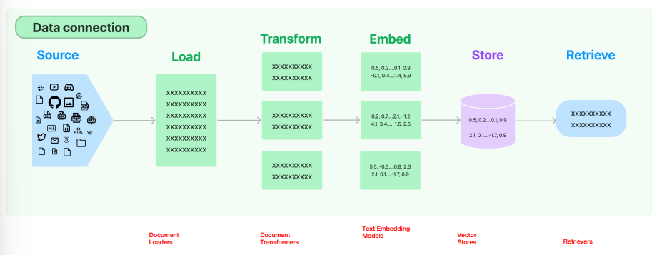

# RAG Workflow
  - 1. Raw Data Processing Flow
  - 2. RAG Process in Q&A Scenarios
  - 3. RAG Optimization Points
  - 4. Prompts in RAG Scenarios
  - 5. Text Segmentation Methods
<!-- more -->

## 1. Raw Data Processing Flow

- Raw Data
- Data Loader
- Data Transformer(Data Cleaning)
- Data Split
  - Split into multiple Chunks
  - Balance in chunk size
- Data Vectorization
  - Represent each Chunk as a Vector
  - Text Embedding Model
- Data Vector Store
- Data Retriever

## 2. RAG Process in Q&A Scenarios

- 1. User initiates a question Query
- 2. The user’s question Query is vectorized using an Embedding Model
- 3. Obtain the vectorized user question as a Query Vector
- 4. Retrieve from the Vector Database using the Query Vector
  - Use of vector databases as external knowledge bases
- 5. Retrieve the Top K vectors based on semantic similarity
- 6. Use the semantic content of the Top K vectors along with the user Query as a Prompt to the LLM
- 7. LLM generates an answer based on the user's query and the retrieved data
- 8. User receives the answer

## 3. RAG Optimization Points
- For step2
  - When vectorizing the Query, consider if it requires processing -> Refined Query
- For step5
  - Separate Recall and Ranking processes
  - Recall (e.g., recall 50 relevant data points from the vector database) => Ranking (e.g., rank the 50 recalled data points and select the top 3)

## 4. Prompts in RAG Scenarios
- Instruction
- Context => Retrieval
- Input => Query
- History

## 5. Text Segmentation Methods
- Purpose
  - Enable retrieval of content more relevant to the Query  
- Methods
  - Split by sentences
  - Fixed window character count
  - Moving window character count
  - Recursive method: RecursiveCharacterTextSplitter (fixed window + semantic segmentation; used by LangChain; commonly applied)
  - Split by semantics (more complex to implement; may result in chunks that are too long or too short)

