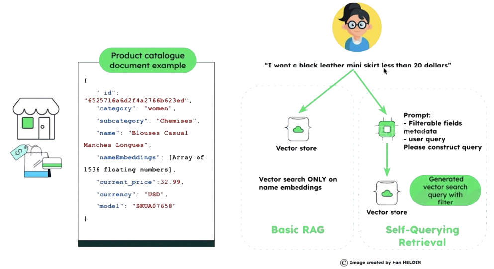
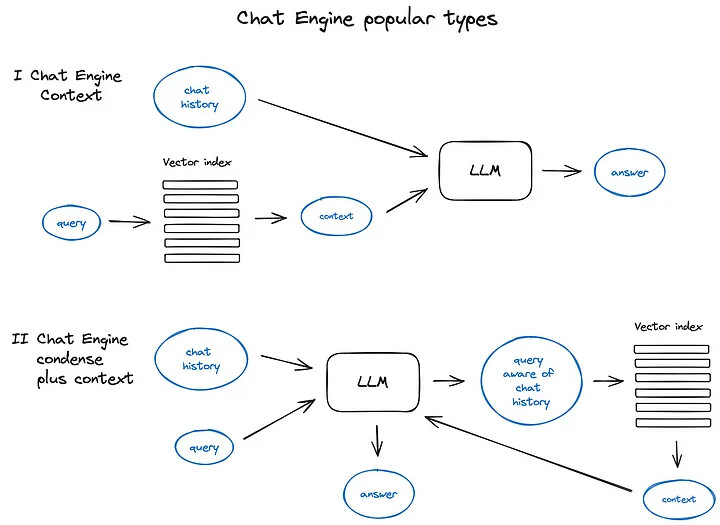
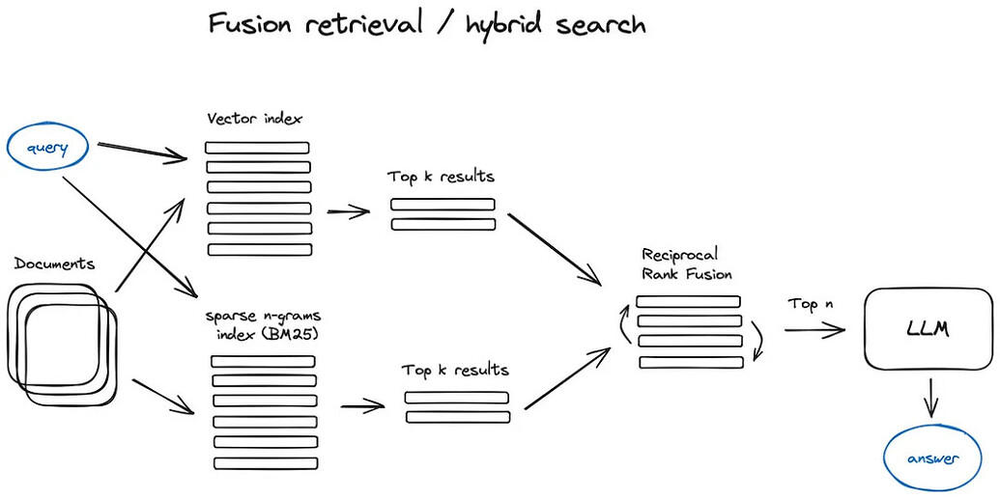
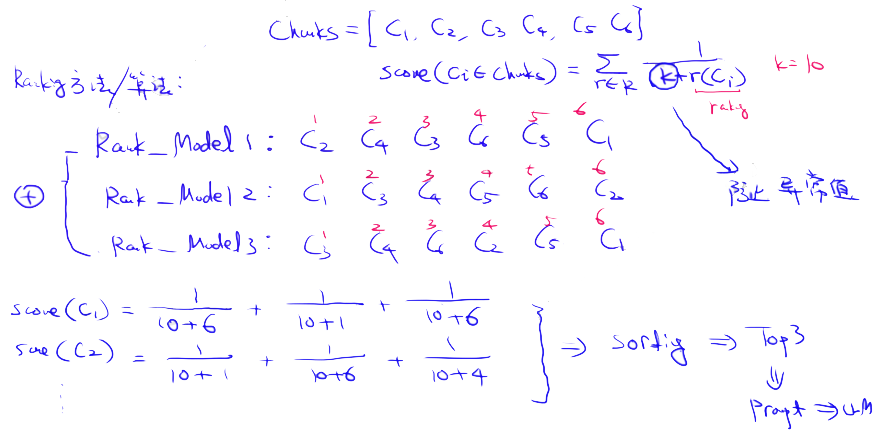
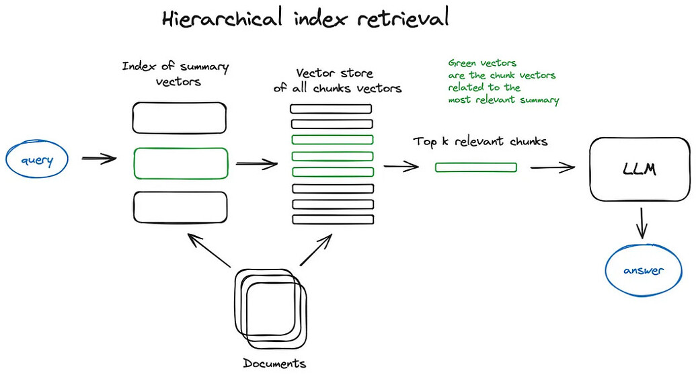

# RAG Workflow
  - Raw Data Processing Flow
  - RAG Process in Q&A Scenarios
  - RAG Optimization Points
  - RAG Optimization: Query / Retriever / Ranking / Indexing Optimization
<!-- more -->

## 1. Raw Data Processing Flow

- 1. Raw Data
- 2. Data Loader
- 3. Data Transformer / Data Cleaning / Data Parsing
- 4. Data Split
  - Split into multiple Chunks
  - Balance in chunk size
- 5. Data Vectorization
  - Represent each Chunk as a Vector
  - Text Embedding Model
- 6. Data Vector Store
  - vector database
  - indexing
- 7. Data Retriever

## 2. RAG Process in Q&A Scenarios

- 1. User initiates a question Query
- 2. The user’s question Query is vectorized using an Embedding Model
- 3. Obtain the vectorized user question as a Query Vector
- 4. Retrieve from the Vector Database using the Query Vector
  - Use of vector databases as external knowledge bases
- 5. Retrieve the Top K vectors based on semantic similarity
- 6. Use the semantic content of the Top K vectors along with the user Query as a Prompt to the LLM
- 7. LLM generates an answer based on the user's query and the retrieved data
- 8. User receives the answer

The RAG construction and Q&A steps are generally summarised in three points
- Indexing
- Retrieval
- Generation
## 3. RAG Optimization Points
### 3.1. Optimization Points for Native Data Processing Flow
- For step1: Native Data
  - Knowledge Graph
    - Increasingly, Knowledge Graphs are introduced into RAG (Retrieval-Augmented Generation) tasks, such as:
      - KnowledGPT for the inference stage
      - SUGRE for the fine-tuning stage
- For step3: Document Parsing
  - Challenges: Different document types (e.g., pdf, html, ppt) require different parsing methods; documents are often unstructured and contain tables, formulas, images, etc., which are difficult to parse; multimodal data such as text, images, audio, and video.
  - Tables
    - Challenges:
      - Text segmentation can separate tables, leading to data corruption
      - Using tables as retrieval data complicates the semantic similarity search process
    - Solutions:
      - Execute Text-2-SQL queries through code
      - Convert tables into descriptive text
  - Consider the accuracy of parsing
- For step4: Text Segmentation
  - Challenges: Different segmentation methods impact subsequent tasks
  - Consider choices and parameters for chunking, as well as the cost of trying different algorithms
  - Chunk Size: If the segmentation granularity is too large, each chunk contains more information, providing more context in a single return; if too small, retrieval can be more accurate for the most relevant chunks
  - Research on chunk size can be found in the NodeParser class of LlamaIndex, which provides some advanced options, such as defining custom text segmenters, metadata, node/chunk relationships, etc.
- For step6: Vector Indexing
  - Choice of different vector databases
  - Choice of different indexing methods
  - Optimization of the index
    - Add metadata (e.g., time, type, title, subtitle, part of document)

### 3.2. Optimization Points in RAG for Q&A Scenarios
- For step2: Query Vectorization
  - During query vectorization, decide whether query processing (query cleaning) is needed → Refined Query
  - User queries may be incomplete, inaccurate, complex, or not a coherent sentence
- For step5: Retrieve Top K
  - Evaluate whether the retrieved items are sufficient to answer the question or if many are redundant
  - Separate Recall and Ranking processes
  - Recall (e.g., retrieve 50 relevant items from the vector database) => Ranking (e.g., rank the 50 items and select the top 3)
  - Determine whether sorting is necessary and how to sort
- For step7: Obtaining the LLM Response
  - Post-processing
  - In LlamaIndex, a variety of Postprocessors are available, which can filter results based on similarity score, keywords, metadata, or rerank them with other models like an LLM, a sentence-transformer cross-encoder, or Cohere’s reranking endpoint, or based on metadata like date recency — essentially, all types of processing one could imagine.

## 4. Prompts in RAG Scenarios
- Instruction
- Context => Retrieval
- Input => Query
- History

## 5. Text Segmentation Methods
- Purpose
  - Enable retrieval of content more relevant to the Query  
- Methods
  - Split by sentences
  - Fixed window character count
  - Moving window character count
  - Recursive method: RecursiveCharacterTextSplitter (fixed window + semantic segmentation; used by LangChain; commonly applied)
  - Split by semantics (more complex to implement; may result in chunks that are too long or too short)

## 6. RAG Optimization —— Query Optimization
- Rewrite
- Expand
### 6.1. Case1: Self-Querying Retrieval
- Transform the Query through information extraction: Self-Querying Retrieval
  - Convert natural language Query into a structured Query through an LLM
  - Store metadata alongside embeddings in the vector database
    - Attributes: metadata (can filter by attributes first)
    - Non-attributes: embedding content information (semantic search follows)

> In the illustration, only the product name undergoes semantic embedding; other information is stored as metadata attributes.

Approach:
- 1. Transform the Query through an LLM into a structured Query, separating metadata from the embedding content
- 2. Filter in the Vector Database using metadata
- 3. Perform a vector search in the Vector Database using the embedding portion

LangChain's Self-Querying Retrieval

https://python.langchain.com/docs/how_to/self_query/

### 6.2. Case2: MultiQueryRetriever
Query Expansion with multiple related questions

Scenario:
- Comparison of multiple products: comparing Xiaomi, Huawei, and Samsung foldable phones from various dimensions, summarized in a table
- Incomplete question: rewrite it into several sub-questions from different perspectives, consult the LLM, then summarize

Approach:
- 1. Break down the Query into multiple SubQueries through the LLM
- 2. Retrieve outputs for each SubQuery in parallel using the LLM
- 3. Aggregate the outputs into a final result using another LLM

Implementation:
- LangChain's MultiQueryRetriever
  - https://python.langchain.com/docs/how_to/MultiQueryRetriever/
- LlamaIndex's SubQuestionQueryEngine

### 6.3. Case3: Step-Back Prompting
Approach:
- 1. Use the LLM to abstract the Query into a “step-back question”
- 2. Generate a response to the Stepback Question using the LLM
- 3. Combine the original Query with the Stepback Answer to obtain the final result via the LLM

Take a Step Back: Evoking Reasoning via Abstraction in Large Language Models

https://arxiv.org/abs/2310.06117

### 6.4. Case4: Combining Query and History
Two combination methods:
- Retrieve from the Vector Database with the Query first, then combine with History (ContextChatEngine)
- Combine Query with History first, then retrieve from the Vector Database (CondensePlusContextMode)

### 6.5. Case5: Hypothetical Answer / Hypothetical Document
Embeddings (HyDE)
Use a generated answer to expand the Query

Approach:
- 1. Generate an Answer to the Query using the LLM
- 2. Combine the Query and Answer to retrieve from the Vector Database

Paper: https://boston.lti.cs.cmu.edu/luyug/HyDE/HyDE.pdf

The logic is the reverse of the hypothetical question approach in Indexing optimization.

### 6.6. Case6: Query Rewriting
Use large language models to reconstruct the initial Query to improve retrieval effectiveness. LangChain and LlamaIndex both have implementations; however, LlamaIndex's solution is generally more robust in this regard.

### 6.7. Case7: Query Routing
Query routing is a decision step based on LLMs.

Query routers are also used to select the appropriate index or a broader data storage location for handling user queries.

- Implementation:
  - llamaindex
    - https://docs.llamaindex.ai/en/stable/module_guides/querying/router/
  - langchain
    - https://python.langchain.com/docs/how_to/routing/

## 7. RAG Optimization —— Retriever Optimization
### 7.1. Case1: Sentence Window Retrieval
Concept: The idea is to retrieve smaller chunks to improve search quality while including surrounding context for LLM reasoning.  
Goal: Obtain as much context as possible, while fine-grained chunks increase accuracy.  
Idea: Neighboring chunks of the retrieved chunk are likely also relevant to the Query, so return these chunks along with the primary result.  
Drawback: The context size can become too large.

Approach:
- 1. Treat each sentence in the document as a Chunk to improve search accuracy
- 2. Expand the retrieved key sentence with k sentences before and after and return the result

### 7.2. Case2: Parent-Child Chunks Retrieval / from Small to Big
Concept: The idea is to retrieve smaller chunks to improve search quality while including surrounding context for LLM reasoning.
Idea: Similar to Sentence Window Retrieval — it aims to search for finer pieces of information and then expands the context window before passing it to the LLM for reasoning.

Approach:
- 1. Divide the document into Parent Chunks with coarse granularity; each Parent Chunk is further subdivided into Child Chunks, stored in the Vector Database
- 2. Retrieve relevant Child Chunks from the Vector Database with the Query
- 3. Return the Parent Chunks (de-duplicated results) containing the retrieved Child Chunks

For a more in-depth understanding, check out LlamaIndex’s tutorial on recursive retrieval and node referencing.

### 7.3. Case3: Fusion Retrieval
Combines keyword search and semantic search, integrating dense and sparse search.

## 8. RAG Optimization —— Ranking Optimization
- Coarse Ranking and Fine Ranking
  - Coarse Ranking: Indexing within the Vector Database
  - Fine Ranking: Sorting results after retrieval from the Vector Database

### 8.1. Reciprocal Rank Fusion (RRF) Algorithm

The key here is to correctly combine retrieval results with different similarity scores. This problem is often addressed by the Reciprocal Rank Fusion algorithm, which re-ranks the retrieval results to produce a final output.

In LangChain, this feature is implemented through the Ensemble Retriever class, which combines a series of retrievers you define, such as a faiss vector index and a BM25-based retriever, and uses the Reciprocal Rank Fusion algorithm (RRF) for result re-ranking. In LlamaIndex, the implementation is very similar.

## 9. RAG Optimization —— Indexing Optimization
### 9.1. Hierarchical Indexing
Create two indexes — one composed of summaries and another of document chunks — then perform a two-step search: filter relevant documents via summaries first, then search within this filtered set.

### 9.2. Hypothetical Question
Let the LLM generate a hypothetical question for each chunk, then embed these questions as vectors, replacing chunk vectors with question vectors.

Due to the higher semantic similarity between the Query and hypothetical questions, search quality is improved.

This approach is the reverse logic of the Hypothetical Answer method in Query optimization.

## 10. RAG Optimization —— Other Optimizations
### Reference Citations
Determine whether it is possible to accurately trace back to the source of the answer.

## 11. GraphRAG  
Leveraging Knowledge Graphs to Capture Complex Relationships Between Entities, Especially Suitable for Handling Data Rich in Relations

Scenario: Suppose we are developing an intelligent question-answering system to answer questions about historical figures and their interrelationships.

Question: The user asks, "Who were Alexander the Great's generals, and what battles did they participate in together?"

Traditional RAG Challenges:  
- Traditional RAG might retrieve documents about Alexander the Great and his generals, but these documents might contain only partial information or be scattered across different documents.  
- It may struggle to extract and integrate all relevant information from the retrieved texts, especially when this information spans multiple documents and contexts.

GraphRAG Solution:  
- 1. **Constructing the Knowledge Graph**: GraphRAG first extracts entities (such as Alexander the Great and his generals) and relationships (such as command relationships and participation in battles) from historical literature and materials to build a knowledge graph.  
- 2. **Graph Querying**: The user's query is converted into a graph query, where the system searches the knowledge graph for nodes related to Alexander the Great's generals and the battle nodes connected to them.  
- 3. **Extracting Subgraphs**: The system retrieves not only individual nodes but also the relationships between those nodes, forming a subgraph that includes all relevant generals and battle information.  
- 4. **Generating the Answer**: GraphRAG uses this subgraph as context to guide the language model in generating a detailed answer that includes not only the names of the generals but also the battles they participated in together.

Pros and Cons  
- Pros: Able to capture and represent complex relationships between entities, integrating and retrieving information spread across different documents.  
- Cons: High cost of building and maintaining the knowledge graph, as well as the technical challenges of managing complex graph structures. It also faces difficulties when handling abstract concepts.

## 12. HybridRAG  
Paper Name: HybridRAG: Integrating Knowledge Graphs and Vector Retrieval Augmented Generation for Efficient Information Extraction

Paper: https://arxiv.org/pdf/2408.04948v1

- 1. **Information Retrieval**: Information related to the query is retrieved from external documents using vector databases for broad, similarity-based retrieval (VectorRAG part), and at the same time, structured and relationship-rich contextual data is retrieved from the knowledge graph (GraphRAG part).  
- 2. **Context Integration**: The information retrieval results from VectorRAG are integrated with the precise relationship data from GraphRAG to form a unified context.  
- 3. **Generating the Answer**: The large language model (LLM) generates the final answer based on the integrated context.

## 13. References
- [Advanced RAG Techniques: an Illustrated Overview](https://pub.towardsai.net/advanced-rag-techniques-an-illustrated-overview-04d193d8fec6) 
