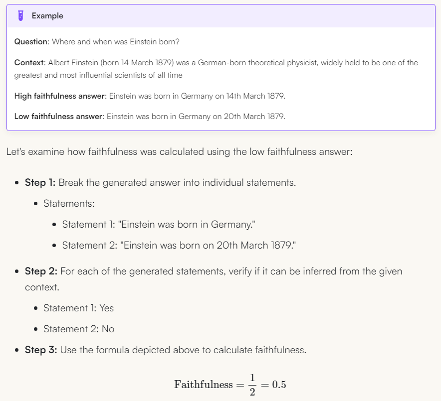
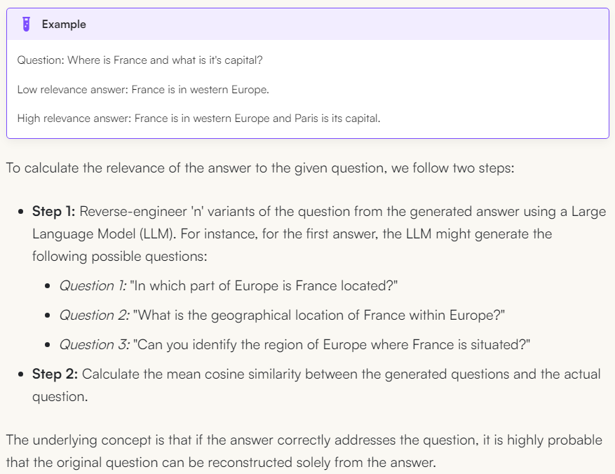
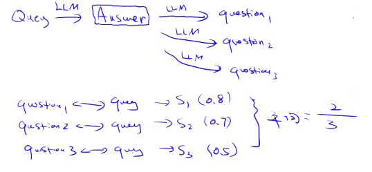

# RAG Evaluation Metrics
  - How to Evaluate RAG
  - Generation Evaluation
  - Retrieval Evaluation
<!-- more -->

## 1. How to Evaluate RAG
Evaluation Framework
- ragas 
  - https://docs.ragas.io/en/stable/concepts/metrics/available_metrics/
- RAGChecker

Ragas: RAG can be evaluated using 4 metrics. Two of the metrics are inclined towards LLMs and two towards context.


- Generation Evaluation
  - Faithfulness
  - Answer Relevancy
  - ROUGE
    - latency of online pipeline
    - cost of offline pipeline
  - BLUE
  - BertScore
  - LLM as a Judge
  - Other
    - Latency
    - Diversity
    - Noise Robustness
    - Negative Rejection
    - Counterfactual Robustness
    - Information Integration
- Retrieval Evaluation
  - Context Precision
  - Context Recall
  - OpenAI
    - Hit Rate
    - MAP (Mean Average Precision)
    - MRR (Mean Reciprocal Rank) 
    - NDCG (Normalized Discounted Cumulative Gain) 
  - Common
    - Precision
    - Recall
    - F1
    - AUC (Area Under Curve)
  
## 2. LLM-related Metrics / Generation Evaluation
### 2.1. Faithfulness
  - Faithfulness metric measures the factual consistency of the generated answer against the given context.

$$\text{Faithfulness score} = {|\text{Number of claims in the generated answer that can be inferred from given context}| \over |\text{Total number of claims in the generated answer}|}$$

> Split the answer (using llm) and try to check it against the facts (using llm) and the percentage that matches the facts is the result.
> If the answer can’t be reconciled as a fact, then the answer is hallucinated.
  



### 2.2. Answer Relevancy
  - Response Relevancy metric focuses on assessing how relevant the generated answer is to the given prompt.
  - Lower scores are assigned to answers that are incomplete or contain redundant information, and higher scores indicate better relevance.
  - Importantly, our assessment of answer relevance does not consider factuality, but rather penalises answers that lack completeness or contain redundant details.
  - Assuming that the model provides a large amount of context, which the model utilises to answer the question, but the answer is far from the user's original need, this metric evaluates the relevance of the answer provided by the model.


> Generate several corresponding problems from the answers in reverse, and then calculate the average cosine similarity between the generated problems and the actual problem





### 2.3. ROUGE
The ROUGE metric is primarily used to evaluate the quality of text summarization. It measures text similarity by calculating the lexical overlap between generated text and reference text, with a particular focus on word coverage in the text.

ROUGE has several variants, including:

- ROUGE-N: Calculates the overlap of N-grams between generated and reference text (e.g., ROUGE-1 represents unigrams, ROUGE-2 represents bigrams, etc.). It is suitable for evaluating the fine details of word order and repetition patterns.
- ROUGE-L: Scores based on the Longest Common Subsequence (LCS), taking word order into account, and is well-suited for handling longer sentences.
- ROUGE-W: Assigns higher weight to longer, contiguous matching subsequences, making it suitable for paragraph-level summarization.
- ROUGE-S: Counts the co-occurrence of adjacent word pairs in sentences, allowing for gaps between words.

ROUGE scores include Precision, Recall, and F-Score, with ROUGE often emphasizing Recall, as the coverage of important information is crucial in text summarization.

Applications:
ROUGE performs well in tasks like text summarization, document generation, and question answering, especially where the importance of information coverage is emphasized.

- ROUGE
  - latency of online pipeline
  - cost of offline pipeline

### 2.4. BLEU
BLEU is one of the most widely used evaluation metrics in the field of machine translation. Unlike ROUGE, BLEU primarily focuses on the precise matching of N-grams between generated and reference text. BLEU reflects the accuracy of generated content by calculating the proportion of matching N-grams in the generated sentence and the reference sentence.

Key elements of BLEU scoring include:

- N-gram Matching: Calculates the matching rate of N-grams (commonly n=1 to 4) between the generated and reference sentences, measuring the lexical accuracy of generated content.
- Brevity Penalty: If the generated text is significantly shorter than the reference text, the score is reduced to prevent the generation of overly short content to inflate match rates.

BLEU’s calculation typically includes multiple reference translations, so slight variations in the generated content for any one reference text do not significantly impact the overall score.

Applications:
BLEU is widely used in machine translation, dialogue generation, and image captioning tasks, making it suitable for evaluations that prioritize the accuracy of generated content. BLEU has limitations, such as its inability to consider the fluency or grammaticality of generated text.

Summary of Differences and Applications
ROUGE emphasizes Recall, making it suitable for evaluating information coverage, and is commonly used in text summarization tasks;
BLEU emphasizes Precision, making it suitable for evaluating content accuracy and is commonly used in machine translation tasks.

### 2.5. BertScore
BertScore leverages the contextual embedding from pre-trained
transformers like BERT to evaluate the semantic similarity between generated text
and reference text. BertScore computes token-level similarity using contextual embedding and produces precision, recall, and F1 scores. Unlike n-gram-based metrics, BertScore captures the meaning of words in context, making it more robust to
paraphrasing and more sensitive to semantic equivalence.

### 2.6. LLM as a Judge
Using “LLM as a Judge” for evaluating generated text is a more recent approach. In this method, LLMs are used to score the generated text based on criteria such as coherence, relevance, and fluency. The LLM can be optionally finetuned on human judgments to predict the quality of unseen text or used to generate evaluations in a zero-shot or few-shot setting. This approach leverages the LLM’s understanding of language and context to provide a more nuanced text quality assessment.

This methodology encompasses critical aspects of content assessment, including coherence, relevance, fluency, coverage, diversity, and detail - both in the
context of answer evaluation and query formulation.

### 2.7. Other
- Latency
  - Latency measures the time taken by the RAG system to finish the response of one query. It is a critical factor for user experience, especially in interactive applications such as chatbots or search engines.
  - Single Query Latency： The mean time is taken to process a single query, including both retrieval and generating phases.
- Diversity
  - Diversity evaluates the variety and breadth of information retrieved and generated
by the RAG system. It ensures that the system can provide a wide range of perspectives and avoid redundancy in responses.
  - Cosine Similarity / Cosine Distance: The cosine similarity/distance calculates embeddings of retrieved documents or generated responses. Lower cosine similarity scores indicate higher diversity, suggesting that the system can retrieve or generate a broader spectrum of information.
- Noise Robustness
  - Noise Robustness measures the RAG system’s ability to handle irrelevant or misleading information without compromising the quality of the response.
  - Misleading Rate 和 Mistake Reappearance Rate 
- Negative Rejection
  - Negative Rejection evaluates the system’s capability to withhold responses when
the available information is insufficient or too ambiguous to provide an accurate answer 
  - Rejection Rate：The rate at which the system refrains from generating a response.
- Counterfactual Robustness
  - Counterfactual robustness assesses the system’s ability to identify and disregard incorrect or counterfactual information within the retrieved documents
  - Error Detection Rate：The ratio of counterfactual statements detected in retrieved information.
- Information Integration
  - integrate answers from multiple document

## 3 Context-related Metrics / Retrieval Evaluation
### 3.1. Context Precision
  - precision = number of docs relevant to the query in retrieved docs / total number of retrieved docs
  - Most useful from the customer perspective, as there can be scenarios where model accuracy is high, but context precision is low.
  - Classic RAG scenario can be thought of as being able to put more and more context in the context window, however as the model gets more context, the model hallucinations might increase (Refer paper: Lost in the Middle: How Language Models Use Long Contexts)
  - Thus, context precision evaluates the signal-to-noise ratio of the retrieved content. It takes the content log and compares it with the answer, and figures out whether the retrieved content matches the “to be answer”.
  - 
### 3.2. Context Recall / Hit Rate
  - recall = number of docs relevant to the query in retrieved docs / total number of relevant docs in the database
    - This metric is commonly used during the bootstrap phase (initial startup phase) and is almost unusable for further improvements thereafter.
  - Context Precision and Context Recall can compose F1 score:
F1 = 2 * precision * recall / (precision + recall)
  - Can the model retrieve all the relevant information required to answer the question?
    - Recall is challenging to calculate due to the difficulty of determining the total number of relevant documents in the database.
  - Does the search which is put at the top by the model is answering the question?
  - context recalls tell if the search needs to be optimized, may need to add reranking, fine-tune embeddings, or may be different embeddings are needed to surface more relevant content.

OpenAI Cookbook:https://github.com/openai/openai-cookbook/blob/main/examples/evaluation/Evaluate_RAG_with_LlamaIndex.ipynb

Hit rate calculates the fraction of queries where the correct answer is found within the top-k retrieved documents.

Example:  
Assume a user is interested in 5 items in the test set. The recommendation system suggests 10 items, of which 3 are items the user is actually interested in. Therefore, the hit rate is 3/5 = 0.6.


### 3.3. MAP (Mean Average Precision) 
#### 3.3.1. AP 
$$
MAP@K = \frac{1}{K}\sum_{k=1}^K \text{precision}_k
$$

Most commonly used in real-world scenarios

Assume a concrete example: A user queries "company's leave policy," and there are 3 relevant documents in total: doc1, doc2, doc4. The system returns the ranked results as follows: [doc1, doc3, doc2, doc4, doc5].

Calculating precision at each position:

```shell
# Calculating Precision at each position:
position1 (doc1): 1/1    (1 relevant found / 1 returned)
position2 (doc3): 1/2    (1 relevant found / 2 returned)
position3 (doc2): 2/3    (2 relevant found / 3 returned)
position4 (doc4): 3/4    (3 relevant found / 4 returned)
position5 (doc5): 3/5    (3 relevant found / 5 returned)
```
MAP@5 is the average of the scores above.

#### 3.3.2. MAP 


where P(k) is the precision at cutoff k in the list, rel(k) is an indicator function
equaling 1 if the item at rank k is a relevant document, 0 otherwise, and n is the
number of retrieved documents.

Detailed Calculation:

Assume there are two queries. Query 1 has 4 relevant documents, and Query 2 has 5 relevant documents. For Query 1, the system retrieves 4 relevant documents with ranks at 1, 2, 4, and 7; for Query 2, the system retrieves 3 relevant documents with ranks at 1, 3, and 5.

For Query 1, the Average Precision (AP) is calculated as: (1/1+2/2+3/4+4/7)/4=0.83

For Query 2, the Average Precision (AP) is calculated as:  (1/1+2/3+3/5)/5=0.45

Therefore, the Mean Average Precision (MAP) is: (0.83+0.45)/2=0.64

### 3.4. Mean Reciprocal Rank (MRR) 
OpenAI Cookbook: https://github.com/openai/openai-cookbook/blob/main/examples/evaluation/Evaluate_RAG_with_LlamaIndex.ipynb

$$
MRR = \frac{1}{Q} \sum_{q=1}^Q\frac{1}{rank_q}
$$

where Q is the number of queries, and ${rank_q}$ is the rank of the first relevant document for each query.

For each query, MRR evaluates the system’s accuracy by looking at the rank of the highest-placed relevant document. Specifically, it’s the average of the reciprocals of these ranks across all the queries. So, if the first relevant document is the top result, the reciprocal rank is 1; if it’s second, the reciprocal rank is 1/2, and so on.

Example:  
Assume there are 3 queries, and the first relevant document appears at ranks 3, 2, and 1, respectively. Then, MRR is calculated as:  
MRR=(1/3 + 1/2 + 1/1) / 3 = 11/18 = 0.611


> MRR assesses “on average, how quickly the system can retrieve the first relevant document in response to a user’s query.” It is highly sensitive to ranking quality.

Comparison with MAP:

- MAP considers the positions of all relevant documents, while MRR only considers the first.
- MAP can more comprehensively evaluate system performance, while MRR focuses on quickly finding the first relevant document.

### 3.5. NDCG (Normalized Discounted Cumulative Gain)

Normalized Discounted Cumulative Gain: A ranking metric widely used in information retrieval to evaluate ranking quality. It considers the ranking of all relevant items and assigns different weights based on their positions (higher weights for higher ranks).

Drawback: Requires detailed relevance annotations (multi-level relevance).

Its main feature is that it considers both the degree of document relevance (potentially multi-level) and the importance of ranking positions.

Calculation Components:
- DCG (Discounted Cumulative Gain): Cumulative gain with positional discounts (actual ranking, considering relevance score and position).
- IDCG (Ideal DCG): Ideal DCG (ideal ranking where relevant documents are sorted by relevance).
- NDCG = DCG / IDCG: Normalized to allow comparability across different queries.

Calculation Process:

Assume we score document relevance on a scale of 0-3:

- 3 points: Highly relevant
- 2 points: Relevant
- 1 point: Moderately relevant
- 0 points: Not relevant

Example for the query "company's leave policy":

System returns sequence: [doc1, doc3, doc2, doc4, doc5]  

Relevance scores: [3, 0, 2, 2, 0]

Comparison with MAP and MRR:

- MAP: Only considers binary relevance (relevant/not relevant).
- MRR: Focuses only on the first relevant document.
- NDCG: Considers both multi-level relevance and positional weights.
  
## 4. Reference
- [Evaluation of Retrieval-Augmented Generation:A Survey （By Tencent）](https://arxiv.org/abs/2405.07437)
- [Benchmarking Large Language Models in Retrieval-Augmented Generation](https://arxiv.org/pdf/2309.01431)