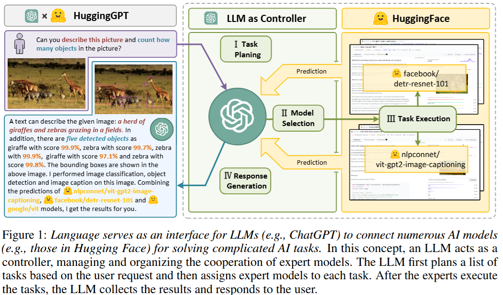
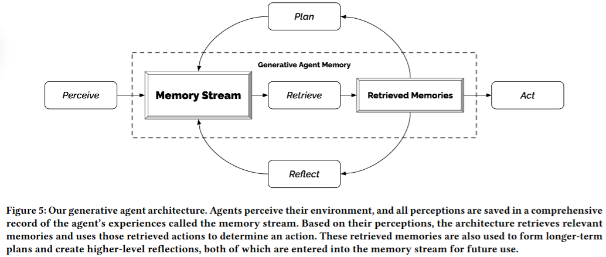

# Agent & MultiAgent
  - Agent
  - MultiAgent
<!-- more -->

## 1. Agent
Agent = LLM + Observation + Thinking + Action + Memory
- **LLM**: Processes information, makes decisions, and executes actions
- **Observation**: Perception of the environment. An agent can receive messages from other intelligent entities in the environment.
- **Thinking**: Analyzes the results of observations and memory content, considers what action to take next. This decision-making ability is provided by the LLM.
- **Action**: The result of observation and thinking, determining what specific tasks to carry out. This is similar to tools in LangChain.
- **Memory**: Stores past experiences.

Difference Between Agent and Chain
- **Similarities**:
  - Both complete a series of tasks step by step to ultimately achieve complex goals.
  
- **Differences**:
  - **Chain**: A predefined sequence of tasks, i.e., static (what should be done in each step is determined in advance).
  - **Agent**: The tasks in each step are not predefined and can vary depending on the user's questions or scenarios (dynamic).

## 2. ReAct
Paper Name: ReAct : SYNERGIZING REASONING AND ACTING IN LANGUAGE MODELS

Paper: https://arxiv.org/pdf/2210.03629

Github: https://github.com/ysymyth/ReAct

## 3. AutoGPT
Github: https://github.com/Significant-Gravitas/AutoGPT

Paper Name: Auto-GPT for Online Decision Making: Benchmarks and
Additional Opinions

Paper: https://arxiv.org/pdf/2306.02224

An autonomous agent only needs to be told the requirements, and does not need guidance on what to do first or next. It can autonomously propose a plan, execute it, and complete the task.

## 4. MetaGPT
Github: https://github.com/geekan/MetaGPT

Paper Name: METAGPT: META PROGRAMMING FOR A
MULTI-AGENT COLLABORATIVE FRAMEWORK

Paper: https://arxiv.org/pdf/2308.00352

## 5. HuggingGPT
Paper Name: HuggingGPT: Solving AI Tasks with ChatGPT and its Friends in Hugging Face

Paper: https://arxiv.org/pdf/2303.17580

Github: https://github.com/microsoft/JARVIS

Four Stages
- Task Planning
- Model Selection (from Hugging Face)
- Task Execution
- Response Generation

## 6. generative_agents: Stanford Town
Paper Name: Generative Agents: Interactive Simulacra of Human Behavior

Paper: https://dl.acm.org/doi/pdf/10.1145/3586183.3606763

Github: https://github.com/joonspk-research/generative_agents

This is one of the most influential works in this field, providing an effective foundation for future multi-agent collaboration.

There are many potential application scenarios to explore in the realm of generative multi-agents.

### 6.1. Design of Each Agent's Properties

- Basic Information
- Past Experiences
- Interests and Hobbies

### 6.2. Memory Design

- **Recency** (Time proximity):
  - The closer an event is to the present, the more weight it carries.
  
- **Importance**:
  - Some events are more important than others, e.g., "Waking up" < "Promotion".
  
- **Relevance** 
  - Cosine Similarity

score = Recency x $\alpha_1$ + Importance x $\alpha_2$ + Relevance x $\alpha_3$

Reflection Extraction: Summarizing the Memory Stream
- Scheduled Task: Summarize periodically after a certain time.

### 6.3. Planning: Generating a Daily Plan for Each Agent
- Daily routine
- Add unique schedules based on the characteristics of the agent
  

### 6.4. React: Interaction Between Agents
- Whether interaction occurs
- Whether the original plan needs to be changed
  

## 7. ChatDev: Multi-Agent Software Development

Paper Name: Communicative Agents for Software Development

Paper: https://openreview.net/pdf?id=yW0AZ5wPji

Github: https://github.com/OpenBMB/ChatDev

- Define Roles
- Memory Design

## 8. ToolLLM
Paper Name: TOOLLLM: FACILITATING LARGE LANGUAGE MODELS TO MASTER 16000+ REAL-WORLD APIS

Paper: https://arxiv.org/pdf/2307.16789

Github: https://github.com/OpenBMB/ToolBench

## 9. RestGPT
Paper Name: RestGPT: Connecting Large Language Models with Real-World RESTful APIs

Paper: https://arxiv.org/pdf/2306.06624

Github: https://github.com/Yifan-Song793/RestGPT