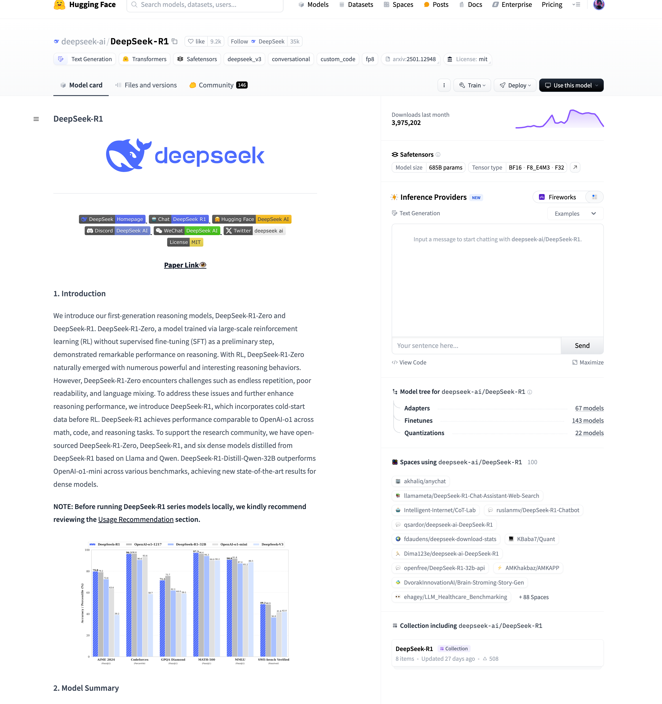
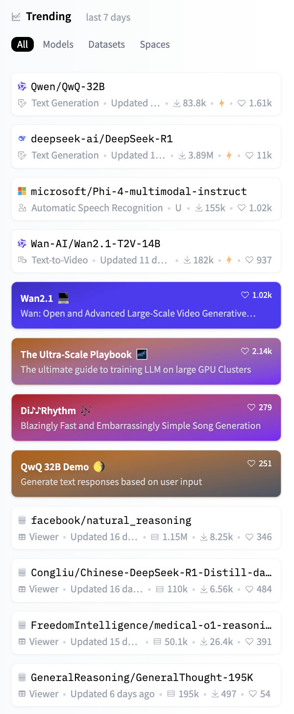
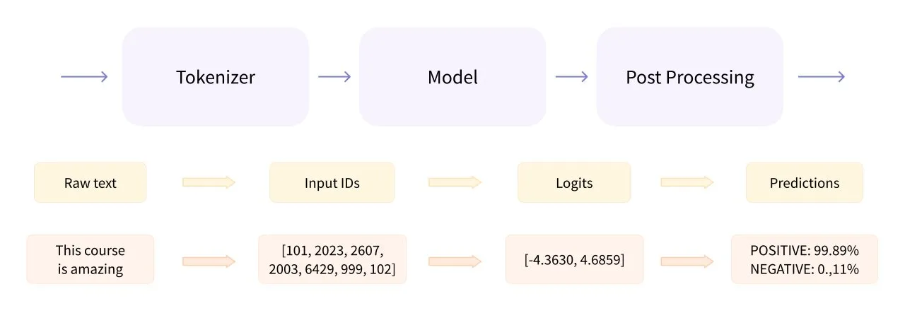

# Hugging Face and Transformers
- Main Features
- Models
- Datasets
- Transformers
<!-- more -->
## 1. Official Website
Official website: [https://huggingface.co/](https://huggingface.co/)

Introduction: Hugging Face is an open-source platform focused on natural language processing (NLP) and artificial intelligence, offering a wealth of tools and resources. It hosts the most active, popular, and influential LLM community, where the latest and most powerful LLMs are often released and open-sourced.

## 2. Main Features
- Models Library
    - Model download
    - Model sharing
- Datasets Library
    - Dataset download
    - Dataset sharing
- Spaces
    - Contains recent interesting and popular applications
    - Supports tools like Gradio and Streamlit for quickly building visual interfaces
    - Used to showcase model effects, test model performance, or as teaching tools
- Trending
    - Displays the most popular Models, Datasets, and Spaces from the last 7 days on the homepage
- Docs Library
    - Documentation for Hugging Face's core libraries and model algorithms
- Core Libraries
    - Transformers Library
        - Hugging Face's core open-source library, providing APIs and tools to easily download and train state-of-the-art pre-trained models, supporting multiple deep learning frameworks (PyTorch, TensorFlow, and JAX), with PyTorch supporting all models and frameworks.
    - Datasets Library
        - Offers the largest ready-to-use machine learning dataset hub with fast, easy-to-use, and efficient data manipulation tools, providing a unified API to access and manage various machine learning datasets, facilitating the handling of different data sources.
    - Tokenizers Library
        - A library for creating and using tokenizers, crucial for text processing in natural language processing models, offering high performance and flexibility.
    - Evaluate Library
        - A library for evaluating and comparing model performance, providing a simple unified API for evaluating machine learning models on different tasks and metrics, facilitating benchmarking and comparison of different models.
    - PEFT Library
        - Parameter-efficient fine-tuning library, efficiently fine-tuning large language models by updating only a small portion of model parameters, helping adapt to new tasks with limited computational resources.
    - TRL (Transformer Reinforcement Learning) Library
        - Reinforcement learning library, providing tools to train large language models with reinforcement learning techniques, facilitating supervised fine-tuning, reward modeling, and proximal policy optimization (PPO) for further fine-tuning of large language models.
    - Accelerate Library
        - Distributed training and inference library, enabling the same code to run on various distributed configurations (e.g., single GPU, multi-node clusters) with minimal modifications, supporting automatic mixed precision and distributed training, enhancing the efficiency of large-scale machine learning tasks.
    - Optimum Library
        - Optimization acceleration library, using easy-to-use hardware optimization tools to accelerate model inference and training, providing tools to optimize model performance on various hardware, including multi-GPU systems and TPUs, facilitating scaling and accelerating model training and inference.
    - Gradio Library
        - Used to create user interfaces for machine learning models, allowing developers to quickly build and share interactive machine learning applications, with free hosting of demos through Hugging Face Spaces.
- Daily Papers
    - Provides the latest research papers in the AI field, allowing users to interact with authors and recommend related papers.
- Learn Courses
    - [https://huggingface.co/learn](https://huggingface.co/learn)
- Community Forum

## 3. Models
### 3.1. Model list page
- Covers various tasks, allowing selection of models based on tasks or direct search by model name
    - Multimodal
    - Computer Vision
    - Natural Language Processing
    - Audio
    - Tabular
    - Reinforcement Learning
- Models without a prefix are provided by Hugging Face, while those with a prefix are third-party models


### 3.2. Model detail page
- Model card: Model introduction
- File and versions: Model files
- Use this model: Sample code for using the model, usually providing a pipeline method
- Inference Providers: Interface provision
- Model tree: Model variants
- Spaces using model: Spaces using the model



### 3.3. Model Files


- Documentation/Metadata: Provides usage guidelines, licensing, and version control
    - README.md: The model’s documentation, usually containing an introduction, usage instructions, training details, and performance evaluation
    - LICENSE: The open-source license agreement, specifying the model’s usage, distribution, and modification permissions
    - .gitattributes: Used for Git version control, especially for Git LFS (Large File Storage), typically containing tracking rules for large files
- Model Configuration Files: Define model architecture and inference parameters
    - config.json: The model’s primary configuration file, specifying architecture details such as the number of layers, hidden units, and attention heads
    - generation_config.json: The default parameter configuration file for text generation, including settings such as maximum length, temperature, and top-k sampling, which control the inference process
- Model Weight Files: Store the neural network parameters
    - safetensors files: The model’s main weight files, stored in the safetensors format (safer and faster to load than traditional .bin), managed via Git LFS
        - model-00001-of-000002.safetensors
        - model-00002-of-000002.safetensors
    - model.safetensors.index.json: The index file, mapping model weights across different .safetensors files, enabling sharded model loading
- Tokenizer: Used for text preprocessing and postprocessing
    - tokenizer.json: The core tokenizer file, containing all tokens and their corresponding IDs for text encoding and decoding
    - tokenizer_config.json: Defines tokenizer-related parameters, such as the use of special tokens and whether it follows BPE/WordPiece tokenization

## 4. Datasets
Dataset list page


Dataset detail page


## 5. Trending
Trending showcases recent popular models, datasets, and shared spaces



## 6. Transformers
### 6.1. Transformers API
The API describes all classes and functions:
- MAIN CLASSES: Detailed introduction of the most important classes, such as configuration, model, tokenizer, and pipeline
    - Pipelines: Provides a high-level API to simplify the execution of common tasks
    - AutoClasses: Provides a unified API to automatically load models, tokenizers, and configurations
    - Configuration: Defines model parameters and structure, ensuring correct model initialization
    - Models: Models
    - Tokenizer: Tokenizer, preprocessing data, converting text to token sequences and vice versa
    - Trainer: Supports model training and fine-tuning, providing a complete PyTorch training API, supporting distributed training and mixed precision
- MODELS: Detailed introduction of classes and functions related to each model implemented in the library
    - text models
    - vision models
    - audio models
    - video models
    - multimodal models
    - reinforcement learning models
    - time series models
    - graph models
- INTERNAL HELPERS: Detailed introduction of utility classes and functions used internally

### 6.2. Pipelines
#### 6.2.1. Introduction to Pipelines
Pipeline is a high-level encapsulation class in the Transformers library, assembling data preprocessing, model invocation, and result post-processing into a pipeline.



pipeline() is the simplest and fastest way to perform inference using pre-trained models. It can be used for many tasks in different modes, as shown in the table below:


#### 6.2.2. Using Pipelines
1 parameter: Specify only the task type
- If no model is specified, the default model and accompanying tokenizer for the target task will be downloaded
```
from transformers import pipeline

pipe = pipeline("text-classification")
pipe("This restaurant is awesome")
```
1 parameter: Specify only the model name
- The model has a corresponding task type and accompanying tokenizer
```
from transformers import pipeline

pipe = pipeline(model="FacebookAI/roberta-large-mnli")
pipe("This restaurant is awesome")
```
2 parameters: Specify task type and model name
```
from transformers import pipeline

messages = [
    {"role": "user", "content": "Who are you?"},
]
pipe = pipeline("text-generation", model="Qwen/QwQ-32B")
pipe(messages)
```
3 parameters: Specify task type, model name, and embedding model name
```
from transformers import pipeline

oracle = pipeline(
    "question-answering", model="distilbert/distilbert-base-cased-distilled-squad", tokenizer="google-bert/bert-base-cased"
)
```

3 parameters: Load model first, then create Pipeline
```
# Named entity recognition pipeline, passing in a specific model and tokenizer

from transformers import *

model = AutoModelForTokenClassification.from_pretrained("dbmdz/bert-large-cased-finetuned-conll03-english")
tokenizer = AutoTokenizer.from_pretrained("google-bert/bert-base-cased")
recognizer = pipeline("ner", model=model, tokenizer=tokenizer)
```

- Generally, the pipeline will load the model the first time it is executed, and the model will be automatically downloaded locally for direct use
- The way the pipeline loads models and the way models are loaded before creating a Pipeline are consistent, both using the Auto Classes method

Official Pipeline documentation: [https://huggingface.co/docs/transformers/main_classes/pipelines#pipelines](https://huggingface.co/docs/transformers/main_classes/pipelines#pipelines)

### 6.3. AutoClasses
- AutoClasses can automatically load Model, Tokenizer, and Config by passing parameters to the from_pretrained() method, i.e., by the name or path of the pre-trained model, automatically retrieving the architecture of the pre-trained model.
- Mainly includes AutoConfig, AutoModel, and AutoTokenizer
```
from transformers import AutoConfig

config = AutoConfig.from_pretrained("google-bert/bert-base-uncased")
```
```
from transformers import AutoModel

model = AutoModel.from_pretrained("google-bert/bert-base-cased")
```

```
from transformers import AutoTokenizer

tokenizer = AutoTokenizer.from_pretrained("google-bert/bert-base-uncased")
```
- Task-specific AutoModel classes (e.g., AutoModelForSequenceClassification), where the suffix ForSequenceClassification indicates the task type. The reason for task-specific AutoModel classes is that the backbone model can handle multiple tasks: the same model can be used for different tasks by connecting different post-processing modules.
- These classes provide a unified API, making the code more flexible and suitable for different models, and they are very effective in simplifying model usage.

Official Auto Classes documentation: [https://huggingface.co/docs/transformers/model_doc/auto](https://huggingface.co/docs/transformers/model_doc/auto) 