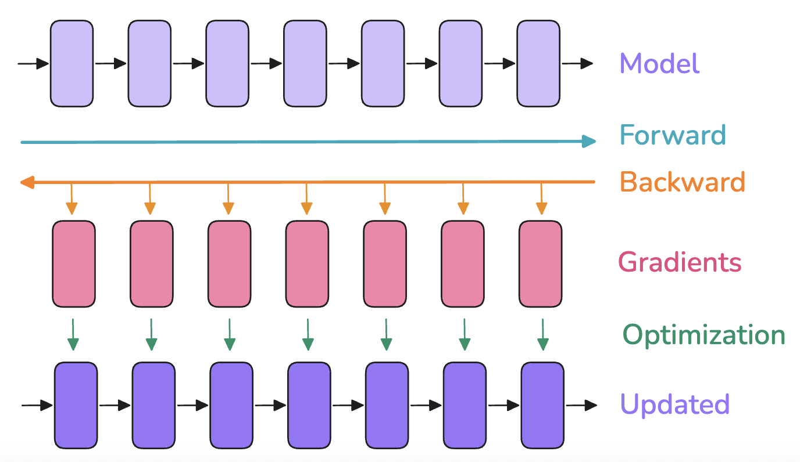
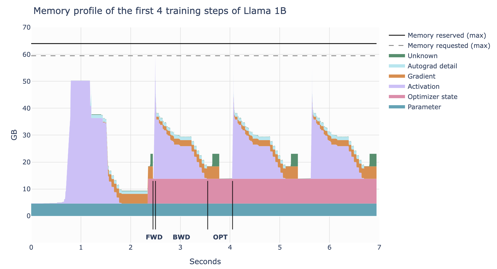
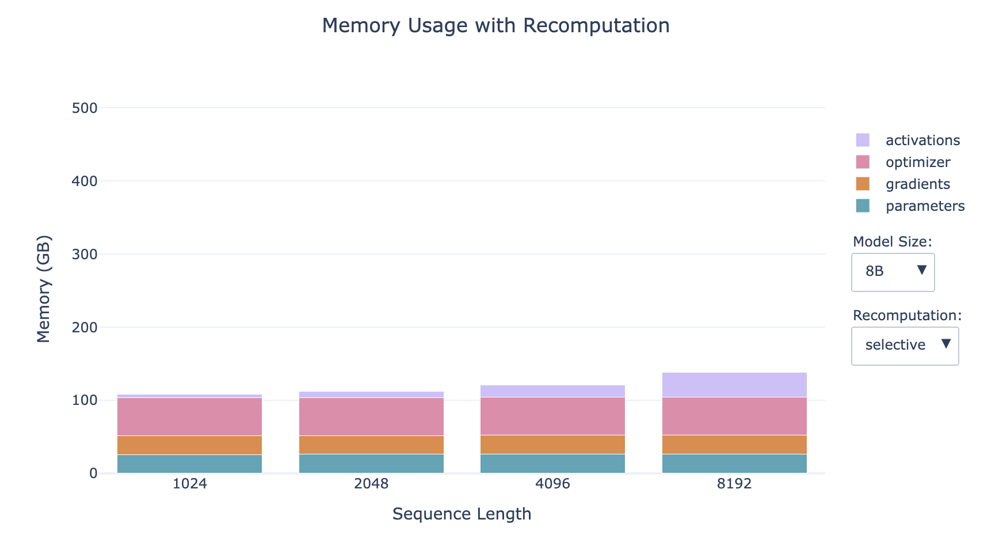
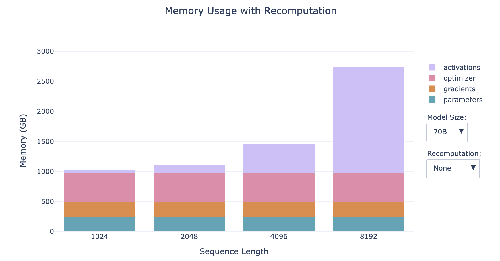
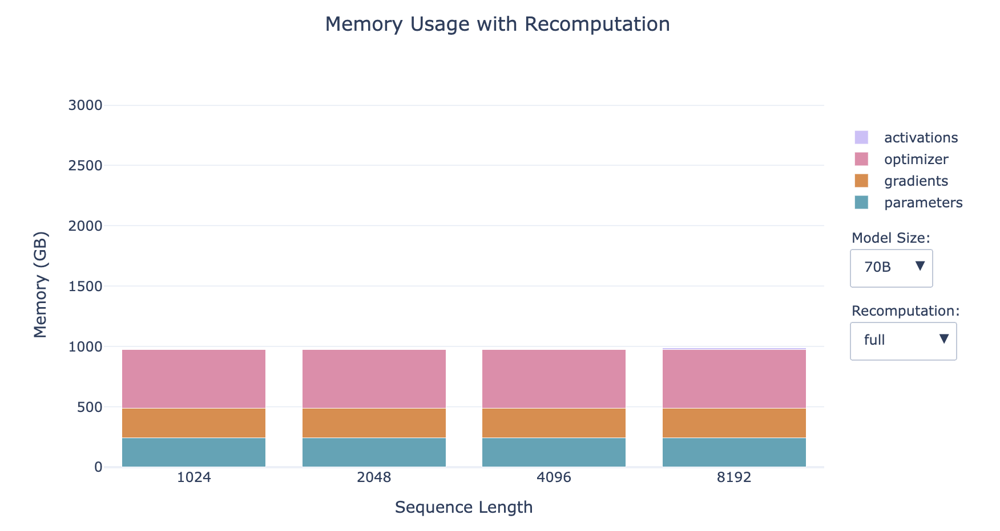
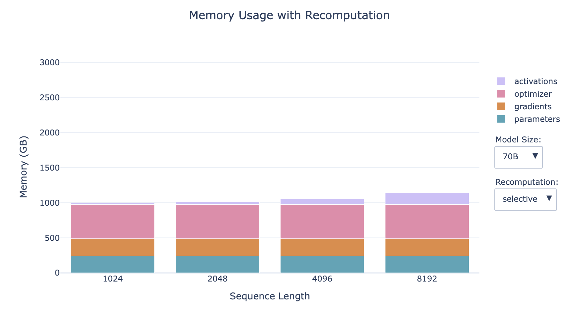
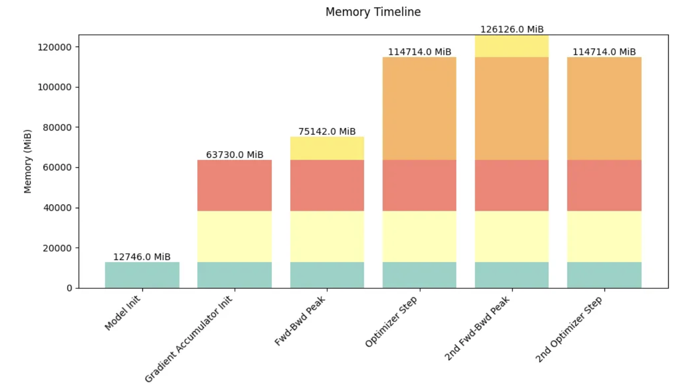
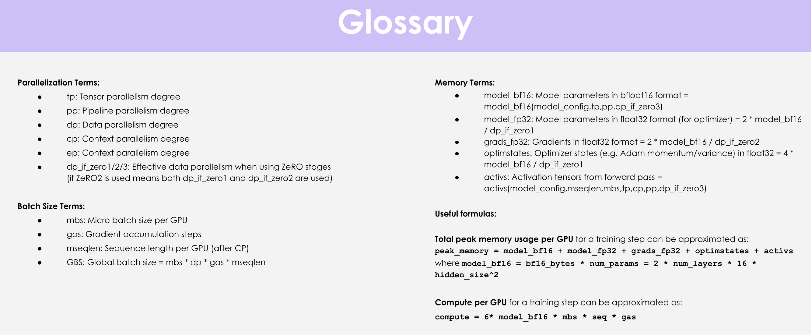

# Distributed Training Part 1: Memory Usage in Model Training
<!-- more -->
## 1. Metrics
Objective: Fully utilize the expensive hardware of GPUs
- Throughput
- GPU Utilization
- Training Time

## 2. Three Key Challenges
- Memory Usage
    - It's a hard limitation - if a training step doesn't fit in memory, training cannot proceed
    - Out-of-Memory (OOM) issues
- Compute Efficiency
    - We want our hardware to spend most time computing, so we need to reduce time spent on data transfers or waiting for other GPUs to perform work.
- Communication Overhead
    - We want to minimize communication overhead as it keeps GPUs idle. To achieve this, we will try to make the best use of intra-node (fast) and inter-node (slower) bandwidths as well as overlap communication with compute as much as possible.

## 3. Basics of Model Training
### 3.1. Model Training Process
Model training consists of three steps:
- Forward Pass: Inputs are passed to the model to produce outputs
- Backward Pass: Gradients are computed
- Optimization Step: The optimizer uses gradients to update model parameters



### 3.2. Important Hyperparameter -- Batch Size
#### 3.2.1. Batch Size (bs)

Affects both model convergence and throughput

A small batch size can be useful early in training to quickly move along the training landscape reaching an optimal learning point. However, further along the model training, small batch sizes will keep gradients noisy and the model may not be able to converge to the most optimal final performances. At the other extreme, a large batch size while giving very accurate gradient estimations will tend to make less use of each training token rendering convergence slower and potentially wasting compute.

Batch size also affects the time it takes to train on a given text dataset: a small batch size will require more optimizer steps to train on the same amount of samples. Optimizer steps are costly (in compute time) and the total time to train will thus increase compared to using a larger batch size. This being said, note that the batch size can often be adjusted quite largely around the optimal batch size without major impact to the performance of the model, i.e. the sensitivity of final model performances to the exact batch size value is usually rather low around the optimal batch size.

Batch size extension links:
- OpenAI Paper: https://arxiv.org/pdf/1812.06162
- MiniMax-01 Paper: https://filecdn.minimax.chat/_Arxiv_MiniMax_01_Report.pdf

#### 3.2.2. Batch Size Tokens (bst)
In the field of LLM pre-training, batch size is often reported in terms of tokens rather than the number of samples (bst = Batch Size Tokens). This approach makes the amount of training data independent of the specific input sequence length used during training.

```
bst = bs * seq
```
where seq is the model input sequence length

- Ideal Batch Size: 4-60 million tokens
- Llama 1: For 1.4 trillion tokens, batch size is about 4 million tokens
- DeepSeek: For 14 trillion tokens, batch size is about 60 million tokens

A sweet spot for recent LLM training is typically on the order of 4-60 million tokens per batch. The batch size as well as the training corpus have been steadily increasing over the years: Llama 1 was trained with a batch size of ~4M tokens for 1.4 trillion tokens while DeepSeek was trained with a batch size of ~60M tokens for 14 trillion tokens.

## 4. Memory Usage in Model Training
Four components:
- Model Parameters (weights & Biases)
    - Purpose: Determine the model's performance; training the model involves updating these parameters
    - Memory Usage: Determined by the number of parameters, each being a floating-point number, depending on the precision used
    - Variation: Fixed during training
- Optimizer States
    - Purpose: Assist in parameter updates to minimize the loss function
    - Memory Usage: Different optimizers occupy different amounts of memory. Many optimizers (like Adam, RMSprop) store additional states for each parameter (like momentum, squared gradients). For example, the Adam optimizer stores two additional variables for each parameter: momentum and the average of squared gradients. This means each parameter occupies additional memory, usually twice its parameter memory usage.
    - Variation: Fixed during training
- Activations
    - Purpose: Outputs of each layer during the forward pass, used to compute gradients during the backward pass
    - Memory Usage: Related to batch size, sequence length, and model architecture. Typically large, especially in deep networks or large batch training.
    - Variation: Stored after each forward pass and used during the backward pass, varies with batch size and input data, dynamically changes during training
- Gradients
    - Purpose: Used in the backward pass to compute the direction and magnitude of parameter updates
    - Memory Usage: During the backward pass, a gradient matrix of the same dimension is stored for each parameter (each parameter corresponds to a gradient), occupying memory equal to the size of model parameters
    - Variation: Dynamically changes during training, computed and stored during the backward pass, released after parameter updates

These four components are stored as tensors with different shapes and precisions.

Hyperparameters determining shapes:
- Batch size
- Sequence length
- Model hidden dimensions
- Attention heads
- Vocabulary size
- Model sharding

Common precisions:
- FP32 (full precision) -> 4 bytes
- BF16 -> 2 bytes
- FP8 -> 1 byte

During training, memory usage is continuously changing rather than static.

- Initialization
    - Initialize model parameters (neural network models usually randomly initialize weights, with some methods like Xavier initialization, He initialization helping to avoid gradient vanishing or explosion issues)
- Iterative Loop
    - Forward Pass
        - Compute model outputs, store activations (hidden_state)
    - Compute Loss
        - Compute loss value (usually a scalar, small memory usage)
    - Backward Pass
        - Compute and store gradients
    - Parameter Update
        - Optimizer updates model parameters based on gradients and maintains optimizer states



## 5. Memory Optimization Suggestions
- Activation Recomputation: Reduce memory usage of activations by storing only part of them and recomputing when needed to save memory
- Gradient Accumulation: Accumulate gradients from multiple small batches before updating parameters to reduce memory usage
- Mixed Precision Training: Reduce memory usage of parameters and gradients by using half-precision floating-point numbers (float16) instead of single-precision (float32)
- Distributed Training: Distribute memory pressure by spreading the model or data across multiple GPUs to reduce memory usage on a single GPU
- Reduce Batch Size: Reducing batch size decreases memory usage but may affect training speed
- Reduce Model Size: Use smaller models or model compression techniques

Extension Link:
https://zdevito.github.io/2022/08/04/cuda-caching-allocator.html

## 6. Activation Recomputation / Gradient Checkpointing / Rematerialization
Trading time for space, computation for memory: discard some activations computed during the forward pass to save memory and spend extra computation during the backward pass to dynamically recompute activations.

Activation Storage Content:
- Without Recomputation: Store every hidden state between two learnable operations (e.g., feedforward network, layer normalization) for use in computing gradients during the backward pass.
- With Recomputation: Store activations only at a few key points in the model architecture, discard the rest, and dynamically recompute them during the backward pass starting from the nearest saved activation, essentially re-executing a subpart of the forward pass.


Activation Recomputation Strategies:
- Full Recomputation
    - Perform a complete forward pass during the backward pass
    - Memory Usage: Activations occupy almost no memory
    - Computational Cost: Increases computational cost and time by up to 30-40%
- Selective Recomputation (Preferred)
    - Discard and recompute the attention part (which causes the largest growth in activations but has the cheapest computational cost)
    - Memory Usage: Reduces activation memory usage by 70% (significantly reduces memory access overhead)
    - Computational Cost: Increases computational cost by 2.7% (slightly increases the number of FLOPS, where FLOPS stands for Floating point operations per second)
    - This trade-off is particularly advantageous on hardware with small, fast memory, such as GPUs, because accessing memory is usually slower than performing computations. Despite involving additional operations, the overall effect is often faster computation with significantly reduced memory usage.










- The smaller the model, the larger the proportion of activations
- The longer the sequence, the larger the proportion of activations
- For small models with long sequences, recomputation has a significant impact on memory

Implementation of Selective Recomputation: FlashAttention

However, activations still have a linear dependency on batch size, and all the profiles in the bar charts above use a batch size of 1, so this may become an issue again when we move to larger batch sizes. Don't despair, because we have a second tool—gradient accumulation to save the day!

## 7. Gradient Accumulation
Trading time for space, computation for memory: further divide the batch into micro-batches, perform forward and backward passes for each micro-batch to compute gradients, then accumulate the gradients from each micro-batch (gradient accumulation is actually averaging rather than summing, so it is not affected by the number of micro-batches), and finally execute the optimizer update step.

Terminology:
- Batch size (bs)
- Micro batch size (mbs)
- Global batch size (gbs)
- grad_acc: the number of gradient accumulation steps

```
bs = gbs = mbs * grad_acc
```


Advantages and Disadvantages of Gradient Accumulation:
- Advantages:
    - Allows batch size to be set larger while keeping memory usage stable, reducing memory usage of activations that grow linearly with batch size through micro-batch size
    - Compatible with Activation Recomputation, can be used together to reduce memory usage
    - Forward and backward computations of multiple micro-batches can be processed in parallel
- Disadvantages:
    - Requires computation of multiple forward and backward passes, increasing computational cost

## 8. Mixed Precision Training
### 8.1. Numerical Range and Precision of Floating-Point Numbers
Default numerical precision of PyTorch tensors: single-precision floating-point format, also known as FP32 or float32
- This means each stored number occupies 32 bits (i.e., 4 bytes)

The available bits are divided into three parts to represent a number (scientific notation):
- Sign Bit: The first bit determines whether the number is positive or negative
- Exponent: Controls the range of the number
- Mantissa: Determines the significant digits of the number


List of floating-point formats provided by PyTorch:
- FP32 / float32 / 32-bit Floating Point
- FP16 / float16 / 16-bit Floating Point
- BF16 / bfloat16 / 16-bit Brain Floating Point
- FP8 / float8 / 8-bit Floating Point


Note:
- bfloat16 was proposed by Google Brain, where 'b' stands for "brain"
- Two types of float8 are named based on exponent and mantissa (e4m3 and e5m2)

We focus on two aspects of floating-point numbers: precision and numerical range
- Precision: The fineness of the numbers that can be represented (i.e., the gap between two adjacent representable numbers)
- Numerical Range: The maximum and minimum values that can be represented

Numerical range of different floating-point numbers:


From the chart (look at the width, the wider the range, the larger the numerical range):
- float32 and bfloat16 have the same and relatively large numerical range
- float16 and float8_e5m2 have the same numerical range, which is relatively small
- float8_e4m3 has the smallest numerical range

Precision of different floating-point numbers:


From the chart (look at the spacing of the vertical lines, the smaller the spacing, the greater the precision):
- bfloat16 has lower precision than float32 and float16

### 8.2. Concept of Mixed Precision Training
The concept of mixed precision training is to use lower precision formats to reduce computational and memory requirements while maintaining performance comparable to full precision (float32) training.

However, completely abandoning float32 is impractical because certain critical parts require higher precision to avoid numerical instability. Therefore, in practice, a mix of high and low precision formats is often used, a method known as "mixed precision training."

### 8.3. Summary of Known Methods for Mixed Precision Training


Number of Parameters: Ψ

- BF16+FP32 Mixed Precision Baseline: 2Ψ + 6Ψ + 12Ψ = 20Ψ
    - Model Parameters (half precision): 2 bytes
    - Gradients (half precision) + FP32 gradients (accumulated in FP32 precision): 2 + 4 = 6 bytes
    - FP32 Model Parameters and Optimizer States: 4 + (4 + 4) = 12 bytes
- BF16+FP32 Mixed Precision without FP32 Gradients: 2Ψ + 2Ψ + 12Ψ = 16Ψ
    - Model Parameters (half precision): 2 bytes
    - Gradients (half precision): 2 bytes
    - FP32 Model Parameters and Optimizer States: 4 + (4 + 4) = 12 bytes

### 8.4. FP16 and BF16 Training
Simply switching all tensors and operations to float16 format usually doesn't work, often resulting in divergent loss values. However, the initial mixed precision training paper proposed three techniques to maintain the performance of float32 training:

- FP32 Copy of Weights:
    - Using float16 weights can encounter two issues. During training, some weights may become very small and be rounded to 0. Even if the weights themselves are not close to 0, the magnitude difference may cause weights to underflow in addition operations if the update amount is very small. Once weights become 0, they will remain 0 in subsequent training because no gradient signal is passed.
- Loss Scaling:
    - Gradients face similar issues because they are often much smaller than 1 and prone to underflow. A simple but effective strategy is to scale (amplify) the loss before backpropagation and then reverse scale (reduce) the gradients after backpropagation. This ensures no underflow occurs during backpropagation, and the scaling operation doesn't affect training because we reverse scale before further processing gradients (e.g., clipping) and optimization steps.
- Accumulation:
    - Performing certain arithmetic operations (e.g., averaging or summing) in 16-bit precision may also encounter underflow or overflow issues. The solution is to use float32 precision to accumulate intermediate results during operations and only convert the result back to 16-bit precision at the end.

The core goal of these three techniques is to leverage the computational acceleration brought by low precision while ensuring training stability by introducing high precision (e.g., float32) operations to avoid numerical instability issues (e.g., gradient or weight underflow). Through these techniques, we can benefit from faster low precision arithmetic operations while maintaining training stability, resulting in higher throughput.

### 8.5. FP8 Training
- FP8 precision and numerical range are very limited, prone to numerical instability and divergent loss, especially in high learning rate scenarios.
- The main advantage of FP8 is its ability to significantly enhance computational efficiency (e.g., on NVIDIA H100 GPUs, FP8 matrix multiplication performance is twice that of bfloat16), making it attractive for training that seeks high throughput and low energy consumption.


#### 8.5.1. FP8 Mixed Precision Training in DeepSeek-V3
- The first successful, very large-scale FP8 mixed precision training was publicly reported in DeepSeek-V3.
- The authors carefully analyzed each operation in the forward pass (Fprop) and activations (Dgrad) and weights (Wgrad) operations in the backward pass.
- To address numerical instability caused by FP8's low precision, they adopted strategies similar to BF16 mixed precision training: keeping critical parts (e.g., aggregation operations and main weights) at higher precision (possibly float32 or bfloat16) while delegating compute-intensive operations (e.g., matrix multiplication) to FP8, thus ensuring stability while fully leveraging FP8's high-performance advantages.


DeepSeek-V3 Paper: http://arxiv.org/pdf/2412.19437

## 9. Tools
## 9.1. Memory Usage Calculation Tool: Predict Memory
Before diving into code and experiments, we want to understand how each method works at a high level and what its advantages and limits are. You'll learn about which parts of a language model eat away your memory and when during training it happens. You'll learn how we can solve memory constraints by parallelizing the models and increase the throughput by scaling up GPUs. As a result, you'll understand how the following widget to compute the memory breakdown of a transformer model works.


Memory Usage Prediction Tool: https://huggingface.co/spaces/nanotron/predict_memory



## 9.2. Distributed Training Tool for Visualizing GPU Compute and Communication Costs: Profiler
Purpose: Understand and verify GPU compute and communication costs, identify bottlenecks

[PyTorch's profiler](https://pytorch.org/tutorials/recipes/recipes/profiler_recipe.html)

Code:
```
with torch.profiler.profile(
    activities=[
        torch.profiler.ProfilerActivity.CPU,
        torch.profiler.ProfilerActivity.CUDA,
    ],
    schedule=torch.profiler.schedule(wait=1, warmup=1, active=3),
    on_trace_ready=torch.profiler.tensorboard_trace_handler('./log/profile'),
    with_stack=True
) as prof:
    for step in range(steps):
        train_step() 
        prof.step()
```


This generates a trace that we can visualize in TensorBoard or Chrome's trace viewer. The trace shows:
- CPU threads asynchronously launching kernels to the GPU
- Multiple CUDA streams processing compute and communication in parallel
- Kernel execution times and memory allocations
For example, the trace shows CPU threads asynchronously launching kernels to the GPU, with compute kernels and communication occurring in parallel on different CUDA streams.
The trace helps identify bottlenecks, such as:
- Sequential compute and communication that could have been overlapped
- Idle time where the GPU is waiting for data transfers
- Memory movement between CPU and GPU
- Kernel launch overhead on the CPU

## 10. Reference: Ultrascale Playbook

[https://huggingface.co/spaces/nanotron/ultrascale-playbook](https://huggingface.co/spaces/nanotron/ultrascale-playbook)

### 10.1. Overview




### 10.2. Prerequisite Knowledge
- Mainstream LLM Architectures
- Basics of Model Training: How Deep Learning Models are Trained
    - Recommended Quality Educational Resources
        - https://www.deeplearning.ai/
        - https://pytorch.org/tutorials/beginner/basics/intro.html

### 10.3. Scaling Experiments
We ran over 4000 scaling experiments on up to 512 GPUs and measured throughput (size of markers) and GPU utilization (color of markers). Note that both are normalized per model size in this visualization.

We ran over 4100 distributed experiments (over 16k including test runs) with up to 512 GPUs to scan many possible distributed training layouts and model sizes.


 