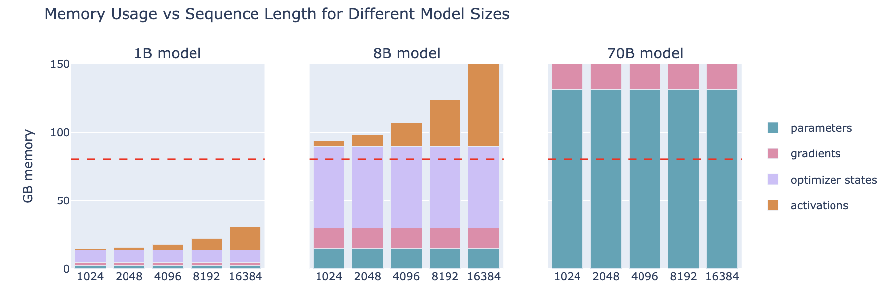
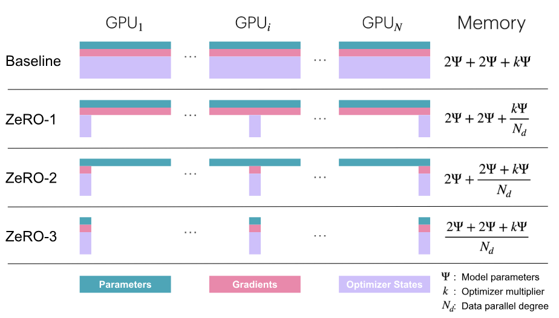
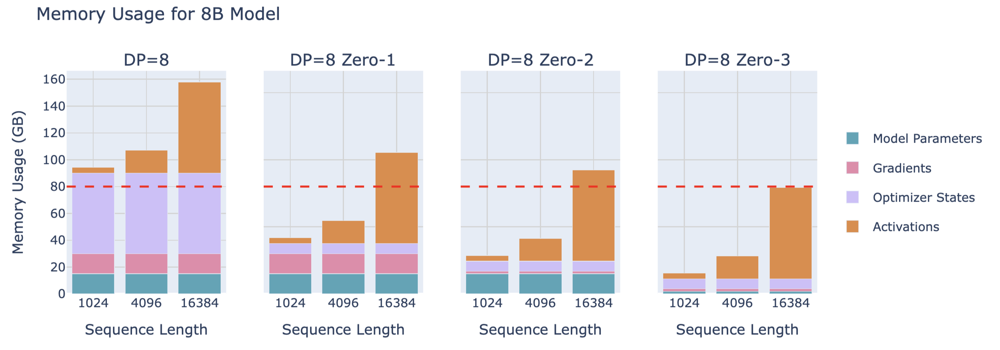
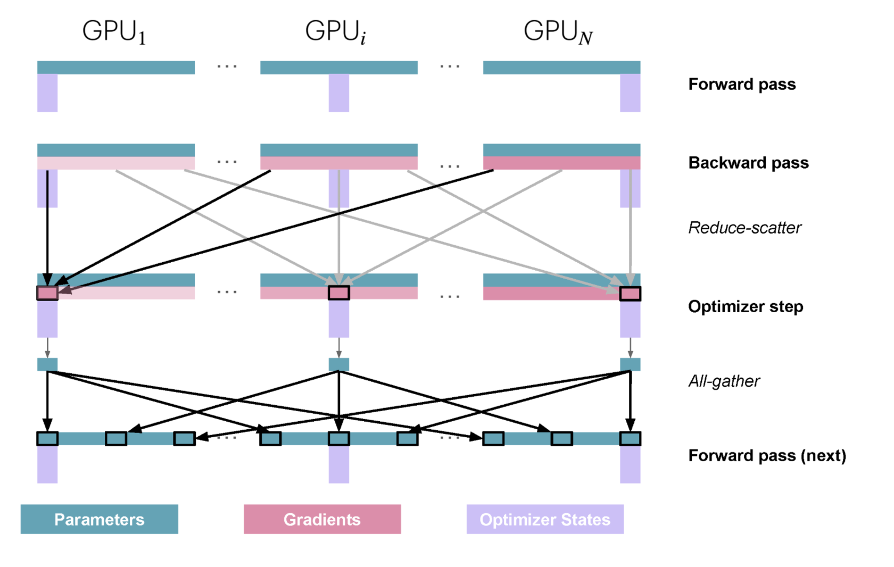
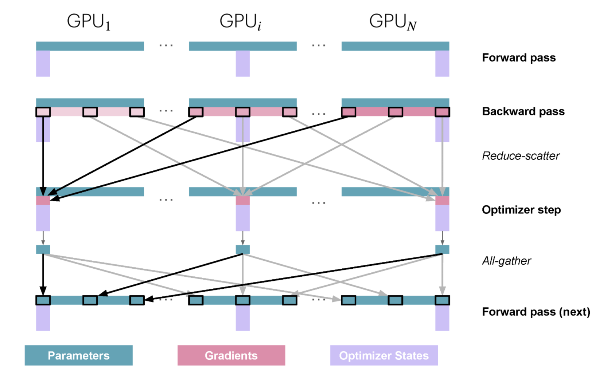
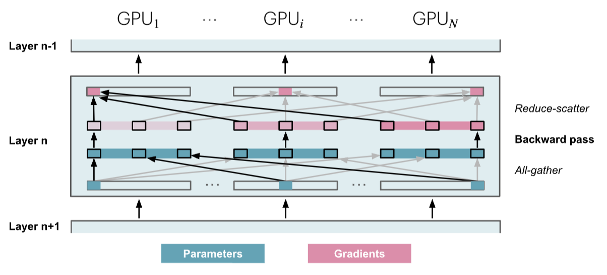

# Distributed Training Part 3: Data Parallelism
- Data Parallelism (DP)
- DP Optimization
- DP Practice
- ZeRO-1 / ZeRO-2 / ZeRO-3 (FSDP)
<!-- more -->
## 1. Overview of Data Parallelism (DP)
Data parallelism (DP)
- Naive DP (naive DDP approach)
- DP Optimization 1: Attach an all-reduce hook function to each parameter
- DP Optimization 2: Bucketing gradients
- ZeRO (Zero Redundancy Optimizer)
    - ZeRO-1: optimizer state partitioning
    - ZeRO-2: optimizer state + gradient partitioning
    - ZeRO-3 / FSDP (Fully-Sharded Data Parallelism): optimizer state + gradient + parameter partitioning

## 2. Data Parallelism (DP)
Different micro-batches are processed in parallel on different GPUs (only gradient computation on micro-batch, model parameters are updated once per global batch)
- A copy of the model instance is replicated on each GPU
- Multiple GPUs compute forward and backward passes of micro-batches in parallel, then compute gradients for each micro-batch
- Perform an all-reduce operation on micro-batch gradients to compute the average
- The optimizer updates model parameters using the average gradient


Involved distributed communication
- all-reduce: Used here to average gradients computed on different GPUs and update each GPU's gradients to the average, thus synchronizing gradients

Gradient computation and synchronization
- Gradient computation (GPU computation): Forward and backward gradient computation
- Gradient synchronization (GPU communication): Trigger distributed communication all-reduce operation for gradient synchronization

### 2.1. Naive DP (naive DDP approach)
Principle: Perform GPU communication after GPU computation is complete, then wait for GPU communication to complete before proceeding with GPU computation
- After each GPU completes gradient computation, trigger a distributed communication all-reduce operation for gradient synchronization, then wait for gradient synchronization to complete before the optimizer updates parameters


Improvement space: During communication, GPUs are idle, and we should try to overlap communication and computation as much as possible to make them occur simultaneously
### 2.2. DP Optimization
Overlap gradient computation's backward pass and gradient synchronization
- DP Optimization 1: Once a parameter's gradient is computed on multiple GPUs, start the all-reduce operation for that parameter's gradient
- DP Optimization 2: Once a layer's gradient is computed on multiple GPUs, start the all-reduce operation for that layer's gradient

#### 2.2.1. DP Optimization 1: Attach an all-reduce hook function to each parameter
Principle: Do not wait for all layers' backward passes to complete before starting gradient synchronization. Instead, start synchronizing gradients of computed layers as soon as they are available, significantly speeding up data parallelism and reducing the wait time for entire model gradient synchronization (e.g., in llama, start synchronizing the gradient of layer 32 while GPU is still computing the gradient of layer 31)

Note: Optimization 1 does not even wait for a decoding layer's gradient to be fully computed before starting gradient synchronization. Instead, it starts synchronizing a parameter's gradient as soon as it is computed on each GPU


PyTorch implementation: Attach an all-reduce hook function to each parameter. Once a parameter's gradient is ready, it immediately triggers the all-reduce operation, even if other parameters' gradients are still being computed

```python
def register_backward_hook(self, hook):
    """
    Registers a backward hook for all parameters of the model that 
    require gradients.
    """
    for p in self.module.parameters():
        if p.requires_grad is True:
            p.register_post_accumulate_grad_hook(hook)
```

#### 2.2.2. DP Optimization 2: Bucketing gradients
Preliminary theory: GPU operations are generally more efficient when processing large tensors than performing multiple operations on many small tensors. This is also true for communication operations.

Principle: Bucket gradients (e.g., bucket by layer, treating each decoding layer as a whole), and initiate a single all-reduce operation for all gradients in the same bucket, rather than performing an all-reduce operation for each parameter's gradient individually. By performing a single all-reduce operation per bucket, we can significantly reduce communication overhead and speed up the communication process.


### 2.3. DP Practice
Terminology
- bs: batch size
- mbs: micro batch size
- gbs: global batch size
- grad_acc: the number of gradient accumulation steps (refers to serially computing several mbs on a single GPU when parallelism is not possible, accumulating these serial computations)
- dp: the number of parallel instances used for data parallelism
- gbst: global batch size tokens

Formula
```
bs = gbs = mbs * grad_acc * dp
```

```
gbst = batch_size * sequence_length 
```

Initial data parallelism plan
- 1. Determine the optimal global batch size tokens (gbst)
    - Determine through literature review or experiments (measuring model convergence)
- 2. Choose the training sequence length
    - Also determined through literature review or experiments
    - Typically, 2-8k tokens are reliable for our evaluations today
- 3. Find the maximum local batch size (mbs)
    - Can be found by continuously increasing the local batch size on a single GPU (mbs) until memory is exhausted
- 4. Determine the number of GPUs available for data parallelism (DP)
    - The value of gbs/dp will tell us how many gradient accumulation steps are needed to achieve the desired gbs.

Specific case
- gbst (tokens) = 4M tokens
- sequence_length=4K tokens
- bs=1024 samples
- observe assume: a single GPU can only fit mbs=2 in memory (meaning a single GPU can only accommodate 2 samples with a sequence length of 4k tokens at a time), mbs needs to be less than or equal to 2
- we have 128 GPUs available for training
- This means with 4 gradient accumulation steps we'll achieve our goal of 1024 samples or 4M tokens per training step. 
    - grad_acc = bs / (dp * mbs) = 1024 / (128 * 2) = 4
- Now what if we suddenly have 512 GPUs available? We can achieve the same GBS and thus identical training by keeping MBS=2 and setting gradient accumulation steps to 1 and achieve faster training!
    - grad_acc = bs / (dp * mbs) = 1024 / (512 * 2) = 1

### 2.4. Performance with DP


As DP parallelism increases
- Throughput decreases  
- Memory usage remains stable

The prerequisite for using this is that mbs is at least 1, meaning a GPU can support at least one input sample's forward pass, but this is not always the case, even with activation recomputation



Tip: Quick estimation of the minimum memory required for model parameters: model parameters * 2 (e.g., 70B → 140GB (=133GiB))

For extremely large models or larger batch token sizes, do we have other options?
- There are two main splitting methods: parallelism (tensor parallelism, context parallelism, or pipeline parallelism) and sharding (DeepSpeed Zero or PyTorch FSDP). These two methods are somewhat independent and can actually be combined!

## 3. DeepSpeed ZeRO
### 3.1. ZeRO
DeepSpeed ZeRO official documentation: [https://www.deepspeed.ai/tutorials/zero/](https://www.deepspeed.ai/tutorials/zero/)

ZeRO 
- (**Ze**ro **R**edundancy **O**ptimizer)
- A memory optimization technique aimed at reducing memory redundancy in LLM training
- ZeRO reduces memory redundancy by partitioning optimizer states, gradients, and parameters along the **data parallel DP dimension**, which sometimes requires more GPU communication that may or may not overlap with GPU computation
- When we mention "partitioning," it refers to partitioning along the DP axis, as ZeRO is part of data parallelism

Three optimization strategies of ZeRO
- ZeRO-1: optimizer state partitioning
- ZeRO-2: optimizer state + gradient partitioning
- ZeRO-3 / FSDP (also called FSDP for "Fully-Sharded Data Parallelism"): optimizer state + gradient + parameter partitioning



Note: k=12 for Adam

Note: Why not shard activations? Because each DP receives different micro-batches, the activations they compute are naturally different, they are not redundant, not shared or duplicated data, so they do not need synchronization or sharding, and they have already been used to compute the gradients of each DP rank, completing their main task, and are no longer needed afterward

Memory usage of different DP strategies:



Limitations of ZeRO:

Data parallelism (DP) only works properly when a single layer of the model can fit on a single GPU, and ZeRO can only partition parameters, gradients, and optimizer states, not activation memory! We recall from the previous discussion on activation memory that this part of activation memory increases linearly with sequence length and batch size. Naturally, we can cope by limiting sequence length and batch size, but in practice, we do not want to train with shorter sequence lengths due to hardware limitations.

### 3.2. Review of Mixed Precision Training
Summary of known methods for mixed precision training:


Number of parameters: Ψ

- BF16+FP32 mixed precision baseline: 2Ψ + 6Ψ + 12Ψ = 20Ψ
    - Model parameters (half precision): 2 bytes
    - Gradients (half precision) + FP32 gradients (accumulated in FP32 precision): 2 + 4 = 6 bytes
    - FP32 model parameters and optimizer states: 4 + (4 + 4) = 12 bytes
- BF16+FP32 mixed precision without FP32 gradients: 2Ψ + 2Ψ + 12Ψ = 16Ψ
    - Model parameters (half precision): 2 bytes
    - Gradients (half precision): 2 bytes
    - FP32 model parameters and optimizer states: 4 + (4 + 4) = 12 bytes

### 3.3. ZeRO-1



Execution process of a single training step
- Forward pass: Each replica holds the same complete model parameters (BF16) but processes different micro-batches (although parameters are the same, the activations and gradients computed will differ due to different micro-batches)
- Backward pass: Each replica computes complete gradients, but due to different micro-batches, each replica's gradients are different
- Perform reduce-scatter operation on gradients: Each replica accumulates only the part of the gradient corresponding to the optimizer state shard, other parts of the gradient remain unchanged
- Local optimization: Each replica performs parameter update steps on its local optimizer state, updating only the part of the parameters corresponding to the optimizer state shard (converted back to BF16 after updating from FP32), other parameters remain unchanged
- Perform all-gather operation on parameters: Collect the updated parameter (BF16) parts from each replica so that each replica has the complete updated parameters

Compared to naive DP
- Gradient accumulation changes from naive DP's all-reduce operation to reduce-scatter operation (reduce-scatter is 2 times faster than all-reduce!)
- Added all-gather operation after optimizer step

Further optimization of ZeRO: Overlap all-gather with preceding and following operations
- Overlap all-gather with optimizer step: Start all-gather operation after optimizer updates part of the parameters
- Overlap all-gather with forward pass: Start forward pass of a layer after all-gather completes parameter collection for that layer

### 3.4. ZeRO-2



### 3.5. ZeRO-3 
ZeRO-3 is called FSDP (Fully Shared Data Parallelism) in PyTorch implementation





Only gather model parameters when needed
- Perform all-gather operation to collect all parameters before each layer's forward pass, and flush unnecessary parameters from memory after each layer's forward pass (32 times from layer 1 to layer 32)
- Perform all-gather operation to collect all parameters before each layer's backward pass, and flush unnecessary parameters from memory after computing gradients for each layer's backward pass (32 times from layer 32 to layer 1)
- Optimization: Combine forward and backward passes of layer 32, perform all-gather operation to collect all parameters before layer 32's forward pass, and flush unnecessary parameters from memory after computing gradients for layer 32's backward pass
- Therefore, the total number of all-gather operations and flushing unnecessary parameters from memory is num_layers + num_layers - 1 = 32 + 32 - 1 = 63 times, as shown in the third figure with some latency overhead
- ZeRO-3 heavily relies on parameter communication

## 4. Extended Links

[https://siboehm.com/articles/22/data-parallel-training](https://siboehm.com/articles/22/data-parallel-training)

[https://www.harmdevries.com/post/context-length/](https://www.harmdevries.com/post/context-length/)


## 5. Code Implementation
### 5.1. Naive DP implementation with overlap in Picotron
Complete code
```python
class DataParallelNaive(nn.Module):
    """
    Naive Data Parallelism. Not used in practice. But it is a good starting point to understand how data parallelism works.
    It implements a simple all-reduce operation to synchronize gradients across multiple processes.
    And `no_sync` context manager to disable gradient synchronization.
    """
    def __init__(self, module):
        """
        Initializes the DataParallel wrapper for a given module.

        Args:
            module (nn.Module): The model to be wrapped for data parallelism.
            process_group (torch.distributed.ProcessGroup): The process group used for gradient synchronization. 
                                                            It could be a data parallel or context parallel group.
        """
        super().__init__()
        self.module = module
        self.require_backward_grad_sync = True # whether to synchronize gradients during backward pass. Set to False when using gradient accumulation
        self.register_backward_hook(self._allreduce_grads)
    
    def forward(self, *inputs, **kwargs):
        return self.module(*inputs, **kwargs)
    
    def register_backward_hook(self, hook):
        """
        Registers a backward hook for all parameters of the model that require gradients.    
        """
        for p in self.module.parameters():
            if p.requires_grad is True:
                p.register_hook(hook)
                
    def _allreduce_grads(self, grad):
        """
        Performs an all-reduce operation to synchronize gradients across multiple processes.    
        """
        # No synchronization needed during gradient accumulation, except at the final accumulation step.
        if self.require_backward_grad_sync:
            dist.all_reduce(grad, op=dist.ReduceOp.SUM, group=pgm.process_group_manager.cp_dp_group)
            grad /= pgm.process_group_manager.cp_dp_world_size
        return grad 
    
    @contextlib.contextmanager
    def no_sync(self):
        """
        A context manager to temporarily disable gradient synchronization. 
        This is useful for performing multiple backward passes during gradient accumulation without synchronizing 
        gradients in between.
        """
        self.require_backward_grad_sync = False
        yield
        self.require_backward_grad_sync = True
```

### 5.2. Bucket DP implementation in Picotron
Complete code
```python
class DataParallelBucket(nn.Module):
    """
    Data Parallelism with gradient grouped into buckets to reduce the communication overhead.
    """
    def __init__(self, module, bucket_cap_mb=25, grad_type = torch.float32):
        """
        Initialize the DataParallelBucket module.
        
        Args:
            module (nn.Module): The model to be parallelized.
            process_group: The process group for gradient synchronization, which can be either 
                           a data parallel group or a context parallel group.
            bucket_cap_mb (int, optional): The maximum size of each gradient synchronization bucket in megabytes. 
                                           Defaults to 25 MB.
            grad_type (torch.dtype, optional): The data type of gradients, defaulting to float32.
        """
        super().__init__()
        self.module = module
        self.require_backward_grad_sync = True # whether to synchronize gradients during backward pass. Set to False when using gradient accumulation
        grad_size = 2 if grad_type == torch.bfloat16 else 4 # float32 gradient: 4 bytes
        bucket_size = bucket_cap_mb * 1024 * 1024 // grad_size # number of gradients in one bucket
        self.bucket_manager = BucketManager(module.parameters(), pgm.process_group_manager.cp_dp_group, bucket_size, grad_type)
        self.register_backward_hook()
        self._post_backward_callback_set = False # whether the callback for wait gradient synchronization is set
        
    def forward(self, *inputs, **kwargs):
        return self.module(*inputs, **kwargs)

    def backward(self, input_tensor, output_tensor, output_tensor_grad):
        return self.module.backward(input_tensor, output_tensor, output_tensor_grad)
    
    def register_backward_hook(self):
        """
        Registers a backward hook to manually accumulate and synchronize gradients.
        
        This hook serves two main purposes:
        1. PyTorch does not natively support gradient accumulation with mixed precision.
        2. After gradient accumulation, it flags parameters as ready for synchronization.
        
        The gradient accumulation functions are stored to prevent them from going out of scope.
        
        References:
        - https://github.com/NVIDIA/Megatron-LM/issues/690
        - https://pytorch.org/docs/stable/generated/torch.autograd.graph.Node.register_hook.html
        - https://arxiv.org/abs/2006.15704 (page 5)
        """
        self.grad_accs = []
        for param in self.module.parameters():
            if param.requires_grad:
                # Expand so we get access to grad_fn.
                param_tmp = param.expand_as(param)
                # Get the gradient accumulator function.
                grad_acc_fn = param_tmp.grad_fn.next_functions[0][0]
                grad_acc_fn.register_hook(self._make_param_hook(param, self.bucket_manager))
                self.grad_accs.append(grad_acc_fn)
                
    def _make_param_hook(self, param: torch.nn.Parameter,bucket_manager: BucketManager):
        """
        Creates the a hook for each parameter to handle gradient accumulation and synchronization.
        """
        def param_hook(*unused):
            """
            The hook called after the gradient is ready. It performs the following:
            1. Accumulates the gradient into the main gradient.
            2. Adds a post-backward callback to wait for gradient synchronization completion.
            3. Marks the parameter as ready for synchronization.
            """
            if param.requires_grad:
                assert param.grad is not None
                param.main_grad.add_(param.grad.data) # accumulate the gradients
                param.grad = None
                
                # skip the gradient synchronization (gradient accumulation/PP micro batches)
                if self.require_backward_grad_sync:
                    # Add a callback to wait for gradient synchronization. Ensures the callback is added only once.
                    # Callback is executed after the backward pass. It should be added per backward pass.
                    if not self._post_backward_callback_set:
                        Variable._execution_engine.queue_callback(self._post_backward)
                        self._post_backward_callback_set = True
                        
                    # mark the parameter as ready for gradient synchronization. 
                    bucket_manager.mark_param_as_ready(param) 
        return param_hook
    
    @contextlib.contextmanager
    def no_sync(self):
        """A context manager to disable gradient synchronization."""
        self.require_backward_grad_sync = False
        yield
        self.require_backward_grad_sync = True
        
    def _post_backward(self):
        """
        A post-backward callback that waits for gradient synchronization to finish, then copies 
        the synchronized gradients back to the parameters' grad attribute.
        
        This method is called after the backward pass and before the optimizer step.
        """
        self.bucket_manager.wait()
        self._post_backward_callback_set = False
        # copy to params.grad so we can use the optimizer to update the parameters
        for p in self.module.parameters():
            if p.requires_grad:
                p.grad = p.main_grad.to(p.dtype) # In PyTorch, you cannot assign a gradient with one data type to a tensor of another data type.

    def reset(self):
        """
        Reset the bucket manager and zero out gradients in the model
        """
        self.bucket_manager.reset() 