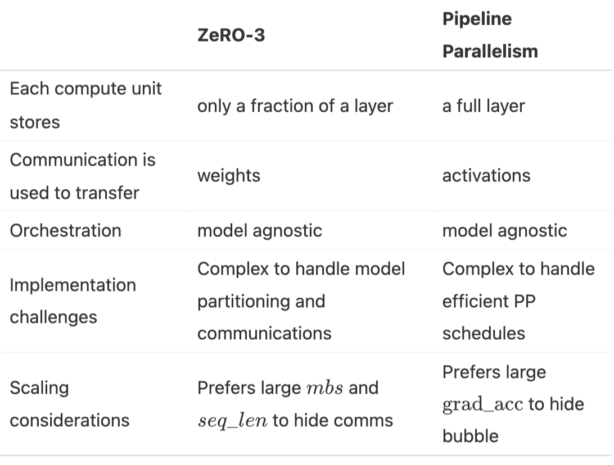
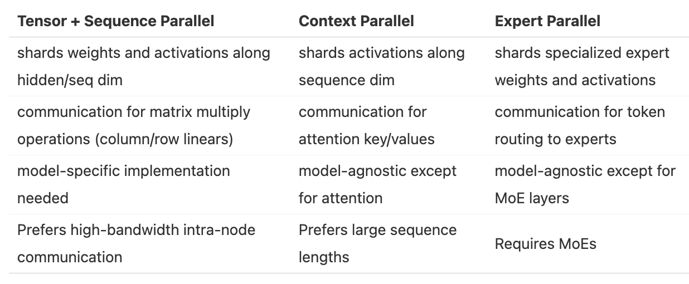
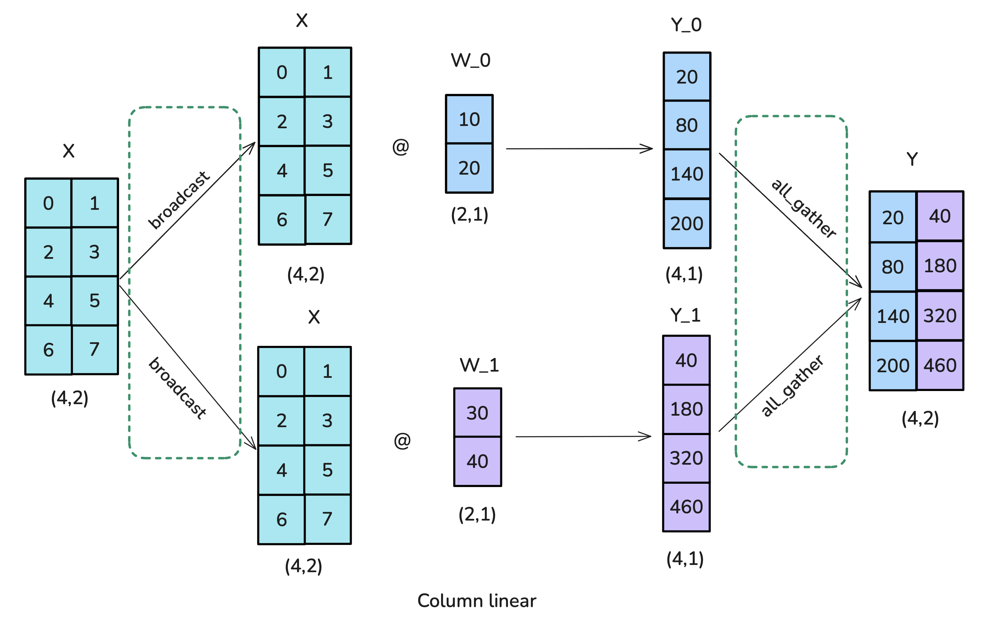
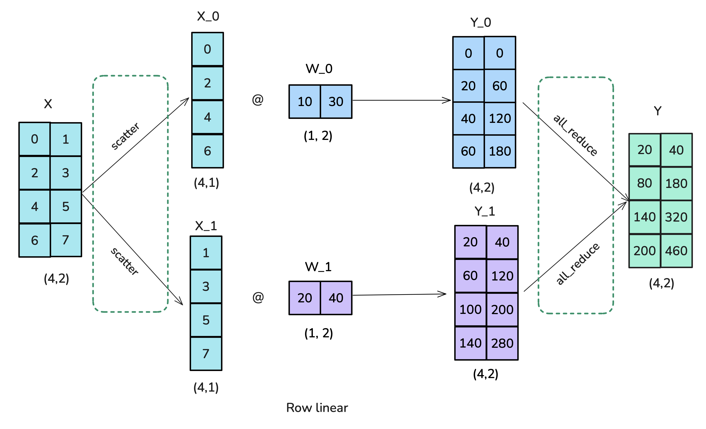
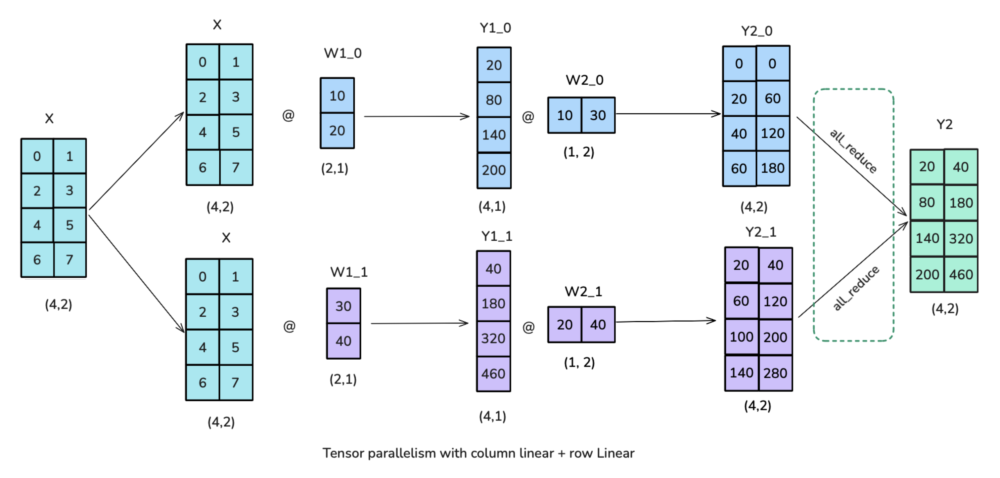
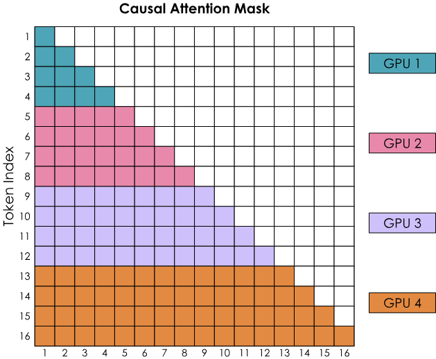
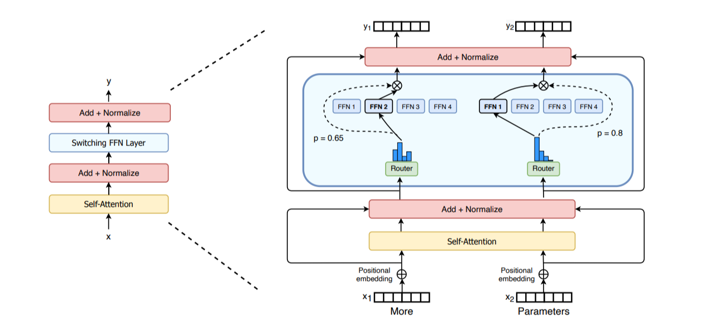
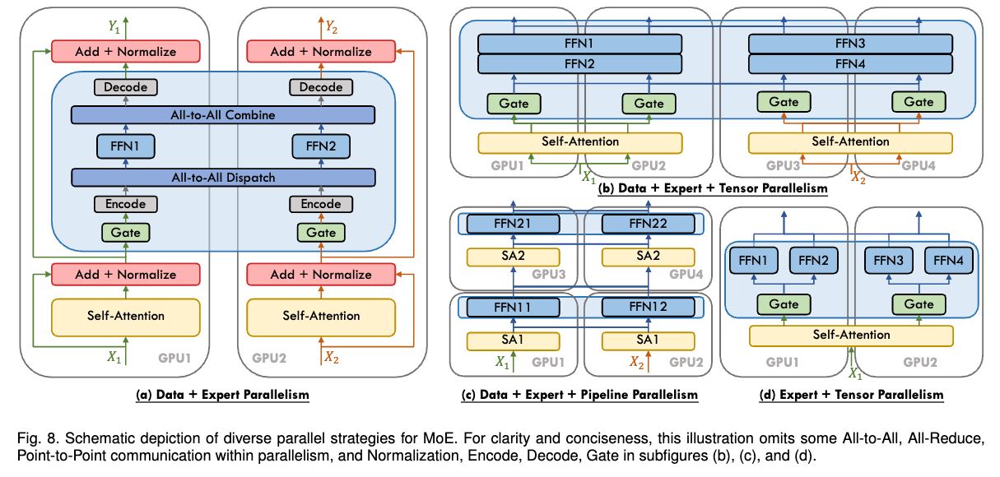

# Distributed Training Part 4: Parallel Strategies
- Five Dimensions of Parallelization Strategies
    - batch dimension
    - hidden_state dimension
    - sequence dimension
    - model_layer dimension
    - model_expert dimension
- Optimal Training Configuration
- Tensor Parallelism（TP）
- Sequence Parallelism (SP)
- Context Parallelism (CP)
- Pipeline parallelism (PP)
- Expert Parallelism (PP)
<!-- more -->
## 1. Five Dimensions of Parallelization Strategies
### 1.1. Five Dimensions
- Data Parallelism (DP) -> batch dimension
    - ZeRO (Zero Redundancy Optimizer)
        - ZeRO-1: optimizer state sharding
        - ZeRO-2: optimizer state + gradient sharding
        - ZeRO-3 / FSDP (Fully-Sharded Data Parallelism): optimizer state + gradient + parameter sharding
- Tensor Parallelism (TP) -> hidden_state dimension
- Sequence Parallelism (SP) -> sequence dimension
- Context Parallelism (CP) -> sequence dimension
- Pipeline Parallelism (PP) -> model_layer dimension
- Expert Parallelism (EP) -> model_expert dimension

### 1.2. Combining Multiple Parallel Strategies
- PP + ZeRO-1/ZeRO-2/ZeRO-3
    - e.g., the training of DeepSeek-v3 used PP combined with ZeRO-1 
- TP & SP + PP
- TP & SP + ZeRO-3
- CP + EP
- TP & SP + CP + EP + PP + FSDP

Three Most Common Parallel Strategies (3D Parallelism)
- DP
- TP
- PP

### 1.3. Impact Scope
- TP & SP: Affect the entire model's computation by sharding weights and activations
- CP: Mainly affects the attention layer, as that's where cross-sequence communication is needed, while other layers run independently on sharded sequences
- EP: Mainly affects MoE layers (these layers replace standard MLP blocks), while attention and other components remain unchanged
- PP: Does not specifically target any submodule or component
- ZeRO: Does not specifically target any submodule or component

### 1.4. PP vs ZeRO-3
Commonality: Both are methods of splitting model weights across multiple GPUs and communicating and computing along the model depth axis, with each device computing full layer operations

Differences:

### 1.5. TP & SP vs CP vs EP

### 1.6. Memory Savings Comparison for Each Parallel Strategy

## 2. Optimal Training Configuration
Considerations
- Consider various physical attributes of the compute cluster, network bandwidth, number of GPUs per node, and memory size of each GPU
- Consider model size
- Consider batch size

### 2.1. Step 1: Fitting a Training Step in Memory / Fit a full model instance on our GPUs
- Abundant GPU resources
    - Models with less than 10B parameters
        - Use a single parallel strategy across 8 GPUs
            - e.g., Tensor Parallelism or ZeRO-3/DP with Full Recompute across 8 GPUs
    - Models with parameters between 10B-100B
        - Use hybrid parallel strategies across 8 GPUs
            - TP (TP=8) + PP
            - TP (TP=8) + ZeRO-3
            - only ZeRO-3
    - At scales of more than 512 GPUs
        - Due to communication costs, pure data parallelism/ZeRO-3 becomes inefficient, and it's best to combine data parallelism with tensor parallelism or pipeline parallelism
    - At scales of more than 1024 GPUs
        - Recommended configuration can be tensor parallelism (TP=8) combined with data parallelism (ZeRO-2) and pipeline parallelism
    - Special considerations
        - For ultra-long sequences: CP
        - For MoE architectures: EP
- Limited GPU resources
    - Full activation recomputation trades time for space (training is somewhat slow)
    - Increase gradient accumulation to handle larger batches

### 2.2. Step 2: Achieving Target Global Batch Size
- Increase current global batch size
    - Expand DP or gradient accumulation steps
    - For long sequences, adopt CP
- Decrease current global batch size
    - Reduce DP 
    - For long sequences, reduce CP

### 2.3. Step 3: Optimizing Training Throughput / Ensure the training is running as fast as possible

When memory and communication are not bottlenecks, try the following:
- Expand TP, using fast intra-node bandwidth until parallelism approaches node size, reducing the use of other parallel methods
- Increase the use of ZeRO-3 data parallelism while maintaining the target batch size
- Transition to using pipeline parallelism when data parallel communication becomes a bottleneck
- Try expanding different parallel methods one by one
- Experiment with various micro-batch sizes (mbs) to find the best balance between maximum global batch size (GBS), model size, computation, and communication

### 2.4. Top Configurations
Fixed experimental settings:
sequence length: 4096
gbs (global batch size): 1M tokens

Shows the best configurations for different model sizes and the number of compute nodes (8 GPUs per node), with color indicating MFU (Model FLOPs Utilization), where FLOPs stands for Floating point operations per second, and brighter colors represent higher efficiency

Included configuration details
- DP
- TP
- PP
- GAS (Gradient Accumulation Steps)
- MBS (Micro Batch Size)
- ZeRO

Key insights
- Efficiency decreases with increased node count (higher parallelism), more noticeable for smaller models (although batch size can be increased to compensate for small model size, we are constrained by a global batch size limit of 1 million)
- Larger models present different challenges. As model size increases, memory requirements grow significantly. This creates two scenarios with fewer nodes: either the model cannot fit in memory at all, or it barely fits but runs inefficiently due to being close to GPU memory limits (e.g., training an 8 billion parameter model on 4 nodes)
- Performance largely depends on the quality of each parallel strategy's specific implementation (when we first implemented these two parallel strategies, tensor parallelism (TP) outperformed pipeline parallelism (PP). After optimizing our PP code, it became the faster choice. We are now improving communication overlap in the TP implementation, expecting it to regain performance leadership.)

## 3. Tensor Parallelism (TP)
### 3.1. TP Principle
- ZeRO shards model parameters, gradients, and optimizer states, but once activation memory exceeds our memory budget, we hit a limitation.
- At this point, we introduce Tensor Parallelism (TP), a method that shards not only weights, gradients, and optimizer states but also activations, without needing to gather them all before computation.

TP's principle leverages the mathematical properties of matrix multiplication:

Example: How to apply TP to the following computation

Option 1: Column-wise sharding / column-linear
- Broadcast X
- Column-shard W
- All-gather to obtain Y

Option 2: Row-wise sharding / row-linear
- Scatter X column-wise
- Row-shard W
- All-reduce to obtain Y

### 3.2. TP Application in Transformer Blocks
Two main blocks of Transformer:
- MLP / Feedforward layers
- MHA / Multi-Head Attention
#### 3.2.1. MLP Block: Column-wise Sharding -> Row-wise Sharding

- The all-reduce operation in the figure is necessary and cannot overlap with GPU computation
- TP helps reduce activation memory for matrix multiplication, but we still need to gather full activations for LayerNorm computation

#### 3.2.2. MHA Block:
- Q, K, V matrices: Use column-wise sharding
    - Multi-head: Each head of multi-head attention is inherently parallel, and TP takes advantage of this
    - MQA (Multi-Query Attention): All Qs share a set of K and V
    - GQA (Grouped-Query Attention): Multiple Qs share a set of K and V (group sharing)
    - Column-wise sharding in TP is also applicable to MQA and GQA, as the shared nature of K and V does not affect the independent computation of heads
    - Constraints
        - TP shard count should not exceed the number of Q/K/V heads (otherwise, independent computation is not possible, requiring additional communication)
        - GQA shard count should not exceed the number of K/V heads (otherwise, K/V heads need to be duplicated to maintain synchronization), e.g., Llama-3 8B has 8 K/V heads, so TP shard count should not exceed 8
- O matrix: Use row-wise sharding

### 3.3. Impact of Scaling TP Shard Size on Throughput and Memory

Trade-offs
- Computational efficiency: Increasing TP shard size reduces throughput (significant drop from TP=8 to TP=16, steeper drop from TP=16 to TP=32, with the drop becoming more severe as TP increases)
- Available memory: Increasing TP shard size allows for handling larger batch sizes

## 4. Sequence Parallelism (SP)
- Sequence Parallelism (SP) involves sharding activations and computations of parts of the model not handled by Tensor Parallelism (TP), such as Dropout and LayerNorm, but sharding is done along the input sequence dimension rather than the hidden dimension.
- Sequence parallelism here is tightly coupled with tensor parallelism, mainly applied to Dropout and LayerNorm operations (For example, LayerNorm needs the full hidden dimension to compute mean and variance)
- However, when dealing with longer sequences, attention computation becomes a bottleneck, requiring techniques like Ring-Attention, sometimes also referred to as sequence parallelism, but we call them context parallelism to distinguish between the two methods. Therefore, whenever you see "sequence parallelism," remember it is usually used with tensor parallelism (while context parallelism can be used independently).

### 4.1. TP Only vs TP with SP

Terminology
- b : batch_size (first dimension of the tensor)
- s : sequence_length (second dimension of the tensor)
- h : hidden_state (third dimension of the tensor)

Comparison of TP Only and TP with SP:
- The key advantage of sequence parallelism is the reduced maximum activation size that needs to be stored
    - TP Only: Activations of shape (b, s, h) are needed at multiple points, with activation size b * s * h
    - TP with SP: Activation shape changes to (b, s, h/k) or (b, s/k, h), reducing maximum activation size to b * s * h / k, where k is the parallelism degree
- Both have the same communication overhead in forward and backward passes
    - TP Only: Each Transformer block has 2 all-reduce operations
    - TP with SP: Each Transformer block has 2 all-gather operations and 2 reduce-scatter operations, but since all-reduce = reduce-scatter + all-gather, it is equivalent to 2 all-reduce operations, consistent with TP Only

#### 4.1.1. Left Figure: TP Only
- f and f* operations
    - f operation
        - No operation in forward pass
        - All-reduce operation in backward pass
    - f* operation
        - All-reduce operation in forward pass
        - No operation in backward pass
- Overall tensor changes
    - (b, s, h) -> Full
    - f
    - (b, s, h/k) -> TP (column-wise sharding -> row-wise sharding)
    - f*
    - (b, s, h) -> Full
    - f
    - (b, s, h/k) -> TP (column-wise sharding -> row-wise sharding)
    - f*
    - (b, s, h) -> Full

#### 4.1.2. Right Figure: TP with SP
- g and g* operations
    - g operation
        - All-gather operation in forward pass
        - Reduce-scatter operation in backward pass
    - g* operation
        - Reduce-scatter operation in forward pass
        - All-gather operation in backward pass
- Overall tensor changes
    - (b, s/k, h) -> SP
    - g
    - (b, s, h/k) -> TP (column-wise sharding -> row-wise sharding)
    - g*
    - (b, s/k, h) -> SP
    - g
    - (b, s, h/k) -> TP (column-wise sharding -> row-wise sharding)
    - g*
    - (b, s/k, h) -> SP 

### 4.2. Throughput and Memory Usage
TP with SP in the MLP part:
- Like TP Only, GPU communication cannot overlap with GPU computation, making throughput heavily dependent on communication bandwidth

Memory usage of a 70B model:

Impact of scaling TP with SP on throughput and memory utilization for a 3B model with 4096 sequence length: 

Similarly, a trade-off between throughput and memory usage is needed

## 5. Context Parallelism (CP)

### 5.1. Ring Attention

At each time step, each GPU sequentially performs these three operations:
- 1. Send current K, V to the next GPU
- 2. Compute attention scores locally
- 3. Wait to receive K, V from the previous GPU

Problem with naive implementation: Due to masking, data is lower triangular, and Softmax is computed row-wise, leading to imbalanced computation across GPUs

### 5.2. Zig-Zag Ring Attention
Balanced computation implementation: Not purely sequential allocation, but mixing front and back tokens onto one GPU

Two ways to overlap computation and communication
- All-gather implementation: Reassemble all KVs on each GPU (in the manner of ZeRO-3)
    - Requires temporary storage of all KV pairs
    - Communication occurs only in the first step
- All-to-all (Ring) implementation: Sequentially gather KVs from each GPU in a ring
    - Requires only temporary storage of an additional block
    - Communication overlaps with computation from start to finish, with some latency overhead

## 6. Pipeline Parallelism (PP) 
Pipeline parallelism: Distribute model layers across multiple GPUs, also known as "inter-layer parallelism"

### 6.1. Memory Usage

Each GPU still processes the entire batch of data, just on different layers, so activation memory size is complete. Activations are processed on one GPU's layers and then sent to the next GPU to continue forward propagation

### 6.2. Main Challenge: Minimize GPU computation idle time, improve GPU utilization
Example: 16-layer model distributed across 4 GPUs
- tf: Time for forward propagation
- tb: Time for backward propagation
- A simple assumption: tb = 2 * tf

### 6.3. Naive PP
Note: The numbers in the squares in the diagram here represent the layer numbers, totaling 16 layers, with every 4 layers grouped on one GPU.

- Ideal total time: tideal = tf + tb
- Idle time: tpipeline_bubble = (p - 1) * (tf + tb), where p is the parallelism degree
- Ratio of idle time to ideal time: rbubble = (p - 1) * (tf + tb) / (tf + tb) = p - 1

### 6.4. All-forward-all-backward (AFAB) Scheme / Forward then Backward / F then B
Note: The numbers in the squares in the diagram here no longer represent layer numbers but instead represent micro-batches. Each batch is divided into 8 micro-batches (numbers 9-16 are the micro-batches of the next batch). Each square represents 4 layers, and the same micro-batch across 4 GPUs covers 16 layers.

- AFAB means starting the backward pass for all micro-batches of a batch only after all forward passes are completed

Problem: Need to store all activations (only after all forward passes are completed and the backward pass of a micro-batch is completed can the activations of that micro-batch be released)
### 6.5. One-forward-one-backward (1F1B) and LLama 3.1 Schemes
#### 6.5.1. Non-interleaved Schedule (default)
Note: The numbers in the squares in the diagram here no longer represent layer numbers but instead represent micro-batches. Each batch is divided into 8 micro-batches (numbers 9-16 are the micro-batches of the next batch). Each square represents 4 layers, and the same micro-batch across 4 GPUs covers 16 layers.

- Compared to AFAB, start the backward pass of a micro-batch as soon as its forward pass is completed
- Each micro-batch does not synchronize with other micro-batches
- Non-interleaved scheduling can be divided into three phases. The first phase is the warm-up phase, where processors perform different amounts of forward computation. In the next phase, processors perform one forward computation followed by one backward computation. The final phase completes backward computation.

- Store only partial activations (as soon as a micro-batch's forward pass is completed, start its backward pass to release activations, while other micro-batches' forward passes are still ongoing)
- 1F1B improves memory usage but does not improve idle time

#### 6.5.2. Interleaving Stages / Interleaved Schedule
Two main blocks of Transformer:
- MLP / Feedforward layers
- MHA / Multi-Head Attention

Note: Here, each block in the diagram represents a computation block. Green blocks represent the forward pass of the attention block (MHA), cyan blocks represent the forward pass of the feed-forward neural network (MLP), pink blocks represent the backward pass of MHA, and purple blocks represent the backward pass of MLP. The numbers on the blocks indicate the micro-batch IDs. Each batch is divided into 8 micro-batches, and each square represents 4 layers. The same micro-batch across 4 GPUs covers 16 layers.

## 7. Expert Parallelism (EP)

MoE (Mixture-of-Experts) basics: https://huggingface.co/blog/moe

Expert Parallelism (EP): Parallelism along the expert dimension
- Each expert's FFN Layer is completely independent
- Lighter than TP, as it does not require splitting matrix multiplication, only routing hidden states to the correct expert
- Typically used with other parallel strategies, such as DP

 