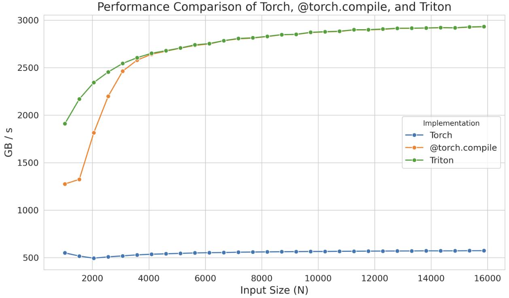
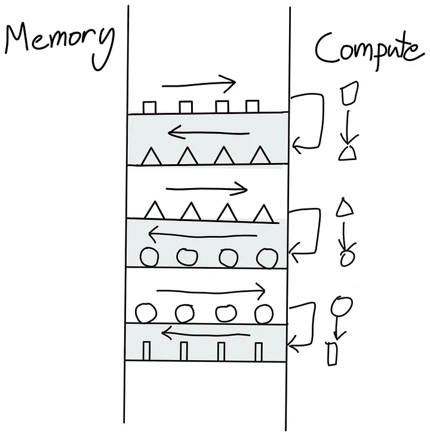
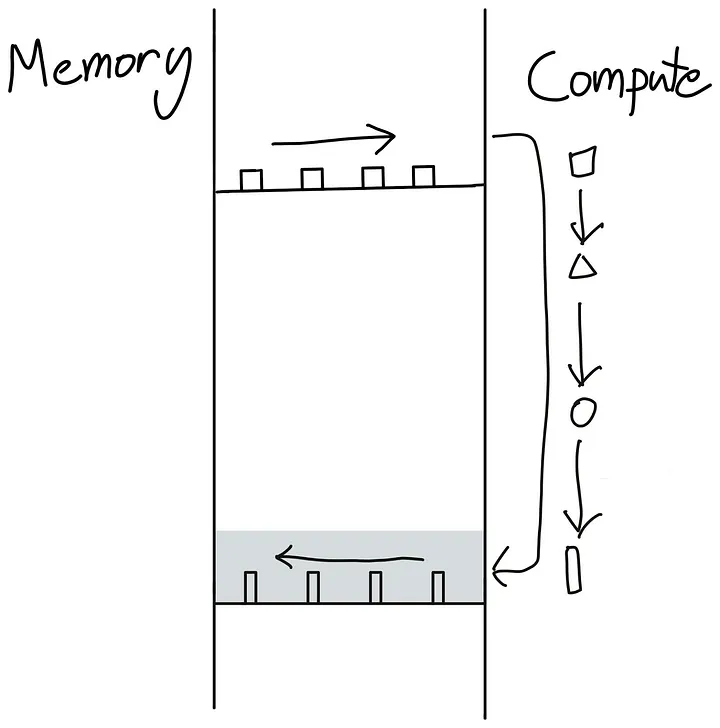

# Distributed Training Part 5: Introduction to GPU
- GPU Architecture
- How to Improve Performance with Kernels
- Fused Kernels
- Flash Attention
<!-- more -->

## 1. GPU Architecture
In terms of computation, it has a highly hierarchical structure
- A GPU consists of a set of computational units called Streaming Multiprocessors (SMs).
- Each SM contains and controls a set of streaming processors, also known as cores. For example, the Nvidia H100 GPU has 132 SMs, each with 128 cores, totaling 16,896 cores.
- Each core can handle multiple threads simultaneously.


In terms of memory, it also has a highly hierarchical structure, including multiple layers of cache and memory
- Registers are the smallest units, private to threads during execution
- Shared Memory and L1 cache are shared by threads running on a single SM
- A higher level is the L2 cache shared by all SMs
- Finally, there is global memory, which is the largest memory on the GPU (e.g., the H100 boasts 80 GB), but it is also the slowest to access and query


The goal of a GPU is to leverage this hierarchical organization of computation/memory to run as many workloads as possible in parallel on the GPU cores.

A piece of code running on GPU cores is called a kernel. It can be written in high-level languages in CUDA or Triton and then compiled into PTX (Parallel Thread Execution), the low-level assembly language used by NVIDIA GPUs.

To run a kernel, a specific piece of code called host code is also needed, which executes on the CPU/host and is responsible for preparing data allocation and loading data and code.

The scheduling of a kernel typically follows:
- Threads are grouped into warps of size 32. All threads in a warp execute instructions synchronously but process different parts of the data.
- Warps are grouped into larger and more flexible blocks (e.g., size 256), each block still assigned to a single SM. An SM can run multiple blocks in parallel, but depending on resource availability, not all blocks can be assigned for execution immediately, and some blocks may be queued, waiting for resources.

## 2. How to Improve Performance with Kernels
### 2.1. Tools for Writing Kernel Code
- Pytorch: easy but slow
- torch.compile: easy, fast, but not flexible
- triton: harder, faster, and more flexible
- CUDA: hardest, fastest, and most flexible (if you get it right)

### 2.2. torch.compile Decorator
If you want to add a new operation lacking in a kernel or speed up an existing PyTorch function, writing a kernel from scratch might seem the most straightforward approach. However, creating high-performance CUDA Kernels from scratch requires extensive experience and a steep learning curve. A better starting point is often to use torch.compile, which captures your operations and generates low-level, high-performance Kernels in Triton, dynamically optimizing PyTorch code.

Suppose you want to write a Kernel for the activation function of the Exponential Linear Unit:


After writing a PyTorch implementation, you only need to decorate it with @torch.compile

```python
@torch.compile
def elu(x, alpha=1.0):
    return torch.where(x < 0, alpha * (torch.exp(x) - 1), x)
```

The performance improvement is significant


Once you run a Python script with the @torch.compile decorator, the corresponding Triton Kernel is generated.

To view the Triton Kernel generated by @torch.compile, simply set the environment variable TORCH_LOGS to "output_code"
```bash
export TORCH_LOGS="output_code"
```

The corresponding Triton Kernel (variables renamed and comments added for readability):
```python
@triton.jit
def elu_kernel(input_ptr, output_ptr, num_elements, BLOCK_SIZE: tl.constexpr):
    # Calculate the starting index for this block
    block_start = tl.program_id(0) * BLOCK_SIZE
    # Create an array of indices for this block
    block_indices = block_start + tl.arange(0, BLOCK_SIZE)[:]
    # Create a mask to ensure only valid indices are processed
    valid_mask = block_indices < num_elements
    # Load input values from the input pointer based on valid indices
    input_values = tl.load(input_ptr + block_indices, valid_mask)
    # Define the ELU parameters
    zero_value = 0.0  # Threshold for ELU activation
    negative_mask = input_values < zero_value
    exp_values = tl.math.exp(input_values)
    # Define the ELU output shift
    one_value = 1.0
    shifted_exp_values = exp_values - one_value

    output_values = tl.where(negative_mask, shifted_exp_values, input_values)

    # Store the computed output values back to the output pointer
    tl.store(output_ptr + block_indices, output_values, valid_mask)
```

Here, tl.program_id(0) provides a unique block ID, which we use to determine the segment of data the block will process. Using this block ID, block_start calculates the starting index for each block segment, while block_indices specify the range of indices within the segment. valid_mask ensures that only indices within num_elements are processed, safely loading data with tl.load. The ELU function is then applied, modifying values based on whether they are negative, and finally, the results are written back to memory with tl.store.

### 2.3. Implementing Triton Kernels
If this performance improvement is not enough, consider implementing Triton Kernels



Even in Triton, sometimes due to the language's limitations in handling low-level details (such as shared memory and scheduling within SMs), we cannot fully achieve the device's optimal performance. Triton's functionality is limited to blocks and their scheduling across SMs. For deeper control, you need to implement kernels directly in CUDA, where you can access all the underlying low-level details.

### 2.4. Implementing CUDA Kernels
Techniques to improve kernel efficiency:
- Optimize memory access patterns to reduce latency
- Use shared memory to store frequently accessed data
- Manage thread workloads to minimize idle time

#### 2.4.1. Optimizing Memory Access / Memory Coalescing
Compared to cache, Global Memory has longer latency and lower bandwidth, which is often the bottleneck for most applications.

In CUDA devices, global memory is implemented using DRAM

Memory coalescing takes advantage of DRAM's burst data transfer mode, where accessing one memory address simultaneously transfers a series of contiguous memory locations.

Maximize memory access efficiency by ensuring that 32 threads in a warp access adjacent memory (For instance, if thread 0 accesses location M, thread 1 accesses M + 1, thread 2 accesses M + 2, and so forth)


Problem
- Low throughput
- Warning of uncoalesced memory access

Reason
Matrix elements are stored in row-major order, as shown below:


But threads load data in column-major order, preventing memory access coalescing

Solution: Let threads load data in row-major order to coalesce memory access


Throughput increased tenfold

#### 2.4.2. Using Shared Memory / Tiling

Shared memory is a small, fast-access memory space shared by all threads in a block, reducing the need to repeatedly load data from slow global memory

Use tiling to load data into shared memory at once, allowing all threads in a block to reuse the same shared data, enabling quick access to all necessary data for matrix multiplication


Throughput increased to 410 GB/s, kernel execution time reduced by about 43%, achieving approximately 6.6 TFLOPs of performance

#### 2.4.3. Thread Coarsening

Thread coarsening combines several threads into a single coarse thread, significantly reducing shared memory access as each coarse thread can handle multiple output elements

#### 2.4.4. Minimizing Control Divergence

SIMD: single instruction, multiple data

An SM (Streaming Multiprocessor) executes all threads in a warp using the SIMD model

The advantage of SIMD is efficiency: control hardware responsible for instruction fetching and scheduling is shared by multiple execution units, minimizing hardware overhead related to control functions, allowing more hardware to focus on improving arithmetic throughput

## 3. Fused Kernels
GPU and CPU operations can be asynchronous. Specifically, host code on the CPU can schedule workloads on the GPU in a non-blocking manner.

Avoid switching back and forth between host and GPU Kernel commands

A series of kernels that need to switch back and forth between global memory and compute units:



Complete all operations at once:



How to avoid this back-and-forth switching? The best way is to make our GPU as autonomous as possible. This can be achieved by packaging as many consecutive computational operations as possible into a single kernel for the GPU to run, known as a "Fused Kernel."

Fused Kernels are particularly efficient and easy to write for consecutive point-like operations, which are executed independently on each input token. In this case, it makes no sense to first put the computed values back into global memory and then move them to SM memory to start a new kernel. A more efficient approach is to keep all values locally until a series of computations are completed.

In Transformer models, there are many places where this "fusing" method can be applied: every time we encounter a series of point-like operations, such as in the computations involved in layer normalization.

## 4. Flash Attention
Flash Attention, proposed by Tri Dao, aims to optimize attention computation by writing custom CUDA kernels, making it faster and more memory-efficient. The core idea of Flash Attention is to efficiently utilize various GPU memories, avoiding excessive reliance on the slowest memory: the GPU's global memory.

### 4.1. Before Optimization


HBM: High Bandwidth Memory (represents global memory, not efficient at all)

The basic implementation of the attention mechanism involves a lot of transfers between memory and work units. It requires instantiating S and P matrices in HBM, meaning results need to be sent to HBM first and then returned to SRAM for subsequent computations.

Because HBM's bandwidth is quite low, it is the bottleneck for attention computation

### 4.2. Flash Attention Optimization
The key is to compute the S matrix in small chunks so that it can fit into the smaller shared memory of the SM. But we can do better by completely avoiding the instantiation of the large S matrix and instead only keeping the necessary statistics needed to compute the softmax normalization factor. This way, we can compute O directly in SRAM at once, rather than moving intermediate results back and forth. In this case, we not only utilize shared memory but also alleviate the memory bottleneck caused by instantiating the attention matrix (the bulk of activations).


The concept of Flash Attention addresses many bottlenecks in model training, quickly becoming the default way to perform attention in all Transformer models.

After Flash-Attention 1, the same lab released two improved versions: Flash-Attention 2 and Flash-Attention 3. Compared to Flash-Attention 1, the improvements in Flash-Attention 2 and 3 focus more on low-level implementation optimizations for GPUs rather than the general attention mechanism. Specifically, these optimizations include: (1) minimizing the number of non-matmul operations as much as possible; (2) for Flash-Attention 2, carefully distributing workloads to warps and thread blocks; for Flash-Attention 3, optimizing support for FP8 and Tensor Core for the latest Hopper (H100) architecture. 