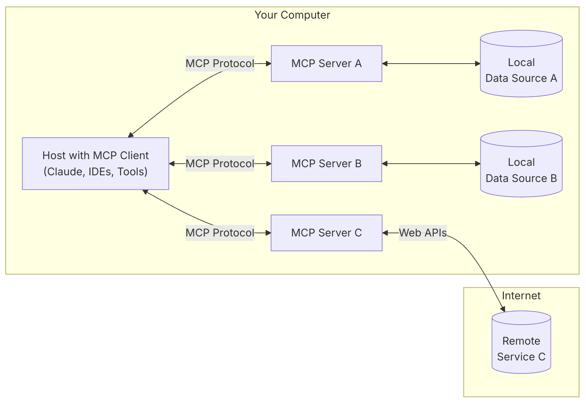
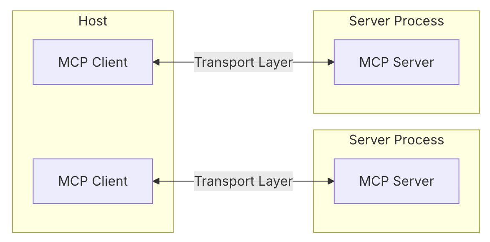
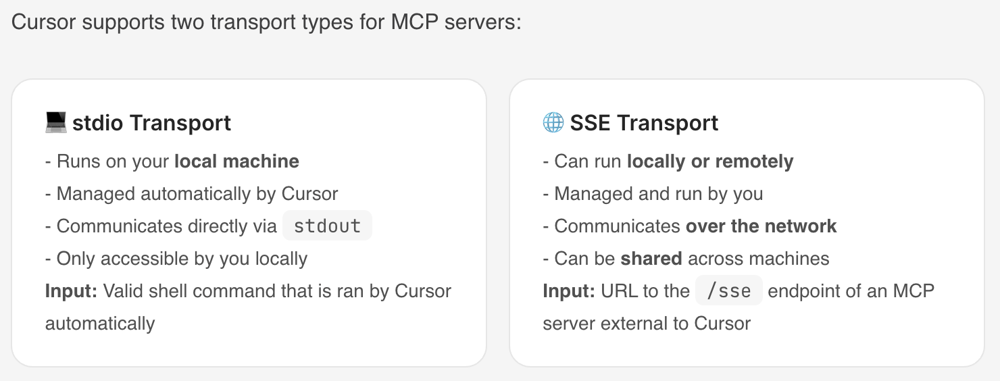

# MCP Technical Overview
- Concept, Evolution, and Significance of MCP  
- MCP Architecture, Core Components, and Function Types  
- MCP Client and MCP Server  
- How Different Roles Use MCP  

<!-- more -->

## 1. What is MCP?

MCP (Model Context Protocol) is an emerging **standard open protocol** launched by Anthropic (the company behind Claude) to address the pain points in **AI model and external tool interactions** on Agent platforms. It helps you build intelligent agents and complex workflows on top of LLMs. MCP standardizes how applications provide context to AI models and aims to enhance model interaction with tools and data sources through secure bi-directional connections.

Think of MCP as the USB-C for AI applications. Just as USB-C standardizes how devices connect to peripherals, MCP standardizes how AI models connect to diverse tools and data sources.

The MCP Server exists to automate AI Agents. It is a middleware layer that informs the AI Agent about available services, APIs, and data sources. The Agent then decides which to invoke and performs function calls accordingly. In the past, every tool needed custom code to connect with AI. With MCP, tools and AIs can "talk" directly using a shared plugin—like a universal interface.

For example, to use GitHub, you ultimately call its official API (https://api.github.com). Before calling it, MCP describes to the AI what capabilities the server provides, what parameters are needed, and what results can be expected. MCP Server itself is not a magical invention—it’s simply a consensus-driven protocol.

Website: https://modelcontextprotocol.io/introduction  

GitHub: https://github.com/modelcontextprotocol

## 2. AI Tool Invocation Evolution

The technical evolution path from complex prompts → Function Calling → GPTs plugins → MCP protocol is quite similar to the standardization process of several classic technologies — especially Web technologies, Internet protocols, and API standardization. This process can be compared to the standardization journey of Web APIs:

|Web API Evolution|AI Tool Invocation Evolution|
|---|---|
|Early Stage: RPC (Remote Procedure Call), various implementations|Early Stage: Tool invocation via prompt engineering|
|Development Stage: Frameworks like SOAP and XML-RPC| Development Stage: Structured Function Calling using JSON|
|Maturity Stage: REST API becomes mainstream|Maturity Stage: Platform-specific implementations like GPTs|
|Unification Stage: New standards like GraphQL| Unification Stage: MCP as a unified protocol|


## 3. What's the Difference Before and After MCP? Why Does It Matter?

- Before MCP: Agent platforms had to **maintain a list of available tools** themselves and **handle tool invocation logic** manually
- After MCP: Both **tool list management** and **invocation logic** are handled by MCP.

Significance:
- MCP solves the problem of inconsistent tool invocation standards across Agent platforms. MCP Servers expose APIs as MCP tools that any Agent platform can use—eliminating redundant work and significantly lowering development costs.
- MCP improves context-awareness, automation, and security through a standardized client-server protocol.
- Its modular design allows one client to connect to multiple servers, unlocking diverse functionality easily.

## 4. MCP vs Function Calling

Functionality Layers:
- **MCP:** Connection Layer  
- **Function Calling:** Execution Layer  
- **AI Agent:** Decision Layer  

Use Case Differences:
- **MCP:** When connecting many tools without writing a lot of custom code  
- **Function Calling:** Automating simple tasks  
- **AI Agent:** Making autonomous decisions

## 5. MCP Architecture

MCP adopts a client-server architecture.

  
  


## 6. Core Components of MCP

Core Components:
- **Host:**  
  The application (e.g., Claude Desktop or IDEs) that initiates the connection.
- **Client:**  
  Resides inside the host application and connects 1:1 with a server.
- **Server:**  
  Provides context, tools, and prompts to the client.
- **Protocol Layer:**  
  Handles message packaging, request/response linking, and high-level communication patterns.
- **Transport Layer:**  
  Manages actual communication between Client and Server.

MCP supports multiple transport mechanisms. All use JSON-RPC 2.0 for message exchange:

Transport Types:
- **Stdio Transport:**  
  Uses standard input/output; suited for local processes.
- **HTTP with SSE Transport:**  
  - Server → Client: via Server-Sent Events (SSE)  
  - Client → Server: via HTTP POST

Message Types:
- Requests  
- Results  
- Errors  
- Notifications

## 7. MCP Connection Lifecycle

### 7.1 Initialization  


### 7.2 Message Exchange
- Either side can send requests, with the other responding.
- Either side can send one-way notifications.

### 7.3 Termination
Either party can terminate the connection.

## 8. MCP Function Types

MCP Servers expose three main function types:
- Tools
    - Executable by LLMs
    - Common Tool Types:
    - **System Operations:** Interact with local systems
    - **API Integrations:** Wrap external APIs
    - **Data Processing:** Transform or analyze data  
    - Docs: https://modelcontextprotocol.io/docs/concepts/tools#python
- Resources
    - Any data type readable by LLMs
    - Identified via unique URIs; may contain text or binary data
    - Resource Types:
    - **Text Resources:**  
        UTF-8 encoded text. Suitable for:
        - Source code
        - Config files
        - Logs
        - JSON/XML
        - Plain text
    - **Binary Resources:**  
        Base64-encoded binary data. Suitable for:
        - Images
        - PDFs
        - Audio/Video files
        - Other non-text formats  
    - Docs: https://modelcontextprotocol.io/docs/concepts/resources
- Prompts
    - Pre-written reusable templates and workflows to assist in specific tasks  
    - Docs: https://modelcontextprotocol.io/docs/concepts/prompts

Additional Functions
- Sampling 
    - Server invokes the LLM hosted on the client side  
    - https://modelcontextprotocol.io/docs/concepts/sampling
- Roots 
  - Define the operational scope for the server  
  - e.g., a workspace that the client uses and informs the server about  
  - Common Uses:
    - Project directories
    - Repo locations
    - API endpoints
    - Config locations
    - Resource boundaries  
  - https://modelcontextprotocol.io/docs/concepts/roots

## 9. Standard Protocols for Different MCP Function Types
### 9.1. Resources
Resources URIs
- Each Resource is defined according to the following standard
```
[protocol]://[host]/[path]
```
### 9.2. Prompts
Prompt Structure
- Each Prompt is defined according to the following standard
```
{
  name: string;              // Unique identifier for the prompt
  description?: string;      // Human-readable description
  arguments?: [              // Optional list of arguments
    {
      name: string;          // Argument identifier
      description?: string;  // Argument description
      required?: boolean;    // Whether argument is required
    }
  ]
}
```
### 9.3. Tools
Tool definition structure 
- Each Tool is defined according to the following standard
```
{
  name: string;          // Unique identifier for the tool
  description?: string;  // Human-readable description
  inputSchema: {         // JSON Schema for the tool's parameters
    type: "object",
    properties: { ... }  // Tool-specific parameters
  },
  annotations?: {        // Optional hints about tool behavior
    title?: string;      // Human-readable title for the tool
    readOnlyHint?: boolean;    // If true, the tool does not modify its environment
    destructiveHint?: boolean; // If true, the tool may perform destructive updates
    idempotentHint?: boolean;  // If true, repeated calls with same args have no additional effect
    openWorldHint?: boolean;   // If true, tool interacts with external entities
  }
}
```
### 9.4. Sampling
Message format 
- Each Sampling request initiated by the server follows the same standard.  

```
{
  messages: [
    {
      role: "user" | "assistant",
      content: {
        type: "text" | "image",

        // For text:
        text?: string,

        // For images:
        data?: string,             // base64 encoded
        mimeType?: string
      }
    }
  ],
  modelPreferences?: {
    hints?: [{
      name?: string                // Suggested model name/family
    }],
    costPriority?: number,         // 0-1, importance of minimizing cost
    speedPriority?: number,        // 0-1, importance of low latency
    intelligencePriority?: number  // 0-1, importance of capabilities
  },
  systemPrompt?: string,
  includeContext?: "none" | "thisServer" | "allServers",
  temperature?: number,
  maxTokens: number,
  stopSequences?: string[],
  metadata?: Record<string, unknown>
}
```

Response format 
- Each Sampling result returned by the client also follows the same standard.

```
{
  model: string,  // Name of the model used
  stopReason?: "endTurn" | "stopSequence" | "maxTokens" | string,
  role: "user" | "assistant",
  content: {
    type: "text" | "image",
    text?: string,
    data?: string,
    mimeType?: string
  }
}
```

## 10. MCP Client
Popular MCP Clients
- For Non-Engineers
    - Claude Desktop App
        - Official product by Anthropic that integrates local tools and data sources using MCP. Suitable for both technical and non-technical users.  
        - https://claude.ai/download
    - LibreChat 
        - Open-source chat application with MCP tool integration support
        - https://github.com/danny-avila/LibreChat
- For Engineers
    - Cursor 
        - AI-powered code editor, early adopter of MCP, ideal for developers
        - https://www.cursor.com/
    - Cline 
        - Open-source VSCode extension that supports the MCP marketplace and custom servers
        - https://github.com/cline/cline
    - Continue
        - VSCode and JetBrains extension that supports full MCP functionality
        - https://github.com/continuedev/continue
    - Zed
        - High-performance code editor with MCP extension support
        - https://zed.dev/
    - Windsurf Editor
        - AI-driven code editor that supports the MCP protocol
        - https://windsurf.com/editor
    - Sourcegraph Cody
        - AI coding assistant with MCP configuration support
        - https://sourcegraph.com/cody

Once an application integrates MCP support (i.e., becomes an MCP Client), it can provide users with powerful AI context capabilities, enabling seamless interaction between the AI model and the MCP Server.

Different clients may support different MCP functions, so the level of integration with MCP servers may vary.

| Client | Resources | Prompts | Tools | Sampling | Roots | Notes |
|--------|-----------|---------|-------|----------|-------|-------|
| Claude Desktop App | ✅ | ✅ | ✅ | ❌ | ❌ | Supports tools, prompts, and resources. |
| LibreChat | ❌ | ❌ | ✅ | ❌ | ❌ | Supports tools for Agents |
| Cursor | ❌ | ❌ | ✅ | ❌ | ❌ | Supports tools. |
| Cline | ✅ | ❌ | ✅ | ❌ | ❌ | Supports tools and resources. |
| Continue | ✅ | ✅ | ✅ | ❌ | ❌ | Supports tools, prompts, and resources. |
| Zed | ❌ | ✅ | ❌ | ❌ | ❌ | Prompts appear as slash commands |
| Windsurf Editor | ❌ | ❌ | ✅ | ❌ | ❌ | Supports tools with AI Flow for collaborative development. |
| Sourcegraph Cody | ✅ | ❌ | ❌ | ❌ | ❌ | Supports resources through OpenCTX |

More:
- Official client list：https://modelcontextprotocol.io/clients
- PulseMCP client list：https://www.pulsemcp.com/clients

### 10.1 Cursor as an MCP Client

Cursor’s guide to MCP configuration: https://docs.cursor.com/context/model-context-protocol

With MCP, Cursor can connect to external tools or data sources, eliminating the need for users to explain external context via prompts.

Example:


Transport Mechanism:



## 11. MCP Server

- Official MCP Servers  
    - https://github.com/modelcontextprotocol/servers  
    - https://modelcontextprotocol.io/examples  
- Cursor MCP Servers  
    - https://cursor.directory/mcp  
- Curated by punkpeye: https://github.com/punkpeye/awesome-mcp-servers/blob/main/README-zh.md  
- Cline’s MCP Marketplace  
- https://smithery.ai/  
- https://www.pulsemcp.com/  
- http://glama.ai/mcp/servers  

Useful MCP Tools
- **Data and File Systems**
    - **Filesystem**  
      - Provides secure file operations with configurable access controls to ensure safe and compliant access.
    - **PostgreSQL**  
      - Offers read-only database access with schema introspection.
- **Development Tools**
    - **GitHub**  
      - Enables repository management and file operations with integrated GitHub API support.
    - **Git**  
      - Tools for reading, searching, and manipulating Git repositories, helping developers manage version control.
- **Web Crawlers**
    - **Firecrawl**: Clone websites.
- **Networking and Browser Automation**
    - **Brave Search**: Uses Brave's API for web and local search.
    - **Fetch**: Web content retrieval and transformation optimized for LLMs.
    - **Puppeteer**: Provides browser automation and web scraping.
    - **Playwright**: Browser control  
        - Automates browser tasks like form filling, screenshots, and navigation.  
        - Executes JavaScript, monitors console logs.  
        - Seamless integration between LLMs and browsers.  
        - Also useful for API testing.

## 12. How Different Roles Use MCP

- MCP Client Users  (e.g., users of Claude Desktop App or Cursor)
    - Just add the desired MCP Server in the config, then simply ask questions as usual
- MCP Client Developers  (e.g., developers of Claude Desktop App or Cursor)
    - Instantiate the MCP Client  
    - Establish connection between MCP Client and MCP Server  
    - For each user query, execute the following logic (tool listing and tool invocation is handled by MCP):
        - Format the user's query as `messages`
        - **MCP Client fetches the available tool list (`available_tools`)**
        - Calls the LLM with `messages` and `available_tools` as input
        - The LLM may respond with either:
            - `text`: return the result directly to the user
            - `tool_use`:
                - **MCP Client invokes the selected tool via the MCP Server**
                - Get the result of the tool invocation
                - Append the original query (`role: "user"`), LLM response (`role: "assistant"`), and tool result (`role: "user"`) into a new `messages` list
                - Call the LLM again with the new `messages` and `available_tools`
                - Return the final response to the user
- MCP Server Developers
    - Instantiate an MCP Server  
    - Define tools and implement their logic  
    - Run the MCP Server  


## 13. Example: MCP Client User Experience (Claude Desktop App)
### 13.1. Configure MCP Server in Claude Desktop App

Add a new MCP Server called `"weather"` under the `mcpServers` config item  
- This tells Claude Desktop App that a server named `"weather"` is available

```
{
    "mcpServers": {
        "weather": {
            "command": "uv",
            "args": [
                "--directory",
                "/ABSOLUTE/PATH/TO/PARENT/FOLDER/weather",
                "run",
                "weather.py"
            ]
        }
    }
}
```
After saving, restart Claude Desktop App

### 13.2. View Available Tools in Claude Desktop App

Users can view all tools provided by all configured MCP Servers, including:  
- Tool name  
- Description  
- Which MCP Server it comes from

### 13.3. Ask Related Questions in Claude Desktop App

- The user submits a query  
- Claude checks available tools and decides whether and which one to use  
- If an MCP tool is selected, the MCP Client executes the tool via the MCP Server  
- Execution result is returned to Claude  
- Claude converts the result into natural language  
- The user receives the response

## 14. Example: Building an MCP Server

The following code creates an MCP Server named `"weather"` with two tools: `get-alerts` and `get-forecast`.

### 14.1. Instantiate the MCP Server
```
mcp = FastMCP("weather")
```
### 14.2. Define Tools and Implement Tool Logic
- Add `@mcp.tool()` to define a function as an MCP tool  
- No need to manually define an API to list available tools

```
@mcp.tool()
async def get_alerts(state: str) -> str:
    """Get weather alerts for a US state.

    Args:
        state: Two-letter US state code (e.g. CA, NY)
    """
    pass

@mcp.tool()
async def get_forecast(latitude: float, longitude: float) -> str:
    """Get weather forecast for a location.

    Args:
        latitude: Latitude of the location
        longitude: Longitude of the location
    """
    pass
```
### 14.3. Run the MCP Server
```
mcp.run(transport='stdio')
```

## 15. Example: Building an MCP Client
### 15.1. Create `.env` File
set Anthropic API key 
```
ANTHROPIC_API_KEY=<your key here>
```

### 15.2. Define `MCPClient` Class
```
load_dotenv()  # load environment variables from .env

class MCPClient:
    def __init__(self):
        # Initialize session and client objects
        self.session: Optional[ClientSession] = None
        self.exit_stack = AsyncExitStack()
        self.anthropic = Anthropic()
    # methods will go here
```

### 15.3. Implement Server Connection Management: `connect_to_server`
```
async def connect_to_server(self, server_script_path: str):
    """Connect to an MCP server

    Args:
        server_script_path: Path to the server script (.py or .js)
    """
    is_python = server_script_path.endswith('.py')
    is_js = server_script_path.endswith('.js')
    if not (is_python or is_js):
        raise ValueError("Server script must be a .py or .js file")

    command = "python" if is_python else "node"
    server_params = StdioServerParameters(
        command=command,
        args=[server_script_path],
        env=None
    )

    stdio_transport = await self.exit_stack.enter_async_context(stdio_client(server_params))
    self.stdio, self.write = stdio_transport
    self.session = await self.exit_stack.enter_async_context(ClientSession(self.stdio, self.write))

    await self.session.initialize()

    # List available tools
    response = await self.session.list_tools()
    tools = response.tools
    print("\nConnected to server with tools:", [tool.name for tool in tools])
```

### 15.4. Implement Query and Tool Invocation Handler: `process_query`
```
async def process_query(self, query: str) -> str:
    """Process a query using Claude and available tools"""
    messages = [
        {
            "role": "user",
            "content": query
        }
    ]

    response = await self.session.list_tools()
    available_tools = [{
        "name": tool.name,
        "description": tool.description,
        "input_schema": tool.inputSchema
    } for tool in response.tools]

    # Initial Claude API call
    response = self.anthropic.messages.create(
        model="claude-3-5-sonnet-20241022",
        max_tokens=1000,
        messages=messages,
        tools=available_tools
    )

    # Process response and handle tool calls
    final_text = []

    assistant_message_content = []
    for content in response.content:
        if content.type == 'text':
            final_text.append(content.text)
            assistant_message_content.append(content)
        elif content.type == 'tool_use':
            tool_name = content.name
            tool_args = content.input

            # Execute tool call
            result = await self.session.call_tool(tool_name, tool_args)
            final_text.append(f"[Calling tool {tool_name} with args {tool_args}]")

            assistant_message_content.append(content)
            messages.append({
                "role": "assistant",
                "content": assistant_message_content
            })
            messages.append({
                "role": "user",
                "content": [
                    {
                        "type": "tool_result",
                        "tool_use_id": content.id,
                        "content": result.content
                    }
                ]
            })

            # Get next response from Claude
            response = self.anthropic.messages.create(
                model="claude-3-5-sonnet-20241022",
                max_tokens=1000,
                messages=messages,
                tools=available_tools
            )

            final_text.append(response.content[0].text)

    return "\n".join(final_text)
```
### 15.5. Define `chat_loop` and `cleanup` Functions
```
async def chat_loop(self):
    """Run an interactive chat loop"""
    print("\nMCP Client Started!")
    print("Type your queries or 'quit' to exit.")

    while True:
        try:
            query = input("\nQuery: ").strip()

            if query.lower() == 'quit':
                break

            response = await self.process_query(query)
            print("\n" + response)

        except Exception as e:
            print(f"\nError: {str(e)}")

async def cleanup(self):
    """Clean up resources"""
    await self.exit_stack.aclose()
```
### 15.6. Main Entry Point
```
async def main():
    if len(sys.argv) < 2:
        print("Usage: python client.py <path_to_server_script>")
        sys.exit(1)

    client = MCPClient()
    try:
        await client.connect_to_server(sys.argv[1])
        await client.chat_loop()
    finally:
        await client.cleanup()

if __name__ == "__main__":
    import sys
    asyncio.run(main())
```