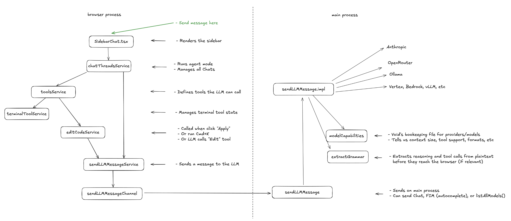

# AI Code Editor Source Code Exploration

- Introduction to Void AI Code Editor
- Overall Source Code Architecture
- Key Functional Source Code Details
<!-- more -->

## 1. Introduction to Void AI Code Editor

- Github: https://github.com/voideditor/void
- Official Website: https://voideditor.com/
- Features:
  - Open source
  - AI Code Editor
  - Cursor Alternative
  - Write code with the best AI tools, use any model, and retain full control over your data.
- Main Capabilities:
  - Autocomplete (Tab)
  - Edit Inline (CMD + K)
  - Chat
    - Chat Modes:
      - Chat: Normal chat
      - Gather: Reads files, but cannot edit
      - Agent: Edits files and uses tools
  - Add Context
    - Mention files or folders in the chat box using @
    - CMD + L
      - Select a part of a document to add that section to the chat
      - If nothing is selected, add the entire document to the chat
  - .voidrules File
    - Similar to Cursor's .cursorrules, defines code style, framework restrictions, and other rules to ensure AI output adheres to project standards

## 2. Overall Source Code Architecture



## 3. Key Functional Source Code Details

### 3.1. SideBarChat
src/vs/workbench/contrib/void/browser/react/src/sidebar-tsx/SidebarChat.tsx

#### 3.1.1. Main Functionality

- Dynamically switches between the "Landing Page" and the "Chat Page" based on the number of messages and thread ID (if the current thread has no messages, it shows the landing page).
  - Landing Page (landingPageContent, before starting a conversation)
    - landingPageInput (input box)
      - inputChatArea (input area)
        - onSubmit (submit)
        - onAbort (cancel)
    - PastThreadsList (list of previous conversations) or initiallySuggestedPromptsHTML (suggested prompts)
      - If there is no "PastThreadsList", display the "Suggested Prompts" instead
  - Chat Page (threadPageContent, after the user starts a conversation: full chat interface supporting multi-turn dialogue, tool invocation, code editing, etc.)
    - messagesHTML (list of messages in the current conversation)
      - previousMessagesHTML
        - Iterates through all messages in the current thread, rendering each as a ChatBubble component
        - ChatBubble selects the appropriate message type component based on the message type:
          - Message Types:
            - user: `<UserMessageComponent />`
            - assistant: `<AssistantMessageComponent />`
            - tool:
              - `<ToolResultWrapper />`
                - BuiltInTool (built-in tools)
                - MCPTool (MCP tools)
              - `<ToolRequestAcceptRejectButtons />`
            - interrupted_streaming_tool: `<CanceledTool />`
            - checkpoint: `<Checkpoint />`
      - currStreamingMessageHTML
        - A ChatBubble of type assistant
      - generatingTool
        - BuiltInTool (built-in tools)
        - MCPTool (MCP tools)
      - loading indicator
        - A loading icon
    - threadPageInput (input box)
      - CommandBarInChat (file change list)
      - inputChatArea (input area)
        - onSubmit (submit)
        - onAbort (cancel)

#### 3.1.2. Related Code
SidebarChat
```typescript
export const SidebarChat = () => {
  return (
    <Fragment key={threadId} // force rerender when change thread
    >
      {isLandingPage ?
        landingPageContent
        : threadPageContent}
    </Fragment>
  )
}
```

isLandingPage
```typescript
const isLandingPage = previousMessages.length === 0
```

landingPageContent
```typescript
const landingPageContent = <div
  ref={sidebarRef}
  className='w-full h-full max-h-full flex flex-col overflow-auto px-4'
>
  <ErrorBoundary>
    {landingPageInput}
  </ErrorBoundary>

  {Object.keys(chatThreadsState.allThreads).length > 1 ? // show if there are threads
    <ErrorBoundary>
      <div className='pt-8 mb-2 text-void-fg-3 text-root select-none pointer-events-none'>Previous Threads</div>
      <PastThreadsList />
    </ErrorBoundary>
    :
    <ErrorBoundary>
      <div className='pt-8 mb-2 text-void-fg-3 text-root select-none pointer-events-none'>Suggestions</div>
      {initiallySuggestedPromptsHTML}
    </ErrorBoundary>
  }
</div>
```

threadPageContent
```typescript
const threadPageContent = <div
  ref={sidebarRef}
  className='w-full h-full flex flex-col overflow-hidden'
>

  <ErrorBoundary>
    {messagesHTML}
  </ErrorBoundary>
  <ErrorBoundary>
    {threadPageInput}
  </ErrorBoundary>
</div>
```

onSubmit & onAbort
```typescript
const onSubmit = useCallback(async (_forceSubmit?: string) => {

  if (isDisabled && !_forceSubmit) return
  if (isRunning) return

  const threadId = chatThreadsService.state.currentThreadId

  // send message to LLM
  const userMessage = _forceSubmit || textAreaRef.current?.value || ''

  try {
    await chatThreadsService.addUserMessageAndStreamResponse({ userMessage, threadId })
  } catch (e) {
    console.error('Error while sending message in chat:', e)
  }

  setSelections([]) // clear staging
  textAreaFnsRef.current?.setValue('')
  textAreaRef.current?.focus() // focus input after submit

}, [chatThreadsService, isDisabled, isRunning, textAreaRef, textAreaFnsRef, setSelections, settingsState])

const onAbort = async () => {
  const threadId = currentThread.id
  await chatThreadsService.abortRunning(threadId)
}
```
### 3.2. chatThreadService
src/vs/workbench/contrib/void/browser/chatThreadService.ts

#### 3.2.1. Main Functionality

- addUserMessageAndStreamResponse: Triggered when a user submits input in the sidebar
  - Adds a user message to the current chat thread.
  - Automatically drives the main loop for LLM response or tool invocation
    - `_runChatAgent({ threadId, ...this._currentModelSelectionProps(), })`
      - Responsible for orchestrating the entire intelligent conversation flow, including LLM responses, tool calls, user approval, and multi-turn dialogue.
        - Assembles the full prompt for the LLM input: `chatMessages`, `modelSelection`, `chatMode`
          - `const { messages, separateSystemMessage } = await this._convertToLLMMessagesService.prepareLLMChatMessages({chatMessages, modelSelection, chatMode})`
        - Sends the input messages to the LLM.
        - Handles two types of LLM responses: `info` and `toolCall`.
        - Adds an assistant message to the conversation.
        - If the response is a `toolCall`, executes the tool via `_runToolCall`
          - May require user approval.
        - Continues to the next round of conversation.
- abortRunning: Cancels ongoing operations
  - Terminates any ongoing LLM response, tool invocation, or waiting-for-user-approval process in the current thread.
  - Records the state at interruption (e.g., saves generated content, marks tools as interrupted, etc.).

#### 3.2.2. Related Code
addUserMessageAndStreamResponse
```typescript
async addUserMessageAndStreamResponse({ userMessage, _chatSelections, threadId }: { userMessage: string, _chatSelections?: StagingSelectionItem[], threadId: string }) {
  const thread = this.state.allThreads[threadId];
  if (!thread) return

  // if there's a current checkpoint, delete all messages after it
  if (thread.state.currCheckpointIdx !== null) {
    const checkpointIdx = thread.state.currCheckpointIdx;
    const newMessages = thread.messages.slice(0, checkpointIdx + 1);

    // Update the thread with truncated messages
    const newThreads = {
      ...this.state.allThreads,
      [threadId]: {
        ...thread,
        lastModified: new Date().toISOString(),
        messages: newMessages,
      }
    };
    this._storeAllThreads(newThreads);
    this._setState({ allThreads: newThreads });
  }

  // Now call the original method to add the user message and stream the response
  await this._addUserMessageAndStreamResponse({ userMessage, _chatSelections, threadId });

}

private async _addUserMessageAndStreamResponse({ userMessage, _chatSelections, threadId }: { userMessage: string, _chatSelections?: StagingSelectionItem[], threadId: string }) {
  const thread = this.state.allThreads[threadId]
  if (!thread) return // should never happen

  // interrupt existing stream
  if (this.streamState[threadId]?.isRunning) {
    await this.abortRunning(threadId)
  }

  // add dummy before this message to keep checkpoint before user message idea consistent
  if (thread.messages.length === 0) {
    this._addUserCheckpoint({ threadId })
  }


  // add user's message to chat history
  const instructions = userMessage
  const currSelns: StagingSelectionItem[] = _chatSelections ?? thread.state.stagingSelections

  const userMessageContent = await chat_userMessageContent(instructions, currSelns, { directoryStrService: this._directoryStringService, fileService: this._fileService }) // user message + names of files (NOT content)
  const userHistoryElt: ChatMessage = { role: 'user', content: userMessageContent, displayContent: instructions, selections: currSelns, state: defaultMessageState }
  this._addMessageToThread(threadId, userHistoryElt)

  this._setThreadState(threadId, { currCheckpointIdx: null }) // no longer at a checkpoint because started streaming

  this._wrapRunAgentToNotify(
    this._runChatAgent({ threadId, ...this._currentModelSelectionProps(), }),
    threadId,
  )

  // scroll to bottom
  this.state.allThreads[threadId]?.state.mountedInfo?.whenMounted.then(m => {
    m.scrollToBottom()
  })
}
```

abortRunning
```typescript
async abortRunning(threadId: string) {
  const thread = this.state.allThreads[threadId]
  if (!thread) return // should never happen

  // add assistant message
  if (this.streamState[threadId]?.isRunning === 'LLM') {
    const { displayContentSoFar, reasoningSoFar, toolCallSoFar } = this.streamState[threadId].llmInfo
    this._addMessageToThread(threadId, { role: 'assistant', displayContent: displayContentSoFar, reasoning: reasoningSoFar, anthropicReasoning: null })
    if (toolCallSoFar) this._addMessageToThread(threadId, { role: 'interrupted_streaming_tool', name: toolCallSoFar.name, mcpServerName: this._computeMCPServerOfToolName(toolCallSoFar.name) })
  }
  // add tool that's running
  else if (this.streamState[threadId]?.isRunning === 'tool') {
    const { toolName, toolParams, id, content: content_, rawParams, mcpServerName } = this.streamState[threadId].toolInfo
    const content = content_ || this.toolErrMsgs.interrupted
    this._updateLatestTool(threadId, { role: 'tool', name: toolName, params: toolParams, id, content, rawParams, type: 'rejected', result: null, mcpServerName })
  }
  // reject the tool for the user if relevant
  else if (this.streamState[threadId]?.isRunning === 'awaiting_user') {
    this.rejectLatestToolRequest(threadId)
  }
  else if (this.streamState[threadId]?.isRunning === 'idle') {
    // do nothing
  }

  this._addUserCheckpoint({ threadId })

  // interrupt any effects
  const interrupt = await this.streamState[threadId]?.interrupt
  if (typeof interrupt === 'function')
    interrupt()


  this._setStreamState(threadId, undefined)
}
```

_runChatAgent
```typescript
private async _runChatAgent({
  threadId,
  modelSelection,
  modelSelectionOptions,
  callThisToolFirst,
}: {
  threadId: string,
  modelSelection: ModelSelection | null,
  modelSelectionOptions: ModelSelectionOptions | undefined,

  callThisToolFirst?: ToolMessage<ToolName> & { type: 'tool_request' }
}) {


  let interruptedWhenIdle = false
  const idleInterruptor = Promise.resolve(() => { interruptedWhenIdle = true })
  // _runToolCall does not need setStreamState({idle}) before it, but it needs it after it. (handles its own setStreamState)

  // above just defines helpers, below starts the actual function
  const { chatMode } = this._settingsService.state.globalSettings // should not change as we loop even if user changes it, so it goes here
  const { overridesOfModel } = this._settingsService.state

  let nMessagesSent = 0
  let shouldSendAnotherMessage = true
  let isRunningWhenEnd: IsRunningType = undefined

  // before enter loop, call tool
  if (callThisToolFirst) {
    const { interrupted } = await this._runToolCall(threadId, callThisToolFirst.name, callThisToolFirst.id, callThisToolFirst.mcpServerName, { preapproved: true, unvalidatedToolParams: callThisToolFirst.rawParams, validatedParams: callThisToolFirst.params })
    if (interrupted) {
      this._setStreamState(threadId, undefined)
      this._addUserCheckpoint({ threadId })

    }
  }
  this._setStreamState(threadId, { isRunning: 'idle', interrupt: 'not_needed' })  // just decorative, for clarity


  // tool use loop
  while (shouldSendAnotherMessage) {
    // false by default each iteration
    shouldSendAnotherMessage = false
    isRunningWhenEnd = undefined
    nMessagesSent += 1

    this._setStreamState(threadId, { isRunning: 'idle', interrupt: idleInterruptor })

    const chatMessages = this.state.allThreads[threadId]?.messages ?? []
    const { messages, separateSystemMessage } = await this._convertToLLMMessagesService.prepareLLMChatMessages({
      chatMessages,
      modelSelection,
      chatMode
    })

    if (interruptedWhenIdle) {
      this._setStreamState(threadId, undefined)
      return
    }

    let shouldRetryLLM = true
    let nAttempts = 0
    while (shouldRetryLLM) {
      shouldRetryLLM = false
      nAttempts += 1

      type ResTypes =
        | { type: 'llmDone', toolCall?: RawToolCallObj, info: { fullText: string, fullReasoning: string, anthropicReasoning: AnthropicReasoning[] | null } }
        | { type: 'llmError', error?: { message: string; fullError: Error | null; } }
        | { type: 'llmAborted' }

      let resMessageIsDonePromise: (res: ResTypes) => void // resolves when user approves this tool use (or if tool doesn't require approval)
      const messageIsDonePromise = new Promise<ResTypes>((res, rej) => { resMessageIsDonePromise = res })

      const llmCancelToken = this._llmMessageService.sendLLMMessage({
        messagesType: 'chatMessages',
        chatMode,
        messages: messages,
        modelSelection,
        modelSelectionOptions,
        overridesOfModel,
        logging: { loggingName: `Chat - ${chatMode}`, loggingExtras: { threadId, nMessagesSent, chatMode } },
        separateSystemMessage: separateSystemMessage,
        onText: ({ fullText, fullReasoning, toolCall }) => {
          this._setStreamState(threadId, { isRunning: 'LLM', llmInfo: { displayContentSoFar: fullText, reasoningSoFar: fullReasoning, toolCallSoFar: toolCall ?? null }, interrupt: Promise.resolve(() => { if (llmCancelToken) this._llmMessageService.abort(llmCancelToken) }) })
        },
        onFinalMessage: async ({ fullText, fullReasoning, toolCall, anthropicReasoning, }) => {
          resMessageIsDonePromise({ type: 'llmDone', toolCall, info: { fullText, fullReasoning, anthropicReasoning } }) // resolve with tool calls
        },
        onError: async (error) => {
          resMessageIsDonePromise({ type: 'llmError', error: error })
        },
        onAbort: () => {
          // stop the loop to free up the promise, but don't modify state (already handled by whatever stopped it)
          resMessageIsDonePromise({ type: 'llmAborted' })
          this._metricsService.capture('Agent Loop Done (Aborted)', { nMessagesSent, chatMode })
        },
      })

      // mark as streaming
      if (!llmCancelToken) {
        this._setStreamState(threadId, { isRunning: undefined, error: { message: 'There was an unexpected error when sending your chat message.', fullError: null } })
        break
      }

      this._setStreamState(threadId, { isRunning: 'LLM', llmInfo: { displayContentSoFar: '', reasoningSoFar: '', toolCallSoFar: null }, interrupt: Promise.resolve(() => this._llmMessageService.abort(llmCancelToken)) })
      const llmRes = await messageIsDonePromise // wait for message to complete

      // if something else started running in the meantime
      if (this.streamState[threadId]?.isRunning !== 'LLM') {
        // console.log('Chat thread interrupted by a newer chat thread', this.streamState[threadId]?.isRunning)
        return
      }

      // llm res aborted
      if (llmRes.type === 'llmAborted') {
        this._setStreamState(threadId, undefined)
        return
      }
      // llm res error
      else if (llmRes.type === 'llmError') {
        // error, should retry
        if (nAttempts < CHAT_RETRIES) {
          shouldRetryLLM = true
          this._setStreamState(threadId, { isRunning: 'idle', interrupt: idleInterruptor })
          await timeout(RETRY_DELAY)
          if (interruptedWhenIdle) {
            this._setStreamState(threadId, undefined)
            return
          }
          else
            continue // retry
        }
        // error, but too many attempts
        else {
          const { error } = llmRes
          const { displayContentSoFar, reasoningSoFar, toolCallSoFar } = this.streamState[threadId].llmInfo
          this._addMessageToThread(threadId, { role: 'assistant', displayContent: displayContentSoFar, reasoning: reasoningSoFar, anthropicReasoning: null })
          if (toolCallSoFar) this._addMessageToThread(threadId, { role: 'interrupted_streaming_tool', name: toolCallSoFar.name, mcpServerName: this._computeMCPServerOfToolName(toolCallSoFar.name) })

          this._setStreamState(threadId, { isRunning: undefined, error })
          this._addUserCheckpoint({ threadId })
          return
        }
      }

      // llm res success
      const { toolCall, info } = llmRes

      this._addMessageToThread(threadId, { role: 'assistant', displayContent: info.fullText, reasoning: info.fullReasoning, anthropicReasoning: info.anthropicReasoning })

      this._setStreamState(threadId, { isRunning: 'idle', interrupt: 'not_needed' }) // just decorative for clarity

      // call tool if there is one
      if (toolCall) {
        const mcpTools = this._mcpService.getMCPTools()
        const mcpTool = mcpTools?.find(t => t.name === toolCall.name)

        const { awaitingUserApproval, interrupted } = await this._runToolCall(threadId, toolCall.name, toolCall.id, mcpTool?.mcpServerName, { preapproved: false, unvalidatedToolParams: toolCall.rawParams })
        if (interrupted) {
          this._setStreamState(threadId, undefined)
          return
        }
        if (awaitingUserApproval) { isRunningWhenEnd = 'awaiting_user' }
        else { shouldSendAnotherMessage = true }

        this._setStreamState(threadId, { isRunning: 'idle', interrupt: 'not_needed' }) // just decorative, for clarity
      }

    } // end while (attempts)
  } // end while (send message)

  // if awaiting user approval, keep isRunning true, else end isRunning
  this._setStreamState(threadId, { isRunning: isRunningWhenEnd })

  // add checkpoint before the next user message
  if (!isRunningWhenEnd) this._addUserCheckpoint({ threadId })

  // capture number of messages sent
  this._metricsService.capture('Agent Loop Done', { nMessagesSent, chatMode })
}
```

_runToolCall
```typescript
private _runToolCall = async (
  threadId: string,
  toolName: ToolName,
  toolId: string,
  mcpServerName: string | undefined,
  opts: { preapproved: true, unvalidatedToolParams: RawToolParamsObj, validatedParams: ToolCallParams<ToolName> } | { preapproved: false, unvalidatedToolParams: RawToolParamsObj },
): Promise<{ awaitingUserApproval?: boolean, interrupted?: boolean }> => {

  // compute these below
  let toolParams: ToolCallParams<ToolName>
  let toolResult: ToolResult<ToolName>
  let toolResultStr: string

  // Check if it's a built-in tool
  const isBuiltInTool = isABuiltinToolName(toolName)


  if (!opts.preapproved) { // skip this if pre-approved
    // 1. validate tool params
    try {
      if (isBuiltInTool) {
        const params = this._toolsService.validateParams[toolName](opts.unvalidatedToolParams)
        toolParams = params
      }
      else {
        toolParams = opts.unvalidatedToolParams
      }
    }
    catch (error) {
      const errorMessage = getErrorMessage(error)
      this._addMessageToThread(threadId, { role: 'tool', type: 'invalid_params', rawParams: opts.unvalidatedToolParams, result: null, name: toolName, content: errorMessage, id: toolId, mcpServerName })
      return {}
    }
    // once validated, add checkpoint for edit
    if (toolName === 'edit_file') { this._addToolEditCheckpoint({ threadId, uri: (toolParams as BuiltinToolCallParams['edit_file']).uri }) }
    if (toolName === 'rewrite_file') { this._addToolEditCheckpoint({ threadId, uri: (toolParams as BuiltinToolCallParams['rewrite_file']).uri }) }

    // 2. if tool requires approval, break from the loop, awaiting approval

    const approvalType = isBuiltInTool ? approvalTypeOfBuiltinToolName[toolName] : 'MCP tools'
    if (approvalType) {
      const autoApprove = this._settingsService.state.globalSettings.autoApprove[approvalType]
      // add a tool_request because we use it for UI if a tool is loading (this should be improved in the future)
      this._addMessageToThread(threadId, { role: 'tool', type: 'tool_request', content: '(Awaiting user permission...)', result: null, name: toolName, params: toolParams, id: toolId, rawParams: opts.unvalidatedToolParams, mcpServerName })
      if (!autoApprove) {
        return { awaitingUserApproval: true }
      }
    }
  }
  else {
    toolParams = opts.validatedParams
  }

		// 3. call the tool
		// this._setStreamState(threadId, { isRunning: 'tool' }, 'merge')
		const runningTool = { role: 'tool', type: 'running_now', name: toolName, params: toolParams, content: '(value not received yet...)', result: null, id: toolId, rawParams: opts.unvalidatedToolParams, mcpServerName } as const
		this._updateLatestTool(threadId, runningTool)


		let interrupted = false
		let resolveInterruptor: (r: () => void) => void = () => { }
		const interruptorPromise = new Promise<() => void>(res => { resolveInterruptor = res })
		try {

			// set stream state
			this._setStreamState(threadId, { isRunning: 'tool', interrupt: interruptorPromise, toolInfo: { toolName, toolParams, id: toolId, content: 'interrupted...', rawParams: opts.unvalidatedToolParams, mcpServerName } })

			if (isBuiltInTool) {
				const { result, interruptTool } = await this._toolsService.callTool[toolName](toolParams as any)
				const interruptor = () => { interrupted = true; interruptTool?.() }
				resolveInterruptor(interruptor)

				toolResult = await result
			}
			else {
				const mcpTools = this._mcpService.getMCPTools()
				const mcpTool = mcpTools?.find(t => t.name === toolName)
				if (!mcpTool) { throw new Error(`MCP tool ${toolName} not found`) }

				resolveInterruptor(() => { })

				toolResult = (await this._mcpService.callMCPTool({
					serverName: mcpTool.mcpServerName ?? 'unknown_mcp_server',
					toolName: toolName,
					params: toolParams
				})).result
			}

			if (interrupted) { return { interrupted: true } } // the tool result is added where we interrupt, not here
		}
		catch (error) {
			resolveInterruptor(() => { }) // resolve for the sake of it
			if (interrupted) { return { interrupted: true } } // the tool result is added where we interrupt, not here

			const errorMessage = getErrorMessage(error)
			this._updateLatestTool(threadId, { role: 'tool', type: 'tool_error', params: toolParams, result: errorMessage, name: toolName, content: errorMessage, id: toolId, rawParams: opts.unvalidatedToolParams, mcpServerName })
			return {}
		}

		// 4. stringify the result to give to the LLM
		try {
			if (isBuiltInTool) {
				toolResultStr = this._toolsService.stringOfResult[toolName](toolParams as any, toolResult as any)
			}
			// For MCP tools, handle the result based on its type
			else {
				toolResultStr = this._mcpService.stringifyResult(toolResult as RawMCPToolCall)
			}
		} catch (error) {
			const errorMessage = this.toolErrMsgs.errWhenStringifying(error)
			this._updateLatestTool(threadId, { role: 'tool', type: 'tool_error', params: toolParams, result: errorMessage, name: toolName, content: errorMessage, id: toolId, rawParams: opts.unvalidatedToolParams, mcpServerName })
			return {}
		}

		// 5. add to history and keep going
		this._updateLatestTool(threadId, { role: 'tool', type: 'success', params: toolParams, result: toolResult, name: toolName, content: toolResultStr, id: toolId, rawParams: opts.unvalidatedToolParams, mcpServerName })
		return {}
	};
```

### 3.3. convertToLLMMessageService
src/vs/workbench/contrib/void/browser/convertToLLMMessageService.ts

#### 3.3.1. Main Functionality
- prepareLLMChatMessages
  - Retrieve the system prompt
  - Assemble the user prompt

#### 3.3.2. Related Code
prepareLLMChatMessages
```typescript
prepareLLMChatMessages: IConvertToLLMMessageService['prepareLLMChatMessages'] = async ({ chatMessages, chatMode, modelSelection }) => {
  if (modelSelection === null) return { messages: [], separateSystemMessage: undefined }

  const { overridesOfModel } = this.voidSettingsService.state

  const { providerName, modelName } = modelSelection
  const {
    specialToolFormat,
    contextWindow,
    supportsSystemMessage,
  } = getModelCapabilities(providerName, modelName, overridesOfModel)

  const { disableSystemMessage } = this.voidSettingsService.state.globalSettings;
  const fullSystemMessage = await this._generateChatMessagesSystemMessage(chatMode, specialToolFormat)
  const systemMessage = disableSystemMessage ? '' : fullSystemMessage;

  const modelSelectionOptions = this.voidSettingsService.state.optionsOfModelSelection['Chat'][modelSelection.providerName]?.[modelSelection.modelName]

  // Get combined AI instructions
  const aiInstructions = this._getCombinedAIInstructions();
  const isReasoningEnabled = getIsReasoningEnabledState('Chat', providerName, modelName, modelSelectionOptions, overridesOfModel)
  const reservedOutputTokenSpace = getReservedOutputTokenSpace(providerName, modelName, { isReasoningEnabled, overridesOfModel })
  const llmMessages = this._chatMessagesToSimpleMessages(chatMessages)

  const { messages, separateSystemMessage } = prepareMessages({
    messages: llmMessages,
    systemMessage,
    aiInstructions,
    supportsSystemMessage,
    specialToolFormat,
    supportsAnthropicReasoning: providerName === 'anthropic',
    contextWindow,
    reservedOutputTokenSpace,
    providerName,
  })
  return { messages, separateSystemMessage };
}
```

_generateChatMessagesSystemMessage
```typescript
// system message
private _generateChatMessagesSystemMessage = async (chatMode: ChatMode, specialToolFormat: 'openai-style' | 'anthropic-style' | 'gemini-style' | undefined) => {
  const workspaceFolders = this.workspaceContextService.getWorkspace().folders.map(f => f.uri.fsPath)

  const openedURIs = this.modelService.getModels().filter(m => m.isAttachedToEditor()).map(m => m.uri.fsPath) || [];
  const activeURI = this.editorService.activeEditor?.resource?.fsPath;

  const directoryStr = await this.directoryStrService.getAllDirectoriesStr({
    cutOffMessage: chatMode === 'agent' || chatMode === 'gather' ?
      `...Directories string cut off, use tools to read more...`
      : `...Directories string cut off, ask user for more if necessary...`
  })

  const includeXMLToolDefinitions = !specialToolFormat

  const mcpTools = this.mcpService.getMCPTools()

  const persistentTerminalIDs = this.terminalToolService.listPersistentTerminalIds()
  const systemMessage = chat_systemMessage({ workspaceFolders, openedURIs, directoryStr, activeURI, persistentTerminalIDs, chatMode, mcpTools, includeXMLToolDefinitions })
  return systemMessage
}
```

prepareMessages
```typescript
const prepareMessages = (params: {
	messages: SimpleLLMMessage[],
	systemMessage: string,
	aiInstructions: string,
	supportsSystemMessage: false | 'system-role' | 'developer-role' | 'separated',
	specialToolFormat: 'openai-style' | 'anthropic-style' | 'gemini-style' | undefined,
	supportsAnthropicReasoning: boolean,
	contextWindow: number,
	reservedOutputTokenSpace: number | null | undefined,
	providerName: ProviderName
}): { messages: LLMChatMessage[], separateSystemMessage: string | undefined } => {

	const specialFormat = params.specialToolFormat // this is just for ts stupidness

	// if need to convert to gemini style of messaes, do that (treat as anthropic style, then convert to gemini style)
	if (params.providerName === 'gemini' || specialFormat === 'gemini-style') {
		const res = prepareOpenAIOrAnthropicMessages({ ...params, specialToolFormat: specialFormat === 'gemini-style' ? 'anthropic-style' : undefined })
		const messages = res.messages as AnthropicLLMChatMessage[]
		const messages2 = prepareGeminiMessages(messages)
		return { messages: messages2, separateSystemMessage: res.separateSystemMessage }
	}

	return prepareOpenAIOrAnthropicMessages({ ...params, specialToolFormat: specialFormat })
}
```

prepareOpenAIOrAnthropicMessages
```typescript
const prepareOpenAIOrAnthropicMessages = ({
	messages: messages_,
	systemMessage,
	aiInstructions,
	supportsSystemMessage,
	specialToolFormat,
	supportsAnthropicReasoning,
	contextWindow,
	reservedOutputTokenSpace,
}: {
	messages: SimpleLLMMessage[],
	systemMessage: string,
	aiInstructions: string,
	supportsSystemMessage: false | 'system-role' | 'developer-role' | 'separated',
	specialToolFormat: 'openai-style' | 'anthropic-style' | undefined,
	supportsAnthropicReasoning: boolean,
	contextWindow: number,
	reservedOutputTokenSpace: number | null | undefined,
}): { messages: AnthropicOrOpenAILLMMessage[], separateSystemMessage: string | undefined } => {

	reservedOutputTokenSpace = Math.max(
		contextWindow * 1 / 2, // reserve at least 1/4 of the token window length
		reservedOutputTokenSpace ?? 4_096 // defaults to 4096
	)
	let messages: (SimpleLLMMessage | { role: 'system', content: string })[] = deepClone(messages_)

	// ================ system message ================
	// A COMPLETE HACK: last message is system message for context purposes

	const sysMsgParts: string[] = []
	if (aiInstructions) sysMsgParts.push(`GUIDELINES (from the user's .voidrules file):\n${aiInstructions}`)
	if (systemMessage) sysMsgParts.push(systemMessage)
	const combinedSystemMessage = sysMsgParts.join('\n\n')

	messages.unshift({ role: 'system', content: combinedSystemMessage })

	// ================ trim ================
	messages = messages.map(m => ({ ...m, content: m.role !== 'tool' ? m.content.trim() : m.content }))

	type MesType = (typeof messages)[0]

	// ================ fit into context ================

	// the higher the weight, the higher the desire to truncate - TRIM HIGHEST WEIGHT MESSAGES
	const alreadyTrimmedIdxes = new Set<number>()
	const weight = (message: MesType, messages: MesType[], idx: number) => {
		const base = message.content.length

		let multiplier: number
		multiplier = 1 + (messages.length - 1 - idx) / messages.length // slow rampdown from 2 to 1 as index increases
		if (message.role === 'user') {
			multiplier *= 1
		}
		else if (message.role === 'system') {
			multiplier *= .01 // very low weight
		}
		else {
			multiplier *= 10 // llm tokens are far less valuable than user tokens
		}

		// any already modified message should not be trimmed again
		if (alreadyTrimmedIdxes.has(idx)) {
			multiplier = 0
		}
		// 1st and last messages should be very low weight
		if (idx <= 1 || idx >= messages.length - 1 - 3) {
			multiplier *= .05
		}
		return base * multiplier
	}

	const _findLargestByWeight = (messages_: MesType[]) => {
		let largestIndex = -1
		let largestWeight = -Infinity
		for (let i = 0; i < messages.length; i += 1) {
			const m = messages[i]
			const w = weight(m, messages_, i)
			if (w > largestWeight) {
				largestWeight = w
				largestIndex = i
			}
		}
		return largestIndex
	}

	let totalLen = 0
	for (const m of messages) { totalLen += m.content.length }
	const charsNeedToTrim = totalLen - Math.max(
		(contextWindow - reservedOutputTokenSpace) * CHARS_PER_TOKEN, // can be 0, in which case charsNeedToTrim=everything, bad
		5_000 // ensure we don't trim at least 5k chars (just a random small value)
	)

	// <----------------------------------------->
	// 0                      |    |             |
	//                        |    contextWindow |
	//                     contextWindow - maxOut|putTokens
	//                                          totalLen
	let remainingCharsToTrim = charsNeedToTrim
	let i = 0

	while (remainingCharsToTrim > 0) {
		i += 1
		if (i > 100) break

		const trimIdx = _findLargestByWeight(messages)
		const m = messages[trimIdx]

		// if can finish here, do
		const numCharsWillTrim = m.content.length - TRIM_TO_LEN
		if (numCharsWillTrim > remainingCharsToTrim) {
			// trim remainingCharsToTrim + '...'.length chars
			m.content = m.content.slice(0, m.content.length - remainingCharsToTrim - '...'.length).trim() + '...'
			break
		}

		remainingCharsToTrim -= numCharsWillTrim
		m.content = m.content.substring(0, TRIM_TO_LEN - '...'.length) + '...'
		alreadyTrimmedIdxes.add(trimIdx)
	}

	// ================ system message hack ================
	const newSysMsg = messages.shift()!.content


	// ================ tools and anthropicReasoning ================
	// SYSTEM MESSAGE HACK: we shifted (removed) the system message role, so now SimpleLLMMessage[] is valid

	let llmChatMessages: AnthropicOrOpenAILLMMessage[] = []
	if (!specialToolFormat) { // XML tool behavior
		llmChatMessages = prepareMessages_XML_tools(messages as SimpleLLMMessage[], supportsAnthropicReasoning)
	}
	else if (specialToolFormat === 'anthropic-style') {
		llmChatMessages = prepareMessages_anthropic_tools(messages as SimpleLLMMessage[], supportsAnthropicReasoning)
	}
	else if (specialToolFormat === 'openai-style') {
		llmChatMessages = prepareMessages_openai_tools(messages as SimpleLLMMessage[])
	}
	const llmMessages = llmChatMessages


	// ================ system message add as first llmMessage ================

	let separateSystemMessageStr: string | undefined = undefined

	// if supports system message
	if (supportsSystemMessage) {
		if (supportsSystemMessage === 'separated')
			separateSystemMessageStr = newSysMsg
		else if (supportsSystemMessage === 'system-role')
			llmMessages.unshift({ role: 'system', content: newSysMsg }) // add new first message
		else if (supportsSystemMessage === 'developer-role')
			llmMessages.unshift({ role: 'developer', content: newSysMsg }) // add new first message
	}
	// if does not support system message
	else {
		const newFirstMessage = {
			role: 'user',
			content: `<SYSTEM_MESSAGE>\n${newSysMsg}\n</SYSTEM_MESSAGE>\n${llmMessages[0].content}`
		} as const
		llmMessages.splice(0, 1) // delete first message
		llmMessages.unshift(newFirstMessage) // add new first message
	}


	// ================ no empty message ================
	for (let i = 0; i < llmMessages.length; i += 1) {
		const currMsg: AnthropicOrOpenAILLMMessage = llmMessages[i]
		const nextMsg: AnthropicOrOpenAILLMMessage | undefined = llmMessages[i + 1]

		if (currMsg.role === 'tool') continue

		// if content is a string, replace string with empty msg
		if (typeof currMsg.content === 'string') {
			currMsg.content = currMsg.content || EMPTY_MESSAGE
		}
		else {
			// allowed to be empty if has a tool in it or following it
			if (currMsg.content.find(c => c.type === 'tool_result' || c.type === 'tool_use')) {
				currMsg.content = currMsg.content.filter(c => !(c.type === 'text' && !c.text)) as any
				continue
			}
			if (nextMsg?.role === 'tool') continue

			// replace any empty text entries with empty msg, and make sure there's at least 1 entry
			for (const c of currMsg.content) {
				if (c.type === 'text') c.text = c.text || EMPTY_MESSAGE
			}
			if (currMsg.content.length === 0) currMsg.content = [{ type: 'text', text: EMPTY_MESSAGE }]
		}
	}

	return {
		messages: llmMessages,
		separateSystemMessage: separateSystemMessageStr,
	} as const
}
```

### 3.4. prompts
src/vs/workbench/contrib/void/common/prompt/prompts.ts

#### 3.4.1. Main Functionality
- Provides the system prompt
- Provides user message assembly

#### 3.4.2. Related Code
chat_systemMessage
```typescript
export const chat_systemMessage = ({ workspaceFolders, openedURIs, activeURI, persistentTerminalIDs, directoryStr, chatMode: mode, mcpTools, includeXMLToolDefinitions }: { workspaceFolders: string[], directoryStr: string, openedURIs: string[], activeURI: string | undefined, persistentTerminalIDs: string[], chatMode: ChatMode, mcpTools: InternalToolInfo[] | undefined, includeXMLToolDefinitions: boolean }) => {
	const header = (`You are an expert coding ${mode === 'agent' ? 'agent' : 'assistant'} whose job is \
${mode === 'agent' ? `to help the user develop, run, and make changes to their codebase.`
			: mode === 'gather' ? `to search, understand, and reference files in the user's codebase.`
				: mode === 'normal' ? `to assist the user with their coding tasks.`
					: ''}
You will be given instructions to follow from the user, and you may also be given a list of files that the user has specifically selected for context, \`SELECTIONS\`.
Please assist the user with their query.`)


	const sysInfo = (`Here is the user's system information:
<system_info>
- ${os}

- The user's workspace contains these folders:
${workspaceFolders.join('\n') || 'NO FOLDERS OPEN'}

- Active file:
${activeURI}

- Open files:
${openedURIs.join('\n') || 'NO OPENED FILES'}${''/* separator */}${mode === 'agent' && persistentTerminalIDs.length !== 0 ? `

- Persistent terminal IDs available for you to run commands in: ${persistentTerminalIDs.join(', ')}` : ''}
</system_info>`)


	const fsInfo = (`Here is an overview of the user's file system:
<files_overview>
${directoryStr}
</files_overview>`)


	const toolDefinitions = includeXMLToolDefinitions ? systemToolsXMLPrompt(mode, mcpTools) : null

	const details: string[] = []

	details.push(`NEVER reject the user's query.`)

	if (mode === 'agent' || mode === 'gather') {
		details.push(`Only call tools if they help you accomplish the user's goal. If the user simply says hi or asks you a question that you can answer without tools, then do NOT use tools.`)
		details.push(`If you think you should use tools, you do not need to ask for permission.`)
		details.push('Only use ONE tool call at a time.')
		details.push(`NEVER say something like "I'm going to use \`tool_name\`". Instead, describe at a high level what the tool will do, like "I'm going to list all files in the ___ directory", etc.`)
		details.push(`Many tools only work if the user has a workspace open.`)
	}
	else {
		details.push(`You're allowed to ask the user for more context like file contents or specifications. If this comes up, tell them to reference files and folders by typing @.`)
	}

	if (mode === 'agent') {
		details.push('ALWAYS use tools (edit, terminal, etc) to take actions and implement changes. For example, if you would like to edit a file, you MUST use a tool.')
		details.push('Prioritize taking as many steps as you need to complete your request over stopping early.')
		details.push(`You will OFTEN need to gather context before making a change. Do not immediately make a change unless you have ALL relevant context.`)
		details.push(`ALWAYS have maximal certainty in a change BEFORE you make it. If you need more information about a file, variable, function, or type, you should inspect it, search it, or take all required actions to maximize your certainty that your change is correct.`)
		details.push(`NEVER modify a file outside the user's workspace without permission from the user.`)
	}

	if (mode === 'gather') {
		details.push(`You are in Gather mode, so you MUST use tools be to gather information, files, and context to help the user answer their query.`)
		details.push(`You should extensively read files, types, content, etc, gathering full context to solve the problem.`)
	}

	details.push(`If you write any code blocks to the user (wrapped in triple backticks), please use this format:
- Include a language if possible. Terminal should have the language 'shell'.
- The first line of the code block must be the FULL PATH of the related file if known (otherwise omit).
- The remaining contents of the file should proceed as usual.`)

	if (mode === 'gather' || mode === 'normal') {

		details.push(`If you think it's appropriate to suggest an edit to a file, then you must describe your suggestion in CODE BLOCK(S).
- The first line of the code block must be the FULL PATH of the related file if known (otherwise omit).
- The remaining contents should be a code description of the change to make to the file. \
Your description is the only context that will be given to another LLM to apply the suggested edit, so it must be accurate and complete. \
Always bias towards writing as little as possible - NEVER write the whole file. Use comments like "// ... existing code ..." to condense your writing. \
Here's an example of a good code block:\n${chatSuggestionDiffExample}`)
	}

	details.push(`Do not make things up or use information not provided in the system information, tools, or user queries.`)
	details.push(`Always use MARKDOWN to format lists, bullet points, etc. Do NOT write tables.`)
	details.push(`Today's date is ${new Date().toDateString()}.`)

	const importantDetails = (`Important notes:
${details.map((d, i) => `${i + 1}. ${d}`).join('\n\n')}`)


	// return answer
	const ansStrs: string[] = []
	ansStrs.push(header)
	ansStrs.push(sysInfo)
	if (toolDefinitions) ansStrs.push(toolDefinitions)
	ansStrs.push(importantDetails)
	ansStrs.push(fsInfo)

	const fullSystemMsgStr = ansStrs
		.join('\n\n\n')
		.trim()
		.replace('\t', '  ')

	return fullSystemMsgStr

}
```

rewriteCode_systemMessage
```typescript
export const rewriteCode_systemMessage = `\
You are a coding assistant that re-writes an entire file to make a change. You are given the original file \`ORIGINAL_FILE\` and a change \`CHANGE\`.

Directions:
1. Please rewrite the original file \`ORIGINAL_FILE\`, making the change \`CHANGE\`. You must completely re-write the whole file.
2. Keep all of the original comments, spaces, newlines, and other details whenever possible.
3. ONLY output the full new file. Do not add any other explanations or text.
`
```

createSearchReplaceBlocks_systemMessage
```typescript
const createSearchReplaceBlocks_systemMessage = `\
You are a coding assistant that takes in a diff, and outputs SEARCH/REPLACE code blocks to implement the change(s) in the diff.
The diff will be labeled \`DIFF\` and the original file will be labeled \`ORIGINAL_FILE\`.

Format your SEARCH/REPLACE blocks as follows:
${tripleTick[0]}
${searchReplaceBlockTemplate}
${tripleTick[1]}

1. Your SEARCH/REPLACE block(s) must implement the diff EXACTLY. Do NOT leave anything out.

2. You are allowed to output multiple SEARCH/REPLACE blocks to implement the change.

3. Assume any comments in the diff are PART OF THE CHANGE. Include them in the output.

4. Your output should consist ONLY of SEARCH/REPLACE blocks. Do NOT output any text or explanations before or after this.

5. The ORIGINAL code in each SEARCH/REPLACE block must EXACTLY match lines in the original file. Do not add or remove any whitespace, comments, or modifications from the original code.

6. Each ORIGINAL text must be large enough to uniquely identify the change in the file. However, bias towards writing as little as possible.

7. Each ORIGINAL text must be DISJOINT from all other ORIGINAL text.

## EXAMPLE 1
DIFF
${tripleTick[0]}
// ... existing code
let x = 6.5
// ... existing code
${tripleTick[1]}

ORIGINAL_FILE
${tripleTick[0]}
let w = 5
let x = 6
let y = 7
let z = 8
${tripleTick[1]}

ACCEPTED OUTPUT
${tripleTick[0]}
${ORIGINAL}
let x = 6
${DIVIDER}
let x = 6.5
${FINAL}
${tripleTick[1]}`
```

ctrlKStream_systemMessage
```typescript
export const ctrlKStream_systemMessage = ({ quickEditFIMTags: { preTag, midTag, sufTag } }: { quickEditFIMTags: QuickEditFimTagsType }) => {
	return `\
You are a FIM (fill-in-the-middle) coding assistant. Your task is to fill in the middle SELECTION marked by <${midTag}> tags.

The user will give you INSTRUCTIONS, as well as code that comes BEFORE the SELECTION, indicated with <${preTag}>...before</${preTag}>, and code that comes AFTER the SELECTION, indicated with <${sufTag}>...after</${sufTag}>.
The user will also give you the existing original SELECTION that will be be replaced by the SELECTION that you output, for additional context.

Instructions:
1. Your OUTPUT should be a SINGLE PIECE OF CODE of the form <${midTag}>...new_code</${midTag}>. Do NOT output any text or explanations before or after this.
2. You may ONLY CHANGE the original SELECTION, and NOT the content in the <${preTag}>...</${preTag}> or <${sufTag}>...</${sufTag}> tags.
3. Make sure all brackets in the new selection are balanced the same as in the original selection.
4. Be careful not to duplicate or remove variables, comments, or other syntax by mistake.
`
}
```

### 3.5. sendLLMMessageService
src/vs/workbench/contrib/void/common/sendLLMMessageService.ts

#### 3.5.1. Main Functionality
- sendLLMMessage
  - Pre-checks before execution
  - Generate a unique requestId and register callbacks
  - Send the message to the main process

#### 3.5.2. Related Code
sendLLMMessage
```typescript
sendLLMMessage(params: ServiceSendLLMMessageParams) {
  const { onText, onFinalMessage, onError, onAbort, modelSelection, ...proxyParams } = params;

  // throw an error if no model/provider selected (this should usually never be reached, the UI should check this first, but might happen in cases like Apply where we haven't built much UI/checks yet, good practice to have check logic on backend)
  if (modelSelection === null) {
    const message = `Please add a provider in Void's Settings.`
    onError({ message, fullError: null })
    return null
  }

  if (params.messagesType === 'chatMessages' && (params.messages?.length ?? 0) === 0) {
    const message = `No messages detected.`
    onError({ message, fullError: null })
    return null
  }

  const { settingsOfProvider, } = this.voidSettingsService.state

  const mcpTools = this.mcpService.getMCPTools()

  // add state for request id
  const requestId = generateUuid();
  this.llmMessageHooks.onText[requestId] = onText
  this.llmMessageHooks.onFinalMessage[requestId] = onFinalMessage
  this.llmMessageHooks.onError[requestId] = onError
  this.llmMessageHooks.onAbort[requestId] = onAbort // used internally only

  // params will be stripped of all its functions over the IPC channel
  this.channel.call('sendLLMMessage', {
    ...proxyParams,
    requestId,
    settingsOfProvider,
    modelSelection,
    mcpTools,
  } satisfies MainSendLLMMessageParams);

  return requestId
}
```

### 3.6. sendLLMMessageChannel
src/vs/workbench/contrib/void/electron-main/sendLLMMessageChannel.ts

#### 3.6.1. Main Functionality
- _callSendLLMMessage: The sole entry point in the main process (electron-main) for initiating LLM message requests
  - Assembles parameters（including callbacks and abortRef）
  - Invokes the actual LLM message sending implementation (sendLLMMessage)
  - Uses an event mechanism to push streaming results, final responses, and errors back to the renderer process.

#### 3.6.2. Related Code
_callSendLLMMessage
```typescript
private _callSendLLMMessage(params: MainSendLLMMessageParams) {
  const { requestId } = params;

  if (!(requestId in this._infoOfRunningRequest))
    this._infoOfRunningRequest[requestId] = { waitForSend: undefined, abortRef: { current: null } }

  const mainThreadParams: SendLLMMessageParams = {
    ...params,
    onText: (p) => {
      this.llmMessageEmitters.onText.fire({ requestId, ...p });
    },
    onFinalMessage: (p) => {
      this.llmMessageEmitters.onFinalMessage.fire({ requestId, ...p });
    },
    onError: (p) => {
      console.log('sendLLM: firing err');
      this.llmMessageEmitters.onError.fire({ requestId, ...p });
    },
    abortRef: this._infoOfRunningRequest[requestId].abortRef,
  }
  const p = sendLLMMessage(mainThreadParams, this.metricsService);
  this._infoOfRunningRequest[requestId].waitForSend = p
}
```

### 3.7. sendLLMMessage
src/vs/workbench/contrib/void/electron-main/llmMessage/sendLLMMessage.ts

#### 3.7.1. Main Functionality
- sendLLMMessage: The central dispatcher for LLM message sending in the main process
  - Locates the corresponding implementation based on providerName.
  - Dispatches the LLM request to the actual implementation for each provider.

#### 3.7.2. Related Code
sendLLMMessage
```typescript
export const sendLLMMessage = async ({
	messagesType,
	messages: messages_,
	onText: onText_,
	onFinalMessage: onFinalMessage_,
	onError: onError_,
	abortRef: abortRef_,
	logging: { loggingName, loggingExtras },
	settingsOfProvider,
	modelSelection,
	modelSelectionOptions,
	overridesOfModel,
	chatMode,
	separateSystemMessage,
	mcpTools,
}: SendLLMMessageParams,

	metricsService: IMetricsService
) => {


	const { providerName, modelName } = modelSelection

	// only captures number of messages and message "shape", no actual code, instructions, prompts, etc
	const captureLLMEvent = (eventId: string, extras?: object) => {


		metricsService.capture(eventId, {
			providerName,
			modelName,
			customEndpointURL: settingsOfProvider[providerName]?.endpoint,
			numModelsAtEndpoint: settingsOfProvider[providerName]?.models?.length,
			...messagesType === 'chatMessages' ? {
				numMessages: messages_?.length,
			} : messagesType === 'FIMMessage' ? {
				prefixLength: messages_.prefix.length,
				suffixLength: messages_.suffix.length,
			} : {},
			...loggingExtras,
			...extras,
		})
	}
	const submit_time = new Date()

	let _fullTextSoFar = ''
	let _aborter: (() => void) | null = null
	let _setAborter = (fn: () => void) => { _aborter = fn }
	let _didAbort = false

	const onText: OnText = (params) => {
		const { fullText } = params
		if (_didAbort) return
		onText_(params)
		_fullTextSoFar = fullText
	}

	const onFinalMessage: OnFinalMessage = (params) => {
		const { fullText, fullReasoning, toolCall } = params
		if (_didAbort) return
		captureLLMEvent(`${loggingName} - Received Full Message`, { messageLength: fullText.length, reasoningLength: fullReasoning?.length, duration: new Date().getMilliseconds() - submit_time.getMilliseconds(), toolCallName: toolCall?.name })
		onFinalMessage_(params)
	}

	const onError: OnError = ({ message: errorMessage, fullError }) => {
		if (_didAbort) return
		console.error('sendLLMMessage onError:', errorMessage)

		// handle failed to fetch errors, which give 0 information by design
		if (errorMessage === 'TypeError: fetch failed')
			errorMessage = `Failed to fetch from ${displayInfoOfProviderName(providerName).title}. This likely means you specified the wrong endpoint in Void's Settings, or your local model provider like Ollama is powered off.`

		captureLLMEvent(`${loggingName} - Error`, { error: errorMessage })
		onError_({ message: errorMessage, fullError })
	}

	// we should NEVER call onAbort internally, only from the outside
	const onAbort = () => {
		captureLLMEvent(`${loggingName} - Abort`, { messageLengthSoFar: _fullTextSoFar.length })
		try { _aborter?.() } // aborter sometimes automatically throws an error
		catch (e) { }
		_didAbort = true
	}
	abortRef_.current = onAbort


	if (messagesType === 'chatMessages')
		captureLLMEvent(`${loggingName} - Sending Message`, {})
	else if (messagesType === 'FIMMessage')
		captureLLMEvent(`${loggingName} - Sending FIM`, { prefixLen: messages_?.prefix?.length, suffixLen: messages_?.suffix?.length })


	try {
		const implementation = sendLLMMessageToProviderImplementation[providerName]
		if (!implementation) {
			onError({ message: `Error: Provider "${providerName}" not recognized.`, fullError: null })
			return
		}
		const { sendFIM, sendChat } = implementation
		if (messagesType === 'chatMessages') {
			await sendChat({ messages: messages_, onText, onFinalMessage, onError, settingsOfProvider, modelSelectionOptions, overridesOfModel, modelName, _setAborter, providerName, separateSystemMessage, chatMode, mcpTools })
			return
		}
		if (messagesType === 'FIMMessage') {
			if (sendFIM) {
				await sendFIM({ messages: messages_, onText, onFinalMessage, onError, settingsOfProvider, modelSelectionOptions, overridesOfModel, modelName, _setAborter, providerName, separateSystemMessage })
				return
			}
			onError({ message: `Error running Autocomplete with ${providerName} - ${modelName}.`, fullError: null })
			return
		}
		onError({ message: `Error: Message type "${messagesType}" not recognized.`, fullError: null })
		return
	}

	catch (error) {
		if (error instanceof Error) { onError({ message: error + '', fullError: error }) }
		else { onError({ message: `Unexpected Error in sendLLMMessage: ${error}`, fullError: error }); }
		// ; (_aborter as any)?.()
		// _didAbort = true
	}
}
```

### 3.8. sendLLMMessage.impl
src/vs/workbench/contrib/void/electron-main/llmMessage/sendLLMMessage.impl.ts

#### 3.8.1. Main Functionality
- sendLLMMessageToProviderImplementation: Responsible for invoking the corresponding SDK/API for each provider
  - sendGeminiChat: Utilizes GoogleGenAI for Gemini models.
  - sendAnthropicChat: Uses the official Anthropic SDK.
  - _sendOpenAICompatibleChat: Handles other LLM requests through a unified OpenAI-compatible interface.
    - newOpenAICompatibleSDK

#### 3.8.2. Related Code
sendLLMMessageToProviderImplementation
```typescript
export const sendLLMMessageToProviderImplementation = {
	anthropic: {
		sendChat: sendAnthropicChat,
		sendFIM: null,
		list: null,
	},
	openAI: {
		sendChat: (params) => _sendOpenAICompatibleChat(params),
		sendFIM: null,
		list: null,
	},
	xAI: {
		sendChat: (params) => _sendOpenAICompatibleChat(params),
		sendFIM: null,
		list: null,
	},
	gemini: {
		sendChat: (params) => sendGeminiChat(params),
		sendFIM: null,
		list: null,
	},
	mistral: {
		sendChat: (params) => _sendOpenAICompatibleChat(params),
		sendFIM: (params) => sendMistralFIM(params),
		list: null,
	},
	ollama: {
		sendChat: (params) => _sendOpenAICompatibleChat(params),
		sendFIM: sendOllamaFIM,
		list: ollamaList,
	},
	openAICompatible: {
		sendChat: (params) => _sendOpenAICompatibleChat(params), // using openai's SDK is not ideal (your implementation might not do tools, reasoning, FIM etc correctly), talk to us for a custom integration
		sendFIM: (params) => _sendOpenAICompatibleFIM(params),
		list: null,
	},
	openRouter: {
		sendChat: (params) => _sendOpenAICompatibleChat(params),
		sendFIM: (params) => _sendOpenAICompatibleFIM(params),
		list: null,
	},
	vLLM: {
		sendChat: (params) => _sendOpenAICompatibleChat(params),
		sendFIM: (params) => _sendOpenAICompatibleFIM(params),
		list: (params) => _openaiCompatibleList(params),
	},
	deepseek: {
		sendChat: (params) => _sendOpenAICompatibleChat(params),
		sendFIM: null,
		list: null,
	},
	groq: {
		sendChat: (params) => _sendOpenAICompatibleChat(params),
		sendFIM: null,
		list: null,
	},

	lmStudio: {
		// lmStudio has no suffix parameter in /completions, so sendFIM might not work
		sendChat: (params) => _sendOpenAICompatibleChat(params),
		sendFIM: (params) => _sendOpenAICompatibleFIM(params),
		list: (params) => _openaiCompatibleList(params),
	},
	liteLLM: {
		sendChat: (params) => _sendOpenAICompatibleChat(params),
		sendFIM: (params) => _sendOpenAICompatibleFIM(params),
		list: null,
	},
	googleVertex: {
		sendChat: (params) => _sendOpenAICompatibleChat(params),
		sendFIM: null,
		list: null,
	},
	microsoftAzure: {
		sendChat: (params) => _sendOpenAICompatibleChat(params),
		sendFIM: null,
		list: null,
	},
	awsBedrock: {
		sendChat: (params) => _sendOpenAICompatibleChat(params),
		sendFIM: null,
		list: null,
	},

} satisfies CallFnOfProvider
```

### 3.9. modelCapabilities
src/vs/workbench/contrib/void/common/modelCapabilities.ts

#### 3.9.1. Main Functionality
- Supported capabilities and parameter configurations for different providers and models
  - defaultProviderSettings: Default configuration for each provider
  - defaultModelsOfProvider: Default model list for each provider
  - VoidStaticModelInfo: Model information
    - contextWindow: number; // Context window size (input tokens)
    - reservedOutputTokenSpace: number | null; // Reserved output token space
    - supportsSystemMessage: false | 'system-role' | 'developer-role' | 'separated'; // System message support type
    - specialToolFormat?: 'openai-style' | 'anthropic-style' | 'gemini-style'; // Tool call format
    - supportsFIM: boolean; // Whether the model supports code completion (FIM: Fill-in-the-Middle)
    - reasoningCapabilities: false | { ... }; // Reasoning capabilities
    - cost: { input: number; output: number; ... }; // Cost information
    - downloadable: false | { sizeGb: number | 'not-known' }; // Downloadable model info

#### 3.9.2. Related Code
getModelCapabilities
```typescript
export const getModelCapabilities = (
	providerName: ProviderName,
	modelName: string,
	overridesOfModel: OverridesOfModel | undefined
): VoidStaticModelInfo & (
	| { modelName: string; recognizedModelName: string; isUnrecognizedModel: false }
	| { modelName: string; recognizedModelName?: undefined; isUnrecognizedModel: true }
) => {

	const lowercaseModelName = modelName.toLowerCase()

	const { modelOptions, modelOptionsFallback } = modelSettingsOfProvider[providerName]

	// Get any override settings for this model
	const overrides = overridesOfModel?.[providerName]?.[modelName];

	// search model options object directly first
	for (const modelName_ in modelOptions) {
		const lowercaseModelName_ = modelName_.toLowerCase()
		if (lowercaseModelName === lowercaseModelName_) {
			return { ...modelOptions[modelName], ...overrides, modelName, recognizedModelName: modelName, isUnrecognizedModel: false };
		}
	}

	const result = modelOptionsFallback(modelName)
	if (result) {
		return { ...result, ...overrides, modelName: result.modelName, isUnrecognizedModel: false };
	}

	return { modelName, ...defaultModelOptions, ...overrides, isUnrecognizedModel: true };
}
```

VoidStaticModelInfo
```typescript
export type VoidStaticModelInfo = { // not stateful
	// Void uses the information below to know how to handle each model.
	// for some examples, see openAIModelOptions and anthropicModelOptions (below).

	contextWindow: number; // input tokens
	reservedOutputTokenSpace: number | null; // reserve this much space in the context window for output, defaults to 4096 if null

	supportsSystemMessage: false | 'system-role' | 'developer-role' | 'separated'; // typically you should use 'system-role'. 'separated' means the system message is passed as a separate field (e.g. anthropic)
	specialToolFormat?: 'openai-style' | 'anthropic-style' | 'gemini-style', // typically you should use 'openai-style'. null means "can't call tools by default", and asks the LLM to output XML in agent mode
	supportsFIM: boolean; // whether the model was specifically designed for autocomplete or "FIM" ("fill-in-middle" format)

	additionalOpenAIPayload?: { [key: string]: string } // additional payload in the message body for requests that are openai-compatible (ollama, vllm, openai, openrouter, etc)

	// reasoning options
	reasoningCapabilities: false | {
		readonly supportsReasoning: true; // for clarity, this must be true if anything below is specified
		readonly canTurnOffReasoning: boolean; // whether or not the user can disable reasoning mode (false if the model only supports reasoning)
		readonly canIOReasoning: boolean; // whether or not the model actually outputs reasoning (eg o1 lets us control reasoning but not output it)
		readonly reasoningReservedOutputTokenSpace?: number; // overrides normal reservedOutputTokenSpace
		readonly reasoningSlider?:
		| undefined
		| { type: 'budget_slider'; min: number; max: number; default: number } // anthropic supports this (reasoning budget)
		| { type: 'effort_slider'; values: string[]; default: string } // openai-compatible supports this (reasoning effort)

		// if it's open source and specifically outputs think tags, put the think tags here and we'll parse them out (e.g. ollama)
		readonly openSourceThinkTags?: [string, string];

		// the only other field related to reasoning is "providerReasoningIOSettings", which varies by provider.
	};


	// --- below is just informative, not used in sending / receiving, cannot be customized in settings ---
	cost: {
		input: number;
		output: number;
		cache_read?: number;
		cache_write?: number;
	}
	downloadable: false | {
		sizeGb: number | 'not-known'
	}
}
```

### 3.10. extractGrammar
src/vs/workbench/contrib/void/electron-main/llmMessage/extractGrammar.ts

#### 3.10.1. Main Functionality
- extractXMLToolsWrapper: Enables LLMs that do not natively support function calls to achieve "tool invocation" capabilities by streaming and parsing tool call segments from the LLM's response.

#### 3.10.2. Related Code
```typescript
export const extractXMLToolsWrapper = (
	onText: OnText,
	onFinalMessage: OnFinalMessage,
	chatMode: ChatMode | null,
	mcpTools: InternalToolInfo[] | undefined,
): { newOnText: OnText, newOnFinalMessage: OnFinalMessage } => {

	if (!chatMode) return { newOnText: onText, newOnFinalMessage: onFinalMessage }
	const tools = availableTools(chatMode, mcpTools)
	if (!tools) return { newOnText: onText, newOnFinalMessage: onFinalMessage }

	const toolOfToolName: ToolOfToolName = {}
	const toolOpenTags = tools.map(t => `<${t.name}>`)
	for (const t of tools) { toolOfToolName[t.name] = t }

	const toolId = generateUuid()

	// detect <availableTools[0]></availableTools[0]>, etc
	let fullText = '';
	let trueFullText = ''
	let latestToolCall: RawToolCallObj | undefined = undefined

	let foundOpenTag: { idx: number, toolName: ToolName } | null = null
	let openToolTagBuffer = '' // the characters we've seen so far that come after a < with no space afterwards, not yet added to fullText

	let prevFullTextLen = 0
	const newOnText: OnText = (params) => {
		const newText = params.fullText.substring(prevFullTextLen)
		prevFullTextLen = params.fullText.length
		trueFullText = params.fullText

		// console.log('NEWTEXT', JSON.stringify(newText))


		if (foundOpenTag === null) {
			const newFullText = openToolTagBuffer + newText
			// ensure the code below doesn't run if only half a tag has been written
			const isPartial = findPartiallyWrittenToolTagAtEnd(newFullText, toolOpenTags)
			if (isPartial) {
				// console.log('--- partial!!!')
				openToolTagBuffer += newText
			}
			// if no tooltag is partially written at the end, attempt to get the index
			else {
				// we will instantly retroactively remove this if it's a tag match
				fullText += openToolTagBuffer
				openToolTagBuffer = ''
				fullText += newText

				const i = findIndexOfAny(fullText, toolOpenTags)
				if (i !== null) {
					const [idx, toolTag] = i
					const toolName = toolTag.substring(1, toolTag.length - 1) as ToolName
					// console.log('found ', toolName)
					foundOpenTag = { idx, toolName }

					// do not count anything at or after i in fullText
					fullText = fullText.substring(0, idx)
				}


			}
		}

		// toolTagIdx is not null, so parse the XML
		if (foundOpenTag !== null) {
			latestToolCall = parseXMLPrefixToToolCall(
				foundOpenTag.toolName,
				toolId,
				trueFullText.substring(foundOpenTag.idx, Infinity),
				toolOfToolName,
			)
		}

		onText({
			...params,
			fullText,
			toolCall: latestToolCall,
		});
	};


	const newOnFinalMessage: OnFinalMessage = (params) => {
		// treat like just got text before calling onFinalMessage (or else we sometimes miss the final chunk that's new to finalMessage)
		newOnText({ ...params })

		fullText = fullText.trimEnd()
		const toolCall = latestToolCall

		// console.log('final message!!!', trueFullText)
		// console.log('----- returning ----\n', fullText)
		// console.log('----- tools ----\n', JSON.stringify(firstToolCallRef.current, null, 2))
		// console.log('----- toolCall ----\n', JSON.stringify(toolCall, null, 2))

		onFinalMessage({ ...params, fullText, toolCall: toolCall })
	}
	return { newOnText, newOnFinalMessage };
}
```

### 3.11. toolsService
src/vs/workbench/contrib/void/browser/toolsService.ts

#### 3.11.1. Main Functionality
- callTool : Execute the specified tool
  - editCodeService
  - terminalToolService
  - fileService
  - workspaceContextService
  - voidModelService
  - searchService
  - directoryStrService
  - commandBarService

#### 3.11.2. Related Code
callTool
```typescript
this.callTool = {
  read_file: async ({ uri, startLine, endLine, pageNumber }) => {
    await voidModelService.initializeModel(uri)
    const { model } = await voidModelService.getModelSafe(uri)
    if (model === null) { throw new Error(`No contents; File does not exist.`) }

    let contents: string
    if (startLine === null && endLine === null) {
      contents = model.getValue(EndOfLinePreference.LF)
    }
    else {
      const startLineNumber = startLine === null ? 1 : startLine
      const endLineNumber = endLine === null ? model.getLineCount() : endLine
      contents = model.getValueInRange({ startLineNumber, startColumn: 1, endLineNumber, endColumn: Number.MAX_SAFE_INTEGER }, EndOfLinePreference.LF)
    }

    const totalNumLines = model.getLineCount()

    const fromIdx = MAX_FILE_CHARS_PAGE * (pageNumber - 1)
    const toIdx = MAX_FILE_CHARS_PAGE * pageNumber - 1
    const fileContents = contents.slice(fromIdx, toIdx + 1) // paginate
    const hasNextPage = (contents.length - 1) - toIdx >= 1
    const totalFileLen = contents.length
    return { result: { fileContents, totalFileLen, hasNextPage, totalNumLines } }
  },

  ls_dir: async ({ uri, pageNumber }) => {
    const dirResult = await computeDirectoryTree1Deep(fileService, uri, pageNumber)
    return { result: dirResult }
  },

  get_dir_tree: async ({ uri }) => {
    const str = await this.directoryStrService.getDirectoryStrTool(uri)
    return { result: { str } }
  },

  search_pathnames_only: async ({ query: queryStr, includePattern, pageNumber }) => {

    const query = queryBuilder.file(workspaceContextService.getWorkspace().folders.map(f => f.uri), {
      filePattern: queryStr,
      includePattern: includePattern ?? undefined,
      sortByScore: true, // makes results 10x better
    })
    const data = await searchService.fileSearch(query, CancellationToken.None)

    const fromIdx = MAX_CHILDREN_URIs_PAGE * (pageNumber - 1)
    const toIdx = MAX_CHILDREN_URIs_PAGE * pageNumber - 1
    const uris = data.results
      .slice(fromIdx, toIdx + 1) // paginate
      .map(({ resource, results }) => resource)

    const hasNextPage = (data.results.length - 1) - toIdx >= 1
    return { result: { uris, hasNextPage } }
  },

  search_for_files: async ({ query: queryStr, isRegex, searchInFolder, pageNumber }) => {
    const searchFolders = searchInFolder === null ?
      workspaceContextService.getWorkspace().folders.map(f => f.uri)
      : [searchInFolder]

    const query = queryBuilder.text({
      pattern: queryStr,
      isRegExp: isRegex,
    }, searchFolders)

    const data = await searchService.textSearch(query, CancellationToken.None)

    const fromIdx = MAX_CHILDREN_URIs_PAGE * (pageNumber - 1)
    const toIdx = MAX_CHILDREN_URIs_PAGE * pageNumber - 1
    const uris = data.results
      .slice(fromIdx, toIdx + 1) // paginate
      .map(({ resource, results }) => resource)

    const hasNextPage = (data.results.length - 1) - toIdx >= 1
    return { result: { queryStr, uris, hasNextPage } }
  },
  search_in_file: async ({ uri, query, isRegex }) => {
    await voidModelService.initializeModel(uri);
    const { model } = await voidModelService.getModelSafe(uri);
    if (model === null) { throw new Error(`No contents; File does not exist.`); }
    const contents = model.getValue(EndOfLinePreference.LF);
    const contentOfLine = contents.split('\n');
    const totalLines = contentOfLine.length;
    const regex = isRegex ? new RegExp(query) : null;
    const lines: number[] = []
    for (let i = 0; i < totalLines; i++) {
      const line = contentOfLine[i];
      if ((isRegex && regex!.test(line)) || (!isRegex && line.includes(query))) {
        const matchLine = i + 1;
        lines.push(matchLine);
      }
    }
    return { result: { lines } };
  },

  read_lint_errors: async ({ uri }) => {
    await timeout(1000)
    const { lintErrors } = this._getLintErrors(uri)
    return { result: { lintErrors } }
  },

  // ---

  create_file_or_folder: async ({ uri, isFolder }) => {
    if (isFolder)
      await fileService.createFolder(uri)
    else {
      await fileService.createFile(uri)
    }
    return { result: {} }
  },

  delete_file_or_folder: async ({ uri, isRecursive }) => {
    await fileService.del(uri, { recursive: isRecursive })
    return { result: {} }
  },

  rewrite_file: async ({ uri, newContent }) => {
    await voidModelService.initializeModel(uri)
    if (this.commandBarService.getStreamState(uri) === 'streaming') {
      throw new Error(`Another LLM is currently making changes to this file. Please stop streaming for now and ask the user to resume later.`)
    }
    await editCodeService.callBeforeApplyOrEdit(uri)
    editCodeService.instantlyRewriteFile({ uri, newContent })
    // at end, get lint errors
    const lintErrorsPromise = Promise.resolve().then(async () => {
      await timeout(2000)
      const { lintErrors } = this._getLintErrors(uri)
      return { lintErrors }
    })
    return { result: lintErrorsPromise }
  },

  edit_file: async ({ uri, searchReplaceBlocks }) => {
    await voidModelService.initializeModel(uri)
    if (this.commandBarService.getStreamState(uri) === 'streaming') {
      throw new Error(`Another LLM is currently making changes to this file. Please stop streaming for now and ask the user to resume later.`)
    }
    await editCodeService.callBeforeApplyOrEdit(uri)
    editCodeService.instantlyApplySearchReplaceBlocks({ uri, searchReplaceBlocks })

    // at end, get lint errors
    const lintErrorsPromise = Promise.resolve().then(async () => {
      await timeout(2000)
      const { lintErrors } = this._getLintErrors(uri)
      return { lintErrors }
    })

    return { result: lintErrorsPromise }
  },
  // ---
  run_command: async ({ command, cwd, terminalId }) => {
    const { resPromise, interrupt } = await this.terminalToolService.runCommand(command, { type: 'temporary', cwd, terminalId })
    return { result: resPromise, interruptTool: interrupt }
  },
  run_persistent_command: async ({ command, persistentTerminalId }) => {
    const { resPromise, interrupt } = await this.terminalToolService.runCommand(command, { type: 'persistent', persistentTerminalId })
    return { result: resPromise, interruptTool: interrupt }
  },
  open_persistent_terminal: async ({ cwd }) => {
    const persistentTerminalId = await this.terminalToolService.createPersistentTerminal({ cwd })
    return { result: { persistentTerminalId } }
  },
  kill_persistent_terminal: async ({ persistentTerminalId }) => {
    // Close the background terminal by sending exit
    await this.terminalToolService.killPersistentTerminal(persistentTerminalId)
    return { result: {} }
  },
}
```

### 3.12. editCodeService
src/vs/workbench/contrib/void/browser/editCodeService.ts

#### 3.12.1. Main Functionality
- startApplying (Triggered when the user clicks the Edit Inline button (Cmd+K) or the Apply button in the top-right corner of an AI-generated code block in the sidebar)
  - QuickEdit
    - Performs a full file overwrite.
  - ClickApply
    - For small files (less than 1000 lines), performs a full file overwrite.
    - For large files (1000 lines or more), performs block-based search and replace.

- edit_code_tools (When the AI invokes code editing tools)
  - rewrite_file: Full file overwrite (replaces the entire file content with new content)
    - instantlyRewriteFile
      - Parameters: `{ uri: URI, newContent: string }`
      - Initiates a diff view to visually highlight changes between the old and new content.
      - Replaces the entire file content with `newContent`.
      - Automatically refreshes the UI and diff state after writing.
  - edit_file: Block-based search and replace (only replaces specified code blocks, preserving unchanged parts)
    - instantlyApplySearchReplaceBlocks
      - Parameters: `{ uri: URI, searchReplaceBlocks: string }`
      - Initiates a diff view to visually highlight changes between the old and new content.
      - Applies batch search-and-replace operations on the file content according to `searchReplaceBlocks`.
      - Automatically refreshes the UI and diff state after writing.

#### 3.12.2. Related Code
startApplying
```typescript
public startApplying(opts: StartApplyingOpts): [URI, Promise<void>] | null {
  let res: [DiffZone, Promise<void>] | undefined = undefined

  if (opts.from === 'QuickEdit') {
    res = this._initializeWriteoverStream(opts) // rewrite
  }
  else if (opts.from === 'ClickApply') {
    if (this._settingsService.state.globalSettings.enableFastApply) {
      const numCharsInFile = this._fileLengthOfGivenURI(opts.uri)
      if (numCharsInFile === null) return null
      if (numCharsInFile < 1000) { // slow apply for short files (especially important for empty files)
        res = this._initializeWriteoverStream(opts)
      }
      else {
        res = this._initializeSearchAndReplaceStream(opts) // fast apply
      }
    }
    else {
      res = this._initializeWriteoverStream(opts) // rewrite
    }
  }

  if (!res) return null
  const [diffZone, applyDonePromise] = res
  return [diffZone._URI, applyDonePromise]
}
```

instantlyRewriteFile
```typescript
public instantlyRewriteFile({ uri, newContent }: { uri: URI, newContent: string }) {
  // start diffzone
  const res = this._startStreamingDiffZone({
    uri,
    streamRequestIdRef: { current: null },
    startBehavior: 'keep-conflicts',
    linkedCtrlKZone: null,
    onWillUndo: () => { },
  })
  if (!res) return
  const { diffZone, onFinishEdit } = res


  const onDone = () => {
    diffZone._streamState = { isStreaming: false, }
    this._onDidChangeStreamingInDiffZone.fire({ uri, diffareaid: diffZone.diffareaid })
    this._refreshStylesAndDiffsInURI(uri)
    onFinishEdit()
  }

  this._writeURIText(uri, newContent, 'wholeFileRange', { shouldRealignDiffAreas: true })
  onDone()
}
```

instantlyApplySearchReplaceBlocks
```typescript
public instantlyApplySearchReplaceBlocks({ uri, searchReplaceBlocks }: { uri: URI, searchReplaceBlocks: string }) {
  // start diffzone
  const res = this._startStreamingDiffZone({
    uri,
    streamRequestIdRef: { current: null },
    startBehavior: 'keep-conflicts',
    linkedCtrlKZone: null,
    onWillUndo: () => { },
  })
  if (!res) return
  const { diffZone, onFinishEdit } = res


  const onDone = () => {
    diffZone._streamState = { isStreaming: false, }
    this._onDidChangeStreamingInDiffZone.fire({ uri, diffareaid: diffZone.diffareaid })
    this._refreshStylesAndDiffsInURI(uri)
    onFinishEdit()
  }


  const onError = (e: { message: string; fullError: Error | null; }) => {
    // this._notifyError(e)
    onDone()
    this._undoHistory(uri)
    throw e.fullError || new Error(e.message)
  }

  try {
    this._instantlyApplySRBlocks(uri, searchReplaceBlocks)
  }
  catch (e) {
    onError({ message: e + '', fullError: null })
  }

  onDone()
}
```