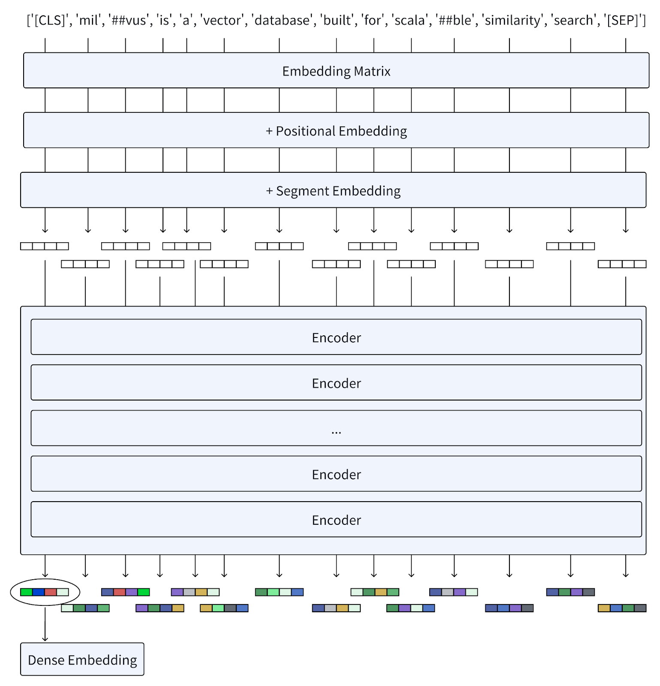
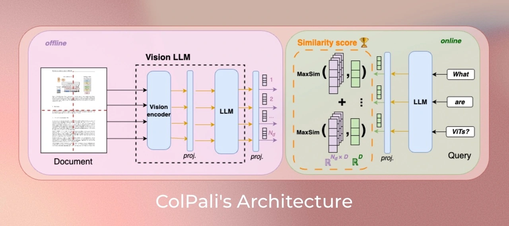
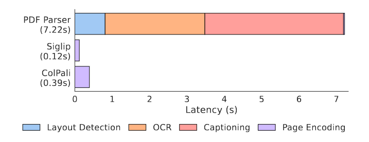
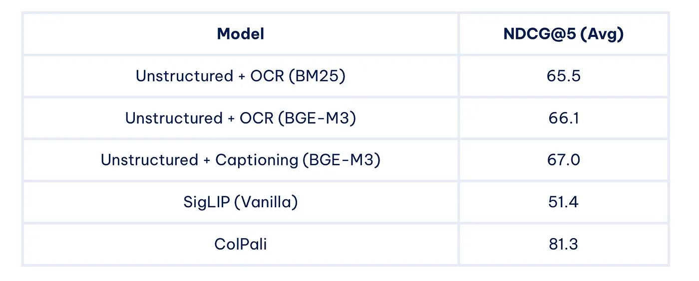

# BERT, ColBERT and ColPali
- BERT
- ColBERT
- ColPali
<!-- more -->

## 1. BERT
### 1.1. What is BERT?
BERT, short for Bidirectional Encoder Representations from Transformers, is a language model based on the transformer architecture and excels in dense embedding and retrieval tasks. Unlike traditional sequential natural language processing methods that move from left to right of a sentence or vice versa, BERT grasps word context by analyzing the entire word sequence simultaneously, thereby generating dense embeddings. 


### 1.2. How BERT generates vector embeddings
User query: Milvus is a vector database built for scalable similarity search.


When we feed a query into BERT, the process unfolds as follows:

- Tokenization: Firstly, The text is first tokenized into a sequence of word pieces known as tokens. Then, it adds a special token [CLS] at the beginning of the sequence of generated tokens and a token [SEP] at the end of these tokens to separate sentences and indicate the end.

- Embedding: Each token is converted into vectors using an embedding matrix, similar to models like Word2Vec. Positional embeddings are added to these token embeddings to preserve information about the order of words, while segment embeddings distinguish different sentences.

- Encoders: The vectors pass through multiple layers of encoders, each composed of self-attention mechanisms and feed-forward neural networks. These layers iteratively refine the representation of each token based on the context provided by all other tokens in the sequence.

- Dense Embeddings Output: The final layer outputs a sequence of embeddings. BERT generates dense embeddings that capture the meaning of individual words and their interrelations within sentences. This approach has proven immensely successful in various language understanding tasks, setting new standards in NLP benchmarks.

- Pooling Operations (Optional): All token vectors are combined using pooling operations to form a unified dense representation.



## 2. ColBERT
### 2.1. What is ColBERT? 
With the rise of natural language understanding (NLU) technologies, many neural ranking models have been developed to enhance traditional retrieval methods such as BM25.

ColBERT is a neural ranking model based on BERT with contextualized late interaction, and it marks an important shift from conventional embedding approaches.

- Unlike BERT, which consolidates token vectors into a singular representation, ColBERT maintains per-token representations, offering a finer granularity in similarity calculation. 
- What sets ColBERT apart is its introduction of a novel late interaction mechanism. This approach provides a more detailed and nuanced understanding of the semantic relationship between queries and documents.

#### 2.1.1. ColBERT Performance


ColBERT is not only competitive with existing BERT-based models—surpassing all non-BERT baselines—but also remarkably efficient, running up to two orders of magnitude faster while reducing the required FLOPs per query by four orders of magnitude.

### 2.2. Understanding ColBERT Architecture
The diagram below demonstrates the general architecture of ColBERT, which comprises:
- A query encoder
- A document encoder
- The late interaction mechanism


#### 2.2.1. The Query Encoder: to transform a query `Q` into a set of fixed-size embeddings `Eq`
$$Eq := Normalize( CNN( BERT("[Q], q0, q1, ...ql, [mask], [mask], …, [mask]") ) )$$

- Step1: Tokenization
- Step2: BERT
- Step3: CNN
- Step4: Normalization

#### 2.2.2. The Document Encoder: to transform document `D` into a set of fixed-size embeddings `Ed`
$$Ed := Filter( Normalize( CNN( BERT("[D], d0, d1, ..., dn") ) ) )$$

- Step1: Tokenization
- Step2: BERT
- Step3: CNN
- Step4: Normalization
- Step5: Filter: to remove punctuation symbols based on a predefined list(aims to reduce the number of embeddings per document)

#### 2.2.3. The Late Interaction Mechanism: to calculate the relevance score between `Q` and `D` with Eq and Ed in hand
##### 2.2.3.1. What is "Late interaction"?
In information retrieval, "interaction" refers to assessing the relevance between a query and a document by comparing their vector representations. "Late interaction" signifies that this comparison occurs after the query and document have been independently encoded. This approach contrasts "early interaction" models like BERT, where query and document embeddings interact at earlier stages, often before or during their encoding.

ColBERT adopts a late interaction mechanism that enables the pre-computation of query and document representations. It then employs a streamlined interaction step towards the end to compare the similarity of the already encoded representations. Compared to the early interaction approach, late interaction results in faster retrieval times and reduced computational requirements, making it well-suited for processing extensive document collections efficiently.

##### 2.2.3.2. How does the late interaction process work?


- Step0: the encoders transform the query and document into lists of token-level embeddings `Eq` and `Ed`
- Step1: to perform a series of maximum similarity (MaxSim) computations （max-pooling）
    - using either cosine similarity or squared L2 distance metrics
- Step2: aggregate the maximum similarity scores across all query tokens by summing them to obtain an overall relevance score for each document.
- Step3: Rank the documents based on their relevance scores in descending order.

##### 2.2.3.3. Unique Value of "Late interaction"
- Offline indexing: Document representations can be precomputed and stored, enabling efficient retrieval at query time.
- Fine-grained matching: By preserving token-level interactions, late interaction captures nuanced similarities between queries and documents, leading to more accurate search and matching results.
- Lightweight yet powerful interaction: The summation of maximum similarity (MaxSim) scores offers two key advantages. First, it serves as a particularly lightweight interaction mechanism. More importantly, it enables efficient top-k pruning during retrieval—delivering both speed and effectiveness.

### 2.3. ColBERTv2: an Improved ColBERT for Better Retrieval Effectiveness and Storage Efficiency
- Challenge: storage consumption
    - Unlike Sentence-BERT, which generates a single vector per sentence, ColBERT generates one vector for each word piece token within a sentence. This approach is effective in similarity retrieval but inflates the space footprint of these models by order of magnitude, requiring heightened storage consumption during practical deployment in retrieval systems.
- Address: product quantization (PQ) 
    - ColBERTv2 was introduced to address these challenges. This iteration enhances ColBERT by integrating product quantization (PQ) with centroid-based encoding strategies. The application of product quantization allows ColBERTv2 to compress token embeddings without significant information loss, thus reducing storage costs while maintaining the model's retrieval effectiveness. This change optimizes the storage efficiency and retains the model's capability for fine-grained similarity assessments, making ColBERTv2 a more viable solution for large-scale retrieval systems.

## 3. ColPali
### 3.1. What is ColPali  

ColPali is a **multimodal model** capable of processing both images and text to efficiently index and retrieve documents. It is an extension of **PaliGemma-3B** that produces **ColBERT-style multi-vector representations** for text and image content.  

**Key Features**  

- **Multimodal**: Simultaneously handles both textual and visual information, allowing richer document representations.  
- **Multi-Vector Embeddings**: Similar to ColBERT, ColPali generates a separate embedding vector for each patch of a page image, rather than representing the entire page with a single vector.  
- **Late Interaction**: During retrieval, the model computes the similarity between each query token embedding and all patch embeddings of the document page. The final document-query relevance score is obtained by summing the maximum similarity for each query token across all patches.  

### 3.2. ColPali Architecture


#### 3.2.1. Related Model
- SigLIP: A powerful vision encoder that produces a single-vector embedding for an input, whether image or text.
- Gemma: A language model focused on textual understanding.
- PaliGemma: A multimodal model capable of processing both images and text, combining the strengths of SigLIP and Gemma.
- ColPali: Integrates the multimodal capabilities of PaliGemma with the late interaction strategy of ColBERT. It leverages ViT patch embeddings to represent an entire PDF page as multiple embeddings, generated at the patch level.

#### 3.2.2. ColPali Workflow
- The Offline Document Encoder
    - Each document page is fed through the vision encoder (SigLIP)
    - A projection layer
    - The resulting image patch embeddings are processed by the language model (Gemma-2B)
    - A projection layer maps the output to a lower-dimensional space (D=128)
- The Online Query Encoder
    - The query is encoded using the language model
    - A projection layer
- The Late Interaction Mechanism
    - computes similarity scores between query tokens and document patches

### 3.3. ColPali Performance


To evaluate ColPali’s performance, the researchers introduced a new benchmark called ViDoRe (Visual Document Retrieval). This comprehensive benchmark includes various tasks spanning multiple domains, modalities, and languages.


Some key results from the ViDoRe benchmark:



As we can see, ColPali significantly outperforms other methods across a wide range of tasks, demonstrating its effectiveness in multimodal document retrieval.

### 3.4. The problem ColPali solves
Traditional document retrieval systems face several challenges:
- Documents contain diverse visual elements—text, charts, tables, layouts, and even fonts. Converting all non-text elements into text can lose significant information.
- Handling different document types and elements (text, images, tables, formulas, etc.) separately is time-consuming, fragile, and complex.

ColPali addresses these issues by operating directly on document images, eliminating the need for complex preprocessing steps and enabling faster, more accurate retrieval.


### 3.5. Advantages of ColPali
- Efficiency: Enables fast indexing and ensures low latency during the querying phase.
- Accuracy: By leveraging visual features, ColPali achieves higher accuracy in document retrieval, particularly for visually rich documents.
- Flexible End-to-End Processing: ColPali can process a variety of documents—such as PDF, PPT, and Word files—containing diverse visual elements, including text, tables, and figures, in a fully end-to-end manner. By directly embedding document page images, it eliminates the need for complex and fragile pipelines such as OCR, layout analysis, or chunking, allowing a single model to simultaneously leverage both textual and visual content. , simplifying the entire retrieval workflow. 
- Interpretability: Offers visualizations highlighting which image patches contribute most to a retrieval decision, enhancing transparency and explainability.
- Multilingual: Supports retrieval across documents in different languages.
- Multimodal: Integrates textual and visual information seamlessly for more robust retrieval.

### 3.6. Potential applications
The capabilities of ColPali open up numerous possibilities for improving existing systems and enabling new applications:
- Enhanced RAG systems: By incorporating ColPali, RAG systems can better understand and retrieve information from visually rich documents.
- Improved search engines: ColPali could significantly enhance the accuracy and speed of document search in large-scale systems.
- Document analysis: The model’s ability to understand document layouts and visual elements makes it valuable for automated document analysis tasks.
- Multimodal question answering: ColPali’s understanding of both text and visual elements makes it well-suited for answering questions about complex documents.
- Legal and medical document retrieval: Fields that deal with large volumes of complex, multimodal documents could benefit greatly from ColPali’s capabilities.

### 3.7. Limitations and future work
While ColPali represents a significant advancement, there are still areas for improvement and further research:
- Memory Footprint: The multi-vector representation requires more storage than traditional single-vector embeddings.
- Scalability: Further optimization may be needed for extremely large document corpora.
- Integration with existing systems: Work is needed to integrate ColPali with popular vector databases and retrieval frameworks.

Future research directions might include:
- Exploring sub-image decomposition techniques
- Optimizing image patch resampling strategies
- Incorporating hard-negative mining during training

### 3.8. How to use
- Official Version: https://huggingface.co/vidore/colpali-v1.3
- ColQwen2.5: https://huggingface.co/tsystems/colqwen2.5-3b-multilingual-v1.0
- Byaldi library: https://github.com/AnswerDotAI/byaldi
- LitePali: https://litepali.com/
- ColPali combined with Qwen2 VL notebook: https://github.com/merveenoyan/smol-vision/blob/main/ColPali_%2B_Qwen2_VL.ipynb

#### 3.8.1. Official Version
For best performance, newer models are available ([vidore/colpali-v1.3](https://huggingface.co/vidore/colpali-v1.3))

Install colpali-engine:  
```
pip install colpali-engine>=0.3.0,<0.4.0
```

Then run the following code:
```
from typing import cast

import torch
from PIL import Image

from colpali_engine.models import ColPali, ColPaliProcessor

model_name = "vidore/colpali-v1.3"

model = ColPali.from_pretrained(
    model_name,
    torch_dtype=torch.bfloat16,
    device_map="cuda:0",  # or "mps" if on Apple Silicon
).eval()

processor = ColPaliProcessor.from_pretrained(model_name)

# Your inputs
images = [
    Image.new("RGB", (32, 32), color="white"),
    Image.new("RGB", (16, 16), color="black"),
]
queries = [
    "Is attention really all you need?",
    "Are Benjamin, Antoine, Merve, and Jo best friends?",
]

# Process the inputs
batch_images = processor.process_images(images).to(model.device)
batch_queries = processor.process_queries(queries).to(model.device)

# Forward pass
with torch.no_grad():
    image_embeddings = model(**batch_images)
    query_embeddings = model(**batch_queries)

scores = processor.score_multi_vector(query_embeddings, image_embeddings)
```

## 4. Reference
- ColPali Official
    - ColPali Paper: https://arxiv.org/pdf/2407.01449
    - ColPali Github: https://github.com/illuin-tech/colpali
    - ColPali Huggingface (models, data, code and benchmarks): https://huggingface.co/vidore/colpali
- ColQwen2.5: https://huggingface.co/tsystems/colqwen2.5-3b-multilingual-v1.0
- Bert Paper: https://arxiv.org/abs/1810.04805
- ColBert Paper: https://arxiv.org/pdf/2004.12832
- Bert & ColBERT & ColBERTv2: https://zilliz.com/learn/explore-colbert-token-level-embedding-and-ranking-model-for-similarity-search
- Bert & Exploring BGE-M3 and Splade: https://zilliz.com/learn/bge-m3-and-splade-two-machine-learning-models-for-generating-sparse-embeddings#BERT-The-Foundation-Model-for-BGE-M3-and-Splade
- ColPali — Revolutionizing multimodal document retrieval: https://medium.com/@simeon.emanuilov/colpali-revolutionizing-multimodal-document-retrieval-324eab1cf480