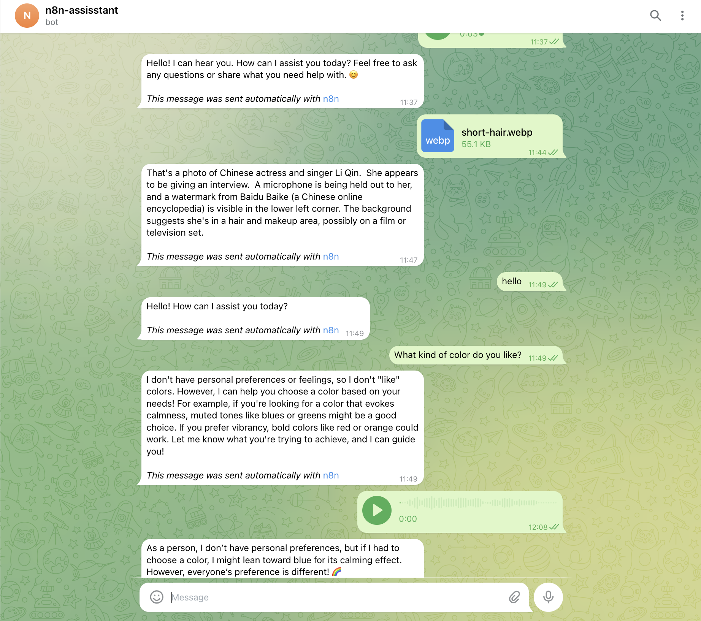
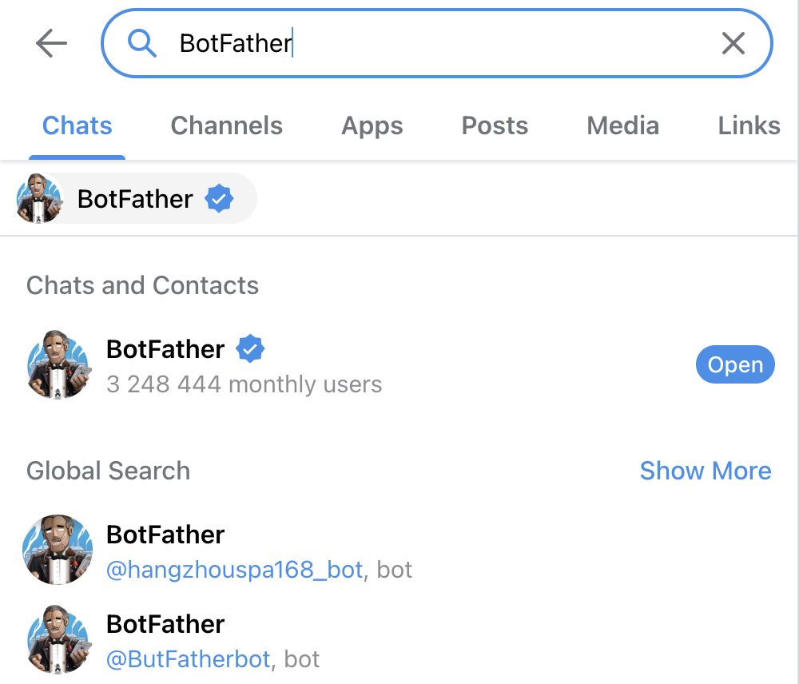
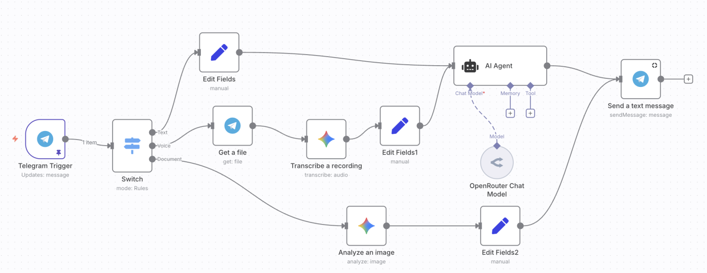
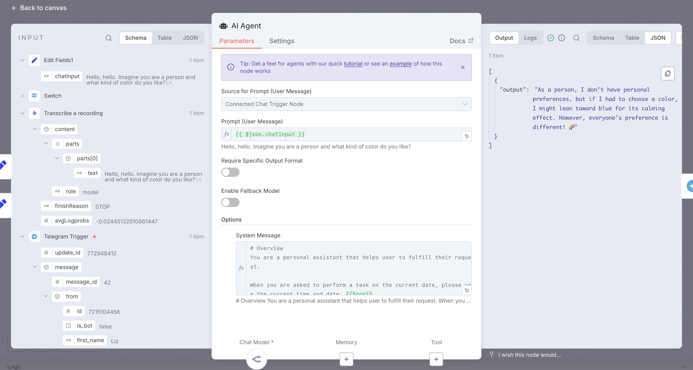
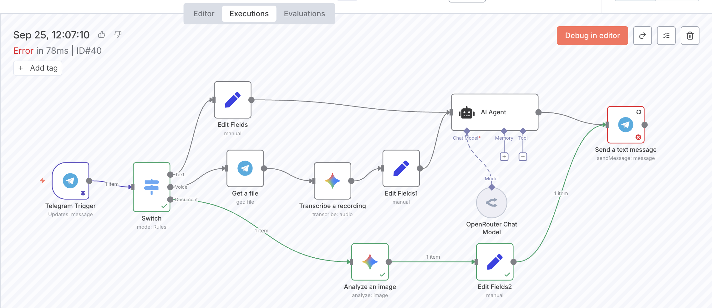

# Using n8n to Build a Telegram Personal Assistant
 
- What is n8n and How to Use n8n
- Creating a Telegram Bot
- Setting Up Telegram Trigger in n8n
- Complete Workflow
<!-- more -->
## 1. Preview
With this setup, users can interact with a Telegram bot conversationally using text, voice, or images.  
- Messages sent to the Telegram bot trigger an n8n workflow.  
- n8n processes the input and sends the result back to Telegram.  
- The user receives the bot’s response seamlessly.



## 2. What is n8n?
n8n is a powerful open-source, low-code workflow automation tool that enables users to seamlessly connect and automate tasks across various apps and services. Its intuitive visual interface lets you create workflows by linking "nodes" (representing apps or actions) to streamline processes like data transfers, notifications, and task scheduling.

Official Website: https://n8n.io/

GitHub: https://github.com/n8n-io/n8n

## 3. How to Use n8n 
There are three main ways to deploy n8n:  
1. Official cloud platform  
2. Self-hosted locally via Docker   
3. Deploy on your own cloud server 

Here, I use the official cloud platform for simplicity.

### 3.1. Option 1: Official Cloud Platform  
Click **“Get Started for free”** on the official site.  

- **Pros**  
  - 14-day free trial  
  - Stable and hassle-free  
- **Cons**  
  - Requires payment after 14 days  
  - No access to community nodes  

### 3.2. Option 2: Self-hosted locally via Docker
```bash
docker volume create n8n_data

docker run -it --rm \
 --name n8n \
 -p 5678:5678 \
 -e N8N_RUNNERS_ENABLED=true \
 -v n8n_data:/home/node/.n8n \
 docker.n8n.io/n8nio/n8n
```

Then open: http://localhost:5678

Connecting n8n to Ollama (for local LLMs):

If n8n runs inside Docker, replace `localhost` with `host.docker.internal` in the Ollama node configuration:

```
http://host.docker.internal:11434
```

- **Pros**
  - Completely free with Ollama integration
  - Supports community nodes
- **Cons**
  - Using webhooks or connecting to external apps can be challenging, requiring public network exposure.
  - Consumes local computer resources during operation, stops when the computer is shut down, and requires restarting the Docker container each time the computer is powered on.

### 3.3. Option 3: Deploy on a Cloud Server
- **Pros**
  - Always online (24/7 uptime)
  - Cheaper than the official cloud option
- **Cons**
  - Less stable than official hosting
  - Setup may be tricky for non-technical users
 
## 4. Creating a Telegram Bot
- Search for `BotFather` in the Telegram search bar



- Add `BotFather` to create a new bot

- Chat with `BotFather` to set the name and username for your new bot


- You now have your own Telegram bot and its API token.

## 5. Setting Up Telegram Trigger in n8n
Common Trigger Types
- **Manual Trigger in the n8n UI**: 
  - Start workflows by clicking "Execute Workflow" in n8n
  - Send chat messages directly within n8n to trigger workflows
- **Scheduled Trigger**: Run workflows every day, hour, or custom interval
- **Chat App Events**: 
  - Telegram
  - WhatsApp
  - Slack
  - Discord
- **Other App Events**: 
  - Trigger on receiving a new Gmail email
  - Trigger when a new page is added to a Notion database
- **Webhook Trigger**: Activate workflows via external data sent to an n8n webhook URL (requires public network access).

Here, I use Telegram Trigger as the entry point.

## 6. Routing with the Switch Node
Parameters Settings
- Mode: choosing `Rules`
- Routing Rules
  - Drag the relevant fields directly to the Routing Rules section.
  - Set the matching condition to `String -> Exists` to check for the presence of a specific string.
  - Define the Output Name for each branch.


## 7. Handling Different Branches
- Text Branch
  - Extract the text message
  - Use it as the User Prompt
  - Combine with a System Prompt inside an AI Agent node
  - Send the generated response back to Telegram
- Voice Branch
  - Receive the audio file from Telegram
  - Transcribe it into text using a multimodal model
  - Use the transcription as the User Prompt
  - Process with the AI Agent and send the response back to Telegram
- Image Branch
  - Receive the uploaded image
  - Analyze it using a multimodal model
  - Send the analysis result back to Telegram

## 8. Complete Workflow


## 9. Workflow Testing and Refinement
### 9.1. Before Activation
- **Inactive State**: When the workflow is "Inactive", testing can only be performed by manually clicking the "Execute Workflow" button, located at the bottom or near the initial trigger node.
- **Node Inspection**: Each node displays its input and output results for review during testing.



### 9.2. After Activation
- **Activating the Workflow**: Once the workflow is fully built, switch its status to "Active". Messages sent via Telegram will then automatically trigger the workflow.
- **Execution Tracking**: Every trigger is logged on the n8n platform. You can view details in the "Executions" section, including which branch was followed, whether the execution succeeded, and any errors. If a part fails, you can debug and troubleshoot to refine the workflow.



## 10. Next Steps
- Add memory to keep track of conversation history
- Add tools to extend functionality
- Connect a knowledge base for richer external information
- Explore other triggers and integrations to personalize your assistant