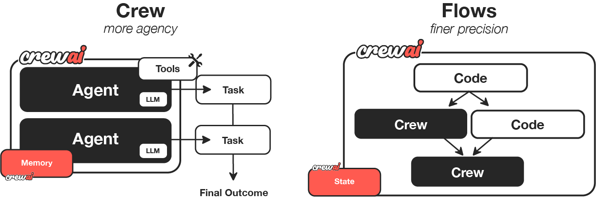

# CrewAI: The Leading Multi-Agent Framework

- Two Automation Modes in CrewAI: Crews & Flows
- Flow Control Logic of CrewAI Flows
- Three Modular Components of CrewAI Crews (Agents, Tasks, Crews)
- CrewAI Use Case: Stock Analysis System

<!-- more -->

## Key Concept Overview

Traditional Automation vs. Agentic Automation

-   Traditional Automation: Relies on conditional judgments, driven by clear rules, fixed and reproducible, suitable for deterministic and repetitive tasks.
-   Agentic Automation: Leverages the fuzzy reasoning capabilities of LLMs, driven by semantic understanding and contextual reasoning, autonomous decision-making, multi-path optional, dynamically diverse, highly adaptable, suitable for fuzzy and highly semantic tasks (such as content generation and decision analysis).

Agent vs. Multi-Agent

-   Agent
    -   Memory: Continuously tracks contextual logic and global goals.
    -   Tool: Interacts with the real world, executing practical operations.
        -   Invokes external APIs and services.
        -   Integrates enterprise internal systems (CRM, databases, etc.).
        -   Executes complex calculations or processing tasks.
        -   Communicates and interacts with existing programs.
    -   It is a ReAct loop: Observation -> Thinking -> Action
-   Multi-Agent
    -   High Specialization: Each agent focuses only on specific tasks.
        -   Each agent should only undertake a specific task scope, controlling context length and the number of tools.
            -   Tools should be carefully selected and highly matched to the task. Too many tools can lead to model selection difficulties or misuse, especially affecting the performance of small models. The system enhances security by making sure that each agent only has access to the tools necessary for its task, reducing the potential for unauthorized access to sensitive data.
    -   Multi-Agent Collaboration: Simulates human team communication and feedback. Agents should be able to exchange information, review each other, and delegate tasks, forming a feedback loop to improve result quality.
    - Complex workflow handling：The system can manage advanced and complex workflows by distributing tasks among multiple agents.
    -   Model Flexibility: Different agents can adopt different models according to task characteristics.
    -   Overall Quality Improvement: Compared to a single agent performing multiple tasks, multiple highly focused agents collaborating can often generate more accurate and professional results.
    -   Further Enhancement: Self-Improvement Loop: A self-improvement mechanism that continuously optimizes decision logic and execution results through feedback.
        -   Agents learn and optimize through memory, outputting more reliable results over time.

## Two Automation Modes in CrewAI: Crews & Flows

-   From a macro perspective, CrewAI has created two main automation methods: Crews and Flows.
    -   Crew: Autonomous collaborative AI team, where each agent has specific roles, tools, and goals (dynamic intelligent decision-making).
        -   Crew: Team
        -   Agents: Intelligent Agents
        -   Tasks: Tasks
        -   Process: Collaboration mode (Sequential or Hierarchical)
    -   Flow: Enables fine-grained, event-driven control, precise task orchestration, and native support for Crews (static workflow).
        -   Flow: Process, workflow orchestration
        -   Events: Events
        -   States: States
        -   Crew Support: Native support for Crews
-   When to Use Crews vs. Flows
    -   Use Crews for:
        -   Open-ended questions, exploratory tasks, requiring autonomous problem-solving, creative collaboration.
    -   Use Flows for:
        -   Predictable, auditable, with definite paths.
    -   Combine Crews and Flows for:
        -   Scenarios that require both structured processes and some autonomous intelligence.

## Flow Control Logic of CrewAI Flows

-   @start(): The starting point of the process.
-   @listen(): Listener (when the method being listened to produces output, the listener method is triggered).
    -   Conditional logic OR:
        -   Used to listen to multiple methods and trigger the listener method when any specified method emits output.
    -   Conditional logic AND:
        -   Triggers the listener method only when all specified methods have emitted output.
-   @router(): Specifies different routes based on the output of the methods.
-   @persist: Manages the persistence of states, applicable at the class level and method level.

## Three Modular Components of CrewAI Crews (Agents, Tasks, Crews)

Through these three components, CrewAI achieves a complete intelligent workflow from task definition and role assignment to result output.

-   Agents: Intelligent agents with goal-oriented behavior.
    -   Function Description: The core individual in a multi-agent system, possessing autonomous thinking and action capabilities.
    -   Key Attributes
        -   Role: Defines responsibilities and identity.
        -   Goal: Clarifies the task direction.
        -   Backstory: Provides behavioral context and decision-making basis.
-   Tasks: Specific goals or operational units that agents execute.
    -   Function Description: Specific work content that guides agents to execute. The output of the previous task can be used as the input for the next task.
    -   Key Attributes
        -   Description: Clearly informs the agent what the task content is.
        -   Expected Output: Defines the form and quality standards of the results, clearly informs the agent of the expected results to be achieved, ensuring that the output is consistent with the goal.
            -   Expected Output is a "forcing function" that guides the agent to think about how to achieve the goal and ensures that the output meets structural requirements. This mechanism effectively improves the controllability and consistency of the output.
        -   Agent: Specifies the executor.
-   Crews: A team composed of multiple AI agents with different roles and capabilities, collaborating to complete complex tasks.
    -   Function Description: Combines agents and tasks into runnable units to achieve collaborative operation.
    -   Key Attributes: agents (list of agents), tasks (list of tasks), verbose (detailed mode, setting verbose=2 enables the highest level of log output).

## CrewAI Agent Collaboration Mode

-   Traditional Collaboration Methods (Sequential & Parallel)
    -   Sequential Execution
        -   Limitation: Initial context may be lost as the task chain lengthens.
    -   Parallel Execution
        -   Limitation: Only solves the problem of task execution speed, does not solve context loss.
-   Advanced Collaboration Method: Hierarchical Process
    -   Core Advantages:
        -   Single-Point Control: Unified management by the Manager Agent.
        -   Memory Goal: The manager maintains the initial goal without loss.
        -   Automatic Delegation: The manager assigns tasks to other agents.
        -   Result Review: The manager reviews and can request improvements to task output.
    -   Implementation Method: In CrewAI, you only need a small amount of code to switch to a hierarchical process.
    -   User Customization: You can customize the manager agent's strategy and decision-making methods.

## CrewAI Tools

CrewAI provides a rich library of built-in tools and skills and supports external and custom tools.

-   Built-in Tools: Provides a variety of out-of-the-box tools.
-   LangChain Compatibility: CrewAI supports all LangChain tools, greatly expanding the toolset available to agents.
-   Custom Tools: Developers can create custom tools for seamless integration with external APIs, databases, CRMs, or internal systems.

Two Tool Scopes of CrewAI Tools

-   Task Level
    -   Tools are only available when the task is executed, high priority.
-   Agent Level
    -   Tools are available in all tasks of the Agent, low priority.

## Three Memory Mechanisms of CrewAI

You only need to enable a flag when instantiating a Crew to enable memory function, and the framework automatically manages storage and calls.

After enabling memory, CrewAI automatically activates the following three types of mechanisms to serve different levels of learning and context maintenance.

-   Short-Term Memory:
    -   Stores the context and intermediate results of a single customer conversation.
    -   Lifecycle: Only exists during the current Crew execution.
    -   Function: Stores information and intermediate results generated during task execution.
    -   Features: Within the same Crew, all agents share short-term memory to achieve contextual coherence and multi-agent collaboration.
    -   Usage Example: In the "planning-writing-editing" process, editors can directly access the outline generated by the planner and the first draft of the writer.
-   Long-Term Memory:
    -   Retains past customer interactions and self-criticism results to help the system continuously improve.
    -   Lifecycle: Retained after Crew execution ends, stored in a local database.
    -   Function: Supports agents to "learn from experience" from historical executions.
    -   Mechanism:
        -   After execution is completed, the agent will perform Self-Critique;
        -   Record how to improve the next performance;
        -   These feedbacks are saved and automatically called during future runs.
    -   Effect: Make the agent "smarter" the more it is used, and continuously optimize output quality and consistency.
-   Entity Memory:
    -   Tracks core "entities" such as customers, companies, products, etc., to achieve cross-task references and personalized responses.
    -   Lifecycle: Similar to short-term memory, only valid during the current execution.
    -   Function: Stores the topic or entity information that the agent is processing.
    -   Example:
        -   When a research agent analyzes "OpenAI Company", the system will create an "OpenAI" entity;
        -   It saves relevant products, personnel, history, and characteristics for other tasks to reference.

## Advanced Hyperparameters for CrewAI Tasks

Advanced hyperparameters are used to handle complex task scenarios, making complex multi-agent systems more flexible, secure, and controllable.

Advanced attributes allow tasks to achieve structured output, human review, and parallel processing, improving system flexibility and efficiency.

-   Context
    -   Function: Provides additional background information for the task.
    -   Example: Load the latest data or instructions before the task starts.
-   Callback
    -   Function: Executes a custom function after the task is completed.
    -   Example: Send a notification email or record data.
-   Overriding Agent Tools
    -   Function: Use task-specific tools to override the agent's default tools.
    -   Example: Restrict tasks to only use specified tools, improving security and efficiency.
-   Force Human Input
    -   Function: Pause the task before completion and wait for human review.
    -   Example: Perform manual intervention at key decision points.
        -   Pause at key nodes and wait for manual review or input to ensure the quality of important decisions.
-   Execution
    -   Function: Configure the way tasks are run.
    -   Example: Synchronous or parallel execution.
        -   Parallel Execution: Allows tasks to run asynchronously, improving overall system efficiency.
-   Output Format
    -   Function: Specifies the format of the task output, making it easy for subsequent programming, storage, or use as function parameters.
    -   Example: Output as a Pydantic object, JSON, or file.
        -   Use Pydantic models to convert LLM fuzzy output into strongly typed data objects.
        -   Can output to JSON files or other file formats for easy integration with conventional programming systems.

## Agent Design

-   Managerial Thinking in Agent Design
    -   When designing agents, shift from "What can I do with AI?" to "If I were to hire a group of people to complete this task, who would I hire?"
    -   Emphasizing role positioning, task division, and clear goals are the keys to the success of a multi-agent system.
-   The Power of Precise Role Positioning and Keywords
    -   Giving agents only a generic role (such as "Researcher" or "Writer") can easily produce vague, low-quality output. Excellent agents require precise role definitions and keywords to guide behavior, just like hiring domain experts.
    -   When defining an agent's role, goals, and backstory, be sure to use the keywords that best represent the expertise.
    -   Examples:
        -   Researcher -> HR Research Specialist
            -   Limit the scope of research and output more professional HR knowledge.
        -   Writer -> Senior Copywriter
            -   Improve output quality, tone, and marketing professionalism.
        -   Financial Analyst -> FINRA Approved Analyst
            -   Use keywords (such as FINRA) to guide the LLM, trigger the RAG mechanism, and output analysis results that meet industry standards.
-   Mandatory Attributes for Creating Excellent Tasks
    -   Clear Description: Clearly inform the agent what the task content is.
    -   Clear Expected Output: Clearly inform the agent of the expected results to be achieved, ensuring that the output is consistent with the goal.
-   Three Key Elements for Building Excellent Tools
    -   Versatility
        -   Tools are converters between the fuzzy input of AI applications and the strongly typed input of external systems.
        -   Key to Implementation: Tools must be flexible enough to handle the diverse inputs provided by LLMs, improving reusability.
        -   Development Practice: Ensure that the parameters output by the LLM can be correctly converted into the types required by external APIs or services to ensure successful request execution.
    -   Fault-Tolerance
        -   Background: External systems may experience exceptions, affecting the agent process.
        -   Function: Tools must be able to Fail Gracefully and have self-healing capabilities. Ensure that the system can continue to execute even if it encounters errors, improving robustness. (Self-healing), preventing process interruption.
        -   CrewAI Mechanism:
            -   Even if the tool runs abnormally, the Crew will not stop execution.
            -   The agent will take action based on the error message, such as adjusting input, supplementing parameters, or trying other execution methods.
        -   Considerations for Large-Scale Deployment: Tools need to be able to handle complex documents and unexpected data formats to ensure stable system operation.
    -   Caching
        -   Background: Calling external APIs or services through tools may trigger rate limits or consume time.
        -   Function: The caching mechanism can optimize system performance, reduce duplicate calls, and improve the efficiency of multi-agent systems. Save API call costs, avoid rate limits, and speed up system operation.
        -   CrewAI Features: Cross-Agent Caching
            -   If different agents use the same tool and parameter call request, the system will hit the cache, avoiding duplicate calls.
            -   Reduce the number of API requests, avoid rate limits, and speed up system execution.

## Steps to Create a Multi-Agent System Using CrewAI

-   Define LLM (three ways: environment variables, use YAML configuration, or define directly in code)
-   Define Agents (two ways: use YAML configuration or define directly in code)
-   Define Tasks (two ways: use YAML configuration or define directly in code)
-   Define Tools
-   Create a Team Crew
-   Run the Crew

## Use Case: Stock Analysis System

Three Crews

-   Data Collection Team (DataCollectionCrew) Process.sequential, allow_delegation=False
    -   Market Researcher - Market Research Task: Collect market news, industry information, and company dynamics.
        -   market\_researcher -> market\_research\_task
    -   Financial Data Expert - Financial Data Collection Task: Obtain financial statements, key financial indicators.
        -   financial\_data\_expert -> financial\_data\_collection\_task
    -   Technical Analyst - Technical Analysis Task: Collect price data, technical indicators.
        -   technical\_analyst -> technical\_analysis\_task
    -   Data Validation Expert - Data Validation Task: Verify data quality, process outliers.
        -   data\_validation\_expert -> data\_validation\_task
    -   Data Coordination Expert - Data Coordination Task: Coordinate and integrate all data collection work.
        -   data\_coordination\_agent -> data\_coordination\_task
-   Analysis Team (AnalysisCrew) Process.hierarchical, allow_delegation=True
    -   Senior Fundamental Analyst - Fundamental Analysis Task: Evaluate company fundamentals, financial health.
        -   fundamental\_analyst -> fundamental\_analysis\_task
    -   Risk Assessment Specialist - Risk Assessment Task: Analyze investment risks, identify risk factors.
        -   risk\_assessment\_specialist -> risk\_assessment\_task
    -   Industry Research Expert - Industry Analysis Task: Analyze industry status, competitive environment.
        -   industry\_expert -> industry\_analysis\_task
    -   Quantitative Analyst - Quantitative Validation Task: Verify the statistical significance of analytical conclusions.
        -   quantitative\_analyst -> quantitative\_validation\_task
    -   Analysis Coordinator - Analysis Coordination Task: Integrate all analysis results and form a final judgment.
        -   analysis\_coordinator -> analysis\_coordination\_task
-   Decision Team (DecisionCrew) Process.hierarchical
    -   Investment Strategy Advisor - Investment Strategy Formulation Task: Generate investment recommendations, strategy formulation.
        -   investment\_advisor -> investment\_strategy\_task
    -   Report Generation Expert - Report Generation Task: Generate detailed analysis reports.
        -   report\_generator -> report\_generation\_task
    -   Quality Control Expert - Quality Assurance Task: Quality control, result verification.
        -   quality\_assurance\_specialist -> quality\_assurance\_task
    -   Risk Management Expert - Risk Assessment Task: Evaluate investment recommendations from a risk management perspective.
        -   risk\_manager -> risk\_assessment\_task
    -   Portfolio Manager - Portfolio Optimization Task: Evaluate investment decisions from a portfolio perspective.
        -   portfolio\_manager -> portfolio\_optimization\_task
    -   Market Strategist - Market Timing Analysis Task: Analyze investment timing and strategy.
        -   market\_strategist -> market\_timing\_task
    -   Ethics Compliance Officer - Compliance Review Task: Review investment recommendations from an ethical and compliance perspective.
        -   ethics\_compliance\_officer -> compliance\_review\_task
    -   Decision Moderator - Collective Decision Task: Chair the Investment Decision Committee, conduct collective discussions and decision-making.
        -   decision\_moderator -> collective\_decision\_task

Intelligent Investment Process Flow

-   Initialize Analysis initialize\_analysis
    -   @start()
-   Intelligent Routing Data Collection Strategy route\_data\_collection
    -   @listen("initialize\_analysis")
    -   @router
        -   Standard Data Collection standard\_data\_collection
            -   @listen("route\_data\_collection")
        -   Comprehensive Data Collection comprehensive\_data\_collection
            -   @listen("route\_data\_collection")
        -   Real-Time Data Collection real\_time\_data\_collection
            -   @listen("route\_data\_collection")
    -   DataCollectionCrew.execute\_data\_collection
-   Intelligent Routing Analysis Strategy route\_analysis\_strategy
    -   @listen(or\_("standard\_data\_collection", "comprehensive\_data\_collection", "real\_time\_data\_collection"))
    -   @router
        -   Deep Analysis deep\_analysis
            -   @listen("route\_analysis\_strategy")
        -   Standard Analysis standard\_analysis
            -   @listen("route\_analysis\_strategy")
        -   Rapid Analysis rapid\_analysis
            -   @listen("route\_analysis\_strategy")
        -   Simplified Analysis simplified\_analysis
            -   @listen("route\_analysis\_strategy")
    -   AnalysisCrew.execute\_collaborative\_analysis
-   Intelligent Routing Decision Strategy route\_decision\_strategy
    -   @listen(or\_("deep\_analysis", "standard\_analysis", "rapid\_analysis", "simplified\_analysis"))
    -   @router
        -   Collective Decision collective\_decision
            -   @listen("route\_decision\_strategy")
        -   Standard Decision standard\_decision
            -   @listen("route\_decision\_strategy")
        -   Rapid Decision rapid\_decision
            -   @listen("route\_decision\_strategy")
        -   Conservative Decision conservative\_decision
            -   @listen("route\_decision\_strategy")
    -   DecisionCrew.execute\_collective\_decision
-   Complete Analysis and Generate Summary Report finalize\_analysis
    -   @listen(or\_("collective\_decision", "standard\_decision", "rapid\_decision", "conservative\_decision"))
-   OUTPUT: Personalized analysis results

Reference Github: https://github.com/liangdabiao/crewai\_stock\_analysis\_system
