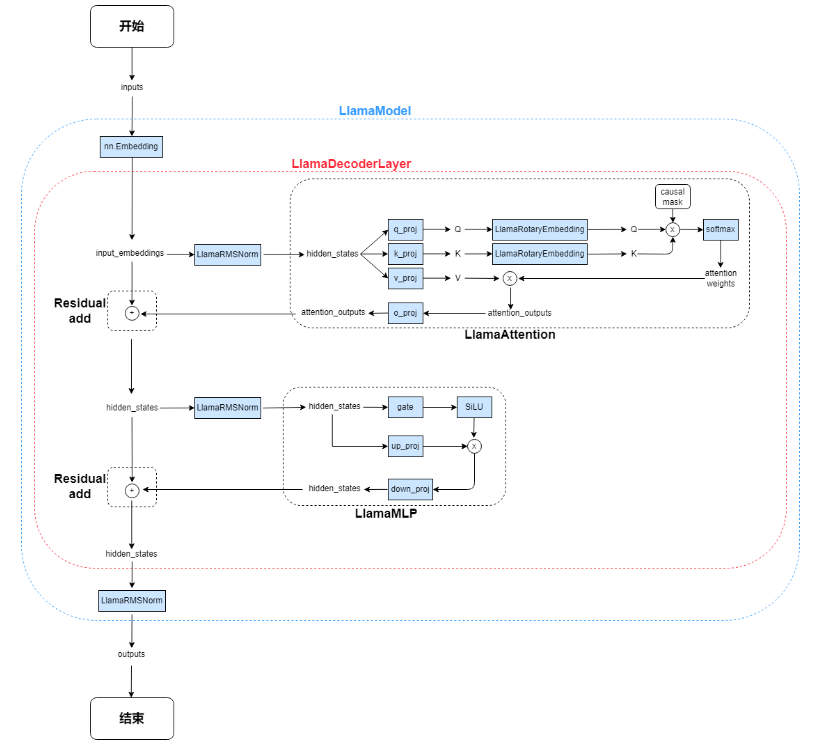
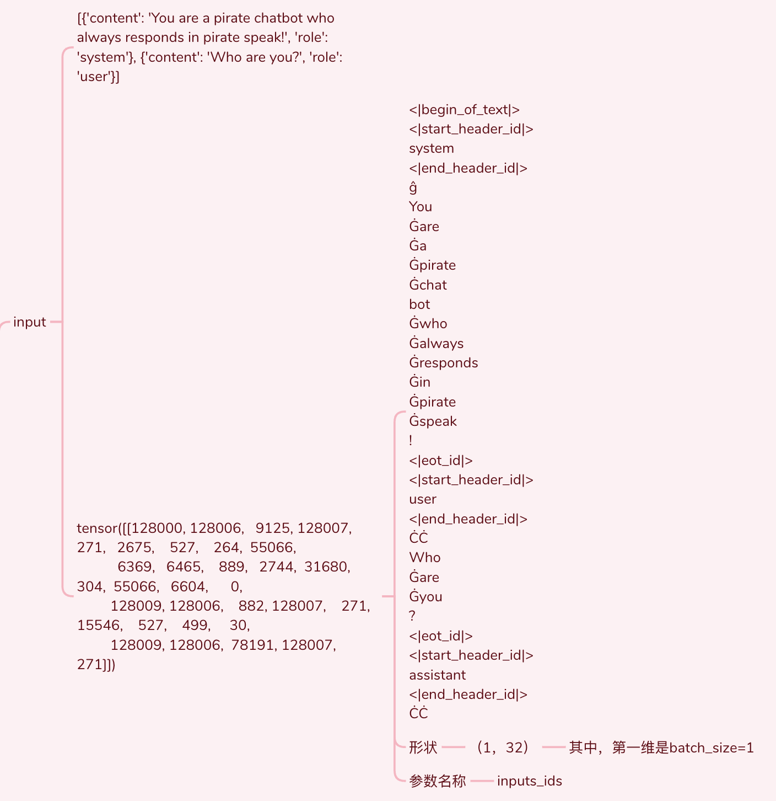
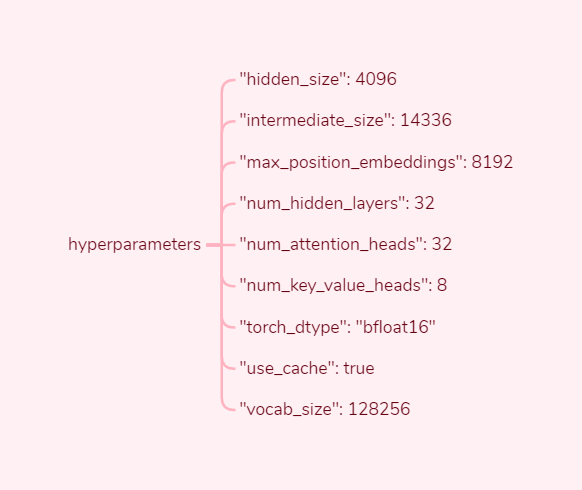
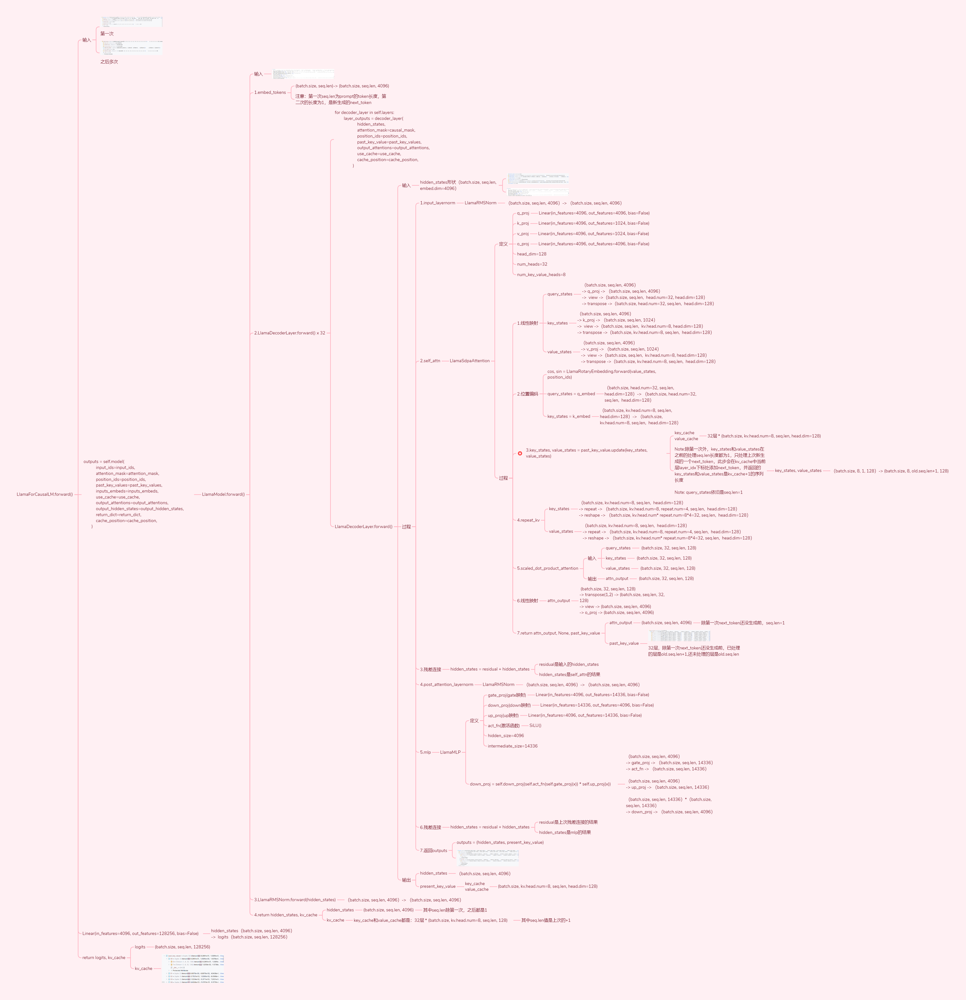

# Llama源码解读
  - 1. About
  - 2. 模型总体架构
  - 3. LLama代码逻辑
  - 4. 超参数
  - 5. 张量维度转换
  - 6. 可训练参数量     
  - 7. 源码
<!-- more -->

## 1. About
来源：https://huggingface.co/meta-llama/Meta-Llama-3-8B-Instruct

发布日期：2024.04.18

公司：Meta

源码：

https://github.com/huggingface/transformers/blob/main/src/transformers/models/llama/modeling_llama.py

## 2. 模型总体架构





## 3. LLama代码逻辑
### 3.1. Llama推理代码逻辑
注意点：
- 1.推理过程中的batch_size，表示在一次推理过程中同时处理的样本数量。如果batch_size=8，则表示每8个prompt作为一个批次输入模型同时处理
    - 这batch_size个prompt的token序列长度大小可能不一样
        - 对齐序列长度
            - 为了在同一批次（batch）中处理不同长度的token序列，通常会使用padding来将所有序列对齐到相同的长度
            - Padding的过程通常是将额外的token位置填充为一个特定的标记（通常是[PAD]），这些填充的位置在模型计算时不会对结果产生影响。
        - 注意力掩码忽略填充的位置
            - 注意力掩码是一个与输入序列相同长度的二进制向量，用于标记哪些位置是有效的（即实际的token）以及哪些是填充位置。例如，填充位置在掩码中会标记为0，实际token的位置则为1。这可以确保模型在计算注意力时，忽略掉填充的位置。
- 2.推理过程只会经过前向传播，不会有反向传播和更新参数的操作，只有训练过程中才有反向传播和更新参数的操作
    - 为什么推理时不需要反向传播？
        - 训练时：反向传播用于计算损失函数关于模型参数的梯度，并通过梯度下降更新模型参数。
        - 推理时：推理的目的是基于已经训练好的模型进行推断和生成，因此不需要计算梯度，也不需要更新模型参数。推理过程仅依赖于已训练好的参数来生成结果。

推理过程：自回归执行，每次输入是prompt再加上上一次自回归的预测token组成的token序列，每次输出是输入token序列后多预测了一位token的概率分布（假设都取最大概率的那个token）
1.将prompt进行token化，转为token序列
2.将token序列进行embedding，将每个token转为一个hidden_size大小的tensor
3.将embed后的token序列作为输入，传入llama解码层，经过32层的前向传播，输出hidden_state
4.把hidden_state映射到token词表，得到每个token作为下一个预测的token的概率分布
5.然后把最大概率的token补到prompt后面继续进行自回归


llama推理代码细节
- 1.将prompt进行token化
    - 也就是将prompt中每个词和位置信息一一对应一个token或几个token
    - 普通token共128000个+特殊token共256个（如: "<|begin_of_text|>"和 "<|end_of_text|>"这两个特殊token分别表示了文本的开始和结束），组成128256个token的词表



- 2.将token进行embedding化
    - 也就是将每个token表示为一个hidden_size维度的张量
    - "hidden_size": 4096
    - (batch.size, seq.len)-> (batch.size, seq.len, 4096)
        - batch.size : 一次处理多个prompt
        - seq.len : 每个prompt在token化后的token个数
        - 4096 : 每个token表示为4096维度的tensor

- 3.32层解码层 LlamaDecoderLayer.forward() 
    - 每层的输出hidden_state会作为下一层的输入
    - 解码层有两大块：注意力块和MLP块
    - 每层可更新的参数主要就是注意力块的4个线性映射和MLP块的3个线性映射，共 16 * h ^ 2 个 tensor
        - 4 * h ^ 2 + 3 * 4 * h ^ 2 = 16 * h ^ 2
    - 32层可更新的参数主要共 
        - num_layers * 16 * h ^ 2 = 512 * h ^ 2

- 4.注意力块
    - 有4个线性映射：Q,K,V,O（query, key, value, output），也就是4个权重矩阵，每个都是hidden_size * hidden_size = hidden_size ^ 2

- 5.MLP块 
    - 有3个线性映射：gate,down,up，也就是3个权重矩阵，每个都是hidden_size * 4 hidden_size = 4 * hidden_size ^ 2
    

### 3.2. Llama训练代码逻辑
训练过程：训练过程的关键在于通过前向传播计算损失（loss），然后通过反向传播计算梯度，并更新模型参数

注意点
- 1.多次训练epochs：数据集会被训练多次，一个训练周期（epoch）是指模型在整个训练数据集上进行一次完整的训练。
- 2.分批训练batch_size：将整个训练数据集分成多个小批次（batch）, 每个批次的batch_size决定了同时输入到模型中的样本数量
- 3.每个批次进行一次参数更新：每个批次都会执行一次前向传播、计算loss、反向传播、参数更新的完整步骤，因此模型参数会随着每个批次的训练而不断更新

训练过程代码逻辑
- 1.数据准备：输入文本token化并分批次处理
- 2.数据集的多次训练epochs，每epoch会按batch_size分批训练
- 3.每批的训练
    - 3.1.前向传播（从第1层到第32层）：输入token序列通过嵌入层和解码器，生成每个token的隐藏表示
    - 3.2.计算损失：根据模型预测的token概率分布与真实token计算损失（例如交叉熵损失）
    - 3.3.反向传播（从第32层到第1层）：计算损失的梯度，并根据梯度执行反向传播
    - 3.4.参数更新：使用优化器更新模型参数以减少损失

## 4. 超参数


## 5. 张量维度转换




## 6. 可训练参数量


## 7. 源码
### 7.1. 入口
```python
from transformers import AutoTokenizer, AutoModelForCausalLM
import torch

# model_id 可以是已下载好的模型的本地路径，也可以是huggingface.co的"{username}/{repository}"
# 从model_id路径下载词表tokenizer.json,实例化tokenizer类
tokenizer = AutoTokenizer.from_pretrained(model_id)

"""
主要分为2步：
1）从model_id路径下载配置config.json,实例化LlamaConfig类
2）从model_id路径下载model相关信息,实例化LlamaForCausalLM类
"""
model = AutoModelForCausalLM.from_pretrained(
    model_id,
    torch_dtype=torch.bfloat16,
    device_map="auto",
)

# prompt
messages = [
    {"role": "system", "content": "You are a pirate chatbot who always responds in pirate speak!"},
    {"role": "user", "content": "Who are you?"},
]

# 将messages转为token
input_ids = tokenizer.apply_chat_template(
    messages,
    add_generation_prompt=True,
    return_tensors="pt"
).to(model.device)

# 结束符
terminators = [
    tokenizer.eos_token_id,
    tokenizer.convert_tokens_to_ids("<|eot_id|>")
]

# GenerationMixin的generate
# 生成策略：*multinomial sampling* if `num_beams=1` and `do_sample=True`
outputs = model.generate(
    input_ids,
    max_new_tokens=256,
    eos_token_id=terminators,
    do_sample=True,
    temperature=0.6, # The value used to modulate the next token probabilities.defaults to 1.0
    top_p=0.9, # defaults to 1.0
)

print(outputs)
response = outputs[0][input_ids.shape[-1]:] # 获取outputs里去掉原样输出的input_ids（prompt）后的部分
print(tokenizer.decode(response, skip_special_tokens=True)) # 将token转为字符，忽略特殊token
```
### 7.2. GenerationMixin

```python
class GenerationMixin:

    @torch.no_grad()
    def generate(
        self,
        inputs: Optional[torch.Tensor] = None,
        generation_config: Optional[GenerationConfig] = None,
        logits_processor: Optional[LogitsProcessorList] = None,
        stopping_criteria: Optional[StoppingCriteriaList] = None,
        prefix_allowed_tokens_fn: Optional[Callable[[int, torch.Tensor], List[int]]] = None,
        synced_gpus: Optional[bool] = None,
        assistant_model: Optional["PreTrainedModel"] = None,
        streamer: Optional["BaseStreamer"] = None,
        negative_prompt_ids: Optional[torch.Tensor] = None,
        negative_prompt_attention_mask: Optional[torch.Tensor] = None,
        **kwargs,
    ) -> Union[GenerateOutput, torch.LongTensor]:

        # 13. run sample
        result = self._sample(
            input_ids,
            logits_processor=prepared_logits_processor,
            logits_warper=prepared_logits_warper,
            stopping_criteria=prepared_stopping_criteria,
            generation_config=generation_config,
            synced_gpus=synced_gpus,
            streamer=streamer,
            **model_kwargs,
        )

    def _sample(
        self,
        input_ids: torch.LongTensor,
        logits_processor: LogitsProcessorList,
        stopping_criteria: StoppingCriteriaList,
        generation_config: GenerationConfig,
        synced_gpus: bool,
        streamer: Optional["BaseStreamer"],
        logits_warper: Optional[LogitsProcessorList] = None,
        **model_kwargs,
    ) -> Union[GenerateNonBeamOutput, torch.LongTensor]:

        while self._has_unfinished_sequences(this_peer_finished, synced_gpus, device=input_ids.device):            

            # forward pass to get next token
            outputs = self(
                **model_inputs,
                return_dict=True,
                output_attentions=output_attentions,
                output_hidden_states=output_hidden_states,
            )

            next_token_logits = outputs.logits[:, -1, :]

            next_token_scores = logits_warper(input_ids, next_token_scores)

            # token selection        
            probs = nn.functional.softmax(next_token_scores, dim=-1)
            next_tokens = torch.multinomial(probs, num_samples=1).squeeze(1)

            input_ids = torch.cat([input_ids, next_tokens[:, None]], dim=-1)

        return GenerateDecoderOnlyOutput(
                    sequences=input_ids,
                    scores=scores,
                    logits=raw_logits,
                    attentions=decoder_attentions,
                    hidden_states=decoder_hidden_states,
                    past_key_values=model_kwargs.get("past_key_values"),
                )
```

### 7.3. LlamaForCausalLM
```python
class LlamaForCausalLM(LlamaPreTrainedModel):
    def __init__(self, config):
        super().__init__(config)
        self.model = LlamaModel(config)
        self.vocab_size = config.vocab_size
        self.lm_head = nn.Linear(config.hidden_size, config.vocab_size, bias=False)

        # Initialize weights and apply final processing
        self.post_init()
    
    def forward(
        self,
        input_ids: torch.LongTensor = None,
        attention_mask: Optional[torch.Tensor] = None,
        position_ids: Optional[torch.LongTensor] = None,
        past_key_values: Optional[Union[Cache, List[torch.FloatTensor]]] = None,
        inputs_embeds: Optional[torch.FloatTensor] = None,
        labels: Optional[torch.LongTensor] = None,
        use_cache: Optional[bool] = None,
        output_attentions: Optional[bool] = None,
        output_hidden_states: Optional[bool] = None,
        return_dict: Optional[bool] = None,
        cache_position: Optional[torch.LongTensor] = None,
    ) -> Union[Tuple, CausalLMOutputWithPast]:

        # decoder outputs consists of (dec_features, layer_state, dec_hidden, dec_attn)
        outputs = self.model(
            input_ids=input_ids,
            attention_mask=attention_mask,
            position_ids=position_ids,
            past_key_values=past_key_values,
            inputs_embeds=inputs_embeds,
            use_cache=use_cache,
            output_attentions=output_attentions,
            output_hidden_states=output_hidden_states,
            return_dict=return_dict,
            cache_position=cache_position,
        )

        hidden_states = outputs[0]

        logits = self.lm_head(hidden_states)

        return CausalLMOutputWithPast(
            loss=loss,
            logits=logits,
            past_key_values=outputs.past_key_values,
            hidden_states=outputs.hidden_states,
            attentions=outputs.attentions,
        )
```

### 7.4. LlamaModel
```python
class LlamaModel(LlamaPreTrainedModel):
    def __init__(self, config: LlamaConfig):
        super().__init__(config)
        self.padding_idx = config.pad_token_id
        self.vocab_size = config.vocab_size

        self.embed_tokens = nn.Embedding(config.vocab_size, config.hidden_size, self.padding_idx)
        self.layers = nn.ModuleList(
            [LlamaDecoderLayer(config, layer_idx) for layer_idx in range(config.num_hidden_layers)]
        )
        self.norm = LlamaRMSNorm(config.hidden_size, eps=config.rms_norm_eps)
        self.gradient_checkpointing = False

        # Initialize weights and apply final processing
        self.post_init()

    def forward(
        self,
        input_ids: torch.LongTensor = None,
        attention_mask: Optional[torch.Tensor] = None,
        position_ids: Optional[torch.LongTensor] = None,
        past_key_values: Optional[Union[Cache, List[torch.FloatTensor]]] = None,
        inputs_embeds: Optional[torch.FloatTensor] = None,
        use_cache: Optional[bool] = None,
        output_attentions: Optional[bool] = None,
        output_hidden_states: Optional[bool] = None,
        return_dict: Optional[bool] = None,
        cache_position: Optional[torch.LongTensor] = None,
    ) -> Union[Tuple, BaseModelOutputWithPast]:

        hidden_states = self.embed_tokens(input_ids)

        for decoder_layer in self.layers:
            layer_outputs = decoder_layer(
                    hidden_states,
                    attention_mask=causal_mask,
                    position_ids=position_ids,
                    past_key_value=past_key_values,
                    output_attentions=output_attentions,
                    use_cache=use_cache,
                    cache_position=cache_position,
                )
        
        hidden_states = self.norm(layer_outputs[0]) 

        return BaseModelOutputWithPast(
            last_hidden_state=hidden_states,
            past_key_values=next_cache,
            hidden_states=all_hidden_states,
            attentions=all_self_attns,
        )
```

### 7.5. LlamaDecoderLayer
```python
class LlamaDecoderLayer(nn.Module):
    def __init__(self, config: LlamaConfig, layer_idx: int):
        super().__init__()
        self.hidden_size = config.hidden_size

        self.self_attn = LLAMA_ATTENTION_CLASSES[config._attn_implementation](config=config, layer_idx=layer_idx)

        self.mlp = LlamaMLP(config)
        self.input_layernorm = LlamaRMSNorm(config.hidden_size, eps=config.rms_norm_eps)
        self.post_attention_layernorm = LlamaRMSNorm(config.hidden_size, eps=config.rms_norm_eps)

    def forward(
        self,
        hidden_states: torch.Tensor,
        attention_mask: Optional[torch.Tensor] = None,
        position_ids: Optional[torch.LongTensor] = None,
        past_key_value: Optional[Cache] = None,
        output_attentions: Optional[bool] = False,
        use_cache: Optional[bool] = False,
        cache_position: Optional[torch.LongTensor] = None,
    ) -> Tuple[torch.FloatTensor, Optional[Tuple[torch.FloatTensor, torch.FloatTensor]]]:

        residual = hidden_states

        hidden_states = self.input_layernorm(hidden_states)

        # Self Attention
        hidden_states, self_attn_weights, present_key_value = self.self_attn(
            hidden_states=hidden_states,
            attention_mask=attention_mask,
            position_ids=position_ids,
            past_key_value=past_key_value,
            output_attentions=output_attentions,
            use_cache=use_cache,
            cache_position=cache_position,
        )

        hidden_states = residual + hidden_states

        # Fully Connected
        residual = hidden_states
        hidden_states = self.post_attention_layernorm(hidden_states)
        hidden_states = self.mlp(hidden_states)
        hidden_states = residual + hidden_states

        outputs = (hidden_states,)

        if use_cache:
            outputs += (present_key_value,)

        return outputs
```
### 7.6. LlamaRMSNorm
```python
class LlamaRMSNorm(nn.Module):
    def __init__(self, hidden_size, eps=1e-6):
        """
        LlamaRMSNorm is equivalent to T5LayerNorm
        """
        super().__init__()
        self.weight = nn.Parameter(torch.ones(hidden_size))
        self.variance_epsilon = eps

    def forward(self, hidden_states):
        input_dtype = hidden_states.dtype
        hidden_states = hidden_states.to(torch.float32)
        variance = hidden_states.pow(2).mean(-1, keepdim=True)
        hidden_states = hidden_states * torch.rsqrt(variance + self.variance_epsilon)
        return self.weight * hidden_states.to(input_dtype)
```

### 7.7. LlamaSdpaAttention
```python
class LlamaSdpaAttention(LlamaAttention):
    """
    Llama attention module using torch.nn.functional.scaled_dot_product_attention. This module inherits from
    `LlamaAttention` as the weights of the module stays untouched. The only changes are on the forward pass to adapt to
    SDPA API.
    """
    def __init__(self, config: LlamaConfig, layer_idx: Optional[int] = None):
        super().__init__()
        self.config = config
        self.layer_idx = layer_idx
        self.attention_dropout = config.attention_dropout
        self.hidden_size = config.hidden_size
        self.num_heads = config.num_attention_heads
        self.head_dim = self.hidden_size // self.num_heads
        self.num_key_value_heads = config.num_key_value_heads
        self.num_key_value_groups = self.num_heads // self.num_key_value_heads
        self.max_position_embeddings = config.max_position_embeddings
        self.rope_theta = config.rope_theta
        self.is_causal = True

        self.q_proj = nn.Linear(self.hidden_size, self.num_heads * self.head_dim, bias=config.attention_bias)
        self.k_proj = nn.Linear(self.hidden_size, self.num_key_value_heads * self.head_dim, bias=config.attention_bias)
        self.v_proj = nn.Linear(self.hidden_size, self.num_key_value_heads * self.head_dim, bias=config.attention_bias)
        self.o_proj = nn.Linear(self.hidden_size, self.hidden_size, bias=config.attention_bias)
        
        self.rotary_emb = LlamaRotaryEmbedding(
                self.head_dim,
                max_position_embeddings=self.max_position_embeddings,
                base=self.rope_theta,
            )

    # Adapted from LlamaAttention.forward
    def forward(
        self,
        hidden_states: torch.Tensor,
        attention_mask: Optional[torch.Tensor] = None,
        position_ids: Optional[torch.LongTensor] = None,
        past_key_value: Optional[Cache] = None,
        output_attentions: bool = False,
        use_cache: bool = False,
        cache_position: Optional[torch.LongTensor] = None,
    ) -> Tuple[torch.Tensor, Optional[torch.Tensor], Optional[Tuple[torch.Tensor]]]:        

        bsz, q_len, _ = hidden_states.size()

        query_states = self.q_proj(hidden_states)
        key_states = self.k_proj(hidden_states)
        value_states = self.v_proj(hidden_states)

        query_states = query_states.view(bsz, q_len, self.num_heads, self.head_dim).transpose(1, 2)
        key_states = key_states.view(bsz, q_len, self.num_key_value_heads, self.head_dim).transpose(1, 2)
        value_states = value_states.view(bsz, q_len, self.num_key_value_heads, self.head_dim).transpose(1, 2)

        cos, sin = self.rotary_emb(value_states, position_ids)
        query_states, key_states = apply_rotary_pos_emb(query_states, key_states, cos, sin)

        if past_key_value is not None:
            # sin and cos are specific to RoPE models; cache_position needed for the static cache
            cache_kwargs = {"sin": sin, "cos": cos, "cache_position": cache_position}
            key_states, value_states = past_key_value.update(key_states, value_states, self.layer_idx, cache_kwargs)

        key_states = repeat_kv(key_states, self.num_key_value_groups)
        value_states = repeat_kv(value_states, self.num_key_value_groups)

        causal_mask = attention_mask
        if attention_mask is not None:
            causal_mask = causal_mask[:, :, :, : key_states.shape[-2]]

        # SDPA with memory-efficient backend is currently (torch==2.1.2) bugged with non-contiguous inputs with custom attn_mask,
        # Reference: https://github.com/pytorch/pytorch/issues/112577.
        if query_states.device.type == "cuda" and causal_mask is not None:
            query_states = query_states.contiguous()
            key_states = key_states.contiguous()
            value_states = value_states.contiguous()

        # We dispatch to SDPA's Flash Attention or Efficient kernels via this if statement instead of an
        # inline conditional assignment to support both torch.compile's `dynamic=True` and `fullgraph=True`
        is_causal = True if causal_mask is None and q_len > 1 else False

        attn_output = torch.nn.functional.scaled_dot_product_attention(
            query_states,
            key_states,
            value_states,
            attn_mask=causal_mask,
            dropout_p=self.attention_dropout if self.training else 0.0,
            is_causal=is_causal,
        )

        attn_output = attn_output.transpose(1, 2).contiguous()
        attn_output = attn_output.view(bsz, q_len, self.hidden_size)

        attn_output = self.o_proj(attn_output)

        return attn_output, None, past_key_value
```

### 7.8. LlamaRotaryEmbedding
```python
class LlamaRotaryEmbedding(nn.Module):
    def __init__(self, dim, max_position_embeddings=2048, base=10000, device=None, scaling_factor=1.0):
        super().__init__()
        self.scaling_factor = scaling_factor # 缩放因子，可以用来调整位置编码的幅度
        self.dim = dim
        self.max_position_embeddings = max_position_embeddings # 代表最大序列长度，即模型能处理的最大位置编码数
        self.base = base # 基数，用于计算频率
        inv_freq = 1.0 / (self.base ** (torch.arange(0, self.dim, 2, dtype=torch.int64).float().to(device) / self.dim)) # 逆频率，inv_freq形状是（64），inv_freq的每个元素代表该维度的编码将有多快地在正余弦函数中循环，较小的inv_freq会导致频率较低（循环较慢），而较大的inv_freq则频率较高（循环较快）。通过这种方式，任何位置的特征向量都将是唯一的，模型可以使用这些向量来理解和利用序列中元素的位置信息。
        self.register_buffer("inv_freq", inv_freq, persistent=False)
        # For BC we register cos and sin cached
        self.max_seq_len_cached = max_position_embeddings

    @torch.no_grad()
    def forward(self, x, position_ids):
        # x: [bs, num_attention_heads, seq_len, head_size]
        inv_freq_expanded = self.inv_freq[None, :, None].float().expand(position_ids.shape[0], -1, 1) # （64）->(batch.size, 64, 1)
        position_ids_expanded = position_ids[:, None, :].float() # (1, seq.len)->(batch.size, 1, seq.len)
        # Force float32 since bfloat16 loses precision on long contexts
        # See https://github.com/huggingface/transformers/pull/29285
        device_type = x.device.type
        device_type = device_type if isinstance(device_type, str) and device_type != "mps" else "cpu"
        with torch.autocast(device_type=device_type, enabled=False):
            freqs = (inv_freq_expanded.float() @ position_ids_expanded.float()).transpose(1, 2) # (batch.size, 64, 1) * (batch.size, 1, seq.len) -> (batch.size, 64, seq.len) -> transpose(1, 2) -> (batch.size, seq.len, 64)
            emb = torch.cat((freqs, freqs), dim=-1) # (batch.size, seq.len, 128)
            cos = emb.cos() # (batch.size, seq.len, 128)
            sin = emb.sin() # (batch.size, seq.len, 128)
        return cos.to(dtype=x.dtype), sin.to(dtype=x.dtype)
```

### 7.9. LlamaMLP
```python
class LlamaMLP(nn.Module):
    def __init__(self, config):
        super().__init__()
        self.config = config
        self.hidden_size = config.hidden_size
        self.intermediate_size = config.intermediate_size
        self.gate_proj = nn.Linear(self.hidden_size, self.intermediate_size, bias=config.mlp_bias)
        self.up_proj = nn.Linear(self.hidden_size, self.intermediate_size, bias=config.mlp_bias)
        self.down_proj = nn.Linear(self.intermediate_size, self.hidden_size, bias=config.mlp_bias)
        self.act_fn = ACT2FN[config.hidden_act]

    def forward(self, x):
        if self.config.pretraining_tp > 1:
            slice = self.intermediate_size // self.config.pretraining_tp
            gate_proj_slices = self.gate_proj.weight.split(slice, dim=0)
            up_proj_slices = self.up_proj.weight.split(slice, dim=0)
            down_proj_slices = self.down_proj.weight.split(slice, dim=1)

            gate_proj = torch.cat(
                [F.linear(x, gate_proj_slices[i]) for i in range(self.config.pretraining_tp)], dim=-1
            )
            up_proj = torch.cat([F.linear(x, up_proj_slices[i]) for i in range(self.config.pretraining_tp)], dim=-1)

            intermediate_states = (self.act_fn(gate_proj) * up_proj).split(slice, dim=2)
            down_proj = [
                F.linear(intermediate_states[i], down_proj_slices[i]) for i in range(self.config.pretraining_tp)
            ]
            down_proj = sum(down_proj)
        else:
            down_proj = self.down_proj(self.act_fn(self.gate_proj(x)) * self.up_proj(x))

        return down_proj
```