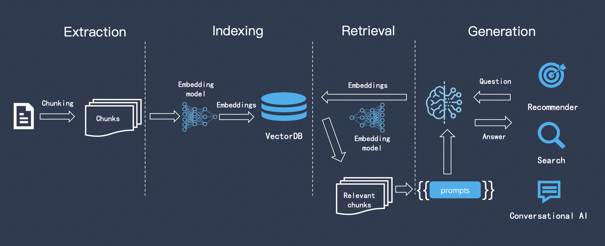
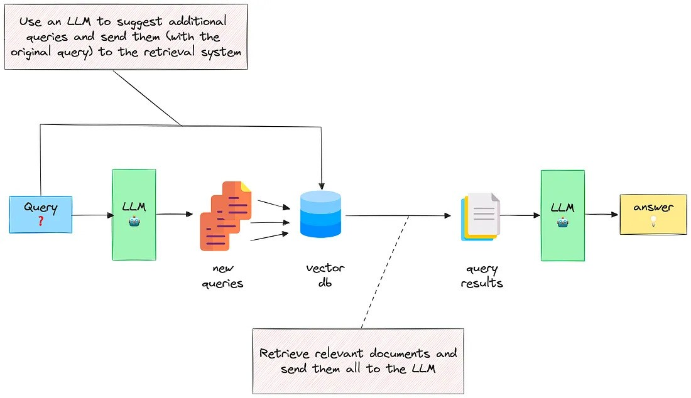
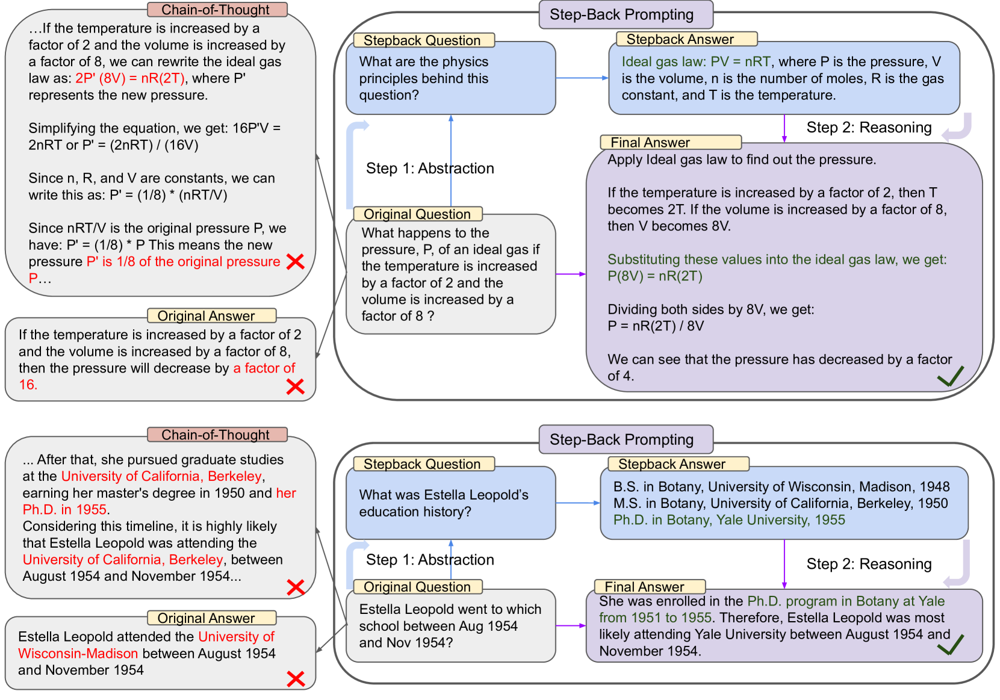

# RAG工作流与RAG优化
  - 1. 原生数据处理流
  - 2. 问答场景中RAG的流程
  - 3. RAG优化点
  - 4. RAG优化
<!-- more -->

## 1. 原生数据处理流

- 1.原生数据 Raw Data
- 2.数据加载 Data Loader
- 3.数据转换（数据解析/数据清洗）Data Transformer(Data Parsing/Data Cleaning)
- 4.数据分割 Data Split
  - 分割为多个块 Chunk
  - 分割大小的权衡
- 5.数据向量化 
  - 将 Chunk 表示为 Vector
  - Text Embedding Model
- 6.数据存储 Vector Store
  - 存储到向量数据库，建立索引 indexing
- 7.数据检索 Retriever

## 2. 问答场景中RAG的流程

- 1.用户发起问题 Query
- 2.将用户问题 Query 使用嵌入模型 Embedding Model 向量化
- 3.得到向量化过的用户问题 Query Vector
- 4.用向量化过的用户问题 Query Vector 检索向量数据库 Vector Database
  - 将向量数据库用作外部知识库
- 5.通过语义相似性检索出 Top k 的向量
- 6.将 Top K 的向量对应语义内容和用户问题 Query 作为 Prompt 调用 LLM
- 7.LLM 根据用户问题和检索到的数据信息给出问题的答案
- 8.用户得到答案

RAG的构建与问答步骤总体概括为三点
- Indexing
- Retrieval
- Generation
## 3. RAG优化点
### 3.1. 原生数据处理流优化点
- For step1: 原生数据
  - 知识图谱
    - 越来越多的工作把知识图谱 (Knowledge Graph) Introduce到RAG中，如:
      - KnowledGPT 用于推理阶段
      - SUGRE 用于微调阶段
- For step3：解析文档
  - 难点：不同文档类型(eg.pdf，html，ppt)的解析方式不同，文档不规则，且包含表格、公式、图片等形式难以解析；多模态数据：文本、图片、音频、视频；
  - 表格
    - 挑战：
      - 文本分割过程可能会分离表格，导致数据损坏
      - 将表格作为检索数据，会使语义相似性搜索过程复杂化
    - 解决：
      - 利用代码执行Text-2-SQL查询
      - 将表格转为描述性文字
  - 考虑解析的准确性
- For step4：文本分割
  - 难点：不同分割方式对后续任务有影响
  - 考虑chunk方式和参数的选择，以及尝试不同算法的成本
  - 块的大小：分割粒度太大，每个Chunk包含更多信息，可以一并返回更多Context; 分割粒度太小，可以更准确的检索更相关的Chunks
  - 关于选择块大小的研究，可以在LlamaIndex的NodeParser类中找到，该类提供了一些高级选项，比如定义自己的文本分割器、元数据、节点/块关系等。
- For step6: 向量索引
  - 不同向量数据库的选择
  - 不同索引的选择
  - 索引的优化
    - 添加元数据 Add metadata (time, type, title, subtitle, part of doc)

### 3.2. 问答场景中RAG的流程优化点
- For step2：Query向量化
  - Query在向量化时，是否需要进行处理（Query的清洗） -> Refined Query
  - 用户问的问题可能不完整，不准确，很复杂，不是连贯的一句话
- For step5：检索top k
  - 是否足够回复问题，是否很多是多余的 
  - 将Recall和Ranking分开处理 
  - Recall (召回，eg.从向量数据库召回50条相关数据) => Ranking (排序，eg.将召回的50条排序，取top3)
  - 是否需要排序，怎么排序
- For step7:得到LLM响应结果
  - 后处理 post processing 
  - In LlamaIndex there is a variety of available Postprocessors, filtering out results based on similarity score, keywords, metadata or reranking them with other models like an LLM,
sentence-transformer cross-encoder, Cohere reranking endpoint
or based on metadata like date recency — basically, all you could imagine.

## 4. RAG场景中的Prompt
- Instruction
- Context => Retrieval
- Input => Query
- History

## 5. 文本分割方式
- 目的
  - 能够检索到和Query更相关的内容  
- 方式
  - 根据句子来切分（split by sentences)
  - 按照字符数，采用固定窗口来切分（fixed window character count）
  - 按照字符数，采用滑动窗口来切分（moving window character count）
  - 递归方法：RecursiveCharacterTextSplitter（固定窗口+语义分割；LangChain采用了此；通常采用此）
  - 根据语义来分割（操作难度比较大；可能有些Chunk太长，有些又太短）

## 6. RAG优化 —— Query优化
- Rewrite
- Expand
### 6.1. Case1：Self-Querying Retrieval
- 将Query进行信息抽取：Self-Querying Retrieval
  - 将自然语言形式的Query通过LLM转化为结构化的Query
  - 将元数据与向量一起存储在向量数据库中
    - 属性：metadata （可以先通过属性进行过滤）
    - 非属性：embedding内容信息（再进行语义搜索）

> 图中只对产品的名称进行了语义嵌入，其他信息都是属性信息metadata

思路：
- 1.将Query通过LLM转化为结构化Query,拆出metadata和用于embedding的部分
- 2.用metadata在Vector Database中进行过滤
- 3.用embedding部分在Vector Database中进行向量搜索

langchain的Self-Querying Retrieval

https://python.langchain.com/docs/how_to/self_query/

### 6.2. Case2: MultiQueryRetriever
Query Expansion with multiple related questions

场景
- 多个产品的比较:从各个维度比较下小米、华为、三星折叠手机的功能，汇总为表格
- 不完整的问题：从多个角度改写几个子问题，询问LLM后再进行汇总

思路
- 1.将Query通过LLM拆分出多个SubQuery
- 2.多个SubQuery并行通过LLM获取各自的Output
- 3.使用一个LLM将多个Output进行信息汇集，得到最终结果

具体实现
- langchain的MultiQueryRetriever
  - https://python.langchain.com/docs/how_to/MultiQueryRetriever/
- Llamaindex的SubQuestionQueryEngine

### 6.3. Case3: 回退式提示词 Step-Back Prompting
思路
- 1.将Query通过LLM进行抽象生成一个“后退一步的问题”Stepback Question
- 2.采用LLM得到Stepback Question对应的答案Stepback Answer
- 3.将原本Query和Stepback Answer结合通过LLM得到结果

Take a Step Back: Evoking Reasoning via Abstraction in Large Language Models

https://arxiv.org/abs/2310.06117

### 6.4. Case4: Query和History的结合方式
2种结合方式
- Query检索Vector Database后结合History（ContextChatEngine）
- QUery结合History后检索Vector Database（CondensePlusContextMode）

### 6.5. Case5: 假设性答案  Hypothetical Answer / Hypothetical Document
Embeddings (HyDE)
使用生成的答案扩展查询 Query Expansion with a generated answer

思路
- 1.先通过LLM生成Query的一个答案Answer
- 2.将Query和Answer结合去检索Vector Database

论文：https://boston.lti.cs.cmu.edu/luyug/HyDE/HyDE.pdf

与Indexing优化的假设性问题是反向的逻辑

### 6.6. Case6: 查询重写
使用大语言模型重新构造初始查询以提高检索效果。LangChain和LlamaIndex都有实现，尽管有些不同，但我认为LlamaIndex的解决方案在这里更为强大。

### 6.7. Case7: 查询路由
查询路由是一种基于LLM的决策步骤

查询路由器还用于选择合适的索引或更广泛的数据存储位置来处理用户查询。

- 具体实现
  - llamaindex
    - https://docs.llamaindex.ai/en/stable/module_guides/querying/router/
  - langchain
    - https://python.langchain.com/docs/how_to/routing/
## 7. RAG优化 —— Retriever优化
### 7.1. Case1：句子窗口检索 Sentence Window Retrieval
理念：理念是检索较小的块以提高搜索质量，但同时增加周围的上下文以供LLM进行推理分析。  
尽可能获得更多的Context,而细粒度的Chunk更准确  
思想：检索出的Chunk邻近的Chunk也与Query相关，于是将该Chunk与邻近Chunk一并返回  
缺点：Context Size太大  

思路
- 1.将文档中每个句子作为一个Chunk，来提高搜索准确度
- 2.将检索出的关键句子前后扩展k个句子后返回

### 7.2. Case2: 父文档检索器 Parent-child chunks retrieval /from small to big
理念：理念是检索较小的块以提高搜索质量，但同时增加周围的上下文以供LLM进行推理分析。 
思想：与句子窗口检索器十分相似——它旨在搜索更精细的信息片段，然后在将这些上下文信息提供给LLM进行推理之前，先扩展上下文窗口

思路
- 1.将文档按粗粒度大小分割为Parent Chunks, 每个Parent Chunks再细分为Child Chunks, 将Child Chunks存入Vector Database
- 2.由Query查询Vector Database检索出相关的Child Chunks
- 3.返回Child Chunks所在的Parent Chunks(去重的结果)
 

想要更深入了解这个方法，可以查看LlamaIndex关于递归检索器和节点引用的教程

### 7.3. Case3: 混合检索 Fusion Retrieval
结合了关键词搜索和语义搜索，即密集搜索和稀疏搜索的结合。

## 8. RAG优化 —— Ranking优化
- 粗排与精排
  - 粗排：Vector Database的Indexing
  - 精排：得到Vector Database的结果后进行的排序

### 8.1. 逆序位融合算法 RRF (Reciprocal Rank Fusion)

这里的关键是正确结合具有不同相似度评分的检索结果。这个问题通常通过Reciprocal Rank Fusion算法解决，该算法会对检索结果进行重新排名，以产生最终输出。

在LangChain中，这一功能是通过Ensemble Retriever类实现的，它结合了您定义的一系列检索器，例如faiss向量索引和基于BM25的检索器，并使用逆序位融合算法（RRF）来进行结果的重新排名。在LlamaIndex中，实现这一功能的方式非常类似。

## 9. RAG优化 —— Indexing优化
### 9.1. 层次索引
创建两个索引——一个由摘要组成，另一个由文档块组成，然后分两步进行搜索：首先通过摘要过滤出相关文档，接着只在这个相关群体内进行搜索。

### 9.2. 假设性问题
让LLM为每个块生成一个假设性问题，并将这些问题以向量形式嵌入，用问题向量替代块向量。

由于查询和假设性问题之间的语义相似性更高，从而提高了搜索质量。

与Query优化的假设性答案是反向的逻辑

## 10. RAG优化 —— 其他优化
### Reference citations  参考引用
是否能准确地反向找到答案的来源处

## 11. GraphRAG
利用知识图谱捕捉实体间复杂关系，特别适用于处理关系丰富的数据

场景：假设我们正在开发一个智能问答系统，用于回答有关历史人物及其相互关系的问题。

问题：用户问：“亚历山大大帝的将军是谁，他们共同参与了哪些战役？”

传统RAG的挑战：
- 传统RAG可能在检索阶段找到关于亚历山大大帝及其将军的文档，但这些文档可能只包含部分信息，或者信息分散在不同的文档中。
- 它可能难以从检索到的文本中提取并整合所有相关信息，尤其是当这些信息需要跨越多个文档和上下文时。

GraphRAG的解决方案：
- 1.构建知识图谱：GraphRAG首先从历史文献和资料中提取实体（如亚历山大大帝、他的将军们）和关系（如指挥关系、参与战役），构建一个知识图谱。
- 2.图查询：用户的查询被转换为图查询，系统在知识图谱中搜索与亚历山大大帝相关的将军节点，以及与这些节点相连的战役节点。
- 3.提取子图：系统不仅检索到单独的节点，还检索到节点间的连接关系，形成一个子图，这个子图包含了所有相关的将军和战役信息。
- 4.生成回答：GraphRAG利用这个子图作为上下文，指导语言模型生成一个详细的回答，这个回答不仅包括将军的名字，还包括他们共同参与的战役。

优缺点
- 优：能够捕捉和表示实体间的复杂关系，整合和检索分散在不同文档中的信息。
- 缺：构建和维护知识图谱的高成本以及对复杂图结构管理的技术挑战，在处理抽象概念时也存在困难。

## 12. HybirdRAG
Paper Name: HybridRAG: Integrating Knowledge Graphs and Vector Retrieval Augmented Generation for Efficient Information Extraction

Paper: https://arxiv.org/pdf/2408.04948v1

- 1.信息检索：从外部文档中检索与查询相关的信息，使用向量数据库进行广泛、基于相似性的检索（VectorRAG部分），同时从知识图谱中检索结构化、关系丰富的上下文数据（GraphRAG部分）。
- 2.上下文整合：将VectorRAG提供的广泛信息检索结果与GraphRAG提供的精确关系数据相结合，形成统一的上下文。
- 3.生成回答：利用大型语言模型（LLM）根据整合后的上下文生成最终的回答。

## 13. References
- [Advanced RAG Techniques: an Illustrated Overview](https://pub.towardsai.net/advanced-rag-techniques-an-illustrated-overview-04d193d8fec6) 

