# 向量数据库与相似性搜索
  - 向量嵌入 Vector Embeddings
  - 向量之间相似度（距离）计算
  - 传统推荐系统模块
  - 向量数据库
  - 索引算法：KNN，ANN，NSW，HNSW，PQ
  - 稀疏搜索·密集搜索·混合搜索
<!-- more -->

## 1. 向量嵌入 Vector Embeddings
- 向量嵌入捕捉了底层数据的含义，可以把向量嵌入看作是数据的机器可理解的格式
- Embedding模型
  - 开源库sentence-transformers
    - 可通过 Hugging Face 模型库或直接从源代码仓库获取
    - 提供了维度在 384、512 和 768 范围内的嵌入模型
  - 付费API服务
    - OpenAI 嵌入 API
      - 维度较高，具有更高的质量，达到几千维
    - Cohere 嵌入 API
      - Cohere 以拥有高质量的多语言嵌入模型而闻名，其性能优于开源变体
- Embeddings评测排行榜 ：MTEB排行榜：https://huggingface.co/spaces/mteb/leaderboard
  
## 2. 向量之间相似度（距离）计算
相似度越大，距离越小，两者的大小是相反的。

4种距离指标 

点积和余弦距离这两个在NLP领域广泛使用

- 欧几里得距离 Euclidean Distance(L2)
  - 计算最短路径
  - 较小的值是更好的匹配

- 曼哈顿距离 Manhattan Distance(L1)
  - 每次只能以一个方向轴移动
  - 较小的值是更好的匹配

- 点积 Dot Product
  - 一个向量在另一个向量上的投影
  - 产生一个非规范化的值，具有任意大小
  - 较大的值是更好的匹配，负值通常意味着实际上相距甚远

- 余弦距离 Cosine Distance
  - 计算夹角
  - 产生一个规范化的值（介于 -1 和 1 之间）
  - 较小的值是更好的匹配

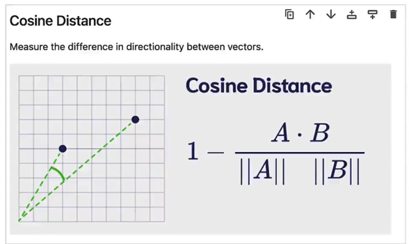

## 3. 传统推荐系统模块
### 3.1. 分类
- 基于内容的推荐
  - 基于之前喜欢的内容
  - 优：推荐的都是明确用户感兴趣的
  - 缺：不会推荐之前没看过的类型
- 基于协同过滤的推荐
  - 推荐朋友喜欢的内容
  - 优：会推荐之前没有看过的类型
  - 缺：可能推荐的内容用户不感兴趣

### 3.2. 输入
  - 1.行为（eg.看过的文章，点击的文章）
  - 2.用户的基本信息
  - 3.文章列表list
### 3.3. 目标
  - 推荐新的内容
### 3.4. 思路
  - 通过用户的行为和基本信息建立用户画像profile
    - 用户向量（和标签类似，只不过这个后面都是向量，那个是内容）
    - 标签（喜欢的话题，不喜欢的话题，偏好等）
      - 用户看过的文章标签（已提供的，学出来的）的集合
  - 通过标签tags从文章库中召回（Recall）候选集（Candidates）
    - 可以设计多次召回
  - 粗排+精排（Rank）
    - 可以设计多次排序
    - 考虑
      - 用户兴趣变化
      - 文章的来源和时效性
      - 用户更细致的兴趣爱好挖掘
  - top 10 文章

### 3.5. 传统推荐系统流程

文章->用户profile->Recall->Candidates->Rank->Top10
- 1.文章->用户profile
- 2.用户profile->Recall
- 3.Recall->Candidates
- 4.Candidates->Rank
- 5.Rank->Top10

### 3.6. 结合LLM的推荐系统

思考，哪些流程可以加入LLM：
- Step1
  - 采用LLM抽取Tags
- Step4
  - 采用LLM进行排序

## 4. 向量数据库
### 4.1. 向量数据库：解决效率问题

向量数据库在生成式人工智能爆发前就存在了，长期以来一直是语义搜索应用程序的一部分，这些应用程序根据单词或短语的含义的相似性搜索而不是精确匹配关键词的搜索。

向量数据库的主要目标是提供一种快速高效的方法来存储和进行语义查询数据
- 原先：和每个向量进行相似度计算
- 现在：近似搜索 approximate search
### 4.2. 向量数据库产品
- 开源 & 闭源
  - 在列出的所有选项中，只有一个是完全封闭源代码：Pinecone。Zilliz 也是一个完全封闭的商业解决方案，但它完全是建立在 Milvus 之上的，并且可以看作是 Milvus 的母公司。
  
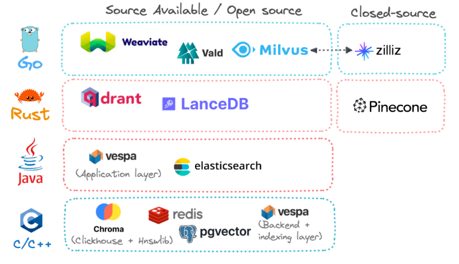

- 发展历程
  - Vespa 是最早在主流的基于 BM25 关键字搜索算法旁边加入向量相似性搜索的厂商之一。
  - 像 Elasticsearch、Redis 和 PostgreSQL 这样的老牌厂商在2022年及之后才开始提供向量搜索，比人们原本想象的要晚得多。

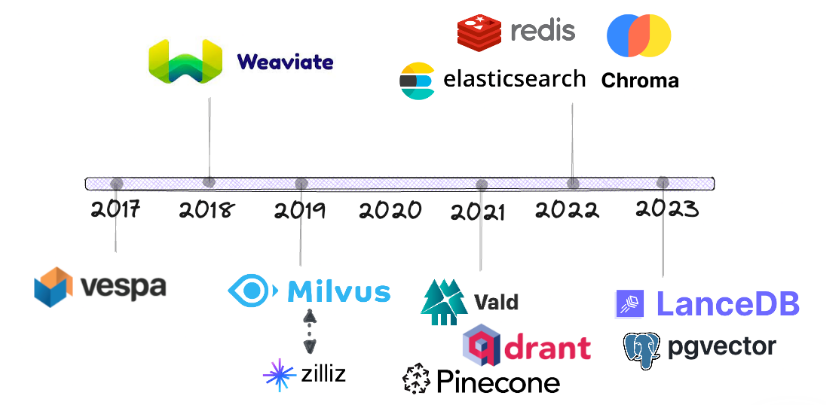

- 托管方式
  - 自托管（本地部署）
    - 遵循客户端-服务器架构
  - 托管（云原生）
    - 遵循客户端-服务器架构
  - 近期的选择：嵌入模式
    - 数据库本身与应用程序代码紧密耦合，以服务器无形式运行
    - 目前只有 Chroma 和 LanceDB 可用作嵌入式数据库

### 4.3. 向量数据库比较
- 权衡选择
  - 混合搜索还是关键词搜索？关键词+向量搜索的混合可以产生最佳结果，每个向量数据库供应商都意识到了这一点，并提供了自己定制的混合搜索解决方案。
  - 部署在本地还是云原生？许多供应商将“云原生”作为卖点，好像基础设施是全球最大的痛点，但本地部署在长期内可能更经济实惠，因此更加有效。
  - 开源还是完全托管？大多数供应商都是在源代码可获得或开源代码基础上构建的，以展示其基本方法，然后通过完全托管的SaaS来实现部署和基础设施的部分。虽然仍然有可能自行托管很多解决方案，但这需要额外的人力和内部技能要求。

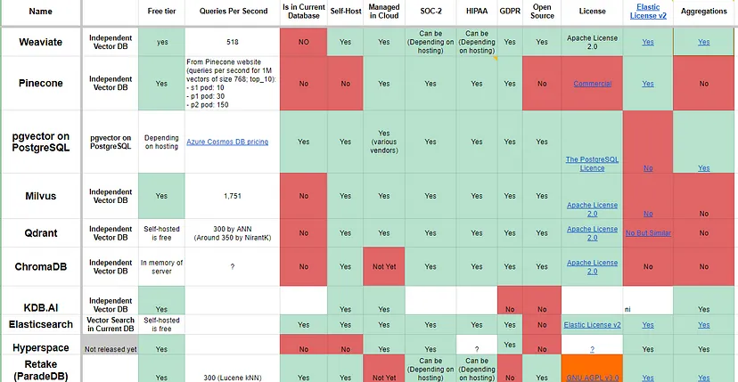

### 4.4. 索引算法
数据通过索引存储在向量数据库中，这指的是创建称为索引的数据结构，以便通过快速缩小搜索空间来进行向量的高效查找。

就像在大多数情况下一样，选择一个向量索引涉及精度（准确率/召回率）与速度/吞吐量之间的权衡。

- 关键词搜索/稀疏搜索
  - BM25 = IDF 逆文档频次
  - IVF（Inverted File，反向文件索引） 搜索引擎广泛使用
- 向量搜索/密集搜索
  - Flat = KNN 最近邻 = 蛮力搜索 = 和每个向量进行相似度计算
  - 近似KNN = 将空间分成若干块，先查询距离每个质心的距离，再从该质心所在空间查找
  - ANN 近似最近邻
  - NSW 可导航小世界
  - HNSW（分层可导航小世界）
  - PQ 乘积量化 Product Quantization

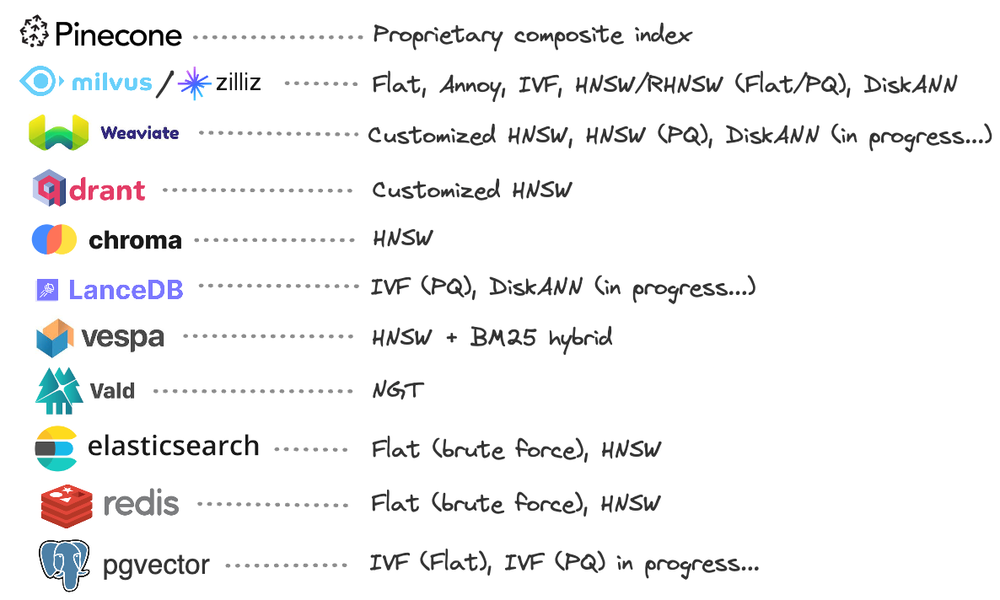

### 4.5. 索引评价标准
评价一个索引的好坏总是依赖于具体的数据模型的，总体来说包含如下几点：

- 查询时间。查询的速度是非常关键的，在大模型中尤为重视。
- 查询质量。ANN查询不会总是返回最精准的结果，但查询质量也不能偏差过大，而查询质量也有很多指标，其中包括最常用的召回率。
- 内存消耗。查询索引所消耗的内存，在内存上查找明显比在磁盘上查找更快。
- 训练时间。有些查询方法需要训练才能达到较好的状态。
- 写入时间。写入向量时对索引的影响，以及包含所有维护。

## 5. 搜索
### 5.1. 稀疏搜索(关键词搜索) vs 密集搜索(向量搜索/语义搜索)
- 稀疏搜索（关键词搜索）Sparse search
  - 关键词搜索，文本匹配
- 密集搜索（向量搜索/语义搜索）Dense Search
  - 向量相似性搜索
  - 在向量空间中搜索最接近的对象，这就是所谓的语义搜索或向量搜索
  - eg."Baby dogs" <=> "Here is content on puppies!"
  - 局限性：   
    - 会受采用的Embedding模型的影响，向量相似只是在训练的数据集中数据的表现，如果搜索的内容与训练Embedding模型的数据集相差甚远，那搜索结果会很差，因为搜索的内容分布与Embedding的数据分布不一样
    - 向量真的能代表语义吗，可以看作是哈希，并不是真正的理解，很容易捕风捉影
    - 向量数据量大的话，搜索准确度会大幅下降（参考https://mp.weixin.qq.com/s/DH4-QCK1U8BYGlAblQLTLw）
    - 像序列数字，表格数据等没有语义信息的，就很不适合用此来搜索 
- 混合搜索 Hybird Search
  - 融合稀疏搜索和密集搜索的结果返回的排名结果

### 5.2. 稀疏搜索

词袋 Bag of Words

最简单的关键词匹配方法是使用词袋--计算一个词在查询和数据向量中出现的次数，然后返回匹配词频率最高的对象。

在实际上，可能只会捕捉到可用单词的百分之一，所以数据中将会有很多零。

### 5.3. 混合搜索
通过设置相应的权重比例，来将两种搜索结果合为一个

### 5.4. 多语言搜索
在多语言搜索情况下，相同含义但不同语言的文本，将生成非常相似的（如果不是相同的话）嵌入

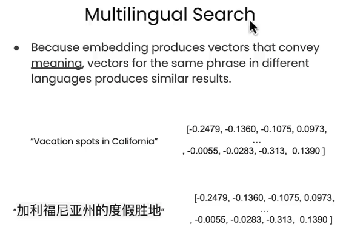

## 6. 关键词匹配算法：BM25 （Best Matching 25, 最佳匹配25）
属于稀疏搜索（关键词搜索）

当涉及跨多个关键词搜索时，它实际上表现得非常好。

思想：统计传入的短语中单词的数量，然后出现更频繁的单词在匹配发生时被加权为不太重要，但是那些更稀有的单词得分就会高得多。

## 7. 倒排索引/倒排文件索引/反向文件索引（Inverted Index / Inverted File Index，IVF）- 快速搜索文本
属于稀疏搜索（关键词搜索）

谷歌、百度搜索引擎都有用到，非常适合文本的检索

正向索引：DocId->Value  
反向索引：Value->DocId

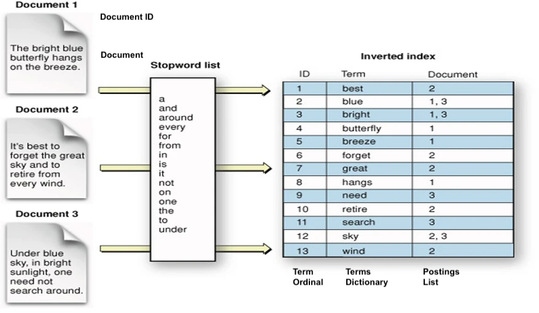

- 1.将文档中停用词表（功能词，没有什么实际含义，几乎每个文档中都会用到的词）外的其他词抽取出来
- 2.每个词和其所在的多个文档ID建立映射关系
- 3.查询关键词，通过关键词就可召回（Recall）到该词所在的所有文档
- 4.查询一句话，一句话有多个关键词，根据每个关键词召回对应文档，再取交集，排序（ranking）后返回top k的文档作为结果
  
## 8. KNN (最近邻算法, KNN搜索，蛮力搜索) 
别名
- a flat index （Flat索引）
- a brute force 蛮力搜索：和每个向量进行相似度计算

在经典机器学习中，这被称为K-最近邻算法（KNN，K Nearest Neighbours）

将查询向量与数据库中的每个向量进行比较

- 1.给定一个Query，找到所有向量和Query向量之间的距离
- 2.对所有距离进行排序
- 3.最终返回距离最近的前K个匹配对象

问题在于蛮力搜索伴随着巨大的计算成本，总体查询时间随着存储的对象数量的增加而增加

拥有的向量越多，查询需要的时间就越长，而在实际应用场景中，将处理数千万甚至数亿个对象

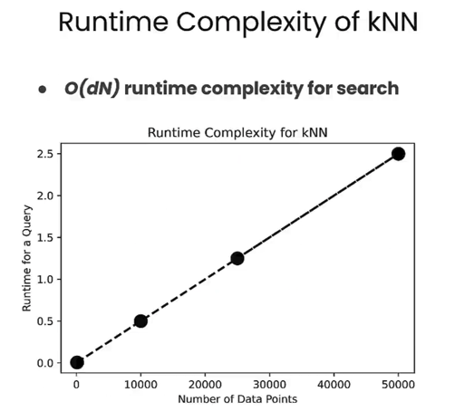

- 优：精确  
- 缺：计算量大，耗时长，时间复杂度O(n)

## 9. 近似KNN-把空间分成若干个模块
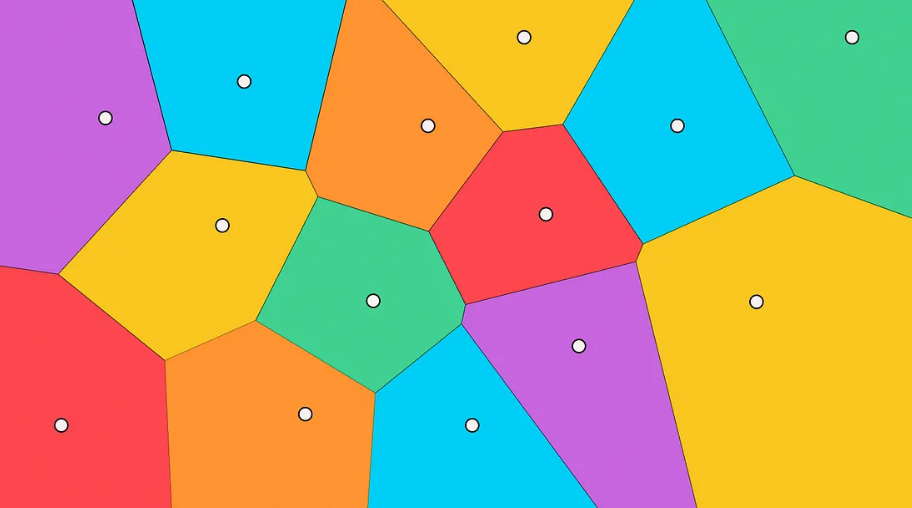

- 1.使用聚类算法（如K-means）初始k个聚类中心(也叫质心 centroids)
- 2.计算每个样本到质心的距离并将样本分配到最近的质心，由此组成聚类
- 3.以这些质心和聚类所属的样本划分空间，此时我们就得到了沃罗诺伊图（Voronoi Diagram)
  - Voronoi图的主要性质是，从一个质心到其区域中任何一点的距离小于从该点到另一个质心的距离。
- 4.给定一个Query，查询Query距离每个质心的距离，找到Query所在的空间
  - 当给定一个新对象时，将计算到Voronoi分区的所有质心的距离。然后选择距离最小的质心，然后将包含在该分区中的向量作为候选。
- 5.Query再与质心所在空间中所有节点计算距离
  - 通过计算到候选者的距离并选择最接近的前k个，返回最终答案

设有k个质心，那每个空间节点数平均为n/k，则时间复杂度为O(k + n/k)

### 9.1. 边界问题

在下图中，我们可以看到这样一种情况：实际最近的邻居位于红色区域，但我们只从绿色区域中选择候选人。这种情况被称为边缘问题。

边界问题本质是因为：

voronio图只能保证某节点到其区域质心的距离小于到其他质心的距离，但不保证某节点到区域内其他节点的距离小于到其他区域节点的距离

如何解决：扩大搜索范围

这种情况通常发生在查询对象位于与另一个区域的边界附近时。为了减少这种情况下的错误数量，我们可以增加搜索范围，并根据距离对象最近的前m个质心选择几个区域来搜索候选者。

扩大搜索范围的时间复杂度为O(k + 3 * n/k)

搜索的区域越多，结果就越准确，计算它们所需的时间也就越多。需要在准确性和耗时之间权衡选择。

## 10. ANN（Approximate Nearest Neighbours，近似最近邻算法）

并不总能找到最佳匹配，但是找到了近似的最近邻匹配，这仍然是一个相当不错的结果，但不一定是完美的结果

牺牲一些准确性（并不总是返回真正的最近邻），但可以通过使用 ANN 算法获得大幅的性能提升

- NSW
- HNSW

## 11. NSW（Navigable Small World，可导航小世界）
### 11.1. 图的构建（one by one）
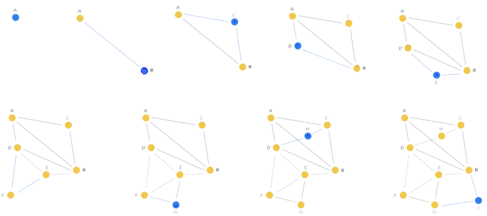

- m=2 邻居有几个，也就是和几个节点相连

- 高速公路思想
  - 刚开始构建的连线可能很长，因为是一个一个连接的，没有更好更近的选择，并不是和最近的相连，越到后面，连的越密，连线可能越短越近
  - 这样连线有个好处，就是高速公路思想，刚开始的距离远的连线就像高速公路一样，有些路可以不用走很多小路就可走很远，经历中间节点少，提高了搜索效率

- 构造复杂度：O(n^2)
  - 第i个节点是与之前i-1个节点做比较
### 11.2. 搜索
- 1.从一个随即入口节点开始，沿着最近的邻居向Query移动
- 2.保留最大的k个点=>priority queue

- 查询复杂度：O(nlogn)
- 问题：找不到下一步？早停
  - 早停。当前节点的两个邻居离查询更远。因此，算法将当前节点作为响应返回，尽管存在比查询更接近的节点。
  - 改善：使用多个入口点可以提高搜索精度。

## 12. HNSW (Hierarchical Navigable Small World，分层可导航小世界)
- HNSW算法：NSW 结合 Skip List 思想
  - HNSW是NSW基于跳表Skip List的优化
  - 对于 NSW 中所提的高速公路思想的话，是明确区分了的高速公路，可以想象成每层分别是：飞机、火车、汽车、自行车、步行
- 它推动了世界上最强大的向量数据库
  - 大多数向量数据库都用到了此

### 12.1. 构建-分层结构
- 分为几层，每层与NSW的构建方式相似，节点的数量从上到下依次增多，最底层包含了所有节点。
- 如何将节点分层？
  - 为每个节点生成一个随机数，作为分配到的该节点的最大层Max Layer，那么该节点会分配到Max Layer和所有下面的层。例如，随机数是零，那么该节点只存在于底层，即零层。如果随机数是2，那么该节点将存在于零层、一层和二层，依此类推。
- 构建复杂度：O(n·logn)

### 12.2. 查询
- 查询过程
  - 1.在顶层，从一个随即入口节点开始，沿着最近的邻居移动
  - 2.移动到该层中最近的节点
  - 3.进入下一层，沿着最近的邻居移动，找该层最近的节点，直到最底层

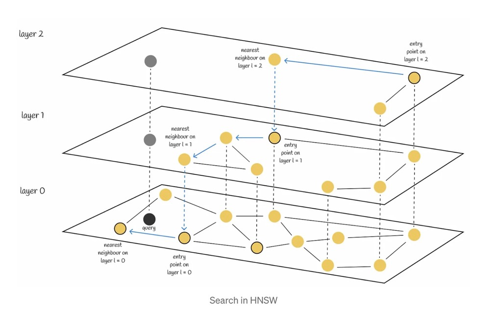

- 查询复杂度：O(logn)
  - 查询时间呈对数增长，随着数据量的增加，速度并不会随时间而受到太大的影响

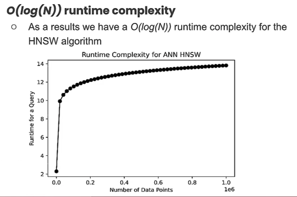

### 12.3. 进一步优化：HNSW + 近似KNN
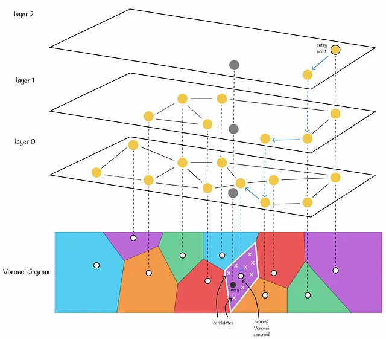

## 13. 乘积量化 Product Quantization (PQ)

提高search效率同时，压缩数据，减少内存使用

核心：
- fast
  - 时间复杂度O(向量个数 * (subspace/dimension))
- compression
  - 数据压缩：假设向量数据库中每个向量为1024维，分为4个256维子向量，那么向量数据库中每个向量从1024个float转换为了4个int，大大压缩了数据所需的存储空间。

乘积量化（Product Quantization）旨在减少内存使用，还可以提升查询速度（因为计算量减少了）。PQ是一种有损压缩方法，这会导致向量检索的准确性降低，不过这在ANN需求中是可行的。

### 13.1. 构建

步骤描述：
- 1.subvectors–将原始的高维向量切分成n个低维子向量
  - eg. 假设向量数据库中每个向量为1024维，分为4个256维子向量
- 2.codebook–将n个各自所有的子向量通过k-means算法计算各自的voronoi图（或者其他算法），计算出来有n个不同的voronoi图，这些voronoi图就是codebook（这里假设每个voronoi图都有k个质心）
  - 计算出4个voronoi图，每个子向量对应一个
- 3.clustering–把n个子向量放进各自已聚类完成的voronoi图中计算出最近质心centroid
  - 每个voronoi图中分为k个子空间，每个有一个质心
- 4.quantized vectors–将这n个最近质心当做新的向量-》量化后向量
  - 每个子向量有邻近的质心
- 5.reproduction values–以n个子空间的各自最近质心的编号为新值，合起来称为PQ code
  - 每个子向量将最近质心的编号作为新值，每个向量就有4个新值
  - 那么向量数据库中每个向量被表示为4个值，也就是PQ code

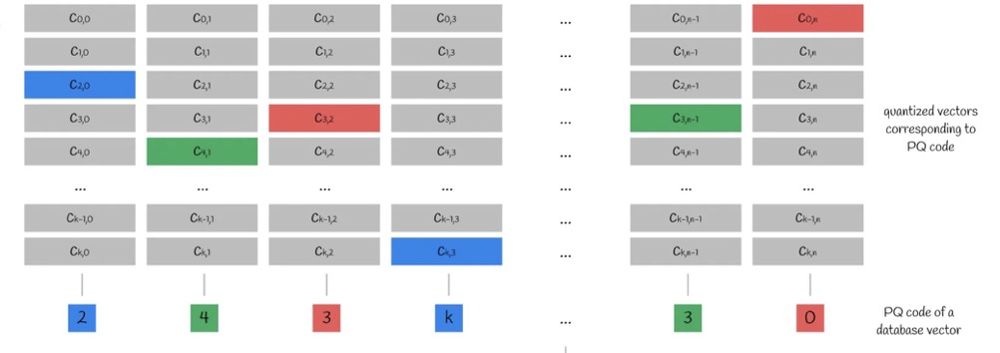

根据n个子向量和每个子空间中的k个质心，我们可以得到一个n*k的质心矩阵。取每个子向量的最近质心的编号，就是PQ code。

### 13.2. 查询
通过PQ code找到质心，在质心所在的子空间中找KNN，查询向量query与已存在向量y的距离，通过向量query与y的质心来近似替代。

查询步骤：
  - 1.查询向量分成为多个子向量
  - 2.计算查询向量子向量和质心矩阵的距离（查询向量子向量到每个质心的距离），得到距离矩阵
  - 3.查询向量和向量数据库中每个向量的距离，通过向量数据库中向量的PQ code，找到对应的质心，进而从距离矩阵中找到每个查询子向量对应的距离，将每个子向量对应距离平方后相加再开根号，计算出查询向量与向量数据库中任意一个向量的近似距离

### 13.3. 进一步优化
在PQ基础上，再结合近似KNN，做到不必和向量数据库中每个向量都进行计算距离

## 14. References
[大模型中间件 向量数据库原理和选择](https://hub.baai.ac.cn/view/29516)

https://www.modb.pro/db/1817186648364507136

https://www.xiaozhuai.com/similarity-search-part-4-hierarchical-navigable-small-world-hnsw.html