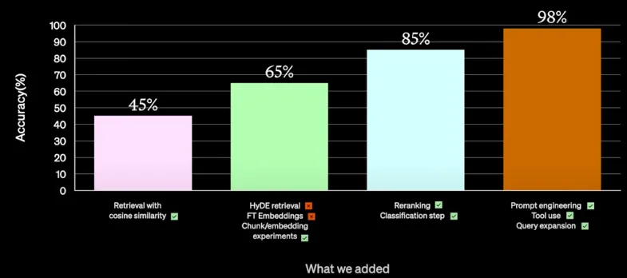

# 优化LLM的最佳实践（提示工程、RAG和微调）
- 优化策略
- 典型优化流程
- 优化方法比较
- OpenAI RAG调优案例
<!-- more -->

## 1. 优化LLM的挑战
- 从噪声（无关信息）中提取信号（有意义的信息）并不容易
- 性能表现可能是抽象的，难以衡量
- 不清楚何时使用哪种方法来优化LLM

## 2. 优化策略
优化LLM可以被视为一个二维问题

- 优先调优Prompt
- 知识更新优化（模型需要知道什么？）=> RAG
- LLM行为优化（模型需要如何行动？）=> Fine-Tuning

## 3. 典型的优化流程

1. 从提示工程 Prompt Engineering 开始
2. 获取适当的评估指标
3. 设置评估指标后，确定 Baseline
4. 一旦 Baseline 确定，增加更多Few-Shot示例
   - 这是为了引导模型，了解用户希望模型如何行动
5. 如果添加Few-Shot示例提升了性能，那么遵循RAG过程
6. 完成RAG后，如果模型获取了正确的上下文，但输出格式不符合需求，则采用微调方法
7. 可能存在检索效果不理想的情况，此时可以返回到RAG进行进一步优化
   - 例如，在RAG中，考虑添加假设文档嵌入（HyDE）检索和事实核查步骤
   - 然后使用这些新示例通过RAG作为上下文再次微调模型

## 4. 优化方法比较
||Prompt Engineering|RAG|Fine-tuning|
|--|--|--|--|
|Reducing token usage|&#10005;|&#10005;|&#10003;|
|Introducing new information|&#10005;|&#10003;|&#10003;|
|Testing and learning early|&#10003;|&#10005;|&#10005;|
|Reducing hallucinations|&#10003;|&#10003;|&#10003;|
|Improving efficiency|&#10005;|&#10005;|&#10003;|

## 5. 通过提示工程进行优化
- 编写清晰的指令
- 将复杂任务拆分为更简单的子任务
- 给 LLM 时间“思考”
- 对于每次优化，进行系统性地测试
- 提供参考样例
- 使用外部工具

## 6. 使用RAG好处
- 可以减少幻觉
- 不必重新训练或微调LLM
- 解决知识密集型任务，引用已有资源

## 7. 通过微调进行优化
微调是通过在更小的特定领域数据集上继续训练模型，以优化模型以适应特定任务的过程。

为什么进行微调？
- 降低Token使用量
  - 减少上下文窗口的限制，并使模型接触到更多数据
- 提高模型效率
  - 观察到，一旦模型经过微调，就不需要复杂的提示技术来达到所需的性能水平
  - 无需提供复杂的指令集、明确的模式、或上下文示例
  - 每次请求所需的提示tokens更少，因此互动成本更低，响应更快
  - 知识蒸馏(Knowledge Distillation)：通过微调从GPT-4 Turbo等大型模型中提取知识到更小的模型（如GPT-3.5），从而降低成本和延迟

## 8. 微调中的最佳实践
- 1.从提示工程 (Prompt Engineering) 和少样本学习（FSL）开始
  - 这些是低成本技术，可用于快速迭代和验证用例
  - 这些可以帮助理解LLM的工作方式及其在特定问题上的表现。
- 2.建立基线
  - 确保有一个性能基线，以便与微调后的模型进行比较
  - 了解模型的失败案例
  - 明确通过微调要实现的确切目标
- 3.从小规模开始，关注质量
  - 构建数据集是困难的，因此可以从小规模开始，精心投资
  - 在较小的数据集上微调模型，观察输出，识别模型表现欠佳的领域，然后通过新数据进行针对性改进
  - 优化高质量训练示例的数量。
- 4.制定合适的评估策略
  - 让专家人工评估输出并按某种标准进行打分
  - 从不同模型生成输出，让模型为这些输出打分。例如，使用GPT-4为某些开源模型的输出打分。
  - 训练模型，评估后将其部署到生产环境。在生产环境中收集样本，使用这些样本构建新的数据集，进行下采样、精炼，然后在该数据集上再次微调。

## 9. 微调 + RAG 的最佳实践
- 1.微调模型以理解复杂的指令
  - 这将消除在示例时间为模型提供复杂的少样本示例的需求
  - 它还将最小化提示工程 (Prompt Engineering) tokens的使用，从而为检索的上下文留出更多空间。
- 2.然后使用RAG注入需要最大化的相关知识，但不要过度填充上下文

## 10. OpenAI RAG 调优案例
某OpenAI客户有一个包含两个知识库和一个LLM的管道。任务是获取用户问题，决定使用哪个知识库，进行查询，并使用一个知识库来回答问题。

### 10.1. 未成功的实验

- 使用余弦相似度 (Cosine Similarity) 检索（准确率45%）
- 试用了HyDE检索，但未通过生产环境测试
- 微调嵌入在准确性方面表现不错，但速度慢且成本高，因此因非功能原因被弃用

### 10.2. 成功的实验

- 分块/嵌入 (Chunk/Embedding) 实验
  - 尝试不同大小的信息分块，并嵌入不同内容块，提高准确率20%，达到65%
- 重排 (Reranking)
  - 应用了跨编码器 (Cross-Encoder) 进行重排或基于规则的排序
  - rerank选择
    - cohere -> rerank (效果好) https://docs.cohere.com/reference/rerank
    - bje reranker （开源）https://huggingface.co/collections/BAAI/bge-66797a74476eb1f085c7446d
    - jina
  - Cross Encoder：https://www.cnblogs.com/huggingface/p/18010292
- 分类步骤
  - 分类问题所属的两个领域（两个知识库），并在提示中提供额外元数据以帮助进一步决策
- 为达到98%的准确率，以下试验成功
  - 进一步的提示工程优化了提示
  - 分析错误答案的类别，并引入了一些工具，如访问SQL数据库以获取答案
  - 查询扩展：如果在一个提示中问了三个问题，则将其解析为查询列表，进行并行执行，汇总结果生成一个回答
  - 此处未使用微调，表明问题与上下文相关。
  - 在与上下文相关的设置中，微调可能会浪费计算资源。

## 11. OpenAI 微调 + RAG 调优案例

用例描述：给定一个自然语言问题和一个数据库模式，模型是否能生成语义正确的SQL查询？

首先采用了GPT 3.5 Turbo模型

- 1.首先通过提示工程从基线模型提升性能（69%）。添加了一些少样本示例，带来了一定的改进，进而引入RAG
- 2.仅使用RAG问题，性能提升了3%
- 3.然后使用答案的假设文档嵌入，进一步提高了5%
  - 此处使用假设性问题进行搜索，而不是实际输入问题，带来了提升
- 4.将示例数量从n=3增加到n=5，进一步提高到80%
- 5.目标是达到84%
- 6.进行了微调（由ScaleAI完成）
  - ScaleAI通过简化模式的简单提示工程微调了GPT-4，达到了接近82%
  - 他们将RAG与微调结合使用，动态地将一些示例注入上下文窗口，达到了83.5%的准确率。
- 7.因此，简单的微调 + RAG结合简单的提示工程将模型准确率提升至83.5%

## 12. 参考内容
- [OpenAI:A Survey of Techniques for Maximizing LLM Performance](https://www.youtube.com/watch?v=ahnGLM-RC1Y)  
- [Optimizing LLMs: Best Practices](https://medium.com/@luvverma2011/optimizing-llms-best-practices-prompt-engineering-rag-and-fine-tuning-8def58af8dcc)