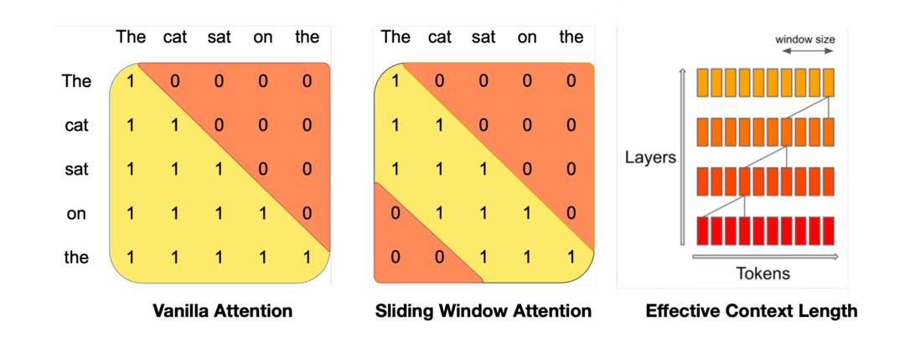

# 微调
  - 模型微调流程
  - LoRA
  - Llama-factory
  - 基础开源模型
  - MoE 混合专家模型
  - RLHF 基于人类反馈的强化学习
<!-- more -->

## 1. 微调 Fine-tuning 
- 目标：放大所需能力同时，保持其他能力不变
  - 更新知识：引入新的特定领域信息
  - 定制行为：调整模型的语气、个性或反应风格
  - 针对任务进行优化：提高特定用例的准确性和相关性
- 价值：增强了相应的能力
- 问题：遗忘问题 catastrophic forgetting（有可能在其他能力上会有所下降）
  - 解决思路
    - 思路1：不需要解决
      - 其他能力不太看重，下降了也不会有太大影响
    - 思路2：使用更大的模型，其被影响的几率是比较小的，因为泛化能力更强
    - 思路3：多任务微调 
      - 结合其他能力的数据
      - 缺什么能力，补什么能力

### 1.1. 指令微调/有监督微调
- FT (Fine-tuning, 微调)
- SFT（Supervised Fine-tuning, 有监督微调）也被称为指令微调（Instruction Fine-tuning）
  - 通过为模型提供特定任务的明确指令或示例来进行微调，通常保持预训练模型的知识
  - 优点: 专注于特定任务的微调，适应性强，同时保留了模型的基础能力。
  - 缺点: 可能无法充分挖掘模型在某些高度复杂任务中的潜力。

### 1.2. 多任务微调 Multi-tasking FT
多个能力都加强, 把数据都合一起进行训练


## 2. 模型微调流程
- 明确问题
- 尝试Prompt Engineering是否能解决问题
  - 能用Few-shot尽量用此解决问题，解决不了再考虑用Fine-tune，Fine-tune的模型会在微调的能力上有所提升，但有可能在其他能力上会有所下降。
  - Few-shot
    - 问题
      - 1.token量增多，context 几乎占满
      - 2.加入了多个few-shot, 效果仍然不好
- 不行的话，采用微调
- 选择多个开源模型进行尝试
- 分析与预期指标的Gap，缺什么能力
- 选择模型
  - Fine-tuned Model
- 收集数据
- 清洗数据
- 指令微调 SFT
- 对齐
- Evaluate
  - A/B Test
- 压缩/量化 & 上线
- 基于人类反馈的强化学习（RLHF， Reinforcement Learning from Human Feedback）

## 3. 数据构造
数据格式跟传统AI不一样，是问答对形式（input, output），其中input部分是Prompt形式 （因为用户使用的时候就是用prompt的形式） 
- Input: Prompt=Instruction+input
- Output: output

json格式 
```
{
    "instruction": "xxx",
    "input": "", // 有时有值，有时没有值
    "output": "xxx"
}
```
不需要太多的数据，例如1000条也够了(几千条-几十万条之间)，因为是在已有模型上添加功能，不是从零训练

Fine-tune过程--划分训练集、验证集和测试集
- 训练集：进行训练的数据
- 验证集：用于边训练边看效果（月考模考）
- 测试集：训练完后最后测试（高考）

## 4. 微调策略分类
### 4.1. 基于微调范围：全量微调和部分参数微调
- 全量微调 Full Fine-tuning
  - 全部参数都会改变，影响很大，会影响模型之前的能力，不太建议
  - 优：高度适应特定任务，能够大幅度提高模型的性能
  - 缺：需要大量计算资源和时间，同时可能导致模型在新任务上泛化能力下降
- 部分参数微调 Partial Fine-tuning / Freeze Fine-tuning
  - 仅微调模型的部分参数（如后期层或特定层），而不是全部参数
  - 优：计算资源需求较低，过拟合风险较小
  - 缺：对复杂任务的适应能力可能不如全量微调
  - 细分
    - PEFT 参数高效微调 （Parameter-Efficient Fine-Tuning， PEFT）
      - 只微调少量或者额外的参数，降低计算、存储成本
      - 常见方法
        - 适应性微调 Adapter Fine-tuning
          - 通过在预训练模型的特定层之间插入小型适应性模块（adapter），仅对这些模块进行微调，而保持主模型参数不变
          - 优：高效灵活，减少了微调的计算成本和内存占用，适用于多个任务
        - LoRA（Low-Rank Adaptation）
          - 属于适应性微调，微调部分参数，通过低秩矩阵来微调模型参数，这种方法只微调一个较小的参数子集，通常是模型权重矩阵的低秩近似部分。
          - 最常用，推荐，微调的结果不太影响原有的模型能力
        - BitFit
          - 只微调偏置参数
    - 选择不同层layer来微调
      - 不建议 
      - 细分
        - 微调后层（Fine-Tuning Last Layers）
          - 仅微调模型的最后几层，这种方法适用于希望在保持原模型能力的基础上增加一些特定任务的适应性。
          - 优：减少了微调的复杂性和资源需求，同时仍然能够提升模型在特定任务上的表现
          - 缺：微调深度有限，可能无法充分适应任务需求

#### 4.1.1. GPU 显存 计算

7B 
- 70亿 * 4 byte
  - 70亿参数
  - 每个参数 4 byte
  - 计算出总共多少GB，记为 a GB

全量微调 （需要5a GB）
- 模型本身 *1
- Gradient *1 
- Optimizer States * 2
- 变量 *1

LoRA (略比aGB大，训练的参数都不到原参数量的1%)  

Trainable: 20971520 | total: 7262703616 | Percentage: 0.2888%
- 模型本身 *1
- Gradient *1 * 1% 
- Optimizer States * 2 * 1%
### 4.2. 基于任务：SFT，RLHF，RLAIF
- 监督式微调SFT( Supervised Fine Tuning); 
- 基于人类反馈的强化学习微调RLHF(把人类的反馈通过强化学习的方式，引入到大模型的微调中)； 
- 基于AI反馈的强化学习微调RLAIF（人类反馈成本高）

### 4.3. 低资源微调
- LoRA/QLoRA(减少训练参数)
- 混合精度训练(减少显存占用一半，加速训练一倍)
- LOMO(大幅减少显存占用，某些场景比lora差)
- Activation checkpointing(减少显存占用，额外计算量)
- 异构设备训练(减少显存占用)

### 4.4. deepspeed
分布式训练
- 数据分区：数据太大，放不到一个显存中
- 模型分区：模型太大，放不到一个显存中

deepspeed将模型分区放到不同显存中处理，进行显存间的通信，为了解决极端显存不够用的情形，也可能短时间内将模型放在内存中（offload）处理

## 5. LoRA 与 QLoRA
### 5.1. LoRA
Paper Name: LoRA: Low-Rank Adaptation of Large Language Models

Paper：https://arxiv.org/abs/2106.09685

W + $\Delta$ W = $W'$

微调改变了模型的$\Delta$ W参数, W冻结不变

LoRA的应用可以发生在模型里面的任何线性转换上
- h= Wx (线性转换 Linear) 
- h = (W + $\Delta$ W)x

LoRA优势
- 训练参数减少，参数变动减小（要冻结原有参数）
  - 如果参数改动很大，原有能力变化会很大，希望对原有参数改动比较小
  - 推理阶段需要将原有参数和训练出的参数合并进行推理
- 训练所需显存降低
- 训练效率提高 

```
lora_config = LoraConfig(
    r=8, # lora rank, Low Rank 低秩矩阵，rank 通常选8或16 
    lora_alpha=32, # 新的W = 旧的W + lora_alpha/r * $\Delta$ W (影响 lora 更新权重占比)  
    target_modules=modules, # 需要进行lora训练的Linear,一般情况不会把所有Linear都进行lora的训练，而是选2-3个，更多是对qkv矩阵做lora训练
    lora_dropout=0.05,
    bias="none",
    task_type="CAUSAL_LM"
)
``` 
  
### 5.2. QLoRA
大模型的加载（将模型导入显存）

量化：大模型导入之前做量化，如将32bit->4bit导入

量化解决显存不够的情形，但精度下降，会影响模型的效果

QLoRA 来加载模型，进行量化，来降低显存的消耗

## 6. 微调实践
### 6.1. 3个关键部分
- 模型（从Huggingface上找）
  - tokenizer：token和id的mapping
  - model
- 数据（从Huggingface上找）
- 参数

### 6.2. 微调高级设置
- 量化等级（QLoRA）
  - 4或8 bit
  - 使用量化，模型会变小，精度也 会变小，效果会稍微下降一点
- 加速方式
  - flash-attention
- 训练方式
  - SFT (Supervised Fine-Tuning) 指令微调 （70%-80%采用此）
  - 对齐常见2种方式
    - PPO （强化学习方式）
    - DPO
- 数据集
  - 本地数据集
  - 来自HuggingFace的数据集
- LoRA参数
  - LoRA矩阵的秩大小
    - 通常选8（或者16）
  - LoRA缩放系数
    - 通常是LoRA秩的2倍，16或32

### 6.3. github: tloen/alpaca-lora
Github: https://github.com/tloen/alpaca-lora

训练
```
python finetune.py \
    --base_model 'decapoda-research/llama-7b-hf' \ # 基础模型
    --data_path 'yahma/alpaca-cleaned' \ # 数据集
    --output_dir './lora-alpaca' \ # 微调模型输出路径
    --batch_size 128 \ # 此行及之下都是参数
    --micro_batch_size 4 \
    --num_epochs 3 \
    --learning_rate 1e-4 \
    --cutoff_len 512 \
    --val_set_size 2000 \
    --lora_r 8 \
    --lora_alpha 16 \
    --lora_dropout 0.05 \
    --lora_target_modules '[q_proj,v_proj]' \
    --train_on_inputs \
    --group_by_length
```

推理
```
python generate.py \
    --load_8bit \
    --base_model 'decapoda-research/llama-7b-hf' \ # 原有参数
    --lora_weights 'tloen/alpaca-lora-7b' # 新的参数
```

### 6.4. LLaMA-Factory
LLaMA-Factory 微调UI界面，将各种模型和参数的配置进行了封装，简化了代码编写流程，只需在UI界面上进行选择和配置内容即可开始微调，无需写代码，除非一些新出的模型，还没有集成到LLaMA-Factory时，可以自己写代码  

### 6.5. More
 租GPU
- 国内：AutoDL
- 国外：jarvislabs.ai

llama模型参数下载: https://github.com/shawwn/llama-dl 

https://github.com/ymcui/Chinese-LLaMA-Alpaca

https://github.com/SCIR-HI/Huatuo-Llama-Med-Chinese

## 7. 开源模型


英文开源模型：
- llama
  - 由Meta公司推出的大型语言模型系列
- alpaca:由斯坦福大学基于LLAMA模型开发和训练的一个轻量化、成本低的指令微调模型，使得Alpaca在较小的资源下能够完成特定的任务。
- Mistral-7B
  - https://colab.research.google.com/drive/1TVEd2fj3YiklvX5zOqJxQAmXnLOk6-to?usp=sharing#scrollTo=7St-hFLNmS2v
- Mixture of Experts (MoE) 之 Mistral 8x7B  混合专家
  - https://colab.research.google.com/drive/1VDa0lIfqiwm16hBlIlEaabGVTNB3dN1A?usp=sharing#scrollTo=lChdRaiR81Dc

中文开源模型：
- Qwen 
- ChatGLM
  - 微调主要是6B为主，没有开源更大的模型  
  - chatglm.cpp是用c++重新写了一遍，目标是能把模型跑在CPU上；现在基本上每个模型都有对应的cpp版本（量化加速推理方案）

全开源 (给了数据集和权重参数,上述没有给出数据集)：
- Pythia 
  - https://github.com/EleutherAI/pythia
- OLMo  
  - https://github.com/allenai/OLMo

### 7.1. Mistral-7B
- 使用滑动窗口注意力以应对长序列 Sliding Window Attention（SWA）
- 使用Grouped-query attention（GQA）以加速推理



## 8. 混合专家模型 MoE，Mixture of Experts
Paper Name: Switch Transformers: Scaling to Trillion Parameter Models
with Simple and Efficient Sparsity

Paper: https://arxiv.org/pdf/2101.03961


- 多个专家
  - Mistral 8x7B有8个专家
  - deepseek的MoE有160个专家
- 每个专家有自己的专长
- Router 路由选择
  - softmax 得到每个专家的权重占比
- sparse 稀疏混合专家
  - 每次无需问所有专家，只是选择其中几个来问
  - Mistral 7B是稀疏混合专家模型
- 多个共享一些模块，部分模块是分开的
  - Mistral 8x7B 按理有56B 但有些共享模块，所以总共约40B
- MoE用switching FFN layer 替代原来的 FFN，其他不变，也就是其他模块共享
  - MoE该层由一个门控网络和一定数量的专家网络组成。


尽管与稠密模型相比，MoE 它具有高效预训练和快速推理的优点，但也面临着一些挑战：
- 训练:MoE 预训练的计算效率可以大大提高，但在微调过程中很难实现泛化，导致过拟合。

- 推理:虽然 MoE 可能有很多参数，但只有一部分是在推理过程中使用的。推理速度比参数相同的稠密模型快得多。然而，所有参数都需要加载 RAM 因此，对内存的要求很高。


MOE的优势
- 计算效率：通过稀疏选择机制，MOE架构避免了让所有专家都参与推理，降低了计算复杂度。实际中，MOE架构的计算量可以近似为$O(k⋅n)$，其中k是激活的专家数量，n是输入序列长度。
- 扩展性：MOE非常适合大规模模型。通过增加专家数量，可以扩大模型容量，而不显著增加每次推理的计算成本。这使得MOE特别适合用于超大规模语言模型，如Switch Transformer、GShard等。
- 灵活性：MOE能够根据输入动态选择专家，因此它具有灵活的模型结构，可以处理不同类型的任务和数据。

MOE通过以下几方面的设计来提升模型性能和效率：
- 稀疏选择专家，降低计算复杂度
- 门控网络根据输入动态选择专家
- 负载均衡损失确保专家均衡利用

## 9. RLHF 基于人类反馈的强化学习
RLHF（Reinforcement Learning from Human Feedback）是一种结合了强化学习和人类反馈的机器学习方法，通过直接从人类反馈中学习，使模型更好的适应特定的任务和预期行为。

要解决的问题：
- 传统强化学习的奖励工程（reward engineering）困难和缺少高质量反馈
- 在许多复杂任务中，定义一个精确的奖励函数非常困难
- 和复杂的人类价值观对齐
  - 如何评价GPT生成的文本好不好呢？好的定于是基于人类价值观的，如何让GPT学到人类的价值观呢？

主要原理:RLHF主要包括四个组件
- 预训练模型（pre-trained model）：开始于一个预训练模型，如在大量文本数据上预训练的大语言模型
- 人类反馈（human feedback):收集关于模型输出质量的人类反馈，这些反馈可以能包括对生成的文本进行标注或者评分，并提供改进的指导。
- 奖励建模（reward modeling）：使用人类反馈来训练一个奖励模型，这个奖励模型学习根据人类反馈来给模型生成的输出评分。
  - RM 奖励模型/偏好模型
- 强化学习（reinforcement learning）：利用奖励模型作为奖励函数，使用标准的强化学习或者深度学习算法来继续训练原始模型，优化模型的输出以最大化奖励模型给出的分数。

## 10. References
- [Mixtral-8x7B: Understanding and Running the Sparse Mixture of Experts](https://towardsdatascience.com/mixtral-8x7b-understanding-and-running-the-sparse-mixture-of-experts-0e3fc7fde818)

- Unsloth微调指南：[https://docs.unsloth.ai/get-started/fine-tuning-guide](https://docs.unsloth.ai/get-started/fine-tuning-guide)