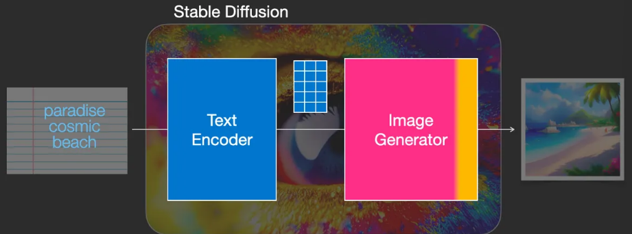
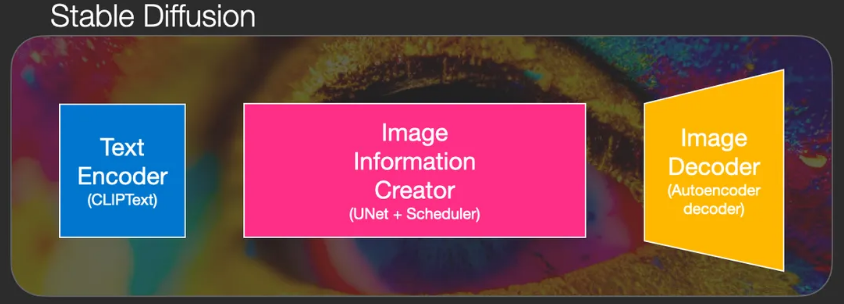
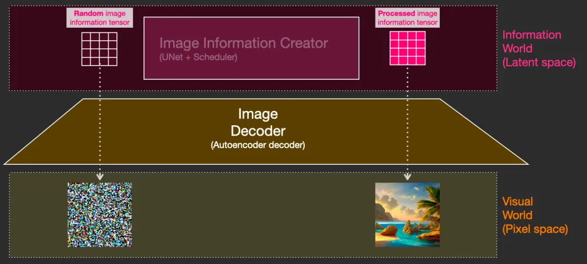
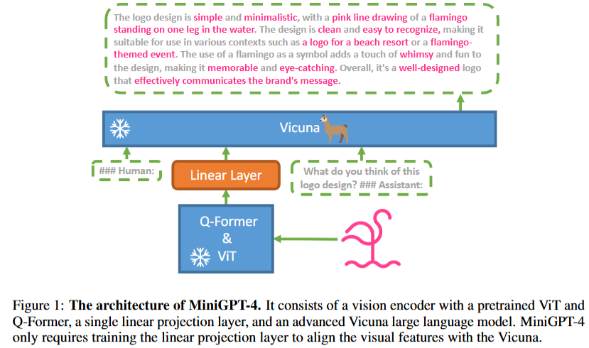
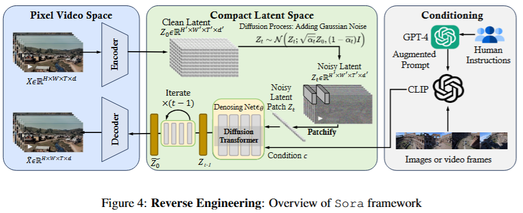

# 多模态大模型
  - 多模态任务
  - 多模态大模型的训练
  - Stable Diffusion
  - LLaVA
<!-- more -->

## 1. 多模态 
模态（Modality）：信号的类型（数据的类型或形式）
- 文本
- 图像
- 视频
- 音频
- 更细分
  - Graph图
  - 表格

多模态 (Multimodal)：设计两种或更多不同类型的模态 （现实场景中通常会涉及到多种信号）

多模态模型 (Multimodal Model)：能处理和整合多种模态数据的AI模型。

多模态系统（Multimodal System）: 能够处理多种模态输入和输出的系统

多模态大模型（Multimodal Large Language Models, MLLMs）: 将额外的模态融入大语言模型（LLMs）, 也就是将大语言模型扩展到多种数据类型。

多模态大模型用于解决：模态之间的转换
- 文本->图像
- 文本->视频
- 文本->表格
- 文本->Graph图
- 图像/视频->文本

## 2. 多模态任务
最火的两种模态就是语言和视觉模态，与之相关的任务主要分为两类：生成和视觉语言理解

- 语言模态 + 视觉模态 （文本+图像）
  - 生成
    - 文生图：输入文本生成图像
      - DALL-E系列
        - OpenAI提出来的
        - 有API接口
        - https://platform.openai.com/docs/guides/images?context=node
      - Midjourney
        - 生成的图效果最好
        - 收费
        - 官方文档：https://docs.midjourney.com/
        - Prompt参考库：https://midlibrary.io/
      - Stable Diffusion
        - 开源，个人PC能跑
        - Web UI: https://github.com/AUTOMATIC1111/stable-diffusion-webui
        - 模型下载网站：Civitai是一个专为Stable Diffusion AI艺术模型设计的网站，是非常好的AI模型库 https://civitai.com/
        - 扩展插件-界面汉化：https://github.com/VinsonLaro/stable-diffusion-webui-chinese
        - 扩展插件-ControlNet：https://github.com/Mikubill/sd-webui-controlnet
        - OpenPose: 根据人物骨架姿势生成图片
        - Canny边缘检测：参考草图轮廓生成图片
    - 修改图片：输入原图和文本，生成修改的图
  - 理解
    - 视觉问题问答
      - 输入图片和文本，要求根据图文回答问题
    - 生成图片描述
      - 输入图片，生成图片的文字描述
    - 图像分类
      - 例如，OCR提取图像中的文字，对图像进行分类
    - 基于文本的图像检索
      - 方法1：为图像生成图像描述，当用户输入文本查询时，找出与该文本最相似的图像描述文本，进而找到相关图像
        - **BLIP模型**：图像转文本描述
      - 方法2：训练图像和文本的联合向量空间，用户输入文本，系统生成该文本的向量，直接找到与该文本最相关的图像向量，从而找到图像。
        - **CLIP模型**：把图像和文本映射到共享向量空间
- 语言模态 + 听觉模态 （文本+音频）
  - 各种与音频有关的任务：https://github.com/AIGC-Audio/AudioGPT
  - 文本转音频 TTS（text-to-speech）
    - edge-tts
      - https://github.com/rany2/edge-tts 
      - 通过python使用Microsoft Edge的在线文本转语音服务，而无需Microsoft Edge或Windows或API密钥
    - MeloTTS
      - https://github.com/myshell-ai/MeloTTS
      - https://huggingface.co/spaces/mrfakename/MeloTTS
      - MyShell.ai 的高质量多语言文本转语音库。支持英语、西班牙语、法语、中文、日语和韩语。
      - 特点
        - 速度快，在CPU上也能实现实时语音合成
        - 多语言
        - 中英混合
        - 安装方便      
  - 音频转文本 STT（speech to text）、ASR(Automatic Speech Recognition, 自动语音识别)
  - 声音克隆
    - GPT-SoVITS
      - https://github.com/RVC-Boss/GPT-SoVITS
  - 生成音乐
    - suno
      - https://www.suno.ai/: 根据提示词生成带完整歌词和旋律的歌曲

## 3. Stable Diffusion （SD)

Stable Diffusion是一个由多个组件和模型组成的系统，而非单一的模型。
- 文本编码器 Text Encoder
  - 将文本向量化，以捕捉文本中的语义信息
- 图像生成器 Image Generator
  - 图像生成器完全在图像信息空间（潜在空间）中工作，这一特性使得扩散模型比之前在像素空间工作的扩散模型更快
  - 组件
    - 图像信息创建器 Image Information Creator
    - 图像解码器 Image Decoder

扩散模型的3个主要组件（每个都有各自的神经网络）
- Clip Text （蓝色）
  - 用于文本编码
  - 输入：文本
  - 输出：77个表征向量，每个有768维度
- 网格网络 + 调度 UNet + Scheduler （粉色）
  - 逐渐扩散信息到潜在latents空间
  - 扩散 diffusion: 对信息一步一步step by step处理，每一步增加更多的相关信息，使得高质量图像得以最终生成
  - 整个diffusion过程包含多个steps，其中每个step都是基于输入的latents矩阵进行操作，并生成另一个latents矩阵以更好地贴合「输入的文本」和从模型图像集中获取的「视觉信息」。
  - 输入：文本向量 和 随机的初始图像信息矩阵（也成为latents）
  - 输出：处理后的信息数组（维度：(4,64,64)）
- 自编码解码器 Autoencoder decoder （橙色）
  - 绘出最后的图像
  - 输入：处理过的信息数组
  - 输出：结果图像（维度：(3,512,512)）

Diffusion的工作原理
扩散模型 Duffusion Model
- 前向扩散 Forward Diffusion
  - 将噪声添加到训练图像中，逐渐将其转换为没有特点的噪声图像。
- 反向/逆向扩散 Reverse Diffusion
  - 从嘈杂、无意义的图像开始，反向扩散恢复了猫或狗的图像

## 4. 多模态大模型的训练

- 传统方法训练
  - End-to-End Training
    - Image Caption任务: Image -> Description/Caption
    - Image -> CNN -> Vector(共享) -> RNN/LSTM -> 文本 （Encoder-Decoder结构）
    - 训练数据：(Image1,Des1)(Image2,Des2)...(ImageN,DesN)
  - 问题
    - 从0开始训练，训练成本高
    - 每个任务都需要大量数据，且没有大模型的情况下人工标注困难
- 多模态大模型的训练
  - 基础模型 Foundation Models
    - 文本领域
      - GPT4, LLaMA, ChatGLM, Qwen
    - 图像领域 Image
      - Clip
    - 视频领域 Video
      - Sora
    - 图 Graph
      - GNN 
  - 多模态系统
    - 文本（语言模型）作为中驱（因为所有的其他模态都归结为表达的含义） 
    - 图像/视频/图 -> 有各自的适配器Adapter -> Align Language model, Image model, Video model and Graph model (使各模态同频)
    - 优势
      - 训练成本低
        - 因为只需要训练每个模态的适配器，各模态的基础模型参数进行冻结不变
          - Stage 1: Pre-training for Feature Alignment
            - 只有适配器部分被更新
            - 之所以需要这一步骤，是因为一开始适配器部分完全是新引入的，不起任何作用
            - 这部分需要的数据量比较大
          - Stage 2: Fine-tuning End-to-End
            - 适配器部分和语言模型部分被更新
            - 这部分需要的数据量比较小
      - 每个任务容易适配

## 5. Flamingo
Github: https://github.com/lucidrains/flamingo-pytorch

- Input: image + text + image + text (图像和文本交替排列)
- Vision Encoder: 处理图像的基础模型 Foundation Models
- Perceiver Resampler: 适配器 Adapter
- LM block: 语言模型

## 6. LLaVA
Github: https://github.com/haotian-liu/LLaVA

Paper Name: Visual Instruction Tuning
Paper: https://arxiv.org/pdf/2304.08485

- Vision Encoder: 处理图像的基础模型 Clip
  - provides the visual feature $Z_v = g(X_v)$
- Projection W: 适配器 Adapter, 转换为和文本相同维度的向量
  - apply a trainable projection matrix W to convert $Z_v$ into
language embedding tokens H
  - $H_v = W · Z_v$
- Language Model: Vicuna

只需要训练每个模态的适配器，各模态的基础模型参数进行冻结不变
  - Stage 1: Pre-training for Feature Alignment
    - 只有适配器部分被更新
  - Stage 2: Fine-tuning End-to-End
    - 适配器部分和语言模型部分被更新

数据生成：GPT-assisted Visual Instruction Data Generation
- 提供给GPT的prompt包括文字描述Captions和边界框bounding boxes, 注意不包括图像本身，使用的GPT也是纯语言模型
  - 文字描述 Caption 
  - 边界框 bounding box
- GPT给出响应包括
  - 问答对 QA Conversation
  - 详细描述 Detailed Description
  - 复杂推理 Complex Reasoning

## 7. MiniGPT-4
Github: https://github.com/Vision-CAIR/MiniGPT-4

Paper Name: MINIGPT-4:
ENHANCING VISION-LANGUAGE UNDERSTANDING
WITH ADVANCED LARGE LANGUAGE MODELS

Paper: https://arxiv.org/pdf/2304.10592

## 8. Sora 视频生成大模型

Paper Name: Sora: A Review on Background, Technology, Limitations, and Opportunities of Large Vision Models

Paper: https://arxiv.org/pdf/2402.17177

Github: https://github.com/lichao-sun/SoraReview

Note: This is not an official technical report from OpenAI.

Sora本质上是一个具备灵活采样维度的diffusion transformer模型。它包括三个部分：
- 1. 时空压缩器：将原始视频映射到潜在空间
  - A time-space compressor：maps the original video into latent space.
- 2. 视觉转换器 ViT: 处理标记化的潜在表示并输出去噪的潜在表示
  - A ViT then processes the tokenized latent representation and outputs the denoised latent representation.
- 3. 类CLIP模型: 引导视频生成过程，创造出具有特定风格或主题的视频 
  - A CLIP-like conditioning mechanism receives LLM-augmented user instructions and potentially visual prompts to guide the diffusion model to generate styled or themed videos. 
  

## 9. 多模态大模型展望
现状
- 处于早期阶段
- 技术迭代特别快
- 长远来看，是大模型的终点

大模型领域的发展分析
- 多模态大模型的基础是文本大模型
  - 文本大模型的上限决定了其他大模型的上限
  - 文本大模型会促进其它模态的发展
  - 其他模态会滞后文本大模型的发展

24年机会
- Agent
- Small Model/模型量化/小模型fine-tune (在智能设备上嵌入的模型，0.5B,1B)
  - 智能硬件，如智能手表
  - 怎么把模型用在cpu上
- 多模态
- 推理加速，减少推理成本

## 10. Reference
- [The Illustrated Stable Diffusion](https://jalammar.github.io/illustrated-stable-diffusion/?spm=a2c6h.12873639.article-detail.7.412f5124rpbR0C)
  - 中文翻译
    - https://blog.51cto.com/u_16099326/11808915