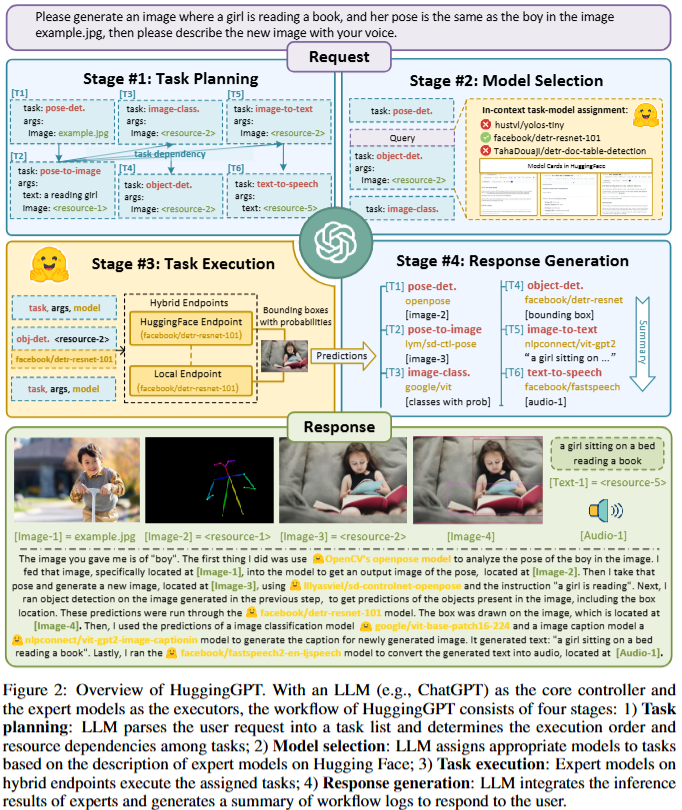
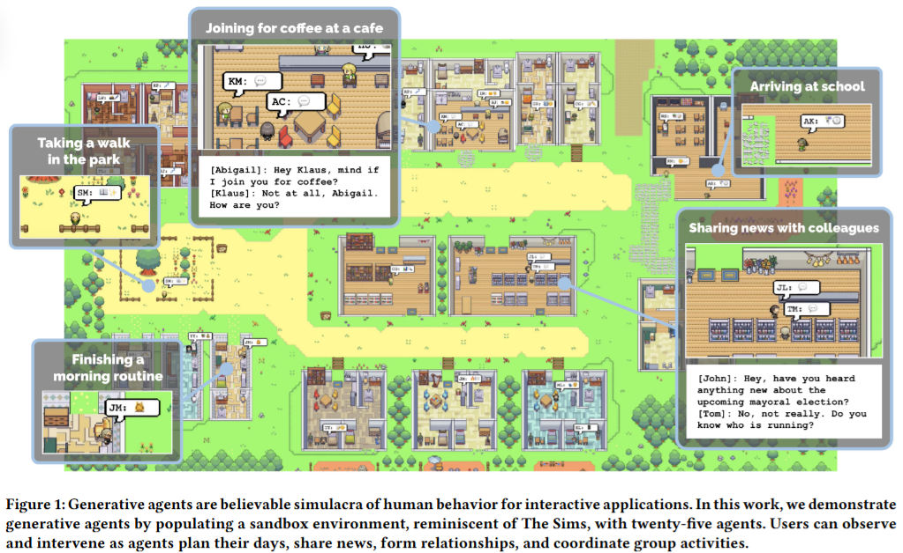
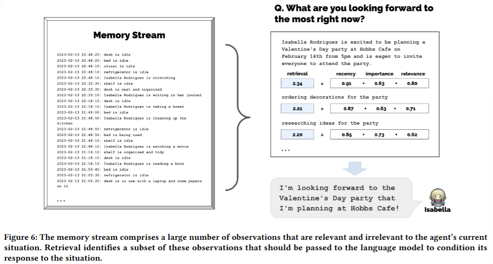
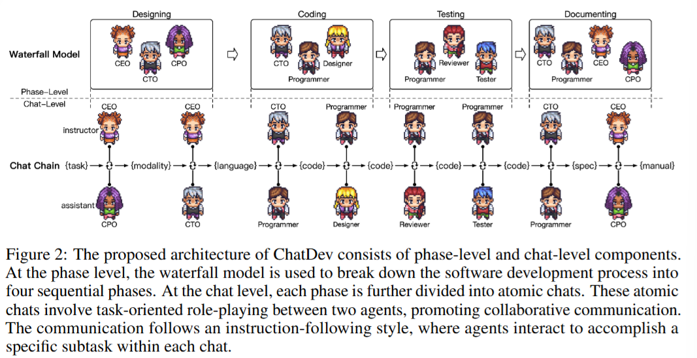

# Agent与MultiAgent
  - Agent
  - MultiAgent
<!-- more -->

## 1. Agent
Agent = LLM + 观察 + 思考 + 行动 + 记忆

- LLM：处理信息、做出决策、执行行动
- 观察：感知环境，一个智能体可以从环境中接收来自另一个智能体的消息
- 思考：分析观察结果和记忆内容，考虑下一步要做什么行动，这种决策能力是LLM提供的
- 行动：观察和思考的结果，决定去做的具体的事，可以类比langchain中的tool
- 记忆：存储过去的经验

Agent和Chain之间的区别？
- 相同点
  - 都是一步步完成一系列任务，从而最终完成复杂的任务
- 不同点
  - Chain是提前定义好的，每一步要做什么（静态的）
  - Agent，针对不同用户问题或场景，每一步的任务是事先不确定的（动态的）

## 2. ReAct
Paper Name: ReAct : SYNERGIZING REASONING AND ACTING IN LANGUAGE MODELS

Paper: https://arxiv.org/pdf/2210.03629

Github: https://github.com/ysymyth/ReAct

## 3. AutoGPT
Github: https://github.com/Significant-Gravitas/AutoGPT

Paper Name: Auto-GPT for Online Decision Making: Benchmarks and
Additional Opinions

Paper: https://arxiv.org/pdf/2306.02224

自治智能体：只需要告诉它需求，不需要指导先做什么，后做什么，它能自主去提出计划，执行计划，完成需求

## 4. MetaGPT：多智能体框架
Github: https://github.com/geekan/MetaGPT

Paper Name: METAGPT: META PROGRAMMING FOR A
MULTI-AGENT COLLABORATIVE FRAMEWORK

Paper: https://arxiv.org/pdf/2308.00352

## 5. HuggingGPT
Paper Name: HuggingGPT: Solving AI Tasks with ChatGPT and its Friends in Hugging Face

Paper: https://arxiv.org/pdf/2303.17580

Github: https://github.com/microsoft/JARVIS

四阶段
- Task Planning
- Model Selection (来自Hugging Face)
- Task Execution
- Response Generation

## 6. generative_agents: 斯坦福小镇
Paper Name: Generative Agents: Interactive Simulacra of Human Behavior

Paper: https://dl.acm.org/doi/pdf/10.1145/3586183.3606763

Github: https://github.com/joonspk-research/generative_agents

是该领域第一个最有影响力的工作，为后续多智能体的协作提供了有效依据

围绕generative multi-agents, 有非常多的应用场景可以去探索

### 6.1. 每个Agent的property设计
  - 基本信息
  - 过往经历
  - 兴趣爱好

### 6.2. Memory设计
  - 时间远近 Recency
    - 越近发生的赋予权重越高
  - 重要性 Importance
    - 起床 < 升职
  - 相关性 Relevance
    - 余弦相似性 cosine similarity

score = Recency x $\alpha_1$ + Importance x $\alpha_2$ + Relevance x $\alpha_3$

Reflection的提取：将Memory Stream进行总结
- 定时任务：隔一段时间总结下

### 6.3. Planning：为每个Agent生成当日的plan
- 每日routine
- 根据agent的特点，添加独特的日程
  

### 6.4. React: Agent之间的互动
- 是否互动
- 原先plan是否要改变
  

## 7. ChatDev: 多智能体软件开发

Paper Name: Communicative Agents for Software Development

Paper: https://openreview.net/pdf?id=yW0AZ5wPji

Github: https://github.com/OpenBMB/ChatDev

- 定义角色 Role
- 记忆设计 Memory

## 8. ToolLLM
Paper Name: TOOLLLM: FACILITATING LARGE LANGUAGE MODELS TO MASTER 16000+ REAL-WORLD APIS

Paper: https://arxiv.org/pdf/2307.16789

Github: https://github.com/OpenBMB/ToolBench

## 9. RestGPT
Paper Name: RestGPT: Connecting Large Language Models with Real-World RESTful APIs

Paper: https://arxiv.org/pdf/2306.06624

Github: https://github.com/Yifan-Song793/RestGPT