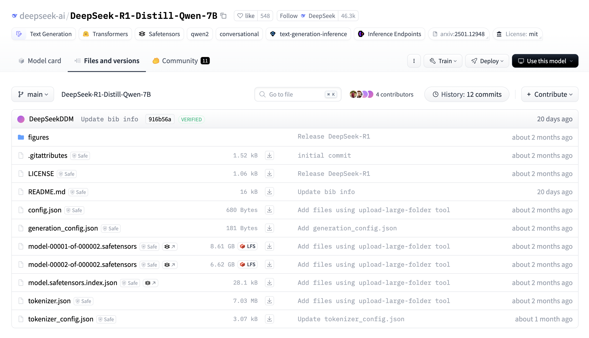
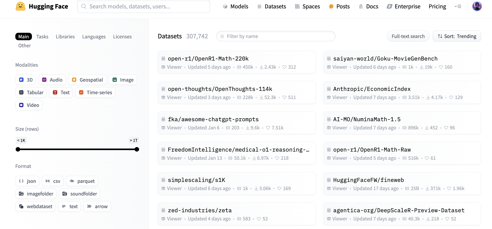
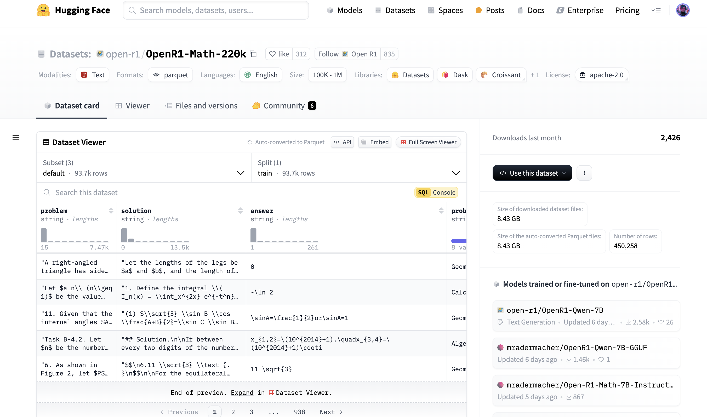
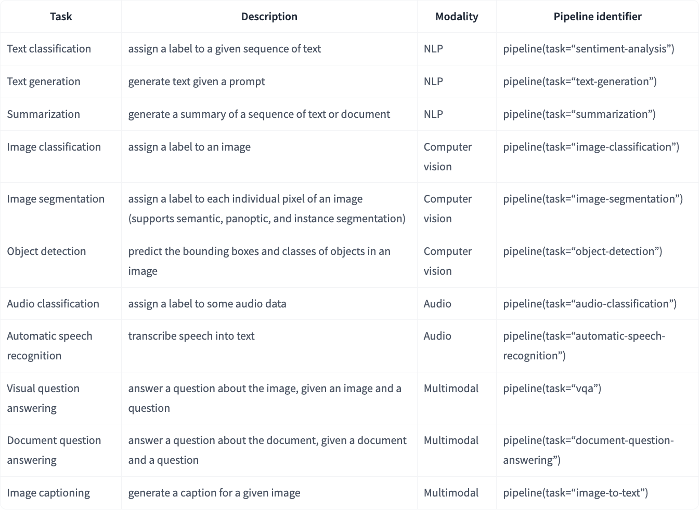

# Hugging Face and Transformers
- 主要功能
- Models
- Datasets
- Transformers
<!-- more -->
## 1. 官网
官网：[https://huggingface.co/](https://huggingface.co/)

简介：Hugging Face 是一个专注于自然语言处理（NLP）和人工智能的开源平台，提供了丰富的工具和资源，它拥有当前最活跃、最受关注、影响力最大的LLM社区，最新最强的LLM大多在这里发布和开源。

## 2. 主要功能
- Models 模型库 
    - 模型下载
    - 模型分享
- Datasets 数据集 
    - 数据集下载
    - 数据集分享
- Spaces 分享空间 
    - 里面有近期有趣的比较火的应用
    - 支持 Gradio 和 Streamlit 等工具，快速构建可视化界面
    - 用于展示模型效果、测试模型性能或作为教学工具
- Trending 趋势 
    - 在首页展示了最近7天最火的Models，Datasets和Spaces
- Docs 文档库 
    - HuggingFace核心库以及模型算法的说明使用文档
- 核心库
    - Transformers库
        - Hugging Face 的核心开源库，提供了API和工具，可以轻松下载和训练最先进的预训练模型，支持多种深度学习框架（PyTorch,TensorFlow和JAX）其中Pytorch支持所有的模型和框架。
    - Datasets库
        - 提供了最大的现成机器学习数据集中心，带有快速、易用和高效的数据操作工具，提供统一的 API 来访问和管理各种机器学习数据集，便于处理不同数据源
    - Tokenizers库
        - 用于创建和使用分词器的库，对自然语言处理模型的文本处理至关重要，提供高性能和灵活性
    - Evaluate库
        - 用于评估和比较模型性能的库，提供简单统一的 API，用于评估机器学习模型在不同任务和指标上的性能，便于基准测试和比较不同模型。
    - PEFT库
        - 参数高效微调库，高效微调大语言模型，仅更新模型参数的一小部分，有助于在有限计算资源下适应新任务
    - TRL (Transformer Reinforcement Learning)库
        - 强化学习库，提供工具以强化学习技术训练大语言模型，便于监督微调、奖励建模和近端策略优化（PPO），用于大型语言模型的进一步微调
    - Accelerate库
        - 分布式训练和推理库，使同一代码能够在各种分布式配置（如单 GPU、多节点集群）上运行，仅需少量修改，支持自动混合精度和分布式训练，增强了大规模机器学习任务的效率
    - Optimum库
        - 优化加速库，使用易用的硬件优化工具加速模型的推理和训练，提供工具以优化模型在各种硬件上的性能，包括多 GPU 系统和 TPU，便于扩展和加速模型训练和推理。
    - Gradio库
        - 用于创建机器学习模型的用户界面，允许开发者快速构建和分享交互式机器学习应用，通过 Hugging Face Spaces 免费托管演示。
- Daily Papers 每日精选论文
    - 提供 AI 领域的最新研究论文，用户可以与作者互动并推荐相关论文
- Learn 课程
    - [https://huggingface.co/learn](https://huggingface.co/learn)
- 社区论坛

## 3. Models
### 3.1. 模型列表页
- 涵盖了各种任务，可根据任务选择模型，也可以直接搜索模型名称
    - Multimodal 多模态
    - Computer Vision 计算机视觉
    - Natural Language Processing 自然语言处理
    - Audio 语音
    - Tabular 表格
    - Reinforcement Learning 强化学习
- 不带前缀是官方提供的模型，带前缀是第三方提供的模型


### 3.2. 模型详情页
- Model card: 模型介绍
- File and versions: 模型文件
- Use this model: 使用该模型的样例代码，一般都提供pipeline的方式
- Inference Providers: 界面提供
- Model tree: 模型的变体
- Spaces using model: 使用该模型的Space


### 3.3. 模型文件



- 文档/元数据：提供使用指南、许可和版本控制
    - README.md：模型的说明文档，通常包含模型的介绍、使用方法、训练细节、性能评测等信息
    - LICENSE：开源许可协议，规定了该模型的使用、分发和修改权限
    - .gitattributes：用于 Git 版本控制，尤其是 Git LFS（Large File Storage），通常包含对大文件的 LFS 追踪规则
- 模型配置文件：定义模型架构和推理参数
    - config.json：模型的主要配置文件，定义了模型架构（如层数、隐藏单元数、注意力头数等）
    - generation_config.json：生成文本时的默认参数配置文件，如最大长度、温度、top-k 采样等，用于控制推理阶段的文本生成方式
- 模型权重文件：存储神经网络参数
    - safetensors文件：模型的主要权重文件，采用 safetensors 格式（比传统的 .bin 更安全、加载更快），通过 Git LFS 存储
        - model-00001-of-000002.safetensors
        - model-00002-of-000002.safetensors
    - model.safetensors.index.json：索引文件，描述了模型权重在不同 .safetensors 文件中的存储位置，允许分片加载模型
- 分词器：用于文本预处理和后处理
    - tokenizer.json：分词器的核心文件，包含所有 token 及其对应的 ID，用于文本编码和解码
    - tokenizer_config.json：定义分词器的相关参数，如是否使用特殊 token，是否是 BPE/WordPiece 分词器等

## 4. Datasets
数据集列表页



数据集详情页



## 5. Trending
Trending展示了近期比较火的模型、数据集和分享空间


## 6. Transformers
### 6.1. Transformers API
API 描述了所有类和函数：
- MAIN CLASSES : 详细介绍了最重要的类，如configuration, model, tokenizer, and pipeline
    - Pipelines : 提供高层次 API，简化常见任务的执行
    - AutoClasses : 提供统一API自动加载模型、tokenizer 和配置的类
    - Configuration : 定义模型的参数和结构，确保模型的正确初始化
    - Models : 模型
    - Tokenizer : 分词器，对数据进行预处理，文本到 token 序列的互相转换
    - Trainer : 支持模型训练和微调，提供完整的 PyTorch 训练 API，支持分布式训练和混合精度    
- MODELS : 详细介绍了与库中实现的每个模型相关的类和函数
    - text models
    - vision models
    - audio models
    - video models
    - multimodal models
    - reinforcement learning models
    - time series models
    - graph models
- INTERNAL HELPERS : 详细介绍了内部使用的实用类和函数

### 6.2. Pipelines
#### 6.2.1. Pipelines介绍
Pipeline是Transformers库的一个高层次封装类，将数据预处理、模型调用和结果后处理三部分组装成流水线。


pipeline() 是使用预训练模型进行推理的最简单、最快捷的方法。可以将 pipeline() 用于不同模式下的许多任务，下表显示了其中一些任务：



#### 6.2.2. Pipelines使用
1个参数：只指定任务类型
- 如果不指定模型，将下载目标任务的默认模型和配套tokenizer
```
from transformers import pipeline

pipe = pipeline("text-classification")
pipe("This restaurant is awesome")
```
1个参数：只指定模型名称
- 模型有相应的任务类型和配套的 tokenizer
```
from transformers import pipeline

pipe = pipeline(model="FacebookAI/roberta-large-mnli")
pipe("This restaurant is awesome")
```
2个参数：指定任务类型和模型名称
```
from transformers import pipeline

messages = [
    {"role": "user", "content": "Who are you?"},
]
pipe = pipeline("text-generation", model="Qwen/QwQ-32B")
pipe(messages)
```
3个参数：指定任务类型、模型名称、embedding模型名称
```
from transformers import pipeline

oracle = pipeline(
    "question-answering", model="distilbert/distilbert-base-cased-distilled-squad", tokenizer="google-bert/bert-base-cased"
)
```

3个参数：先加载模型再创建Pipeline
```
# Named entity recognition pipeline, passing in a specific model and tokenizer

from transformers import *

model = AutoModelForTokenClassification.from_pretrained("dbmdz/bert-large-cased-finetuned-conll03-english")
tokenizer = AutoTokenizer.from_pretrained("google-bert/bert-base-cased")
recognizer = pipeline("ner", model=model, tokenizer=tokenizer)
```

- 一般来说，第一次执行时pipeline会加载模型，模型会自动下载到本地，可以直接用
- Pipeline加载模型的方式和先加载模型再创建Pipeline其中的加载模型方式一致1，都是用Auto Classes的方式进行加载

Pipeline官方文档：[https://huggingface.co/docs/transformers/main_classes/pipelines#pipelines](https://huggingface.co/docs/transformers/main_classes/pipelines#pipelines)

### 6.3. AutoClasses
- AutoClasses可以从from_pretrained()方法的传参，也就是通过预训练模型的名称或路径，自动检索预训练模型的架构来进行自动加载Model、Tokenizer和Config
- 主要包括 AutoConfig、AutoModel 和 AutoTokenizer
```
from transformers import AutoConfig

config = AutoConfig.from_pretrained("google-bert/bert-base-uncased")
```
```
from transformers import AutoModel

model = AutoModel.from_pretrained("google-bert/bert-base-cased")
```

```
from transformers import AutoTokenizer

tokenizer = AutoTokenizer.from_pretrained("google-bert/bert-base-uncased")
```
- 特定任务的 AutoModel类（如 AutoModelForSequenceClassification），后缀ForSequenceClassification指明了任务类型，之所以有特定任务AutoModel类，是因为骨干模型可以处理多个任务：相同的 model，接入不同的 post processing 模块，就可以用于不同的任务
- 这些类通过提供统一的 API，使代码更灵活，适合不同模型，它们在简化模型使用方面非常有效。


Auto Classes官方文档：[https://huggingface.co/docs/transformers/model_doc/auto](https://huggingface.co/docs/transformers/model_doc/auto)