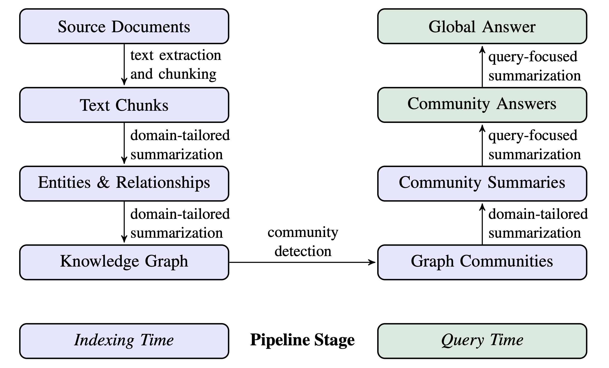
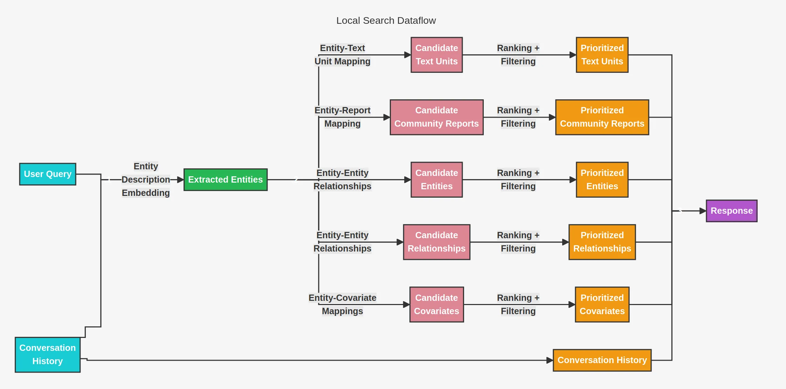

# 微软GraphRAG源码解读
<!-- more -->
## 1. 官方文档
Github: [https://github.com/microsoft/graphrag](https://github.com/microsoft/graphrag)

Get Started: [https://microsoft.github.io/graphrag/get_started/](https://microsoft.github.io/graphrag/get_started/)

Paper: https://arxiv.org/pdf/2404.16130

## 2. 入口 
> graphrag.cli.main.py

5个函数对应5个命令
- init => def _initialize_cli()
    - graphrag init --root ./ragtest
- index => def _index_cli()
    - graphrag index --root ./ragtest
- query => def _query_cli()
    - global search
        - graphrag query --root ./ragtest --method global --query "What are the top themes in this story?"
    - local search
        - graphrag query --root ./ragtest --method local --query "Who is Scrooge and what are his main relationships?"
- update => def _update_cli()
    - graphrag update
- prompt-tune => def _prompt_tune_cli()
    - graphrag prompt-tune

原理：使用Python的Typer库来创建命令行接口(CLI)，以index为例
- @app.command("index") 是装饰器语法，用于将下面的_index_cli函数注册为CLI命令，创建一个名为"index"的子命令
- 当用户在命令行运行"graphrag index"时，就会调用被装饰的def _index_cli()函数
- Typer会自动将函数参数转换为命令行选项，并处理参数解析和验证

### 2.1. init
```
@app.command("init")
def _initialize_cli(
    root, 
    force,
):
    """Generate a default configuration file."""
    from graphrag.cli.initialize import initialize_project_at

    initialize_project_at(path=root, force=force)
```
### 2.2. index
```
@app.command("index")
def _index_cli(
    config,
    root,  
    method,
    verbose,
    memprofile,
    logger,
    dry_run,
    cache,
    skip_validation,
    output,
):
    """Build a knowledge graph index."""
    from graphrag.cli.index import index_cli

    index_cli(
        root_dir=root,
        verbose=verbose,
        memprofile=memprofile,
        cache=cache,
        logger=LoggerType(logger),
        config_filepath=config,
        dry_run=dry_run,
        skip_validation=skip_validation,
        output_dir=output,
        method=method,
    )
```

### 2.3. qurey
```
@app.command("query")
def _query_cli(
    method,
    query,
    config,
    data,
    root,  
    community_level,
    dynamic_community_selection,
    response_type,
    streaming,
):
    """Query a knowledge graph index."""
    from graphrag.cli.query import (
        run_basic_search,
        run_drift_search,
        run_global_search,
        run_local_search,
    )

    match method:
        case SearchMethod.LOCAL:
            run_local_search(
                config_filepath=config,
                data_dir=data,
                root_dir=root,
                community_level=community_level,
                response_type=response_type,
                streaming=streaming,
                query=query,
            )
        case SearchMethod.GLOBAL:
            run_global_search(
                config_filepath=config,
                data_dir=data,
                root_dir=root,
                community_level=community_level,
                dynamic_community_selection=dynamic_community_selection,
                response_type=response_type,
                streaming=streaming,
                query=query,
            )
        case SearchMethod.DRIFT:
            run_drift_search(
                config_filepath=config,
                data_dir=data,
                root_dir=root,
                community_level=community_level,
                streaming=streaming,
                response_type=response_type,
                query=query,
            )
        case SearchMethod.BASIC:
            run_basic_search(
                config_filepath=config,
                data_dir=data,
                root_dir=root,
                streaming=streaming,
                query=query,
            )
        case _:
            raise ValueError(INVALID_METHOD_ERROR)
```
## 3. init 源码逻辑
- 在指定的根目录下生成初始化文件
    - 生成配置文件 settings.yaml
    - 生成环境变量文件 .env
    - 在根目录的prompts路径下生成多个xxx_prompt.txt文件

## 4. index 源码逻辑

### 4.1. 加载配置文件
```
# graphrag.cli.index.py -> def index_cli()

config = load_config(root_dir, config_filepath, cli_overrides)
```
### 4.2. 构建索引  
```
# graphrag.api.index.py -> def build_index()

async def build_index(
    config: GraphRagConfig,
    method: IndexingMethod = IndexingMethod.Standard,
    is_update_run: bool = False,
    memory_profile: bool = False,
    callbacks: list[WorkflowCallbacks] | None = None,
    progress_logger: ProgressLogger | None = None,
) -> list[PipelineRunResult]:

    # 创建pipeline
    pipeline = PipelineFactory.create_pipeline(config, method)

    # 执行pipeline
    async for output in run_pipeline(
        pipeline,
        config,
        cache=pipeline_cache,
        callbacks=callbacks,
        logger=progress_logger,
        is_update_run=is_update_run,
    ):
        outputs.append(output)
    return outputs
```

### 4.3. 创建pipeline

参数 method 决定 pipeline 类型
- 标准Pipeline: IndexingMethod.Standard => full LLM
    - "create_base_text_units",
    - "create_final_documents",
    - "extract_graph",
    - "finalize_graph",
    - *(["extract_covariates"] if config.extract_claims.enabled else []),
    - "create_communities",
    - "create_final_text_units",
    - "create_community_reports",
    - "generate_text_embeddings",
- 快速Pipeline: IndexingMethod.Fast => NLP + LLM
    - "create_base_text_units",
    - "create_final_documents",
    - "extract_graph_nlp",
    - "prune_graph",
    - "finalize_graph",
    - "create_communities",
    - "create_final_text_units",
    - "create_community_reports_text",
    - "generate_text_embeddings",

```
# graphrag.index.workflows.factory.py -> def create_pipeline()

class PipelineFactory:
    """A factory class for workflow pipelines."""

    workflows: ClassVar[dict[str, WorkflowFunction]] = {}

    @classmethod
    def create_pipeline(
        cls, config: GraphRagConfig, method: IndexingMethod = IndexingMethod.Standard
    ) -> Pipeline:
        """Create a pipeline generator."""
        workflows = _get_workflows_list(config, method)
        for name in workflows:
            yield name, cls.workflows[name]


def _get_workflows_list(
    config: GraphRagConfig, method: IndexingMethod = IndexingMethod.Standard
) -> list[str]:
    """Return a list of workflows for the indexing pipeline."""
    if config.workflows:
        return config.workflows
    match method:
        case IndexingMethod.Standard:
            return [
                "create_base_text_units",
                "create_final_documents",
                "extract_graph",
                "finalize_graph",
                *(["extract_covariates"] if config.extract_claims.enabled else []),
                "create_communities",
                "create_final_text_units",
                "create_community_reports",
                "generate_text_embeddings",
            ]
        case IndexingMethod.Fast:
            return [
                "create_base_text_units",
                "create_final_documents",
                "extract_graph_nlp",
                "prune_graph",
                "finalize_graph",
                "create_communities",
                "create_final_text_units",
                "create_community_reports_text",
                "generate_text_embeddings",
            ]
```
### 4.4. 加载Input数据集 
- 加载根目录input文件夹下的文件
- 目前支持txt和csv文件类型
```
# graphrag.index.run.run_pipeline.py -> def run_pipeline()

dataset = await create_input(config.input, logger, root_dir)
```

### 4.5. 生成documents.parquet文件

- 行：input文件夹下每一个文件是一行
- 列：
    - 'text' : 文档里的文本内容
    - 'id' : 文档ID
    - 'title' : 文档名
    - 'creation_date' : 创建时间

```
# graphrag.index.run.run_pipeline.py -> def _run_pipeline()

await write_table_to_storage(dataset, "documents", context.storage)
```

### 4.6. 执行pipeline : create_base_text_units（文档分块）
- 加载documents.parquet文件
- 生成text_unit.parquet文件
    - 行：将documents.parquet每行进行分块，每一行为一个分块
    - 列：
        - 'id' : 分块ID
        - 'text' : 分块文本
        - 'document_ids' : 所属文件ID
        - 'n_tokens' : token数

### 4.7. 执行pipeline : create_final_documents（聚合分块ID列表到documents.parquet文件）
- 加载documents.parquet文件和text_unit.parquet文件
- create_final_documents
    - 以文档ID为关联inner连接合并documents.parquet和text_unit.parquet文件
    - 按文档ID进行分组，聚合块ID作为text_unit_ids列
- 更新documents.parquet文件
    - 行：input文件夹下每一个文件是一行
    - 列：
        - 'id' : 文档ID (多位无序的唯一ID)
        - 'human_readable_id' : 可读的序号ID (按顺序编号的ID)
        - 'text' : 文档里的文本内容
        - 'text_unit_id' : 分块ID列表
        - 'creation_date' : 创建时间

### 4.8. 执行pipeline : extract_graph
- 加载text_unit.parquet文件
- extract_graph (详见以下代码)
    - load_llm
    - run_extract_graph 抽取出实体和关系 (详见以下代码)
    - run_summarize_descriptions 生成摘要描述 (详见以下代码)
    - return (entities, relationships)
        - entities
            - "title", 实体名称
            - "type",  实体类型
            - "description", 实体描述
            - "text_unit_ids", 分块ID列表
            - "frequency", 实体出现的次数
        - relationships
            - "source", 关系的起始实体ID
            - "target", 关系的结束实体ID
            - "description", 关系的描述
            - "weight", 关系权重（连接强度）
            - "text_unit_ids", 分块ID列表
- 生成entities.parquet和relationships.parquet文件

```
graphrag.index.workflows.extract_graph.py -> def extract_graph()

async def extract_graph(
    text_units: pd.DataFrame,
    callbacks: WorkflowCallbacks,
    cache: PipelineCache,
    extraction_strategy: dict[str, Any] | None = None,
    extraction_num_threads: int = 4,
    extraction_async_mode: AsyncType = AsyncType.AsyncIO,
    entity_types: list[str] | None = None,
    summarization_strategy: dict[str, Any] | None = None,
    summarization_num_threads: int = 4,
) -> tuple[pd.DataFrame, pd.DataFrame]:
    """All the steps to create the base entity graph."""
    # this returns a graph for each text unit, to be merged later
    extracted_entities, extracted_relationships = await extractor(
        text_units=text_units,
        callbacks=callbacks,
        cache=cache,
        text_column="text",
        id_column="id",
        strategy=extraction_strategy,
        async_mode=extraction_async_mode,
        entity_types=entity_types,
        num_threads=extraction_num_threads,
    )

    entity_summaries, relationship_summaries = await summarize_descriptions(
        entities_df=extracted_entities,
        relationships_df=extracted_relationships,
        callbacks=callbacks,
        cache=cache,
        strategy=summarization_strategy,
        num_threads=summarization_num_threads,
    )

    relationships = extracted_relationships.drop(columns=["description"]).merge(
        relationship_summaries, on=["source", "target"], how="left"
    )

    extracted_entities.drop(columns=["description"], inplace=True)
    entities = extracted_entities.merge(entity_summaries, on="title", how="left")

    return (entities, relationships)
```

```
# graphrag.index.operations.extract_graph.graph_intelligence_strategy.py -> def run_extract_graph()

async def run_extract_graph(
    llm: ChatLLM,
    docs: list[Document],
    entity_types: EntityTypes,
    callbacks: WorkflowCallbacks | None,
    args: StrategyConfig,
) -> EntityExtractionResult:
    """Run the entity extraction chain."""
    tuple_delimiter = args.get("tuple_delimiter", None)
    record_delimiter = args.get("record_delimiter", None)
    completion_delimiter = args.get("completion_delimiter", None)
    extraction_prompt = args.get("extraction_prompt", None)
    encoding_model = args.get("encoding_name", None)
    max_gleanings = args.get("max_gleanings", defs.EXTRACT_GRAPH_MAX_GLEANINGS)

    extractor = GraphExtractor(
        llm_invoker=llm,
        prompt=extraction_prompt,
        encoding_model=encoding_model,
        max_gleanings=max_gleanings,
        on_error=lambda e, s, d: (
            callbacks.error("Entity Extraction Error", e, s, d) if callbacks else None
        ),
    )
    text_list = [doc.text.strip() for doc in docs]

    results = await extractor(
        list(text_list),
        {
            "entity_types": entity_types,
            "tuple_delimiter": tuple_delimiter,
            "record_delimiter": record_delimiter,
            "completion_delimiter": completion_delimiter,
        },
    )

    graph = results.output
    # Map the "source_id" back to the "id" field
    for _, node in graph.nodes(data=True):  # type: ignore
        if node is not None:
            node["source_id"] = ",".join(
                docs[int(id)].id for id in node["source_id"].split(",")
            )

    for _, _, edge in graph.edges(data=True):  # type: ignore
        if edge is not None:
            edge["source_id"] = ",".join(
                docs[int(id)].id for id in edge["source_id"].split(",")
            )

    entities = [
        ({"title": item[0], **(item[1] or {})})
        for item in graph.nodes(data=True)
        if item is not None
    ]

    relationships = nx.to_pandas_edgelist(graph)

    return EntityExtractionResult(entities, relationships, graph)
```

```
# graphrag.index.operations.summarize_descriptions.graph_intelligence_strategy.py -> def run_summarize_descriptions()

async def run_summarize_descriptions(
    llm: ChatLLM,
    id: str | tuple[str, str],
    descriptions: list[str],
    callbacks: WorkflowCallbacks,
    args: StrategyConfig,
) -> SummarizedDescriptionResult:
    """Run the entity extraction chain."""
    # Extraction Arguments
    summarize_prompt = args.get("summarize_prompt", None)
    entity_name_key = args.get("entity_name_key", "entity_name")
    input_descriptions_key = args.get("input_descriptions_key", "description_list")
    max_tokens = args.get("max_tokens", None)

    extractor = SummarizeExtractor(
        llm_invoker=llm,
        summarization_prompt=summarize_prompt,
        entity_name_key=entity_name_key,
        input_descriptions_key=input_descriptions_key,
        on_error=lambda e, stack, details: (
            callbacks.error("Entity Extraction Error", e, stack, details)
            if callbacks
            else None
        ),
        max_summary_length=args.get("max_summary_length", None),
        max_input_tokens=max_tokens,
    )

    result = await extractor(id=id, descriptions=descriptions)
    return SummarizedDescriptionResult(id=result.id, description=result.description)
```

### 4.9. 执行pipeline : finalize_graph
- 加载entities.parquet和relationships.parquet文件
- finalize_graph
    - finalize_entities
        - "id", 实体ID
        - "human_readable_id", 可读的有序实体ID
        - "title", 实体名称
        - "type",  实体类型
        - "description", 实体描述
        - "text_unit_ids", 分块ID列表
        - "frequency", 实体出现的次数
        - "degree", 图中连接数（实体节点的度数）
        - "x", 可视化布局的X坐标
        - "y", 可视化布局的Y坐标
    - finalize_relationships
        - "id", 关系ID
        - "human_readable_id", 可读的有序关系ID
        - "source", 关系的起始实体ID
        - "target", 关系的结束实体ID
        - "description", 关系的描述
        - "weight", 关系权重（连接强度）
        - "combined_degree", 综合连接度（两端节点degree之和，反映关系重要性）
        - "text_unit_ids", 分块ID列表
- 更新entities.parquet和relationships.parquet文件

### 4.10. 执行pipeline : create_communities（将节点聚类成社区）
- 加载entities.parquet和relationships.parquet文件
- create_communities
- 生成communities.parquet
    - "id", 社区ID
    - "human_readable_id", 可读有序社区ID
    - "community", 社区父子关系链接ID
    - "level", 当前层级
    - "parent", 父级
    - "children", 子级
    - "title", 社区名称
    - "entity_ids", 实体ID列表
    - "relationship_ids", 关系ID列表
    - "text_unit_ids", 分块ID列表
    - "period", 时间戳
    - "size", 社区大小

### 4.11. 执行pipeline : create_final_text_units
- 加载text_units.parquet、entities.parquet和relationships.parquet文件
- create_final_text_units
- 更新text_units.parquet
    - 'id' : 分块ID
    - 'human_readable_id' : 可读有序分块ID
    - 'text' : 分块文本
    - 'document_ids' : 所属文件ID
    - 'n_tokens' : token数
    - 'entity_ids' : 实体ID列表
    - 'relationship_ids' : 关系ID列表

### 4.12. 执行pipeline : create_community_reports（生成社区报告）
- 加载entities.parquet、relationships.parquet和communities.parquet
- create_community_reports
- 生成community_reports.parquet
    - "id",
    - "human_readable_id",
    - "community",
    - "level",
    - "parent",
    - "children",
    - "title",
    - "summary",
    - "full_content",
    - "rank",
    - "rank_explanation",
    - "findings",
    - "full_content_json",
    - "period",
    - "size",

### 4.13. 执行pipeline : generate_text_embeddings
- 加载documents.parquet文件、text_unit.parquet、entities.parquet、relationships.parquet和community_reports.parquet
- generate_text_embeddings


## 5. query 源码逻辑

四种搜索方式
- local
- global
- drift
- basic
### 5.1. local_search -> 搜索实体或关系的细节问题

### 5.2. global_search -> 搜索社区的广泛问题

### 5.3. drift_search -> 结合了local_search和global_search
https://microsoft.github.io/graphrag/query/drift_search/


