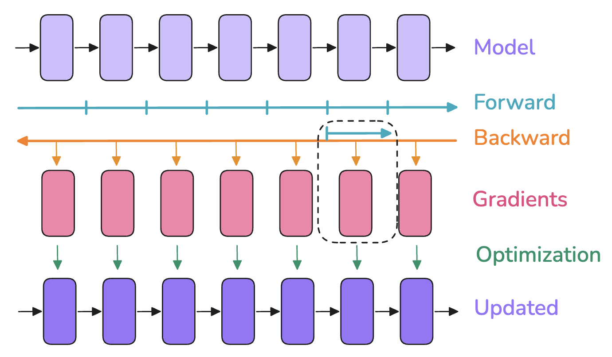
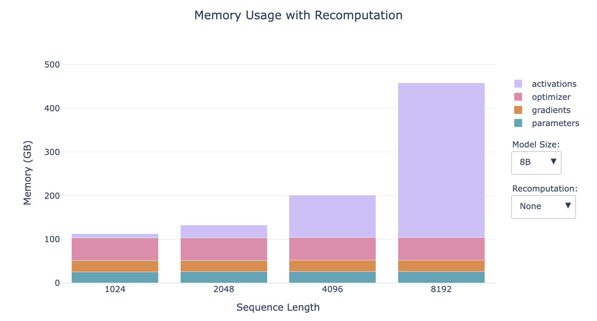
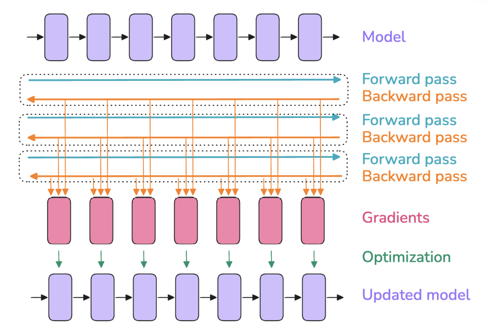
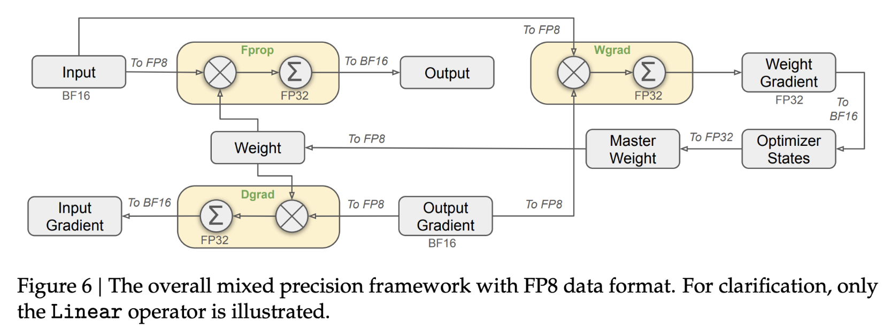
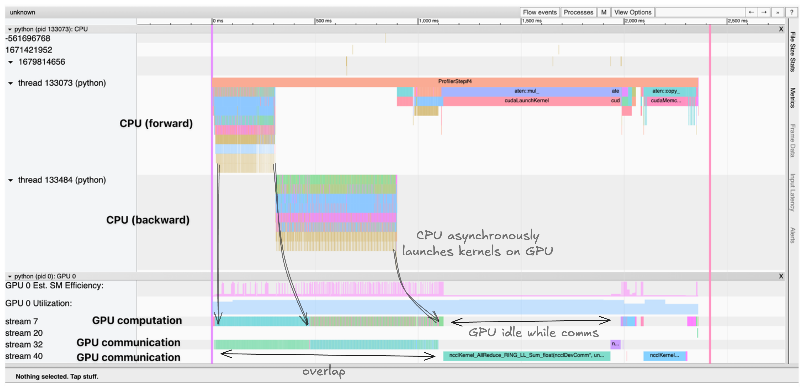
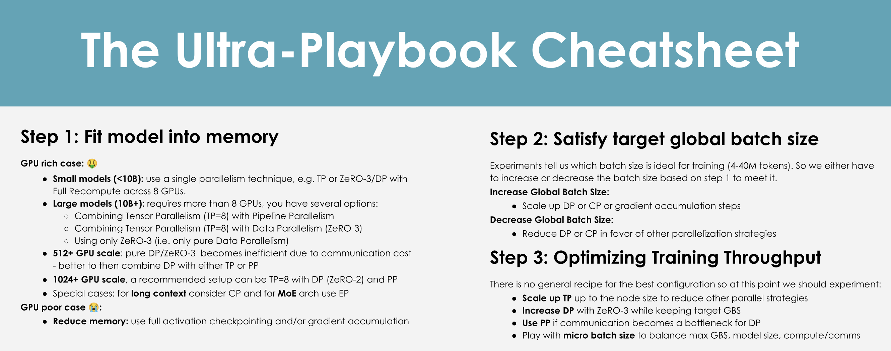
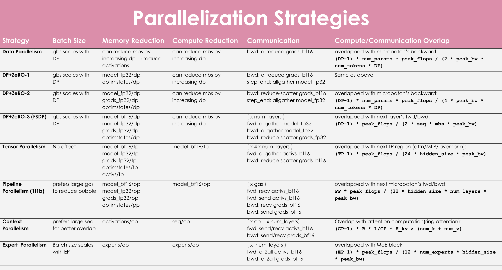

# 分布式训练之一：模型训练的内存占用
<!-- more -->
## 1. 指标
目标： 充分利用GPU这个昂贵的硬件
- 吞吐量 throughput
- GPU利用率 GPU utilization
- 训练时间 training time

## 2. 三大关键挑战 three key challenges
- 内存使用量 Memory Usage / Memory
    - 硬限制
    - OOM（out-of-memory）内存溢出问题
- 计算效率 Compute Efficiency / Computation
    - 希望硬件花费更多时间在计算上而不是数据传输或等待其他GPU执行任务上 
- 通信开销 Communication overhead / Communication
    - 充分使用节点内带宽（快速）和节点间带宽（较慢）
    - 尽可能多的与计算重叠通信，避免让GPU闲置

## 3. 模型训练基础
### 3.1. 模型训练过程
模型训练由3个步骤组成
- 前向传播：inputs传给model输出outputs
- 反向传播：计算梯度gradients
- 优化步骤：优化器使用梯度gradients更新模型参数model parameters


### 3.2. 重要超参数 -- 批大小
#### 3.2.1. 批大小 Batch Size (bs)

同时影响模型的收敛性(convergence)和吞吐量(throughput)

在训练初期，小的批次大小对较快达到最佳学习点很有用。但是，在模型训练的后期，小的批次大小会使梯度保持嘈杂，模型可能无法收敛到最佳的最终性能。在另一个极端，大的批次大小虽然可以提供非常准确的梯度估计，但往往无法充分利用每个训练数据，从而导致收敛速度变慢，并可能造成计算浪费。

批次大小还会影响在给定文本数据集上进行训练所需的时间：较小的批次大小将需要更多的优化器步骤来对相同数量的样本进行训练。优化器步骤成本高昂（在计算时间方面），因此与使用较大的批次大小相比，总训练时间将会增加。

batch size 扩展链接：
- OpenAI论文：https://arxiv.org/pdf/1812.06162
- MiniMax-01论文：https://filecdn.minimax.chat/_Arxiv_MiniMax_01_Report.pdf

#### 3.2.2. 批大小token数 Batch Size Tokens (bst)
在LLM预训练领域，通常以词元tokens而非样本数量samples来报告批次大小（bst = Batch Size Tokens）。
这样做使得训练数据量在总体上与训练期间使用的具体输入序列长度无关。

```
bst=bs∗seq
```
其中seq为模型输入序列长度

理想批大小token数为： 4-60 million token

## 4. 模型训练的内存使用
4项
- 模型参数 Model Parameters (weights & Biases)
    - 作用：决定了模型的表现，训练模型就是更新这些参数
    - 内存占用：由参数量决定，每个参数是一个浮点数，具体取决于使用的精度
    - 变化情况：训练期间固定不变
- 优化器状态 Optimizer States
    - 作用：用于辅助参数更新来最小化损失函数
    - 内存占用：不同的优化器会占用不同大小的内存，许多优化器（如Adam、RMSprop等）会存储每个参数的额外状态（如动量、平方梯度等）。例如，Adam优化器会为每个参数存储两个额外的变量：一是动量（momentum），二是梯度平方的平均值（variance）。这意味着每个参数都会占用额外的内存，通常是其参数内存占用的两倍。
    - 变化情况：训练期间固定不变
- 激活值 Activations 
    - 作用：前向传播时各层的输出为激活值，用于反向传播时计算梯度
    - 内存占用：与批次大小、序列长度、模型结构相关。通常较大，尤其是在深层网络或大批次训练时。
    - 变化情况：在每一次前向传播后，激活值会被存储并在反向传播中使用，随批次大小和输入数据变化，训练期间动态变化
- 梯度 Gradients
    - 作用：反向传播，计算参数更新的方向和幅度，用于更新参数
    - 内存占用：在反向传播过程中，需要为每个参数存储一个相同维度的梯度矩阵（每个参数对应一个梯度），占用内存总量与模型参数大小相同
    - 变化情况：训练期间动态变化，反向传播时计算并存储，更新参数后释放

上述4项以张量tensors的形式存储，有不同的形状shapes和精度precisions

决定形状shapes的超参数
- batch size
- sequence length
- model hidden dimensions
- attention heads
- vocabulary size
- model sharding

常见精度precisions
- FP32 (full precision) -> 4 bytes
- BF16 -> 2 bytes
- FP8 -> 1 byte

训练过程中，内存的使用量是持续变化的而不是静止不变的

- 初始化
    - 初始化模型参数（神经网络模型通常会随机初始化权重，有些方法（如Xavier初始化、He初始化）能帮助避免梯度消失或梯度爆炸问题）
- 循环迭代
    - 前向传播
        - 计算模型输出，存储激活值hidden_state
    - 计算损失
        - 计算损失值（损失值通常是一个标量，内存占用较小）
    - 反向传播
        - 计算并存储梯度
    - 参数更新
        - 优化器会根据梯度更新模型参数，并维护优化器状态


## 5. 内存优化建议
- 激活值重新计算: 减少激活值的内存占用，仅存储部分激活值，在需要时重新计算，以减少内存占用
- 梯度累积：将batch_size拆成多个小批次，每个小批次独立进行前向传播和反向传播得到各自的梯度，然后将这些小批次的梯度累积起来求平均值，进行一次参数更新（同样是一个batch_size进行一次参数更新，但拆分为小批次后，不用一次性把batch_size的批次数据加载进内存），以减少内存占用
- 混合精度训练（Mixed Precision Training）: 减少参数和梯度的内存占用，使用半精度浮点数（float16）代替单精度浮点数（float32）可以减少内存占用
- 分布式训练: 分摊内存压力，将模型或数据分布在多个GPU上，以减少单个GPU的内存占用
- 减小批量大小：减小批量大小会减少内存占用，但可能会影响训练速度
- 减少模型大小：使用更小的模型或模型压缩技术

扩展链接：
https://zdevito.github.io/2022/08/04/cuda-caching-allocator.html

## 6. 激活值重新计算 Activation Recomputation / Gradient Checkpointing / rematerialization
以时间换空间，以计算换内存：丢弃一些前向传播计算出的激活值来节省内存，并花费额外的计算在反向传播中来动态地重新计算激活值

激活值存储内容：
- 不使用重新计算的情况下：存储两个可学习操作（例如前馈网络、层归一化等）之间的每个隐藏状态，以便在反向传播时使用它们来计算梯度
- 使用重新计算的情况下：只在模型架构的几个关键点存储激活值，丢弃其余的激活值，并在反向传播时从最近保存的激活值开始动态重新计算它们，基本上是再次执行前向传播的一个子部分



激活值重新计算策略：
- 全部激活值重新计算 Full
    - 在反向传播时走一遍完整的前向传播
    - 内存占用：激活值几乎不占内存
    - 计算消耗：增加计算成本和时间高达 30-40%
- 选择部分激活值重新计算 Selective （更优选）
    - 丢弃并重新计算注意力部分（这部分造成了激活值的最大增长但有最廉价的计算成本）
    - 内存占用：减少了70%的激活值内存占用（显著减少了内存访问开销）
    - 计算消耗：增加了2.7%的计算消耗（略微增加了FLOPS的数量，其中FLOPS (Floating point operations per second)）
    - 这种权衡在具有小型高速内存的硬件上尤其有利，例如GPU，因为访问内存通常比执行计算要慢。尽管涉及额外的操作，但整体效果往往是计算速度更快，同时内存占用也大大减少。




- 越小的模型，激活值占比越大
- 序列越长，激活值占比越大
- 对于小模型的长序列情形，重新计算对内存的影响显著

Selective Recomputation的实现：FlashAttention

然而，激活值仍然与批次大小呈线性依赖关系，我们在上面的条形图中所有的配置文件都使用的是批次大小为1，因此当我们转向更大的批次大小时，这可能会再次成为一个问题。别绝望，因为我们还有第二件工具——梯度累积来救场！

## 7. 梯度累积 Gradient Accumulation
以时间换空间，以计算换内存：把批次batch再进行分批为微批次micro-batch，对每个micro-batch进行前向传播和反向传播计算梯度，然后将每个micro-batch计算的梯度进行梯度累积后（梯度累积实际上不是求和而是求平均值，以至于不受微批次micro-batch个数的影响），再执行优化器更新参数的步骤

术语
- batch size (bs)
- micro batch size (mbs)
- global batch size (gbs)
- grad_acc: the number of gradient accumulation step 梯度累积数

```
bs = gbs = mbs * grad_acc
```



梯度累积优劣势
- 优势
    - 允许batch size设置的较大但内存占用保持稳定，通过微批次micro batch size降低了随batch size线形增长的激活值的内存占用
    - 与Activation Recomputation兼容，可以一同采用来降低内存占用
    - 多个微批次的前向传播和反向传播计算，可以并行处理
- 劣势
    - 需要计算多个前向传播和反向传播，增加了计算消耗

## 8. 混合精度训练 Mixed Precision Training
### 8.1. 浮点数的数值范围与精度
PyTorch张量的默认数值精度：单精度浮点格式，也称为 FP32 或 float32
- 这意味着存储的每个数字占用 32 位（即 4 字节）

可用位数被分为三个部分来表示一个数字（科学计数法表示）：
- 符号位（Sign）：第一位决定数字是正数还是负数
- 指数（Exponent）：控制数字的大小范围  
- 尾数（Mantissa）：决定数字的有效数字


PyTorch提供的浮点格式列表：
- FP32 / float32 / 32-bit Floating Point
- FP16 / float16 / 16-bit Floating Point
- BF16 / bfloat16 / 16-bit Brain Floating Point
- FP8 / float8 / 8-bit Floating Point


Note
- bfloat16是由Google Brain提出的，其中的b表示“brain”
- 两种float8根据指数和尾数命名（e4m3和e5m2）

我们关注浮点数的2个方面：精度和数值范围
- 精度 precision：能表示数字的细腻程度（即两个相邻可表示数字之间的差距）
- 数值范围 range： 能表示的最大值和最小值

不同浮点数的数值范围：


从图中可看出（看宽度，越宽数值范围越大）：
- float32和bfloat16的数值范围一样且比较大
- float16和float8_e5m2的数值范围一样，数值范围就比较小了
- float8_e4m3有最小的数值范围

不同浮点数的精度：


从图中可看出（看竖线的间距，间距越小精度越大）：
- bfloat16的精度比float32和float16低

### 8.2. 混合精度训练理念  
混合精度训练的理念是利用较低精度的格式来减少计算和内存需求，同时尽量保持与全精度（float32）训练的性能。  

但是，完全放弃 float32 是不现实的，因为某些关键部分需要更高的精度来避免数值不稳定性。因此，实际应用中通常会混合使用高精度和低精度格式，这种方法被称为“混合精度训练”。

### 8.3. 混合精度训练的已知方法汇总


参数量 num_parameters : Ψ

- BF16+FP32混合精度baseline：2Ψ + 6Ψ + 12Ψ = 20Ψ
    - 模型参数（半精度）：2 bytes
    - 梯度（半精度） + FP32的梯度（以FP32的精度进行梯度累积）：2 + 4 = 6 bytes
    - FP32的模型参数和优化器状态：4 + （4 + 4）= 12 bytes
- 去掉FP32梯度的BF16+FP32混合精度：2Ψ + 2Ψ + 12Ψ = 16Ψ
    - 模型参数（半精度）：2 bytes
    - 梯度（半精度）：2 bytes
    - FP32的模型参数和优化器状态：4 + （4 + 4）= 12 bytes
    
### 8.4. FP16和BF16训练
简单地将所有张量和操作切换到 float16 格式通常是行不通的，结果往往是loss值发散。然而，最初的混合精度训练论文提出了三种技巧来保持 float32 训练的性能：

- FP32 权重副本 (FP32 copy of weights)：
    - 使用 float16 权重可能会遇到两个问题。在训练过程中，某些权重可能会变得非常小，被四舍五入为 0。然而，即使权重本身不接近 0，如果更新量非常小，量级差异可能导致权重在加法操作中下溢（underflow）。一旦权重变为 0，它们在后续训练中将一直保持为 0，因为此时不再有梯度信号传递过来。
- Loss 缩放（Loss Scaling）：
    - 梯度也会面临类似的问题，因为梯度往往远小于 1，容易发生下溢。一个简单但有效的策略是在反向传播前对损失进行缩放（放大），然后在反向传播后再对梯度进行反向缩放（缩小）。这确保了反向传播过程中不会发生下溢，同时缩放操作不会影响训练，因为我们在进一步处理梯度（例如裁剪）以及优化步骤之前已经进行了反向缩放。
- 累积（Accumulation）：
    - 在 16 位精度下执行某些算术操作（例如求平均或求和）时，也可能会遇到下溢或上溢（overflow）的问题。解决方法是在操作过程中使用 float32 精度来累积中间结果，仅在最后将结果转换回 16 位精度。

三种技巧的核心目标是既利用低精度带来的计算加速，又通过引入高精度（如 float32）的部分操作来确保训练的稳定性，避免数值不稳定问题（如梯度或权重下溢）。通过这些技术，我们可以在保持训练稳定性的同时，受益于更快的低精度算术操作，从而获得更高的吞吐量。

### 8.5. FP8训练
- FP8 精度和数值范围都非常有限，容易导致数值不稳定和Loss发散，尤其是在高学习率场景下。
- FP8 的主要优势在于它能显著提升计算效率（例如在 NVIDIA H100 GPU 上，FP8 的矩阵乘法性能是 bfloat16 的两倍），这对追求高吞吐量和低能耗的训练非常有吸引力。


#### 8.5.1. DeepSeek-V3的FP8混合精度训练
- 首次成功的、非常大规模的FP8混合精度训练在 DeepSeek-V3 上被公开报道。
- 作者仔细分析了前向传播（Fprop）的每个操作，以及反向传播中的激活值（Dgrad）和权重（Wgrad）操作。
- 为了解决 FP8 低精度带来的数值不稳定性，他们采用了与 BF16 混合精度训练类似的策略：将关键部分（如聚合操作和主权重）保持在较高精度（可能是 float32 或 bfloat16），而将计算密集的操作（例如矩阵乘法）交给 FP8 执行，从而在保证稳定性的同时充分利用 FP8 的高性能优势。



DeepSeek-V3论文：http://arxiv.org/pdf/2412.19437


## 9. 小工具
## 9.1. 计算内存使用量工具：Predict Memory
[预测内存工具](https://huggingface.co/spaces/nanotron/ultrascale-playbook)


[预测内存使用量工具](https://huggingface.co/spaces/nanotron/predict_memory)


## 9.2. 可视化GPU计算和通信成本的分布式训练工具：Profiler
用途：理解和验证GPU计算和通信成本，知道瓶颈在哪

[PyTorch's profiler](https://pytorch.org/tutorials/recipes/recipes/profiler_recipe.html)

代码：
```
with torch.profiler.profile(
    activities=[
        torch.profiler.ProfilerActivity.CPU,
        torch.profiler.ProfilerActivity.CUDA,
    ],
    schedule=torch.profiler.schedule(wait=1, warmup=1, active=3),
    on_trace_ready=torch.profiler.tensorboard_trace_handler('./log/profile'),
    with_stack=True
) as prof:
    for step in range(steps):
        train_step() 
        prof.step()
```



这会生成一个跟踪记录，我们可以在 TensorBoard 或 Chrome 的跟踪查看器中进行可视化。跟踪记录显示：
- CPU 线程异步地将内核启动到 GPU
- 多个 CUDA 流并行处理计算和通信
- 内核执行时间和内存分配
例如，跟踪记录显示 CPU 线程异步地将内核启动到 GPU，计算内核和通信在不同的 CUDA 流上并行进行。
跟踪记录有助于识别瓶颈，例如：
- 本可以重叠的顺序计算和通信
- GPU 等待数据传输的空闲时间
- CPU 和 GPU 之间的内存移动
- CPU 的内核启动开销

## 10. 参考资料：ultrascale-playbook

[https://huggingface.co/spaces/nanotron/ultrascale-playbook](https://huggingface.co/spaces/nanotron/ultrascale-playbook)

### 10.1. 概览





### 10.2. 前置基础知识
- 主流的LLM架构
- 模型训练的基础：深度学习模型怎么被训练的
    - 推荐优质教学资源
        - https://www.deeplearning.ai/
        - https://pytorch.org/tutorials/beginner/basics/intro.html

### 10.3. scaling experiments
We ran over 4000 scaling experiments on up to 512 GPUs and measured throughput (size of markers) and GPU utilization (color of markers). Note that both are normalized per model size in this visualization.

We ran over 4100 distributed experiments (over 16k including test runs) with up to 512 GPUs to scan many possible distributed training layouts and model sizes.


