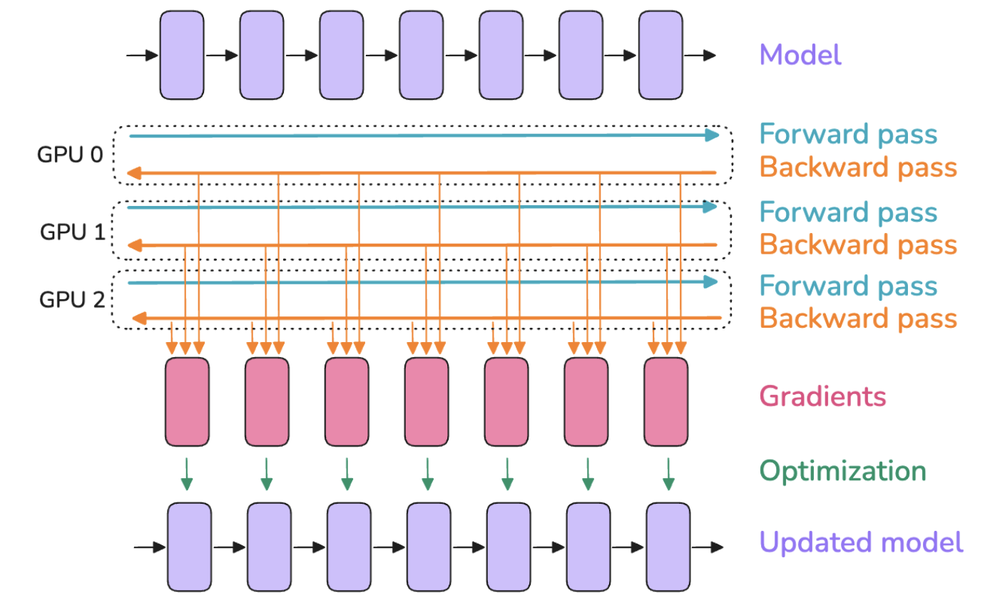
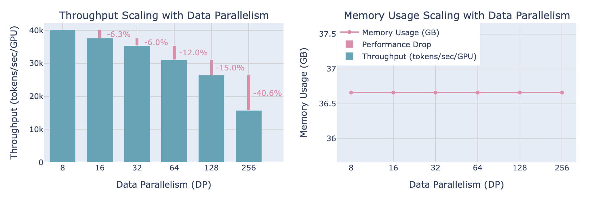

# 分布式训练之三：数据并行 Data Parallelism
<!-- more -->
## 1. DP概览
Data parallelism (DP)
- 朴素DP（naive DDP approach）
- DP优化一：为每个参数附加一个all-reduce的钩子函数
- DP优化二：分桶 Bucketing gradients
- ZeRO (Zero Redundancy Optimizer)
    - ZeRO-1: optimizer state partitioning
    - ZeRO-2: optimizer state + gradient partitioning
    - ZeRO-3 / FSDP (Fully-Sharded Data Parallelism): optimizer state + gradient + parameter partitioning

## 2. Data Parallelism (DP)
不同微批次在不同的GPU上并行处理（micro batch上只进行梯度计算，每个global batch更新一次模型参数）
- 每个GPU上复制一份模型实例
- 多个GPU并行计算微批次的前向传播和反向传播，然后计算出每个微批次的梯度
- 将微批次的梯度进行梯度累积（求平均值）-> all-reduce
- 优化器用平均梯度更新模型参数



涉及到的分布式通信 distributed communication
- all-reduce：此处用于将不同GPU上计算的梯度求平均值，并把每个GPU上的梯度都更新为平均梯度，从而进行梯度同步

梯度计算与梯度同步
- 梯度计算（GPU计算）：前向传播和反向传播的梯度计算
- 梯度同步（GPU通信）：触发分布式通信all-reduce操作进行梯度同步

### 2.1. 朴素DP（naive DDP approach）
原理：GPU计算完成后进行GPU通信，再等GPU通信完成后进行GPU计算
- 等待每个GPU计算梯度完成后，触发一次分布式通信all-reduce操作进行梯度同步，然后等待梯度同步完成后，优化器进行更新参数


改进空间：在通信进行时，GPU处于空闲状态，而我们应该尽量让通信和计算重叠，尽可能使它们同时进行
### 2.2. DP优化
将梯度计算的反向传播和梯度同步重叠
- DP优化一：多个GPU上的某个参数都计算出梯度了，就开始对这个参数的梯度进行all-reduce操作
- DP优化二：多个GPU上的某个层都计算出梯度了，就开始对这个层的梯度进行all-reduce操作

#### 2.2.1. DP优化一：为每个参数附加一个all-reduce的钩子函数
原理：不等所有层的反向传播都计算完成了才开始梯度同步，而是在计算出部分层的梯度后，就开始同步这些计算出的层的梯度同步，从而显著加速数据并行，减少等待整个模型梯度同步的时间（例如:llama在计算出第32层的梯度后,GPU还在计算第31层的梯度时，就开始同步第32层的梯度）

Note: 优化一甚至不等一个解码层的梯度完全计算完成才开始梯度同步，而是只要每个参数在各个GPU上计算出梯度就开始同步这个参数的梯度


PyTorch实现：为每个参数附加一个all-reduce的钩子函数，一旦某个参数的梯度准备就绪，就会立即触发all-reduce操作，而此时其他参数的梯度可能仍在计算中

```python
def register_backward_hook(self, hook):
    """
    Registers a backward hook for all parameters of the model that 
    require gradients.
    """
    for p in self.module.parameters():
        if p.requires_grad is True:
            p.register_post_accumulate_grad_hook(hook)
```

#### 2.2.2. DP优化二：分桶 Bucketing gradients
前置理论：GPU 操作在处理大张量时通常比对许多小张量执行多次操作更高效。这一点对通信操作同样适用。

原理：将梯度分桶（例如，按层分桶，每个解码层作为一个整体），对同一桶的所有梯度启动一次all-reduce操作，而不是对每个参数的梯度单独执行all-reduce操作。通过对每个桶执行一次all-reduce操作，我们可以显著减少通信开销并加速通信过程。


### 2.3. DB实践
术语
- bs: batch size 批次大小
- mbs: micro batch size 微批次大小
- gbs: global batch size 全局批次大小
- grad_acc: the number of gradient accumulation step 梯度累积步骤数 (指在没法并行的情况下，在一个GPU上连续串行计算几个mbs，把串行计算的这几个累积起来)
- dp: the number of parallel instances used for data parallelism 数据并行的并行实例数
- gbst: global batch size tokens 全局批次大小Token数

公式
```
bs = gbs = mbs * grad_acc * dp
```

```
gbst = batch_size * sequence_length 
```

数据并行初步方案
- 1.确定最佳的全局批次大小Token数 global batch size tokens (gbst)
    - 通过查阅文献或运行实验（测量模型收敛性）来确定
- 2.选择训练的序列长度
    - 同样可以通过查阅文献或实验来决定
    - 通常，2-8k 个 token 对于我们今天的评估来说效果可靠
- 3.找到最大本地批次大小 micro batch size (mbs)
    - 可以通过不断增加单 GPU 上的本地批次大小（mbs），直到内存耗尽，来找到最大本地批次大小
- 4.确定目标数据并行（DP）可用的GPU数量
    - gbs/dp 的值将告诉我们，为了达到所需的 gbs，还需要多少梯度累积步骤。

具体案例
- gbst（token数）= 4M tokens
- sequence_length=4K tokens
- bs=1024 samples
- observe assume: a single GPU can only fit mbs=2 in memory (也就是单个GPU单位时间只能容纳序列长度为4k tokens的2个样本), mbs需要小于等于2
- we have 128 GPUs available for training
- This means with 4 gradient accumulation steps we’ll achieve our goal of 1024 samples or 4M tokens per training step. 
    - grad_acc = bs / (dp * mbs) = 1024 / (128 * 2) = 4
- Now what if we suddenly have 512 GPUs available? We can achieve the same GBS and thus identical training by keeping MBS=2 and setting gradient accumulation steps to 1 and achieve faster training!
    - grad_acc = bs / (dp * mbs) = 1024 / (512 * 2) = 1

### 2.4. 采用DP的表现


随着扩充DP并行数量
- 吞吐量(throughput)下降  
- 内存占用保持稳定

采用这个的前提是mbs至少是1，也就是一个GPU至少能支持一个输入样本的前向传播，但这个不总是成立，甚至采用了激活值重新计算的情况下


Tip: 快速目测模型参数所需的最小内存：模型参数 * 2（e.g. 70B → 140GB (=133GiB)）

对于超大的模型或较大的批次token数，我们还有其他可选项吗？
- 有两种主要的拆分方法：并行性 parallelism（张量并行、上下文并行或流水线并行）和分片 sharding（DeepSpeed Zero 或 PyTorch FSDP）。这两种方法在某种程度上是相互独立的，实际上可以结合使用！

## 3. DeepSpeed ZeRO
### 3.1. ZeRO
DeepSpeed ZeRO官方文档：[https://www.deepspeed.ai/tutorials/zero/](https://www.deepspeed.ai/tutorials/zero/)

ZeRO 
- (**Ze**ro **R**edundancy **O**ptimizer)
- 一种内存优化技术，旨在减少LLM训练中的内存冗余
- ZeRO通过在**数据并行DP维度**上将optimizer states, gradients, and parameters进行分片来减少内存冗余，这有时需要更多GPU通信，这些通信也许能和GPU计算重叠也许不能
- 当我们提到“分区”时，是指沿着 DP 轴进行分区，因为 ZeRO 是数据并行的一部分

ZeRO的三种优化策略
- ZeRO-1: optimizer state partitioning
- ZeRO-2: optimizer state + gradient partitioning
- ZeRO-3 / FSDP (also called FSDP for “Fully-Sharded Data Parallelism”): optimizer state + gradient + parameter partitioning


Note：k=12 for Adam

Note: 激活值activations怎么不进行分片？ 因为每个DP接收不同的微批次micro-batch，其计算的激活值自然也不同，它本身就没有冗余，本来就不是共享或重复的数据，所以不需要同步，不需要分片，并且已经被用于计算DP rank各自的梯度，它的主要任务就完成了，后面已经用不到了

DP不同策略的内存占用：


ZeRO的限制：

数据并行（DP）只有在模型的单层能够适应单个 GPU 的情况下才能正常工作，而 ZeRO 只能对参数、梯度和优化器状态进行分区，无法对激活值内存进行分区！我们从之前的激活值内存讨论中回忆，激活值内存的这一部分会随着序列长度和批次大小（batch size）而线性增加。自然地，我们可以通过限制序列长度和批次大小来应对，但实际上，我们不希望因硬件限制而只能使用较短的序列长度进行训练。

### 3.2. 混合精度训练回顾
混合精度训练的已知方法汇总：


参数量 num_parameters : Ψ

- BF16+FP32混合精度baseline：2Ψ + 6Ψ + 12Ψ = 20Ψ
    - 模型参数（半精度）：2 bytes
    - 梯度（半精度） + FP32的梯度（以FP32的精度进行梯度累积）：2 + 4 = 6 bytes
    - FP32的模型参数和优化器状态：4 + （4 + 4）= 12 bytes
- 去掉FP32梯度的BF16+FP32混合精度：2Ψ + 2Ψ + 12Ψ = 16Ψ
    - 模型参数（半精度）：2 bytes
    - 梯度（半精度）：2 bytes
    - FP32的模型参数和优化器状态：4 + （4 + 4）= 12 bytes

### 3.3. ZeRO-1


单个训练步的执行过程
- 前向传播：每个副本持相同且完整的模型参数（BF16），但处理不同的微批次micro_batch（尽管参数相同，之后计算出的激活值和梯度会因微批次不同而不同）
- 反向传播：每个副本计算出完整的梯度，但由于微批次不同，每个副本的梯度也不同
- 对梯度进行reduce-scatter操作：每个副本只把优化器状态分片对应的部分梯度进行累积，其他部分的梯度保持不变
- 本地优化：每个副本在其本地优化器状态上执行更新参数的步骤，只更新优化器状态分片对应的部分参数（从 FP32 格式更新后转换回 BF16），其他参数保持不变
- 对参数进行all-gather操作：将每个副本更新的参数（BF16）部分进行收集，使每个副本都有完整的更新后的参数

和朴素DP相比
- 梯度累积从朴素DP的all-reduce操作转变为reduce-scatter操作（reduce-scatter is 2 times faster than all-reduce! ）
- 在优化器步骤后添加了all-gather操作

ZeRO的进一步优化: 将all-gather与前后操作重叠
- all-gather重叠优化器步骤：优化器更新部分参数后，就开启all-gather操作
- all-gather重叠前向传播：all-gather执行完一层的参数收集，就开启这层的前向传播

### 3.4. ZeRO-2


### 3.5. ZeRO-3 
ZeRO-3在PyTorch的实现中叫FSDP(Fully Shared Data Parallelism)


只有在模型参数用到的时候按需收集它们
- 每一层前向传播之前采用all-gather操作收集所有参数，每一层前向传播之后，将不需要的参数从内存中刷掉（从第1层到第32层进行32次）
- 每一层反向传播之前采用all-gather操作收集所有参数，每一层反向传播计算出梯度之后，将不需要的参数从内存中刷掉（从第32层到第1层进行32次）
- 优化：第32层的前向传播和反向传播合在一起，在第32层前向传播之前采用all-gather操作收集所有参数，在第32层反向传播计算出梯度之后，将不需要的参数从内存中刷掉
- 所以执行all-gather操作和将不需要的参数从内存刷掉的操作总共执行 num_layers + num_layers - 1 = 32 + 32 - 1 = 63 次，如第3个图所示有一点延迟开销
- ZeRO-3重度依赖参数通信

## 4. 扩展链接

[https://siboehm.com/articles/22/data-parallel-training](https://siboehm.com/articles/22/data-parallel-training)

[https://www.harmdevries.com/post/context-length/](https://www.harmdevries.com/post/context-length/)


## 5. 代码实现
### 5.1. Naive DP implementation with overlap in Picotron
完成代码
```python
class DataParallelNaive(nn.Module):
    """
    Naive Data Parallelism. Not used in practice. But it is a good starting point to understand how data parallelism works.
    It implements a simple all-reduce operation to synchronize gradients across multiple processes.
    And `no_sync` context manager to disable gradient synchronization.
    """
    def __init__(self, module):
        """
        Initializes the DataParallel wrapper for a given module.

        Args:
            module (nn.Module): The model to be wrapped for data parallelism.
            process_group (torch.distributed.ProcessGroup): The process group used for gradient synchronization. 
                                                            It could be a data parallel or context parallel group.
        """
        super().__init__()
        self.module = module
        self.require_backward_grad_sync = True # whether to synchronize gradients during backward pass. Set to False when using gradient accumulation
        self.register_backward_hook(self._allreduce_grads)
    
    def forward(self, *inputs, **kwargs):
        return self.module(*inputs, **kwargs)
    
    def register_backward_hook(self, hook):
        """
        Registers a backward hook for all parameters of the model that require gradients.    
        """
        for p in self.module.parameters():
            if p.requires_grad is True:
                p.register_hook(hook)
                
    def _allreduce_grads(self, grad):
        """
        Performs an all-reduce operation to synchronize gradients across multiple processes.    
        """
        # No synchronization needed during gradient accumulation, except at the final accumulation step.
        if self.require_backward_grad_sync:
            dist.all_reduce(grad, op=dist.ReduceOp.SUM, group=pgm.process_group_manager.cp_dp_group)
            grad /= pgm.process_group_manager.cp_dp_world_size
        return grad 
    
    @contextlib.contextmanager
    def no_sync(self):
        """
        A context manager to temporarily disable gradient synchronization. 
        This is useful for performing multiple backward passes during gradient accumulation without synchronizing 
        gradients in between.
        """
        self.require_backward_grad_sync = False
        yield
        self.require_backward_grad_sync = True
```

### 5.2. Bucket DP implementation in Picotron
完整代码
```python
class DataParallelBucket(nn.Module):
    """
    Data Parallelism with gradient grouped into buckets to reduce the communication overhead.
    """
    def __init__(self, module, bucket_cap_mb=25, grad_type = torch.float32):
        """
        Initialize the DataParallelBucket module.
        
        Args:
            module (nn.Module): The model to be parallelized.
            process_group: The process group for gradient synchronization, which can be either 
                           a data parallel group or a context parallel group.
            bucket_cap_mb (int, optional): The maximum size of each gradient synchronization bucket in megabytes. 
                                           Defaults to 25 MB.
            grad_type (torch.dtype, optional): The data type of gradients, defaulting to float32.
        """
        super().__init__()
        self.module = module
        self.require_backward_grad_sync = True # whether to synchronize gradients during backward pass. Set to False when using gradient accumulation
        grad_size = 2 if grad_type == torch.bfloat16 else 4 # float32 gradient: 4 bytes
        bucket_size = bucket_cap_mb * 1024 * 1024 // grad_size # number of gradients in one bucket
        self.bucket_manager = BucketManager(module.parameters(), pgm.process_group_manager.cp_dp_group, bucket_size, grad_type)
        self.register_backward_hook()
        self._post_backward_callback_set = False # whether the callback for wait gradient synchronization is set
        
    def forward(self, *inputs, **kwargs):
        return self.module(*inputs, **kwargs)

    def backward(self, input_tensor, output_tensor, output_tensor_grad):
        return self.module.backward(input_tensor, output_tensor, output_tensor_grad)
    
    def register_backward_hook(self):
        """
        Registers a backward hook to manually accumulate and synchronize gradients.
        
        This hook serves two main purposes:
        1. PyTorch does not natively support gradient accumulation with mixed precision.
        2. After gradient accumulation, it flags parameters as ready for synchronization.
        
        The gradient accumulation functions are stored to prevent them from going out of scope.
        
        References:
        - https://github.com/NVIDIA/Megatron-LM/issues/690
        - https://pytorch.org/docs/stable/generated/torch.autograd.graph.Node.register_hook.html
        - https://arxiv.org/abs/2006.15704 (page 5)
        """
        self.grad_accs = []
        for param in self.module.parameters():
            if param.requires_grad:
                # Expand so we get access to grad_fn.
                param_tmp = param.expand_as(param)
                # Get the gradient accumulator function.
                grad_acc_fn = param_tmp.grad_fn.next_functions[0][0]
                grad_acc_fn.register_hook(self._make_param_hook(param, self.bucket_manager))
                self.grad_accs.append(grad_acc_fn)
                
    def _make_param_hook(self, param: torch.nn.Parameter,bucket_manager: BucketManager):
        """
        Creates the a hook for each parameter to handle gradient accumulation and synchronization.
        """
        def param_hook(*unused):
            """
            The hook called after the gradient is ready. It performs the following:
            1. Accumulates the gradient into the main gradient.
            2. Adds a post-backward callback to wait for gradient synchronization completion.
            3. Marks the parameter as ready for synchronization.
            """
            if param.requires_grad:
                assert param.grad is not None
                param.main_grad.add_(param.grad.data) # accumulate the gradients
                param.grad = None
                
                # skip the gradient synchronization (gradient accumulation/PP micro batches)
                if self.require_backward_grad_sync:
                    # Add a callback to wait for gradient synchronization. Ensures the callback is added only once.
                    # Callback is executed after the backward pass. It should be added per backward pass.
                    if not self._post_backward_callback_set:
                        Variable._execution_engine.queue_callback(self._post_backward)
                        self._post_backward_callback_set = True
                        
                    # mark the parameter as ready for gradient synchronization. 
                    bucket_manager.mark_param_as_ready(param) 
        return param_hook
    
    @contextlib.contextmanager
    def no_sync(self):
        """A context manager to disable gradient synchronization."""
        self.require_backward_grad_sync = False
        yield
        self.require_backward_grad_sync = True
        
    def _post_backward(self):
        """
        A post-backward callback that waits for gradient synchronization to finish, then copies 
        the synchronized gradients back to the parameters' grad attribute.
        
        This method is called after the backward pass and before the optimizer step.
        """
        self.bucket_manager.wait()
        self._post_backward_callback_set = False
        # copy to params.grad so we can use the optimizer to update the parameters
        for p in self.module.parameters():
            if p.requires_grad:
                p.grad = p.main_grad.to(p.dtype) # In PyTorch, you cannot assign a gradient with one data type to a tensor of another data type.

    def reset(self):
        """
        Reset the bucket manager and zero out gradients in the model
        """
        self.bucket_manager.reset() 
```