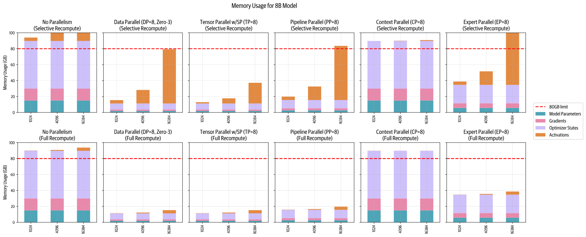
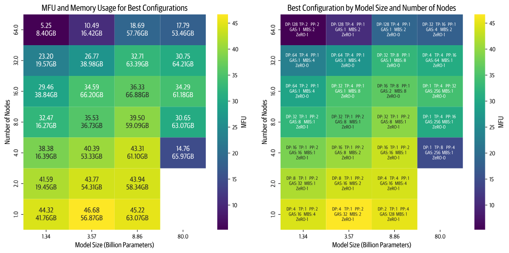
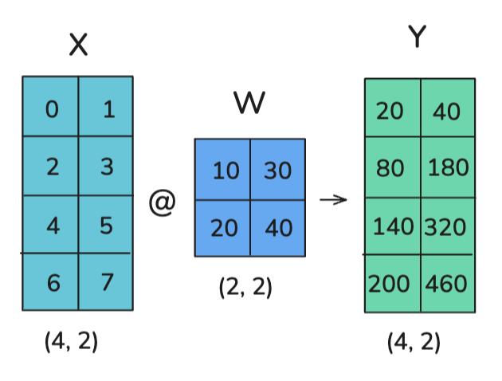
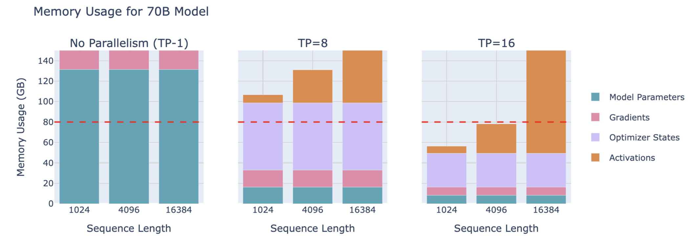
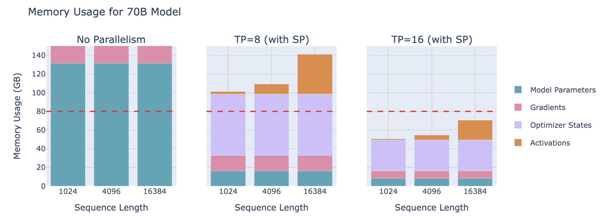
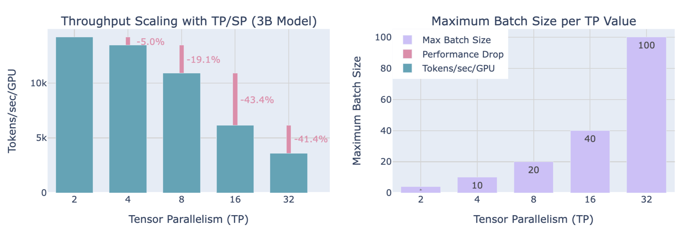
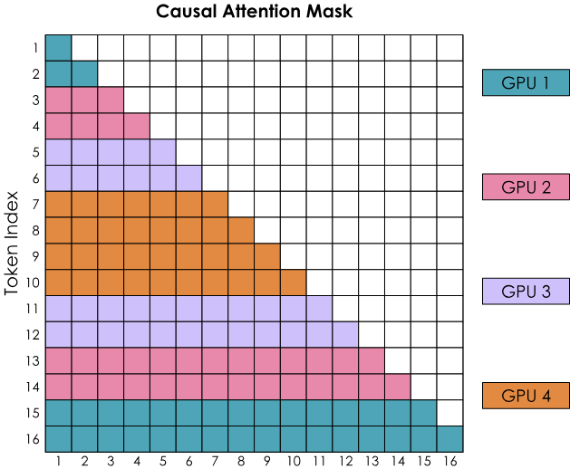

# 分布式训练之四：并行策略 
<!-- more -->
## 1. 五个维度的并行策略 5D Parallelization Strategies
### 1.1. 五个维度
- Data Parallelism (DP) -> batch维度
    - ZeRO (Zero Redundancy Optimizer)
        - ZeRO-1: optimizer state 分片
        - ZeRO-2: optimizer state + gradient 分片
        - ZeRO-3 / FSDP (Fully-Sharded Data Parallelism): optimizer state + gradient + parameter 分片
- Tensor Parallelism (TP) -> hidden_state维度
- Sequence Parallelism (SP) -> sequence维度
- Context Parallelism (CP) -> sequence维度
- Pipeline parallelism (PP) -> model_layer维度
- Expert Parallelism (PP) -> model_expert维度

### 1.2. 多个并行策略的结合
- PP + ZeRO-1/ZeRO-2/ZeRO-3
    - eg. the training of DeepSeek-v3 used PP combined with ZeRO-1 
- TP & SP + PP
- TP & SP + ZeRO-3
- CP + EP
- TP & SP + CP + EP + PP + FSDP

### 1.3. 影响范围
- TP & SP: 通过分片权重和激活值，影响整个模型的计算
- CP: 主要影响注意力层，因为那是需要跨序列通信的地方，而其他层则在分片的序列上独立运行
- EP: 主要影响MoE层（这些层替换了标准的MLP块），而注意力和其他组件保持不变
- PP: 并不特别针对任何子模块或组件
- ZeRO: 并不特别针对任何子模块或组件

### 1.4. PP vs ZeRO-3
共同点：都是将模型权重分割到多个 GPU 上，并沿着模型深度轴进行通信和计算的方法，每个设备上都会计算完整的层操作

不同点：

### 1.5. TP & SP vs CP vs EP

### 1.6. 每种并行策略节约内存的对比

## 2. 最佳训练配置
考虑点
- 考虑到计算集群的各种物理属性，网络带宽，每个节点的GPU数，每个GPU的显存大小
- 考虑模型大小
- 考虑批次大小

### 2.1. Step1: Fitting a Training Step in Memory / Fit a full model instance on our GPUs
- GPU资源多
    - 低于10B参数的模型
        - 在8个GPU上使用单一的并行策略
            - e.g. Tensor Parallelism or ZeRO-3/DP with Full Recompute across 8 GPUs
    - 参数在10B-100B之间的模型
        - 在8个GPU上使用混合并行策略
            - TP（TP=8）+ PP
            - TP（TP=8）+ ZeRO-3
            - only ZeRO-3
    - 在512个以上的GPU规模下
        - 由于通信成本，纯数据并行/ZeRO-3会开始变得低效，此时最好将数据并行与张量并行或流水线并行结合使用
    - 在1024个以上的GPU规模下
        - 推荐的配置可以是张量并行（TP=8）结合数据并行（ZeRO-2）和流水线并行
    - 特别考虑
        - 对于超长序列：CC
        - 对于MoE架构：EP
- GPU资源少
    - 完全的激活值重新计算用时间换空间  (训练有些缓慢)
    - 增加梯度累积来处理更大的批次

### 2.2. Step2: Achieving Target Global Batch Size
- 增加当前的全局批次大小
    - 扩大 DP 或 梯度累积步骤
    - 对于长序列，采用 CP
- 减少当前的全局批次大小
    - 减少 DP 
    - 对于长序列，减少 CP
### 2.3. Step3: Optimizing Training Throughput / make sure the training is running as fast as possible

在内存和通信不是瓶颈的情形下，尝试以下操作：
- 扩大TP，使用快速的节点内带宽，直到并行度接近节点大小，从而减少其他并行方式的使用
- 在保持目标批次大小的同时，增加使用ZeRO-3的数据并行
- 当数据并行的通信开始成为瓶颈时，过渡到使用流水线并行
- 尝试逐一扩展不同的并行方式
- 实验几种微批次大小（mbs），以在最大全局批次大小（GBS）、模型大小、计算和通信之间寻求最佳平衡

### 2.4. Top Configurations
固定的实验设置：
sequence length: 4096
gbs(global batch size): 1M tokens

展示了不同的模型大小，计算节点数（每个节点有8个GPU）的最佳配置，颜色表示了MFU (Model FLOPs Utilization)，其中FLOPs 为 Floating point operations per second，越亮的颜色代表更高的效率

包含的配置细节
- DP
- TP
- PP
- GAS (Gradient Accumulation Steps)
- MBS (Micro Batch Size)
- ZeRO

可获得的重要信息
- 随着节点数量的增加（更高的并行度），效率有所下降，对小模型更为明显（虽然可以通过增大批次大小来补偿小模型的尺寸，但我们受到全局批次大小限制100万的约束）
- 较大模型带来了不同的挑战。随着模型大小的增加，内存需求大幅增长。这在节点较少的情况下产生了两种情景：要么模型完全无法匹配内存大小，要么勉强匹配但由于接近GPU内存限制而运行效率低下（例如，80亿参数模型在4个节点上的训练）
- 性能在很大程度上取决于每种并行策略的具体实现的质量（当我们首次实现这两种并行策略时，张量并行（TP）优于流水线并行（PP）。在优化了我们的PP代码后，它成为了更快的选择。现在我们正在改进TP实现中的通信重叠，预计它将重新获得性能领先优势。）

## 3. 张量并行 Tensor Parallelism（TP）
### 3.1. TP原理
- ZeRO 对模型的参数、梯度和优化器状态进行了分片，但一旦激活值内存超出了我们的内存预算，我们就遇到了限制。
- 这时，我们引入张量并行（Tensor Parallelism, TP），这是一种不仅分片权重、梯度和优化器状态，还分片激活值的方法，而且在计算之前无需将它们全部聚集（gather）。

TP的原理是利用了矩阵乘法的数学性质：

案例：如何对以下的计算进行TP

方案一：列分片 / column-wise sharding / column-linear
- 将 X 进行广播：broadcast
- 将 W 进行列分片
- 聚集得到 Y：all-gather

方案二：行分片 / row-wise sharding / row-linear
- 将 X 进行列分片：scatter
- 将 W 进行行分片
- 求和得到 Y：all-reduce

### 3.2. Transformer块的TP应用
Transformer两个主要的块：
- MLP / Feedforward layers
- MHA / Multi-Head Attention
#### 3.2.1. MLP块：列分片 -> 行分片

- 图中的all-reduce操作是必要的，且不能和GPU计算重叠
- TP确实有助于减少矩阵乘法的激活值内存，但我们仍需要聚集完整的激活值用于LayerNorm的运算

#### 3.2.2. MHA块：
- Q、K、V矩阵：用列分片
    - 多头：多头注意力的每个头本身是并行的，TP正好利用这一特性
    - MQA (Multi-Query Attention)：所有 Q 共享一组 K 和 V
    - GQA (Grouped-Query Attention)：多个 Q 共享一组 K 和 V（分组共享）
    - 张量并行的列分片方式对 MQA 和 GQA 同样适用，因为 K 和 V 的共享特性不会影响头的独立计算
    - 限制条件
        - TP分片个数不要超过Q/K/V头的个数（否则不能独立的计算，需要额外的通信操作）
        - GQA分片个数不要超过K/V的头数（否则需要复制K/V的头来保持同步），例如Llama-3 8B有8个K/V头，所以TP分片不要超过8
- O矩阵：用行分片

### 3.3. 缩放TP分片大小对吞吐量和内存的影响

权衡
- 计算效率：增加的TP分片大小使得吞吐量降低（TP=8到TP=16,有显著的下降，TP=16到TP=32,有更陡的下降，下降程度随着TP的升高越发严重）
- 可用内存：增加的TP分片大小使得可处理更大的批大小

## 4. 序列并行 Sequence Parallelism (SP)
- 序列并行（SP）涉及对模型中未被张量并行（Tensor Parallelism, TP）处理的部分（例如 Dropout 和 LayerNorm）的激活值和计算进行分片，但分片是沿着输入序列维度（sequence dimension）进行的，而不是沿着隐藏维度（hidden dimension）。
- 此处的序列并行与张量并行紧密耦合，主要应用于 Dropout 和 LayerNorm 操作（For example, LayerNorm needs the full hidden dimension to compute mean and variance）
- 然而，当我们处理更长的序列时，注意力计算会成为瓶颈，这时需要引入一些技术，例如 Ring-Attention，这些技术有时也被称为序列并行，但我们将它们称为上下文并行（Context Parallelism），以区分这两种方法。因此，每次看到“序列并行”时，请记住它通常与张量并行一起使用（而上下文并行可以独立使用）。

### 4.1. TP Only 与 TP with SP

术语
- b : batch_size 批大小（张量的第一维度）
- s : sequence_length 序列长度（张量的第二维度）
- h : hidden_state 隐状态（张量的第三维度）

对比 TP Only 和 TP with SP：
- 序列并行最关键的优势是减少的需要存储的最大激活值大小
    - TP Only：在多个点都需要存形状为(b, s, h)的激活值，激活值大小为 b * s * h
    - TP with SP：激活值形状转为(b, s, h/k) 或 (b, s/k, h)，最大激活值大小被减小为 b * s * h / k，其中k为并行数
- 两者在前向传播和后向传播中的通信开销都一样
    - TP Only：每个Transformer块有2个all-reduce操作
    - TP with SP：每个Transformer块有2个all-gather操作和2个reduce-scatter操作，但由于all-reduce = reduce-scatter + all-gather，所以相当于有2个all-reduce操作，和TP Only一致

#### 4.1.1. 左图：TP Only
- f 与 f* 操作
    - f 操作
        - 前向传播中是空操作
        - 反向传播中是all-reduce操作
    - f* 操作
        - 前向传播中是all-reduce操作
        - 反向传播中是空操作
- 整体的张量变化
    - (b, s, h) -> Full
    - f
    - (b, s, h/k) -> TP (列分片 -> 行分片)
    - f*
    - (b, s, h) -> Full
    - f
    - (b, s, h/k) -> TP (列分片 -> 行分片)
    - f*
    - (b, s, h) -> Full

#### 4.1.2. 右图：TP with SP
- g 与 g* 操作
    - g 操作
        - 前向传播中是all-gather操作
        - 反向传播中是reduce-scatter操作
    - g* 操作
        - 前向传播中是reduce-scatter操作
        - 反向传播中是all-gather操作
- 整体的张量变化
    - (b, s/k, h) -> SP
    - g
    - (b, s, h/k) -> TP (列分片 -> 行分片)
    - g*
    - (b, s/k, h) -> SP
    - g
    - (b, s, h/k) -> TP (列分片 -> 行分片)
    - g*
    - (b, s/k, h) -> SP 

### 4.2. 吞吐量和内存占用
TP with SP 的 MLP 部分情况：
- 与TP Only一样，GPU通信不能与GPU计算重叠，这使得吞吐量严重依赖于通信带宽

70B模型的内存占用：

3B model with 4096 seqlen 的 TP with SP 缩放对吞吐量和内存利用的影响： 

同样需要权衡吞吐量和内存占用

## 5. Context Parallelism (CP)

### 5.1. Ring Attention 环形注意力

在每个时间步，每个GPU接连着执行这三个操作：
- 1.发送当前的K、V到下一个GPU
- 2.本地计算注意力得分
- 3.等待接收上一个GPU传来的K、V

朴素实现存在的问题：因为有掩码，所以数据呈下三角，而Softmax是按行计算的，各个GPU上的计算是不平衡的

### 5.2. Zig-Zag Ring Attention
平衡计算的实现：不纯粹按顺序分配，二把前面的后面的token进行混合到一个GPU上

两种重叠计算和通信的方式
- all-gather实现：重组所有的KV在每个GPU上（以ZeRO-3的方式）
    - 需要临时存储所有的KV对
    - 通信只发生在第一步
- all-to-all(Ring)实现：环形依次收集每个GPU上的KV
    - 只需要临时存储额外的一块
    - 通信从头到尾，和计算重叠，有一些延迟开销

## 6. 流水线并行 Pipeline Parallelism (PP) 
流水线并行：把模型的层分到多个GPU上，又被称为“层间并行”

### 6.1. 内存占用

每个GPU仍需处理这批次的全部数据，只是在不同的层上，所以激活值占内存大小是完整的，激活值在一个GPU的层上处理完后被发送给下一个GPU，从而继续前向传播

### 6.2. 主要挑战：尽量避免GPU计算的闲置，提高GPU利用率
案例：16层的模型分布在4个GPU上
- tf : 前向传播的耗时
- tb : 反向传播的耗时
- 一个简单的假设：tb = 2 * tf

### 6.3. 朴素PP
- 理想总耗时：tideal = tf + tb
- 闲置时间：tpipeline_bubble = (p - 1) * (tf + tb)，其中p为并行数
- 闲置时间与理想时间的比例：rbubble = (p - 1) * (tf + tb) / (tf + tb) = p - 1

### 6.4. all-forward-all-backward (AFAB) 方案 / forward then backword / F then B
- 把批次再分为微批次，图中方块中的编号就是微批次
- 每批次被划分为8个微批次，9-16编号是下一个批次的微批次
- 假设模型有4层，每个GPU上放一层
- AFAB是指等每个批次的所有微批次的前向传播都完成后，开启这个批次所有微批次的反向传播

存在的问题：要存所有激活值（只有等前向传播都完成了，且该微批次的反向传播完成后才能释放该微批次的激活值）
### 6.5. One-forward-one-backward (1F1B)  and LLama 3.1 schemes 方案
#### 6.5.1. non-interleaved schedule 非交错调度 （默认是此）
- 和AFAB相比，只要有一个微批次的前向传播完成了，就开启这个微批次的反向传播
- 每个微批次和其他微批次不进行同步
- 非交错式调度可分为三个阶段。第一阶段是热身阶段，处理器进行不同数量的前向计算。在接下来的阶段，处理器进行一次前向计算，然后是一次后向计算。最后一个阶段处理器完成后向计算。

- 只存部分激活值（只要该微批次自己的前向传播完成，就可开启该微批次的反向传播来释放激活值，此时其他微批次的前向传播还在进行）
- 1F1B改善了内存占用但没有改善闲置问题

#### 6.5.2. Interleaving stages / interleaved schedule 交错式调度
Transformer两个主要的块：
- MLP / Feedforward layers
- MHA / Multi-Head Attention

这里的每个块代表一个计算块，绿色块代表注意力块MHA的前向传播，青色块代表前馈神经网络MLP的前向传播，粉色块代表MHA的反向传播，紫色块代表MLP的反向传播，块上的数字表示微批次ID

## 7. Expert Parallelism (EP)

MoE(Mixture-of-Experts)基础: https://huggingface.co/blog/moe

Expert Parallelism (EP)：在专家维度上并行
- 每个专家的FFN Layer是完全独立的
- 比起TP更轻量级，因为不需要切分矩阵乘法，只需要路由hidden states到正确的专家
- 一般毁于其他并行策略一起采用，如DP

