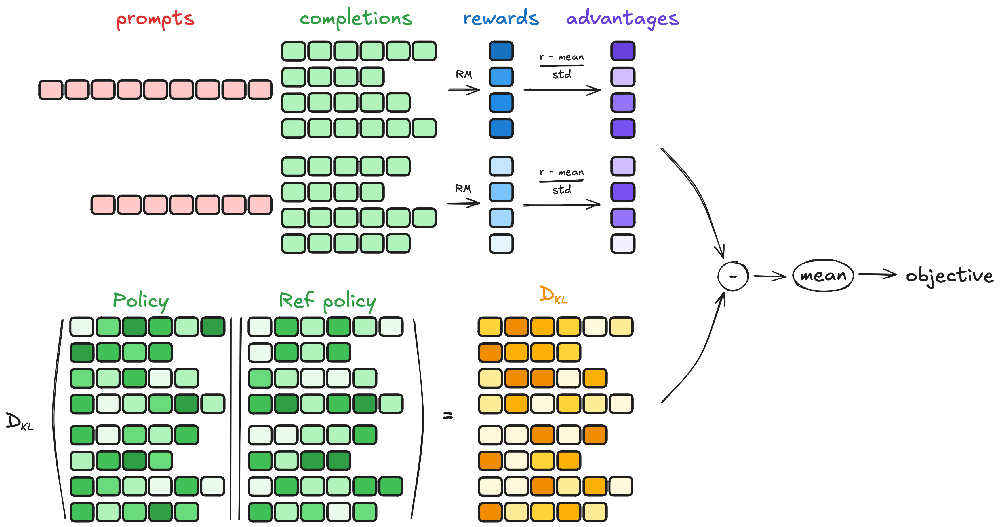

# EasyR1 + Verl + Ray + QwenVL + GRPO 
- 背景介绍
- GRPO 四个主要步骤
- 采用 EasyR1 的 GRPO 训练代码实现
- 实操记录 GRPO 训练细节
<!-- more -->

## 1. 背景介绍
- EasyR1
    - https://github.com/hiyouga/EasyR1
- Verl
    - https://github.com/volcengine/verl
- ray: 分布式计算框架
    - https://segmentfault.com/a/1190000046195156
- GRPO
    - Group Relative Policy Optimization
    - grpo_trainer：https://huggingface.co/docs/trl/v0.16.1/grpo_trainer
- 实验记录
    - 模型：QwenVL
        - https://huggingface.co/Qwen/Qwen2.5-VL-3B-Instruct
    - 数据集：geometry3k
        - https://huggingface.co/datasets/hiyouga/geometry3k
    - 环境：一台8卡A800-80G
    - 耗时：geometry3k数据集train(2.1k) 训15个episodes,共需8h20min

## 2. GRPO 四个主要步骤 GRPO Four Main Steps
GRPO 四个主要步骤
- 生成补全序列 Generating completions
- 计算优势值 Computing the advantage
- 估计KL散度 Estimating the KL divergence
- 计算损失 Computing the loss



### 2.1. 生成补全序列 Generating completions

在每个训练步骤中，采样一批提示 prompts，并为每个提示生成一组补全序列 completions（一组有 G 个，每个记为 $o_i$ ）。

### 2.2. 计算优势值 Computing the advantage

对于每个组的 G 个序列中的每一个使用奖励模型计算奖励 $r_i$，优势值 $\hat{A}_{i,t}$ 通过相对比较进行计算，并按以下方式归一化：

$$
\hat{A}_{i,t} = \frac{r_i - \text{mean}(r)}{\text{std}(r)}
$$

### 2.3. 估计KL散度 Estimating the KL divergence

KL散度使用 Schulman 等人（2020）引入的近似器进行估计。近似器定义如下：

$$
D_{\text{KL}}[\pi_\theta \parallel \pi_{\text{ref}}] = \frac{\pi_{\text{ref}}(o_{i,t} \mid q, o_{i,<t})}{\pi_\theta(o_{i,t} \mid q, o_{i,<t})} - \log \frac{\pi_{\text{ref}}(o_{i,t} \mid q, o_{i,<t})}{\pi_\theta(o_{i,t} \mid q, o_{i,<t})} - 1
$$
### 2.4. 计算损失 Computing the loss

目标是最大化优势值，同时确保模型保持接近参考策略 Ref Policy。因此，损失函数定义如下：

$$
L_{\text{GRPO}}(\theta) = -\frac{1}{G} \sum_{i=1}^G \frac{1}{|o_i|} \sum_{t=1}^{|o_i|} \left[ \frac{\pi_\theta(o_{i,t} \mid q, o_{i,<t})}{[\pi_\theta(o_{i,t} \mid q, o_{i,<t})]_{\text{no grad}}} \hat{A}_{i,t} - \beta D_{\text{KL}}[\pi_\theta \parallel \pi_{\text{ref}}] \right]
$$

其中，第一项表示缩放后的优势值，第二项表示通过KL散度惩罚偏离参考策略的行为。

## 3. 采用 EasyR1 的 GRPO 训练代码实现
### 3.1. GRPO 训练：examples/qwen2_5_vl_3b_geo3k_grpo.sh

- change注释为更改的地方
- 如果此处 python3 -m verl.trainer.main 命令行后 和 examples/config.yaml 有同样的配置项，这里的会覆盖 examples/config.yaml 中的配置

```shell
set -x

export VLLM_ATTENTION_BACKEND=XFORMERS # change
export VLLM_USE_V1=0 # change

RAY_PORT=6379 # change
DASHBOARD_PORT=8297 # change

MODEL_PATH=Qwen/Qwen2.5-VL-3B-Instruct  # replace it with your local file path

SYSTEM_PROMPT="""You FIRST think about the reasoning process as an internal monologue and then provide the final answer.
 The reasoning process MUST BE enclosed within <think> </think> tags. The final answer MUST BE put in \boxed{}."""

python3 -m verl.trainer.main \
    config=examples/config.yaml \
    data.train_files=hiyouga/geometry3k@train \
    data.val_files=hiyouga/geometry3k@test \
    data.system_prompt="${SYSTEM_PROMPT}" \ 
    worker.actor.model.model_path=${MODEL_PATH} \
    worker.rollout.tensor_parallel_size=1 \
    trainer.experiment_name=qwen2_5_vl_3b_geo_grpo \
    trainer.n_gpus_per_node=8
```

### 3.2. 配置文件：examples/config.yaml

- change注释为更改的地方

```yaml
data:
  train_files: hiyouga/math12k@train
  val_files: hiyouga/math12k@test
  prompt_key: problem
  answer_key: answer
  image_key: images
  max_prompt_length: 2048
  max_response_length: 2096 # change
  rollout_batch_size: 256 # change
  val_batch_size: -1
  shuffle: true
  seed: 1
  max_pixels: 2097152 # change
  min_pixels: 262144

algorithm:
  adv_estimator: grpo
  disable_kl: false
  use_kl_loss: true
  kl_penalty: low_var_kl
  kl_coef: 1.0e-2

worker:
  actor:
    global_batch_size: 64 # change
    micro_batch_size_per_device_for_update: 2 # change
    micro_batch_size_per_device_for_experience: 8 # change
    max_grad_norm: 1.0
    padding_free: true
    ulysses_sequence_parallel_size: 1
    model:
      model_path: Qwen/Qwen2.5-7B-Instruct
      enable_gradient_checkpointing: true
      trust_remote_code: false
      freeze_vision_tower: false
    optim:
      lr: 1.0e-6
      weight_decay: 1.0e-2
      strategy: adamw  # {adamw, adamw_bf16}
      lr_warmup_ratio: 0.0
    fsdp:
      enable_full_shard: true
      enable_cpu_offload: false
      enable_rank0_init: true
    offload: # change
      offload_params: false  # true: more CPU memory; false: more GPU memory
      offload_optimizer: false  # true: more CPU memory; false: more GPU memory

  rollout:
    temperature: 1.0
    n: 6 # change
    gpu_memory_utilization: 0.7 # change
    enforce_eager: false
    enable_chunked_prefill: false
    tensor_parallel_size: 2
    limit_images: 1 # change
    val_override_config:
      temperature: 0.2 # change
      n: 1

  ref:
    fsdp:
      enable_full_shard: true
      enable_cpu_offload: false  # true: more CPU memory; false: more GPU memory # change
      enable_rank0_init: true
    offload:
      offload_params: false

  reward:
    reward_type: function
    compute_score: math

trainer:
  total_episodes: 15 # change
  logger: ["console", "wandb"]
  project_name: easy_r1
  experiment_name: qwen2_5_7b_math_grpo
  n_gpus_per_node: 8
  nnodes: 1
  val_freq: 5  # -1 to disable
  val_before_train: true
  val_only: false
  val_generations_to_log: 1 # change
  save_freq: 5  # -1 to disable
  save_limit: 3  # -1 to disable
  save_checkpoint_path: null
  load_checkpoint_path: null
```

### 3.3. 入口点：verl.trainer.main.py
- 1.合并配置
    - 先将默认配置与配置文件中的配置进行合并
    - 再将上一部合并的配置与命令行中的配置进行合并
- 2.初始化 ray (如果 ray 没有初始化)
    - ray.init(runtime_env={"env_vars": {"TOKENIZERS_PARALLELISM": "true", "NCCL_DEBUG": "WARN"}})
- 3.让 ray 来执行 runner.run
    - ray.get(runner.run.remote(ppo_config))
- 4.实例化 trainer 并执行训练

```python
trainer = RayPPOTrainer(
    config=config,
    tokenizer=tokenizer,
    processor=processor,
    role_worker_mapping=role_worker_mapping,
    resource_pool_manager=resource_pool_manager,
    ray_worker_group_cls=ray_worker_group_cls,
    reward_fn=reward_fn,
    val_reward_fn=val_reward_fn,
)
trainer.init_workers() # Init resource pool and worker group
trainer.fit() # The training loop of PPO
```

### 3.4. trainer.fit()
```python
class RayPPOTrainer:
    def fit(self):
        for _ in tqdm(range(self.config.trainer.total_episodes), desc="Episode", position=0):
            for batch_dict in tqdm(self.train_dataloader, desc="Running step", position=1):
                # generate sequences
                gen_batch_output = self.actor_rollout_wg.generate_sequences(gen_batch)
                # compute reward
                reward_tensor, reward_metrics = self.reward_fn(batch)
                batch.batch["token_level_scores"] = reward_tensor
                reward_metrics = {f"reward/{key}": value for key, value in reduce_metrics(reward_metrics).items()}
                # recompute old_log_probs
                old_log_probs = self.actor_rollout_wg.compute_log_probs(batch)
                # compute ref_log_probs
                ref_log_probs = self.ref_policy_wg.compute_ref_log_probs(batch)
                batch.batch["token_level_rewards"] = batch.batch["token_level_scores"]
                # compute advantages
                batch = compute_advantage(
                    batch,
                    adv_estimator=self.config.algorithm.adv_estimator,
                    gamma=self.config.algorithm.gamma,
                    lam=self.config.algorithm.lam,
                )
                # update actor
                actor_output = self.actor_rollout_wg.update_actor(batch)
```

## 4. 实操记录 GRPO 训练细节
### 4.1. 关键数据信息
- train_dataset: 2100（训练数据集2100条数据）
- val_dataset: 300（验证数据集300条数据）
- max_prompt_len: 2048（Prompt最大长度为2048个token）
- max_resp_len: 2096（Completion最大长度为2096个token）
- max_total_len: 4144 （Prompt和Completion总的最大长度为4144个token）
    - （max_total_len = max_prompt_len + max_resp_len = 2048 + 2096 = 4144）
- total_episodes: 15（总的轮数Epochs为15轮）
- rollout_batch_size: 256 (256条数据作为一个rollout批次)
- rollout_n: 6 (每条数据生成序列个数为6)
- rollout_batch_size * rollout_n = 256 * 6 = 1536 (一个rollout批次处理1536个序列的生成)
- nnodes: 1 （节点个数为1）
- n_gpus_per_node: 8 （每个节点的GPU数为8）
- world_size = nnodes * n_gpus_per_node =  1 * 8 = 8 （并发度world_size为8）
- (rollout_batch_size * rollout_n) / (nnodes * n_gpus_per_node) = 256 * 6 / 8 = 192 （每个GPU上要处理192个token序列）
- global_batch_size: 64 (全局批次大小为64，也就是64个序列进行一次更新)
- global_batch_size_per_device = global_batch_size * rollout_n / world_size = 64 * 6 / 8 = 48 （每个GPU的全局批次大小）
- mini_batches = nums_per_rank / global_batch_size_per_device = 192/ 48 = 4 （每个rollout批次的处理，分成4次进行更新）
- micro_batch_size_per_device_for_experience: 8 （每个GPU的处理微批次为8）
- micro_batch_size_per_device_for_update: 2 （每个GPU上的更新微批次为2）

### 4.2. 训练细节
```shell
- episodes 15 （15个Epochs）
    - steps 8 (train_dataset / rollout_batch_size =  2100 / 256 = 8) （数据集的每256条数据作为一个rollout批次，每个Epochs分为8个steps）
        - batch_dict
            - batch_dict.keys(): ['input_ids', 'attention_mask', 'position_ids', 'problem', 'id', 'choices', 'ground_truth', 'multi_modal_data', 'multi_modal_inputs', 'raw_prompt_ids']
            - batch_dict['input_ids'].shape: (rollout_batch_size, max_prompt_len) 
                - [256, 2048]
        - nums_per_step 1536 (rollout_batch_size * rollout_n = 256 * 6 = 1536)（一个rollout批次有256条数据，每条数据生成6个序列，共要处理1536个token序列）
            - nums_per_rank 192 (rollout_batch_size * rollout_n / world_size = 1536 / 8 = 192) （共8个GPU，每个GPU上要处理192个token序列）
                - generate sequences 生成序列
                - compute reward 计算奖励
                    - reward_tensor, reward_metrics = self.reward_fn(batch)
                    - batch.batch["token_level_scores"] = reward_tensor# 每个token的得分，（每个token对应一个得分，boxed{x}那个作为答案的位置的token得分大于0，其余token等于0）
                    - reward_metrics: {'reward/overall': x1, 'reward/format': x2, 'reward/accuracy': x3}
                - Compute log probs 
                    - 24 (nums_per_rank / micro_batch_size_per_device_for_experience = 192 / 8 = 24) 计算每个补全token序列的概率估计，每个token都对应一个概率，有2096维度（每个GPU的处理微批次为8，进行24次处理）
                    - compute old_log_probs & compute ref_log_probs
                        - compute old_log_probs 计算老的actor model(本轮还未更新的)在此batch上的log_probs
                        - compute ref_log_probs 计算ref model的log_probs
        - 聚合 log prob
            - [1536, 2096] （聚合rollout批次的log prob数据）
        - compute advantage 计算优势值
            - 计算每个补全token序列的得分
                - [1536] 
                - scores = token_level_scores.sum(-1) 每个token得分之和为最终得分
            - 计算每组的均值和标准差 
                - id2mean，id2std 
                - rollout_n个uid是一样的，用来计算均值和标准差
            - 计算组内相对优势 
                - [1536] 
                - scores[i] = (scores[i] - id2mean[index[i]]) / (id2std[index[i]] + eps)
            - [1536,2096] 2096维度的值都一样，都为组内相对优势计算出的值
        - update actor（actor model == policy model）
            - 计算 mini_batches （如果rollout_batch_size==global_batch_size的话，mini_batches为1）
                - nums_per_rank 192
                - global_batch_size 64
                - global_batch_size_per_device = global_batch_size * rollout_n / world_size = 64 * 6 / 8 = 48
                - mini_batches = nums_per_rank / global_batch_size_per_device = 192 / 48 = 4
            - Train mini batch（4）
                - 一个mini_batch更新一次参数
                - 一个mini_batch每个GPU处理48条数据，每micro_batch为2进行反向传播计算梯度，进行了24次的梯度累积
                - gradient_accumulation 24 
                    - gradient_accumulation = global_batch_size_per_device / micro_batch_size_per_device_for_update = 48 / 2 = 24
```