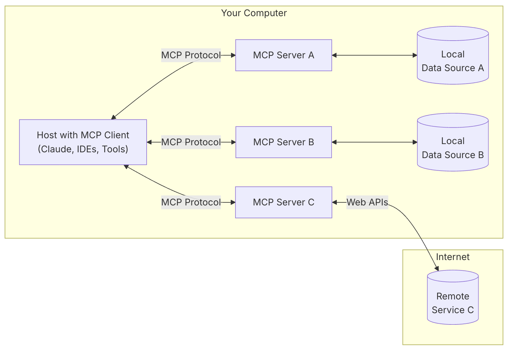
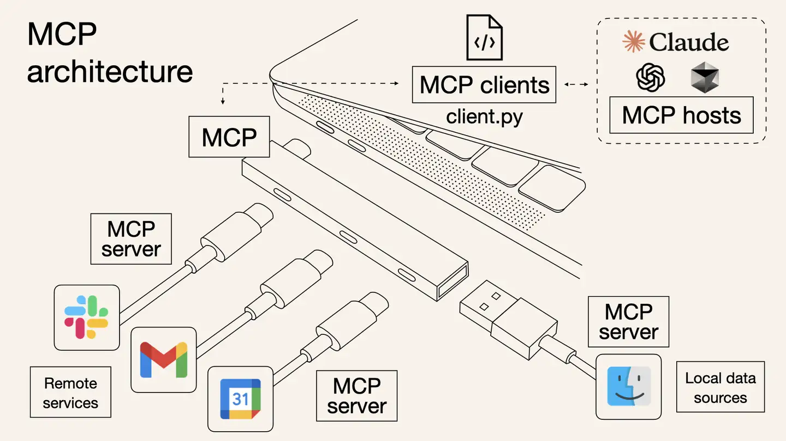
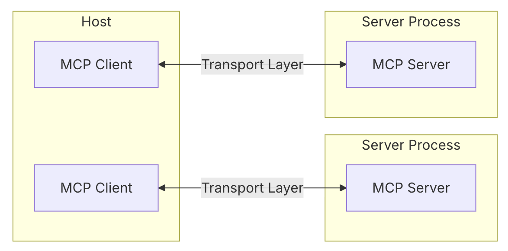
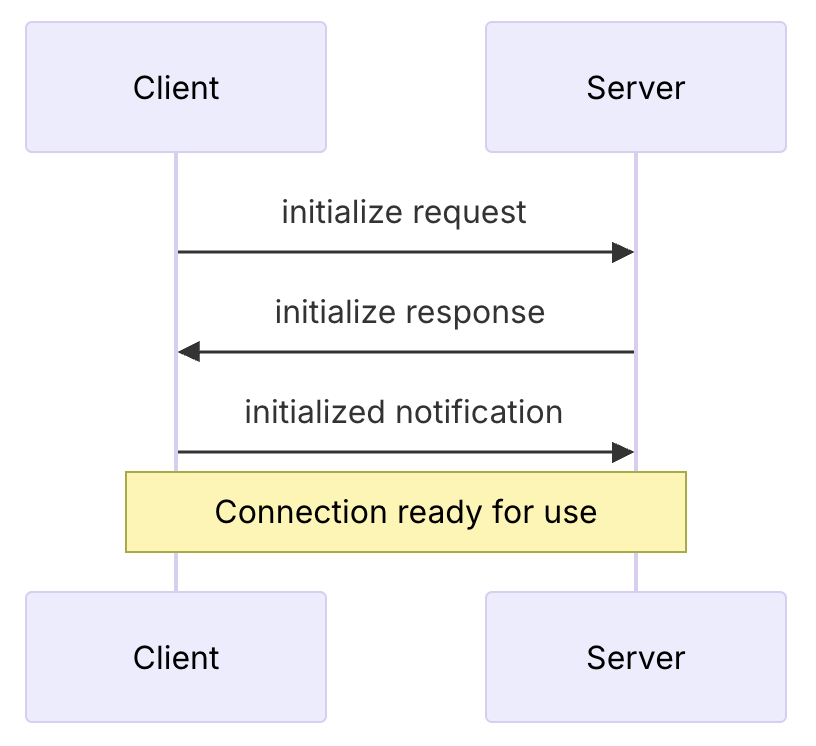
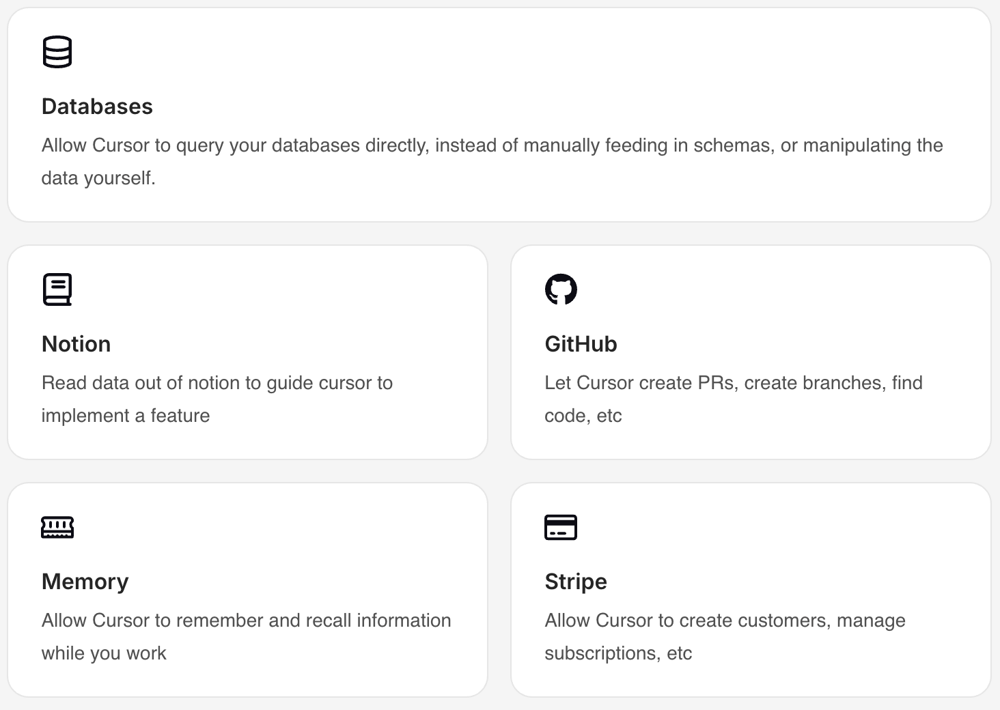
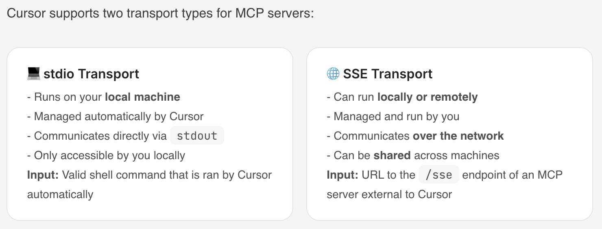
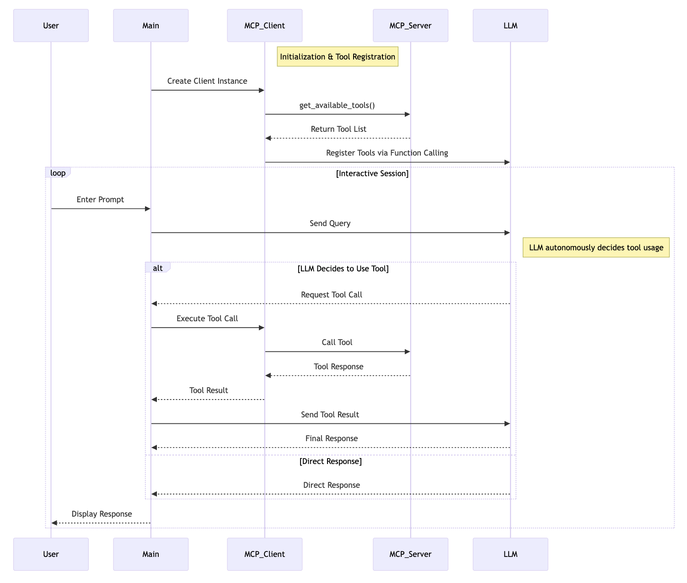

# MCP 技术解读
- MCP概念、演进与意义
- MCP架构、核心组件与功能类型
- MCP Client 与 MCP Server
- 不同角色使用 MCP 的方式和逻辑
<!-- more -->

## 1. MCP是什么
MCP（Model Context Protocol） 是由 Anthropic（就是训练 Claude 的那个公司） 推出的一种新兴的**标准开放协议**，用于解决 Agent 平台的**AI 模型与外部工具交互**的痛点，帮助你在 LLM 之上构建智能体和复杂工作流。MCP 将应用程序向 AI 模型提供上下文的方式标准化，旨在通过安全的双向连接来增强 AI 模型与工具和数据源的交互能力。可以将 MCP 视为 AI 应用的 USB-C 接口，正如 USB-C 为设备连接各种外设和配件提供了标准化方式，MCP 也为 AI 模型连接不同数据源和工具提供了标准化方法。

MCP Server 就是为了实现 AI Agent 的自动化而存在的，它是一个中间层，告诉 AI Agent 目前存在哪些服务，哪些 API，哪些数据源，AI Agent 可以根据 Server 提供的信息来决定是否调用某个服务，然后通过 Function Calling 来执行函数。以前每个工具都要单独写代码才能连AI，但现在MCP就像"通用接口"，工具和AI各装一个MCP插件，就能直接对话了。

比如要用Github服务，最终实现还是通过调用Github的API（https://api.github.com）来实现和Github交互，在调用 Github 官方的 API 之前，MCP 的主要工作是描述 Server 提供了哪些能力(给 LLM 提供)，需要哪些参数(参数具体的功能是什么)，最后返回的结果是什么。所以 MCP Server 并不是一个新颖的、高深的东西，它只是一个具有共识的协议。

官网：https://modelcontextprotocol.io/introduction

Github: https://github.com/modelcontextprotocol

## 2. AI 工具调用演进

从复杂提示词 → Function Calling → GPTs 插件 → MCP 协议的技术演进路径，非常类似于几个经典技术标准化的发展历程，特别是 Web 技术、互联网协议和 API 标准化的过程。以 Web API 的标准化进程类比，

| Web API 演进| AI 工具调用演进|
|---|---|
|早期：RPC（远程过程调用）各自实现|早期：提示词工程中的工具调用|
|发展期：SOAP 和 XML-RPC 等框架|发展期：Function Calling 的 JSON 结构化调用|
|成熟期：REST API 成为主流|成熟期：GPTs 等平台专属实现|
|统一期：GraphQL 等新一代标准|统一期：MCP 作为统一协议|

## 3. MCP 出来前后的区别是啥？意义是啥？
MCP 出来前后的区别
- MCP 出来前，Agent 平台需要自己**维护可用工具列表**以及**进行工具调用**
- Agent 平台集成 MCP 后，**维护可用工具列表**以及**进行工具调用**都由MCP来做

MCP意义
- MCP 解决了 Agent 平台工具调用标准不统一的问题，MCP Server 直接提供功能 API 作为 MCP 工具，供任意 Agent 平台直接使用，避免 Agent 平台重复造轮子，大幅降低开发成本
- MCP 通过标准化协议和客户端-服务器架构，提升了 AI 的上下文感知、自动化能力和安全性
- MCP 的客户端-服务器架构支持模块化扩展，一个客户端可连接多个服务器，Agent 平台可以轻松解锁多样化功能

## 4. MCP vs Function Calling

功能深度不同
- MCP: 连接层
- Function Calling: 执行层
- AI Agent: 决策层

应用场景不同
- MCP: 需要连接大量工具，但不想写代码
- Function Calling: 简单任务自动化
- AI Agent: 自主决策

## 5. MCP 架构
MCP 采用客户端-服务器架构







## 6. MCP 核心组件
​核心组件
- Host 主机
    - 是应用程序（如 Claude 桌面或 IDEs），它们发起连接
- Client 客户端
    - 在主机应用程序内部与服务器保持 1:1 的连接
- Server 服务器
    - 为客户端提供上下文、工具和提示
- Protocol layer 协议层
    - 协议层处理消息封装、请求/响应链接和高级通信模式
- Transport layer 传输层
    - 传输层负责处理 Client 和 Server 之间的实际通信

MCP 支持多种传输机制，所有传输都使用 JSON-RPC 2.0 来交换消息
- Stdio transport （标准输入输出传输）
    - 使用标准输入/输出进行通信
    - 适用于本地进程
- HTTP with SSE transport （使用 SSE 传输的 HTTP）
    - 服务器到客户端的消息传输: 服务器发送事件方式（Server-Sent Events，SSE）
    - 客户端到服务器的消息传输: HTTP POST方式

消息类型
- Requests
- Results
- Errors
- Notifications

## 7. MCP 连接生命周期
### 7.1. Initialization 初始化

### 7.2. Message exchange 消息交换
- 客户端或服务器发送请求，另一方响应
- 任一方发送单向消息(Notifications)
### 7.3. Termination 终止
任何一方均可终止连接

## 8. MCP 功能类型
MCP 服务器提供三种主要功能类型：
- Tools 工具
    - 可以由 LLM 集成的功能
    - 常见工具类型
        - System operations  系统操作
            - 与本地系统交互的工具
        - API integrations  API 集成
            - 封装外部 API 的工具
        - Data processing  数据处理
            - 转换或分析数据的工具
    - https://modelcontextprotocol.io/docs/concepts/tools#python
- Resources 资源
    - 可以由 LLM 读取的任何类型的数据
    - 每个资源都由一个唯一的 URI 标识，可以包含文本或二进制数据
    - Resource types  资源类型
        - Text resources  文本资源
            - 文本资源包含 UTF-8 编码的文本数据。这些适用于：
                - Source code  源代码
                - Configuration files  配置文件
                - Log files  日志文件
                - JSON/XML data  JSON/XML 数据
                - Plain text  纯文本
        - Binary resources  二进制资源
            - 二进制资源包含原始的二进制数据，以 base64 编码。这些资源适用于：
                - Images  图片
                - PDFs  PDF 文件
                - Audio files  音频文件
                - Video files  视频文件
                - Other non-text formats  其他非文本格式
    - https://modelcontextprotocol.io/docs/concepts/resources
- Prompts 提示
    - 创建可重用的提示模板和工作流程，帮助用户完成特定任务的预写提示模板
    - https://modelcontextprotocol.io/docs/concepts/prompts

两种额外功能：
- Sampling
    - MCPServer 调用 MCPClient 的 LLM
    - https://modelcontextprotocol.io/docs/concepts/sampling
- Roots
    - Roots定义了服务器可以操作的范围
    - 比如客户端在服务器上开了个人工作空间，客户端在工作空间中进行操作，告诉服务器它在用这个工作空间
    - Roots通常用于定义：
        - Project directories  项目目录
        - Repository locations  仓库位置
        - API endpoints  API 端点
        - Configuration locations  配置位置
        - Resource boundaries  资源边界
    - https://modelcontextprotocol.io/docs/concepts/roots

## 9. 不同功能类型的标准协议
### 9.1. Resources
Resources URIs 统一资源标识符
- 每个Resource都按以下标准定义
```
[protocol]://[host]/[path]
```
### 9.2. Prompts
Prompt Structure 提示结构
- 每个Prompt都按以下标准定义
```
{
  name: string;              // Unique identifier for the prompt
  description?: string;      // Human-readable description
  arguments?: [              // Optional list of arguments
    {
      name: string;          // Argument identifier
      description?: string;  // Argument description
      required?: boolean;    // Whether argument is required
    }
  ]
}
```
### 9.3. Tools
Tool definition structure 工具定义结构
- 每个 Tool 都按以下标准定义
```
{
  name: string;          // Unique identifier for the tool
  description?: string;  // Human-readable description
  inputSchema: {         // JSON Schema for the tool's parameters
    type: "object",
    properties: { ... }  // Tool-specific parameters
  },
  annotations?: {        // Optional hints about tool behavior
    title?: string;      // Human-readable title for the tool
    readOnlyHint?: boolean;    // If true, the tool does not modify its environment
    destructiveHint?: boolean; // If true, the tool may perform destructive updates
    idempotentHint?: boolean;  // If true, repeated calls with same args have no additional effect
    openWorldHint?: boolean;   // If true, tool interacts with external entities
  }
}
```
### 9.4. Sampling
Message format  消息格式
- 服务器发起 Sampling 请求都按以下标准定义
```
{
  messages: [
    {
      role: "user" | "assistant",
      content: {
        type: "text" | "image",

        // For text:
        text?: string,

        // For images:
        data?: string,             // base64 encoded
        mimeType?: string
      }
    }
  ],
  modelPreferences?: {
    hints?: [{
      name?: string                // Suggested model name/family
    }],
    costPriority?: number,         // 0-1, importance of minimizing cost
    speedPriority?: number,        // 0-1, importance of low latency
    intelligencePriority?: number  // 0-1, importance of capabilities
  },
  systemPrompt?: string,
  includeContext?: "none" | "thisServer" | "allServers",
  temperature?: number,
  maxTokens: number,
  stopSequences?: string[],
  metadata?: Record<string, unknown>
}
```

Response format  响应格式
- 客户端返回 Sampling 结果都按以下标准定义
```
{
  model: string,  // Name of the model used
  stopReason?: "endTurn" | "stopSequence" | "maxTokens" | string,
  role: "user" | "assistant",
  content: {
    type: "text" | "image",
    text?: string,
    data?: string,
    mimeType?: string
  }
}
```

## 10. MCP Client (MCP 客户端)
比较火的MCP客户端
- 适合非工程师
    - Claude Desktop App
        - Anthropic官方产品，支持MCP的本地工具和数据源集成，适合工程师和非工程师
        - https://claude.ai/download
    - LibreChat 
        - 开源聊天应用，支持MCP工具集成
        - https://github.com/danny-avila/LibreChat
- 适合工程师
    - Cursor 
        - AI驱动的代码编辑器，快速采用MCP，适合开发者
        - https://www.cursor.com/
    - Cline 
        - 开源VSCode扩展，支持MCP市场和自定义服务器
        - https://github.com/cline/cline
    - Continue
        - VSCode和JetBrains扩展，支持完整的MCP功能
        - https://github.com/continuedev/continue
    - Zed
        - 高性能代码编辑器，支持MCP扩展
        - https://zed.dev/
    - Windsurf Editor
        - AI驱动的代码编辑器，支持MCP协议
        - https://windsurf.com/editor
    - Sourcegraph Cody
        - AI编码助手，支持MCP配置
        - https://sourcegraph.com/cody

应用程序集成对 MCP 支持后（也就是作为 MCP 客户端），可为用户提供强大的 AI 上下文能力，方便用户通过 AI 模型与 MCP 服务器进行交互

不同客户端可能支持不同的 MCP 功能，因此与 MCP 服务器的集成程度也有所差异。

| Client | Resources | Prompts | Tools | Sampling | Roots | Notes |
|--------|-----------|---------|-------|----------|-------|-------|
| Claude Desktop App | ✅ | ✅ | ✅ | ❌ | ❌ | Supports tools, prompts, and resources. |
| LibreChat | ❌ | ❌ | ✅ | ❌ | ❌ | Supports tools for Agents |
| Cursor | ❌ | ❌ | ✅ | ❌ | ❌ | Supports tools. |
| Cline | ✅ | ❌ | ✅ | ❌ | ❌ | Supports tools and resources. |
| Continue | ✅ | ✅ | ✅ | ❌ | ❌ | Supports tools, prompts, and resources. |
| Zed | ❌ | ✅ | ❌ | ❌ | ❌ | Prompts appear as slash commands |
| Windsurf Editor | ❌ | ❌ | ✅ | ❌ | ❌ | Supports tools with AI Flow for collaborative development. |
| Sourcegraph Cody | ✅ | ❌ | ❌ | ❌ | ❌ | Supports resources through OpenCTX |

More:
- 官网提及的客户端列表：https://modelcontextprotocol.io/clients
- PulseMCP提及的客户端列表：https://www.pulsemcp.com/clients

### 10.1. Cursor 作为 MCP 客户端
Cursor 配置 MCP 的介绍：https://docs.cursor.com/context/model-context-protocol

将 Cursor 连接到外部工具或数据源，代替了用户通过 Prompt 告诉 Cursor 外部的一些情况

示例：



传输机制：



## 11. MCP Server (MCP 服务器)

- 官方 MCP Servers
    - https://github.com/modelcontextprotocol/servers
    - https://modelcontextprotocol.io/examples
- Cursor MCP Servers
    - https://cursor.directory/mcp
- punkpeye 精选 MCP Servers: https://github.com/punkpeye/awesome-mcp-servers/blob/main/README-zh.md
- Cline的MCP Marketplace
- https://smithery.ai/
- https://www.pulsemcp.com/
- http://glama.ai/mcp/servers

好用的MCP工具
- 数据与文件系统
    - Filesystem
        - 提供安全的文件操作功能，并且可以配置访问控制权限，确保文件访问的安全性和规范性
    - PostgreSQL
        - 提供只读数据库访问，具备架构检查功能
- 开发工具
    - GitHub
        - 实现仓库管理、文件操作，还集成了 GitHub API，方便与 GitHub 平台进行交互
    - Git
        - 提供读取、搜索和操作 Git 仓库的工具，帮助开发人员管理代码版本
- 爬虫
    - Firecrawl：复制网站
- 网络与浏览器自动化
    - Brave Search：利用Brave的搜索API进行网络和本地搜索。
    - Fetch：为LLM优化的网络内容获取和转换
    - Puppeteer：提供浏览器自动化和网页抓取功能。
    - Playwright：控制浏览器
        - 可以自动化浏览器任务。填表单，截图，导航网页。还能执行JavaScript，监控控制台日志
        - 让LLM和浏览器无缝配合。API测试也变得更简单

## 12. 不同角色使用 MCP 的方式和逻辑

- MCP Client 用户 （eg. 使用 Claude Desktop App 或 Cursor 的用户）
    - 只需在配置中添加要使用的 MCP Server 后，正常问问题就行
- MCP Client 开发者 （eg. Claude Desktop App 或 Cursor的开发者）
    - 实例化 MCP 客户端
    - MCP 客户端与 MCP 服务器建立连接
    - 每当用户发起一个问题，执行以下逻辑（传给LLM的工具列表是和工具调用是由MCP负责的）：
        - 拼接用户 query 为 messages
        - **MCP Client 获取可用工具列表 available_tools**
        - 将 messages 和 available_tools 作为入参调用 LLM
        - LLM 响应有两种：text 或 tool_use
        - 如果是 text 则将文本结果返回给用户，结束
        - 如果是 tool_use
            - **MCP Client 通过MCP Server执行工具调用**
            - 得到工具调用结果
            - messages 除了用户 query（"role": "user"）外，接着拼接 LLM 响应（"role": "assistant"）和工具调用结果（"role": "user"）为新的 messages
            - 将拼接后的 messages 和 available_tools 作为参数再次调用 LLM
            - 将 LLM 响应结果返回给用户，结束
- MCP Server 开发者
    - 实例化 MCP 服务器
    - 定义工具，实现每个工具的执行逻辑
    - 运行 MCP 服务器



## 13. MCP Client 用户使用案例（Claude Desktop App）
### 13.1. 在 Claude Desktop App 中配置想要使用的MCP服务器
在Claude Desktop App 中添加想要使用的 MCP 服务器 "weather" 到 "mcpServers" 配置项
- 告诉 Claude Desktop App 有一个名为 "weather" 的 MCP 服务器
```
{
    "mcpServers": {
        "weather": {
            "command": "uv",
            "args": [
                "--directory",
                "/ABSOLUTE/PATH/TO/PARENT/FOLDER/weather",
                "run",
                "weather.py"
            ]
        }
    }
}
```
保存配置后重启Claude Desktop App

### 13.2. 在 Claude Desktop App 中查看可用工具

可以看到配置的所有服务器提供的所有工具
- 工具名称
- 工具的功能描述
- 工具来源于哪个MCP服务器

### 13.3. 在 Claude Desktop App 中问一些相关问题
- 用户发起一个问题
- Claude分析可用工具，决定是否使用工具和使用哪个工具
- 如果确定使用MCP工具，该工具对应的MCP Client通过MCP Server执行选中的工具
- 执行结果返回给Claude
- Claude将执行结果转为自然语言响应
- 用户收到响应

## 14. 构建 MCP 服务器案例
以下代码构建的 MCP 服务器名称为 “weather”，提供了2个工具：get-alerts 和 get-forecast

### 14.1. 实例化 MCP 服务器
```
mcp = FastMCP("weather")
```
### 14.2. 定义工具，实现每个工具的执行逻辑
- 加上@mcp.tool()后，一个API就是一个MCP工具
- 不需要提供一个查询可用工具列表的API

```
@mcp.tool()
async def get_alerts(state: str) -> str:
    """Get weather alerts for a US state.

    Args:
        state: Two-letter US state code (e.g. CA, NY)
    """
    pass

@mcp.tool()
async def get_forecast(latitude: float, longitude: float) -> str:
    """Get weather forecast for a location.

    Args:
        latitude: Latitude of the location
        longitude: Longitude of the location
    """
    pass
```
### 14.3. 运行 MCP 服务器
```
mcp.run(transport='stdio')
```

## 15. 构建 MCP 客户端案例
### 15.1. 创建 .env 文件
设置Anthropic API key 
```
ANTHROPIC_API_KEY=<your key here>
```

### 15.2. 定义 MCPClient 类
```
load_dotenv()  # load environment variables from .env

class MCPClient:
    def __init__(self):
        # Initialize session and client objects
        self.session: Optional[ClientSession] = None
        self.exit_stack = AsyncExitStack()
        self.anthropic = Anthropic()
    # methods will go here
```

### 15.3. 实现服务器连接管理函数 connect_to_server
```
async def connect_to_server(self, server_script_path: str):
    """Connect to an MCP server

    Args:
        server_script_path: Path to the server script (.py or .js)
    """
    is_python = server_script_path.endswith('.py')
    is_js = server_script_path.endswith('.js')
    if not (is_python or is_js):
        raise ValueError("Server script must be a .py or .js file")

    command = "python" if is_python else "node"
    server_params = StdioServerParameters(
        command=command,
        args=[server_script_path],
        env=None
    )

    stdio_transport = await self.exit_stack.enter_async_context(stdio_client(server_params))
    self.stdio, self.write = stdio_transport
    self.session = await self.exit_stack.enter_async_context(ClientSession(self.stdio, self.write))

    await self.session.initialize()

    # List available tools
    response = await self.session.list_tools()
    tools = response.tools
    print("\nConnected to server with tools:", [tool.name for tool in tools])
```

### 15.4. 实现处理查询和工具调用的函数 process_query
```
async def process_query(self, query: str) -> str:
    """Process a query using Claude and available tools"""
    messages = [
        {
            "role": "user",
            "content": query
        }
    ]

    response = await self.session.list_tools()
    available_tools = [{
        "name": tool.name,
        "description": tool.description,
        "input_schema": tool.inputSchema
    } for tool in response.tools]

    # Initial Claude API call
    response = self.anthropic.messages.create(
        model="claude-3-5-sonnet-20241022",
        max_tokens=1000,
        messages=messages,
        tools=available_tools
    )

    # Process response and handle tool calls
    final_text = []

    assistant_message_content = []
    for content in response.content:
        if content.type == 'text':
            final_text.append(content.text)
            assistant_message_content.append(content)
        elif content.type == 'tool_use':
            tool_name = content.name
            tool_args = content.input

            # Execute tool call
            result = await self.session.call_tool(tool_name, tool_args)
            final_text.append(f"[Calling tool {tool_name} with args {tool_args}]")

            assistant_message_content.append(content)
            messages.append({
                "role": "assistant",
                "content": assistant_message_content
            })
            messages.append({
                "role": "user",
                "content": [
                    {
                        "type": "tool_result",
                        "tool_use_id": content.id,
                        "content": result.content
                    }
                ]
            })

            # Get next response from Claude
            response = self.anthropic.messages.create(
                model="claude-3-5-sonnet-20241022",
                max_tokens=1000,
                messages=messages,
                tools=available_tools
            )

            final_text.append(response.content[0].text)

    return "\n".join(final_text)
```
### 15.5. 定义 chat_loop 和 cleanup 函数
```
async def chat_loop(self):
    """Run an interactive chat loop"""
    print("\nMCP Client Started!")
    print("Type your queries or 'quit' to exit.")

    while True:
        try:
            query = input("\nQuery: ").strip()

            if query.lower() == 'quit':
                break

            response = await self.process_query(query)
            print("\n" + response)

        except Exception as e:
            print(f"\nError: {str(e)}")

async def cleanup(self):
    """Clean up resources"""
    await self.exit_stack.aclose()
```
### 15.6. 主入口
```
async def main():
    if len(sys.argv) < 2:
        print("Usage: python client.py <path_to_server_script>")
        sys.exit(1)

    client = MCPClient()
    try:
        await client.connect_to_server(sys.argv[1])
        await client.chat_loop()
    finally:
        await client.cleanup()

if __name__ == "__main__":
    import sys
    asyncio.run(main())
```