# BERT、ColBERT 和 ColPali
- BERT
- ColBERT
- ColPali
<!-- more -->

## 1. BERT
### 1.1. 什么是 BERT？
BERT（Bidirectional Encoder Representations from Transformers）是一种基于 Transformer 架构的语言模型，擅长密集嵌入和检索任务。与传统的从左向右或反之的顺序自然语言处理方法不同，BERT 通过同时分析整个词序列来掌握上下文信息，从而生成密集嵌入。

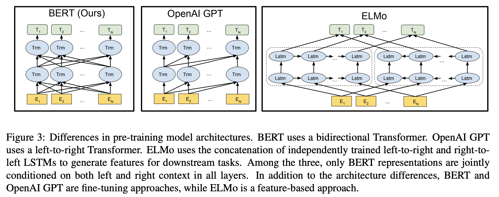

### 1.2. BERT 如何生成向量嵌入
用户查询：Milvus is a vector database built for scalable similarity search.

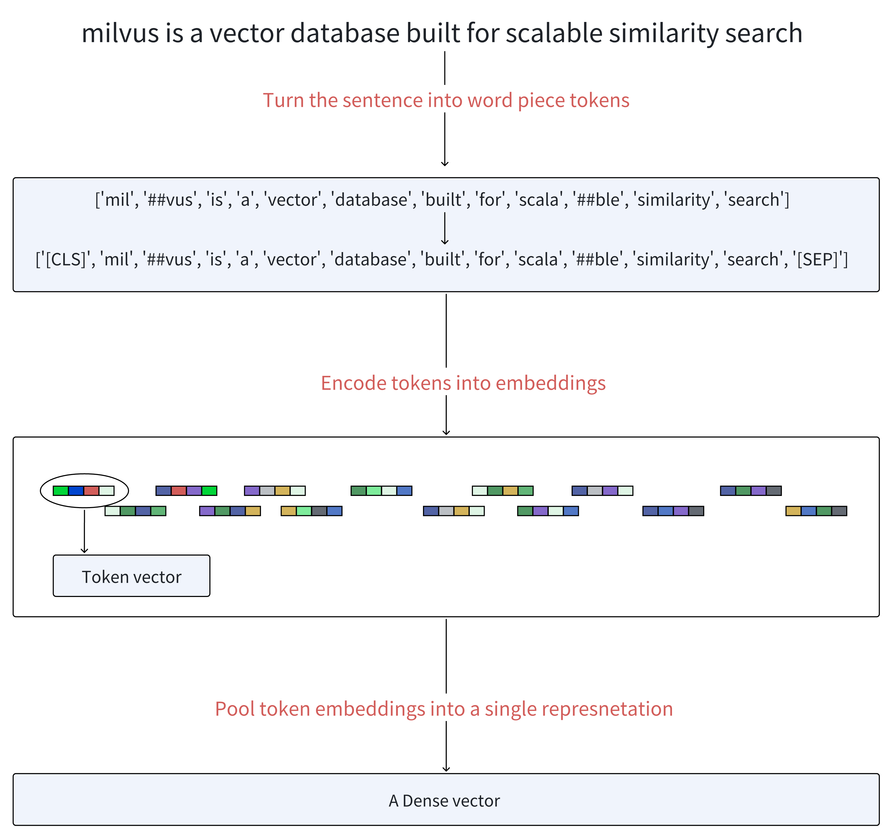

当我们向 BERT 提供查询 query 时，该过程按如下过程展开：

- 分词（Tokenization）：首先，文本首先被分词成一系列词片段，称为 tokens。然后，它在生成的 tokens 序列的开头添加一个特殊的 token [CLS]，并在这些 tokens 的末尾添加一个 token [SEP]，以分隔句子并指示结束。

- 嵌入（Embedding）：每个 token 使用嵌入矩阵转换为向量，类似于 Word2Vec 等模型。位置嵌入（Positional embeddings）被添加到这些 token 嵌入中，以保留有关单词顺序的信息，而段嵌入（segment embeddings）区分不同的句子。

- 编码器（Encoders）：向量通过多层编码器，每个编码器由自注意力机制和前馈神经网络组成。这些层基于序列中所有其他 tokens 提供的上下文迭代地优化每个 token 的表示。

- 密集嵌入输出（Dense Embeddings Output）：最后一层输出一个嵌入序列。BERT 生成密集嵌入，捕捉单个单词的含义及其在句子中的相互关系。这种方法已在各种语言理解任务中被证明非常成功，为 NLP 基准设定了新标准。

- 池化操作（Pooling Operations，可选）：所有 token 向量都使用池化操作组合以形成统一的密集表示。

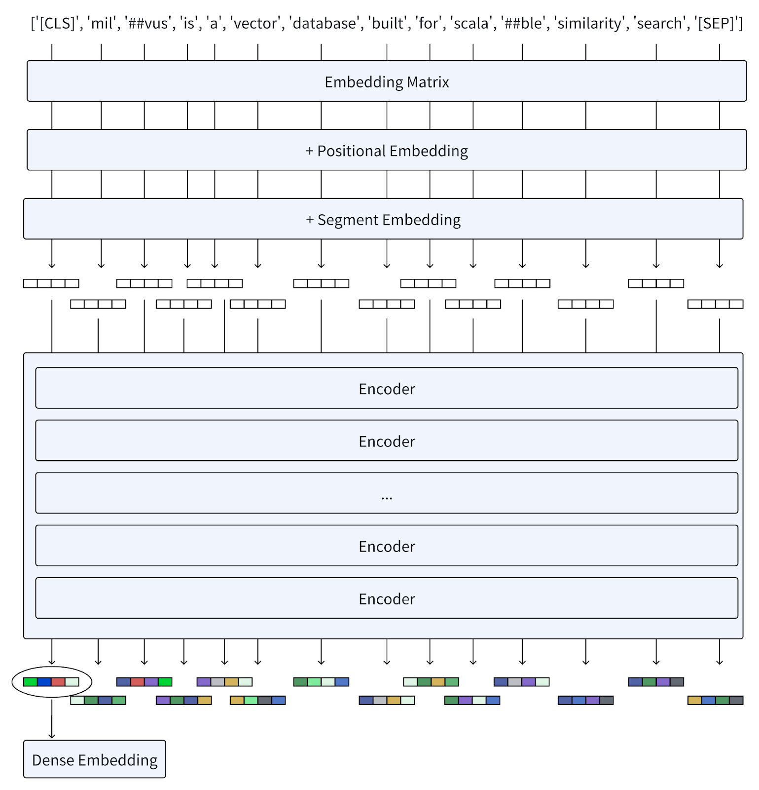

## 2. ColBERT
### 2.1. 什么是 ColBERT？
随着自然语言理解（NLU）技术的兴起，出现许多神经排序模型来增强例如 BM25的传统检索方法。

ColBERT 是一种基于 BERT 的神经排序模型，具有上下文相关的后期交互（contextualized late interaction），它标志着从传统嵌入方法的重要转变。

- 与 BERT 将 token 向量合并为单一表示不同，ColBERT 保持每个 token 的表示，从而在相似度计算中提供更精细的粒度。
- ColBERT 的独特之处在于它引入了一种新颖的后期交互机制。这种方法提供了对查询和文档之间语义关系的更详细和细致的理解。

#### 2.1.1. ColBERT 性能

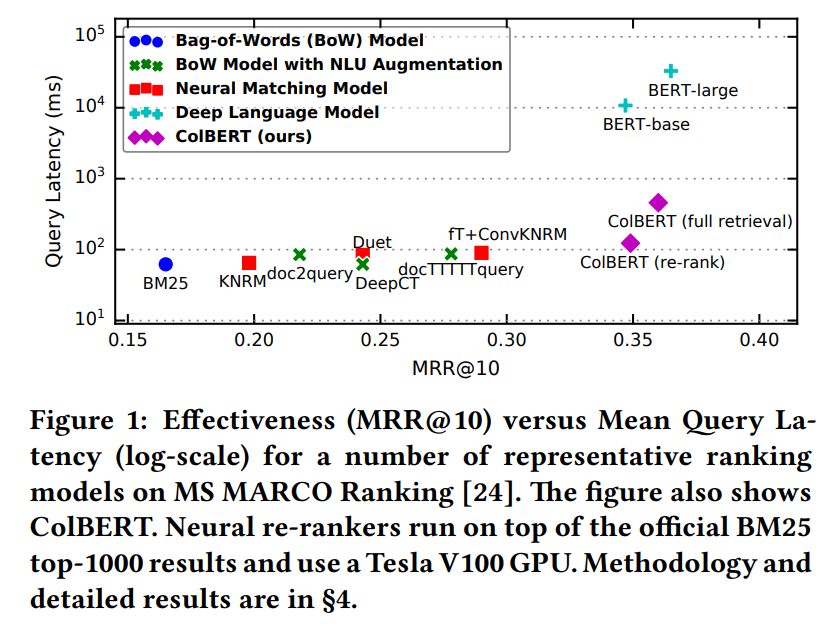

ColBERT 不仅与在现有的基于 BERT 的模型中具有竞争力（超过所有非 BERT 基线），而且效率非常高，运行速度提高了两个数量级，同时将每个查询所需的 FLOP 减少了四个数量级。

### 2.2. 理解 ColBERT 架构
下图展示了 ColBERT 的总体架构，包括：
- 一个查询编码器
- 一个文档编码器
- 后期交互机制

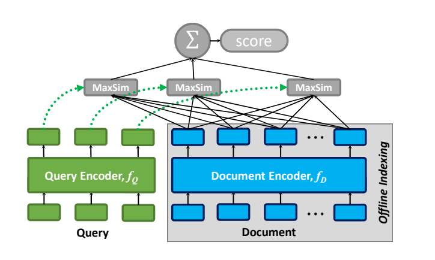

#### 2.2.1. 查询编码器：将查询 `Q` 转换为一组固定大小的嵌入 `Eq`
$$Eq := Normalize( CNN( BERT("[Q], q0, q1, ...ql, [mask], [mask], …, [mask]") ) )$$

- 步骤 1：分词（Tokenization）
- 步骤 2：BERT
- 步骤 3：CNN
- 步骤 4：归一化（Normalization）

#### 2.2.2. 文档编码器：将文档 `D` 转换为一组固定大小的嵌入 `Ed`
$$Ed := Filter( Normalize( CNN( BERT("[D], d0, d1, ..., dn") ) ) )$$

- 步骤 1：分词（Tokenization）
- 步骤 2：BERT
- 步骤 3：CNN
- 步骤 4：归一化（Normalization）
- 步骤 5：过滤（Filter）：根据预定义的列表删除标点符号（旨在减少每个文档的嵌入数量）

#### 2.2.3. 后期交互机制：用于计算 `Q` 和 `D` 之间的相关性得分
##### 2.2.3.1. 什么是“后期交互”？
在信息检索中，“交互”指的是通过比较查询和文档的向量表示来评估它们之间的相关性。“后期交互”表示这种比较发生在查询和文档被独立编码之后。这种方法与“早期交互”模型（如 BERT）形成对比，在早期交互模型中，查询和文档嵌入在更早的阶段（通常是在编码之前或期间）进行交互。

ColBERT 采用了一种后期交互机制，该机制能够预先计算查询和文档表示。然后，它在最后采用简化的交互步骤，以比较已编码表示的相似性。与早期交互方法相比，后期交互可以缩短检索时间并减少计算需求，使其非常适合有效地处理大量的文档集合。

##### 2.2.3.2. 后期交互过程如何工作？
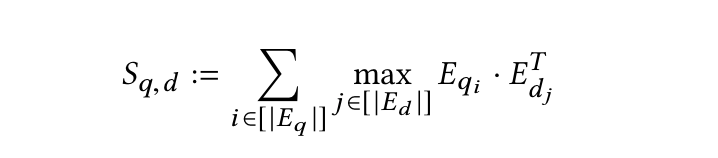

- 步骤 0：编码器将查询和文档转换为 token 级别嵌入的列表 `Eq` 和 `Ed`
- 步骤 1：执行一系列最大相似度（MaxSim）计算（最大池化）
    - 使用余弦相似度或平方 L2 距离度量
- 步骤 2：通过对所有查询 token 求和来聚合最大相似度得分，以获得每个文档的总体相关性得分。
- 步骤 3：根据相关性得分降序排列文档。

##### 2.2.3.3. “后期交互”的独特价值
- 离线索引（Offline indexing）：可以预先计算和存储文档表示，从而在查询时实现高效检索。
- 细粒度匹配（Fine-grained matching）：通过保留 token 级别的交互，后期交互可以捕捉查询和文档之间细微的相似之处，从而带来更准确的搜索和匹配结果。
- 轻量但功能强大的交互：最大相似度（MaxSim）得分的求和提供了两个关键优势。首先，它是一种特别轻量级的交互机制。更重要的是，它可以在检索期间实现高效的 top-k 剪枝，从而兼顾速度和效率。

### 2.3. ColBERTv2：一种改进的 ColBERT，可实现更好的检索效果和存储效率
- 挑战：存储消耗
    - 与 Sentence-BERT 不同，Sentence-BERT 为每个句子生成一个向量，而 ColBERT 为句子中每个词片段 token 生成一个向量。这种方法在相似性检索中非常有效，但会使这些模型的空间占用量增加一个数量级，从而在检索系统中实际部署期间需要更高的存储消耗。
- 解决方案：乘积量化（product quantization，PQ）
    - 引入 ColBERTv2 来应对这些挑战。ColBERTv2 通过将乘积量化（PQ）与基于质心的编码策略集成来增强 ColBERT。乘积量化的应用允许 ColBERTv2 压缩 token 嵌入而不会造成显著的信息丢失，从而在保持模型检索效果的同时降低存储成本。这种方式优化了存储效率，并保留了模型进行细粒度相似性评估的能力，使 ColBERTv2 成为大规模检索系统更可行的解决方案。

## 3. ColPali
### 3.1. 什么是 ColPali

ColPali 是一个**多模态模型**，能够处理图像和文本，以高效地索引和检索文档。它是 **PaliGemma-3B** 的扩展，可为文本和图像内容生成 **ColBERT 风格的多向量表示**。

**主要特点**

- **多模态（Multimodal）**：同时处理文本和视觉信息，从而实现更丰富的文档表示。
- **多向量嵌入（Multi-Vector Embeddings）**：与 ColBERT 类似，ColPali 为页面截图的每个 patch 生成一个单独的嵌入向量，而不是用单个向量表示整个页面。
- **后期交互（Late Interaction）**：在检索期间，该模型计算每个查询 token 嵌入与文档页面的所有 patch 嵌入之间的相似度。通过对所有 patch 中每个查询 token 的最大相似度求和，获得最终的文档查询相关性得分。

### 3.2. ColPali 架构
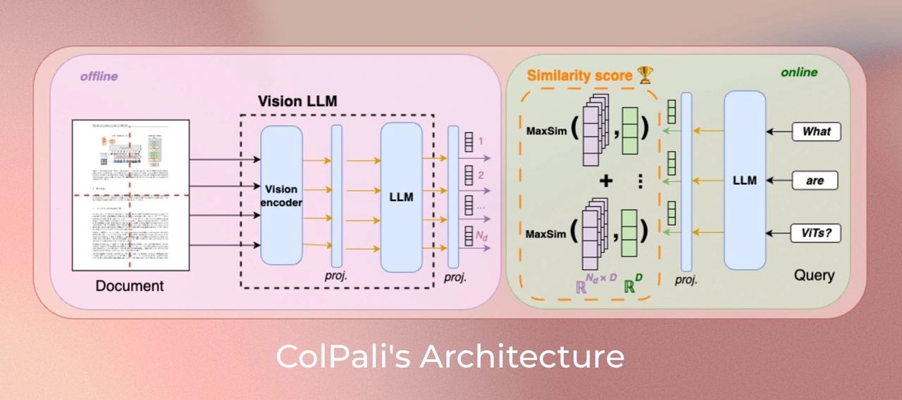

#### 3.2.1. 相关模型
- SigLIP：一种强大的视觉编码器，可为图像或文本生成单向量嵌入。
- Gemma：一种专注于文本理解的语言模型。
- PaliGemma：一种能够处理图像和文本的多模态模型，结合了 SigLIP 和 Gemma 的优势。
- ColPali：将 PaliGemma 的多模态功能与 ColBERT 的后期交互策略相结合。它利用 ViT patch 嵌入将整个 PDF 页面表示为多个嵌入，这些嵌入在 patch 级别生成。

#### 3.2.2. ColPali 工作流程
- 离线文档编码器（The Offline Document Encoder）
    - 每个文档页面经过视觉编码器（SigLIP）处理
    - 一个投影层（projection layer）
    - 将生成的图像 patch 嵌入由语言模型（Gemma-2B）处理
    - 一个投影层将输出映射到较低维度的空间（D=128）
- 在线查询编码器（The Online Query Encoder）
    - 使用语言模型对查询进行编码
    - 一个投影层
- 后期交互机制（The Late Interaction Mechanism）
    - 计算查询 tokens 和文档 patches 之间的相似度得分

### 3.3. ColPali 性能
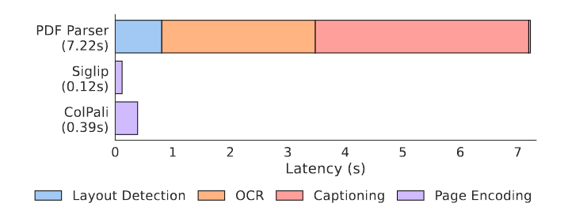

为了评估 ColPali 的性能，研究人员引入了一个名为 ViDoRe（Visual Document Retrieval，视觉文档检索）的新基准。这个全面的基准包括跨多个领域、模式和语言的各种任务。

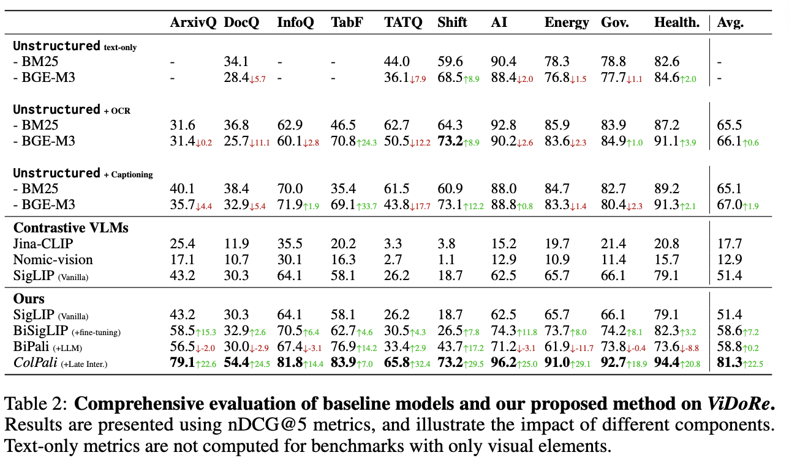

ViDoRe 基准的一些关键结果：

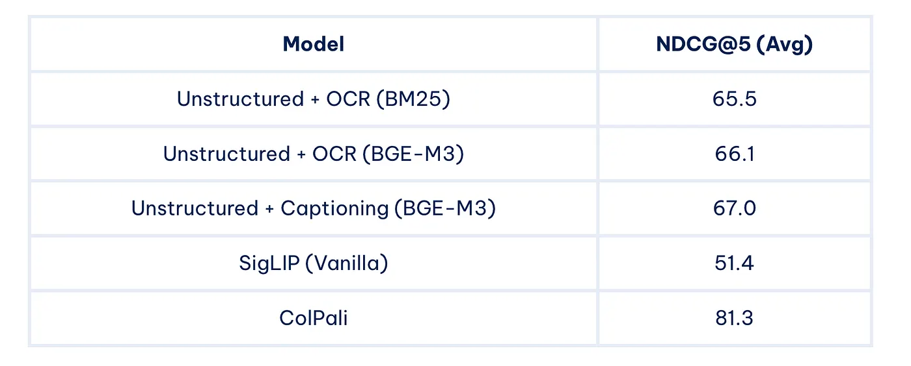

ColPali 在各种任务中显著优于其他方法，证明了其在多模态文档检索中的有效性。

### 3.4. ColPali 解决的问题
传统的文档检索系统面临着几个挑战：
- 文档包含各种视觉元素——文本、图表、表格、布局，甚至字体。将所有非文本元素转换为文本可能会丢失大量信息。
- 单独处理不同的文档类型和元素（文本、图像、表格、公式等）既耗时、脆弱又复杂。

ColPali 通过直接对文档图像进行操作来解决这些问题，从而消除了对复杂预处理步骤的需求，并实现了更快、更准确的检索。

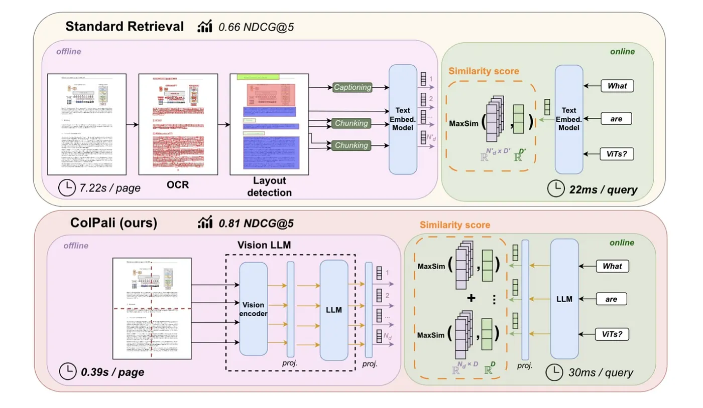

### 3.5. ColPali 的优势
- 效率（Efficiency）：实现快速索引并确保查询阶段的低延迟。
- 准确性（Accuracy）：通过利用视觉特征，ColPali 在文档检索中实现了更高的准确性，尤其是在视觉丰富的文档中。
- 灵活的端到端处理（Flexible End-to-End Processing）：ColPali 可以以完全端到端的方式处理各种文档（例如 PDF、PPT 和 Word 文件），这些文档包含各种视觉元素，包括文本、表格和图形。通过直接对文档页面图像 embedding，它消除了对复杂且脆弱的管道的需求，例如 OCR、布局分析或分块，从而允许单个模型同时利用文本和视觉内容，从而简化了整个检索工作流程。
- 可解释性（Interpretability）：提供可视化，突出显示哪些图像 patch 对检索决策的贡献最大，从而增强透明度和可解释性。
- 多语言（Multilingual）：支持跨不同语言的文档检索。
- 多模态（Multimodal）：无缝集成文本和视觉信息，以实现更强大的检索。

### 3.6. 潜在应用
ColPali 的功能为改进现有系统和支持新应用开辟了许多可能性：
- 增强 RAG 系统：通过结合 ColPali，RAG 系统可以更好地理解和检索视觉丰富的文档中的信息。
- 改进搜索引擎：ColPali 可以显著提高大型系统中文档搜索的准确性和速度。
- 文档分析：该模型理解文档布局和视觉元素的能力使其对于文档自动化分析任务非常有价值。
- 多模态问题解答：ColPali 对文本和视觉元素的理解使其非常适合回答有关复杂文档的问题。
- 法律和医学文档检索：处理大量复杂多模态文档的领域可以从 ColPali 的功能中受益匪浅。

### 3.7. 局限性和未来工作
虽然 ColPali 代表着一项重大进步，但仍有改进和进一步研究的领域：
- 内存占用（Memory Footprint）：多向量表示比传统的单向量嵌入需要更多的存储空间。
- 可扩展性（Scalability）：可能需要进一步优化以用于极其庞大的文档语料库。
- 与现有系统集成：需要将 ColPali 与流行的向量数据库和检索框架集成。

未来的研究方向可能包括：
- 探索子图像分解技术
- 优化图像 patch 重新采样策略
- 在训练期间加入难负样本问题进行信息挖掘

### 3.8. 如何使用
- 官方版本（Official Version）：https://huggingface.co/vidore/colpali-v1.3
- ColQwen2.5: https://huggingface.co/tsystems/colqwen2.5-3b-multilingual-v1.0
- Byaldi library: https://github.com/AnswerDotAI/byaldi
- LitePali: https://litepali.com/
- ColPali combined with Qwen2 VL notebook: https://github.com/merveenoyan/smol-vision/blob/main/ColPali_%2B_Qwen2_VL.ipynb

#### 3.8.1. 官方版本
为了获得最佳性能，可以使用较新的模型 ([vidore/colpali-v1.3](https://huggingface.co/vidore/colpali-v1.3))

安装 colpali-engine：
```
pip install colpali-engine>=0.3.0,<0.4.0
```

然后运行以下代码：
```
from typing import cast

import torch
from PIL import Image

from colpali_engine.models import ColPali, ColPaliProcessor

model_name = "vidore/colpali-v1.3"

model = ColPali.from_pretrained(
    model_name,
    torch_dtype=torch.bfloat16,
    device_map="cuda:0",  # or "mps" if on Apple Silicon
).eval()

processor = ColPaliProcessor.from_pretrained(model_name)

# Your inputs
images = [
    Image.new("RGB", (32, 32), color="white"),
    Image.new("RGB", (16, 16), color="black"),
]
queries = [
    "Is attention really all you need?",
    "Are Benjamin, Antoine, Merve, and Jo best friends?",
]

# Process the inputs
batch_images = processor.process_images(images).to(model.device)
batch_queries = processor.process_queries(queries).to(model.device)

# Forward pass
with torch.no_grad():
    image_embeddings = model(**batch_images)
    query_embeddings = model(**batch_queries)

scores = processor.score_multi_vector(query_embeddings, image_embeddings)
```

## 4. 参考
- ColPali Official
    - ColPali Paper: https://arxiv.org/pdf/2407.01449
    - ColPali Github: https://github.com/illuin-tech/colpali
    - ColPali Huggingface (models, data, code and benchmarks): https://huggingface.co/vidore/colpali
- ColQwen2.5: https://huggingface.co/tsystems/colqwen2.5-3b-multilingual-v1.0
- Bert Paper: https://arxiv.org/abs/1810.04805
- ColBert Paper: https://arxiv.org/pdf/2004.12832
- Bert & ColBERT & ColBERTv2: https://zilliz.com/learn/explore-colbert-token-level-embedding-and-ranking-model-for-similarity-search
- Bert & Exploring BGE-M3 and Splade: https://zilliz.com/learn/bge-m3-and-splade-two-machine-learning-models-for-generating-sparse-embeddings#BERT-The-Foundation-Model-for-BGE-M3-and-Splade
- ColPali — Revolutionizing multimodal document retrieval: https://medium.com/@simeon.emanuilov/colpali-revolutionizing-multimodal-document-retrieval-324eab1cf480
