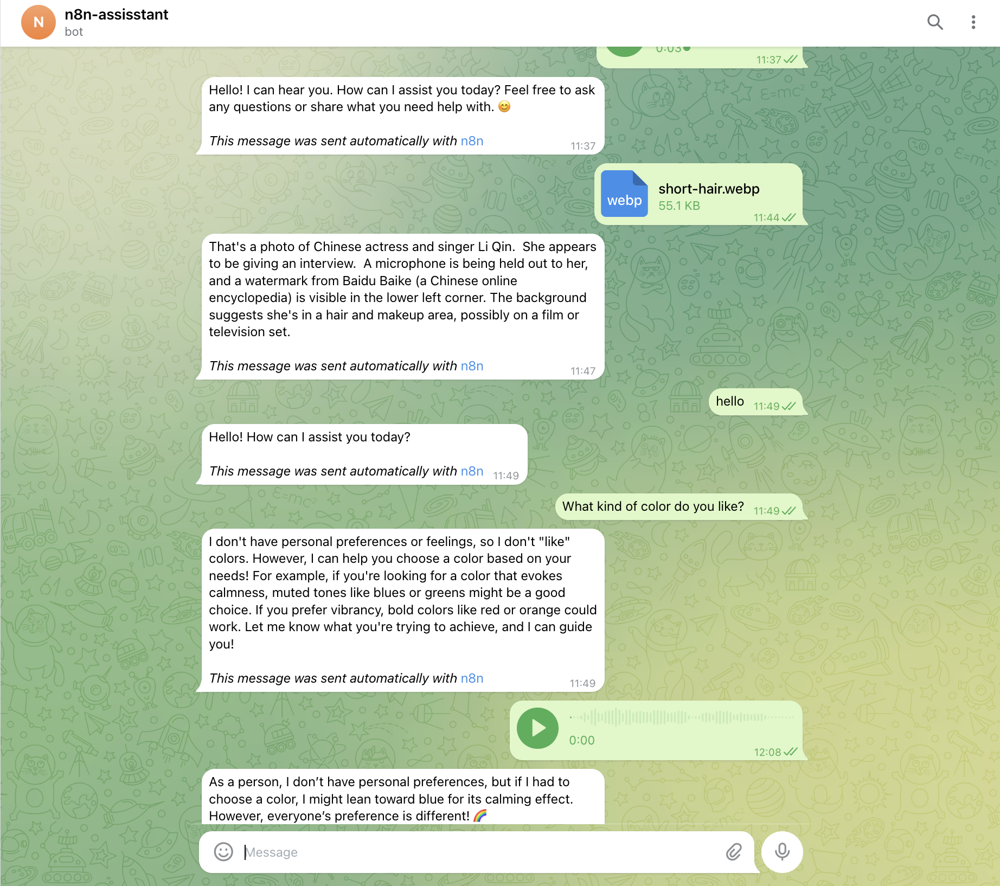
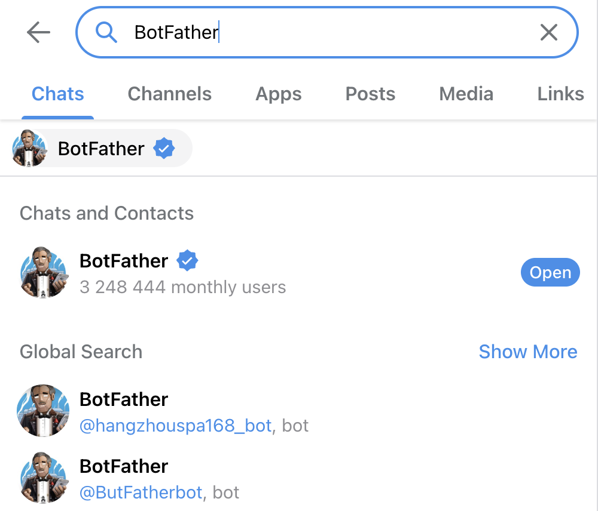
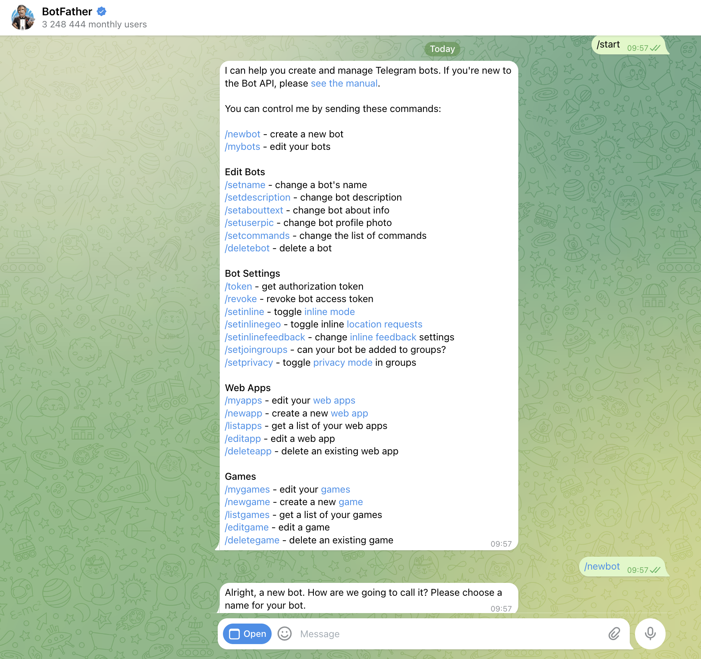
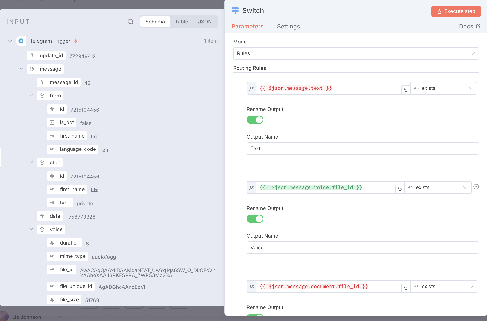
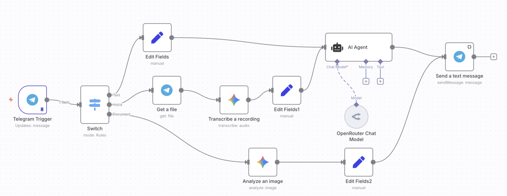
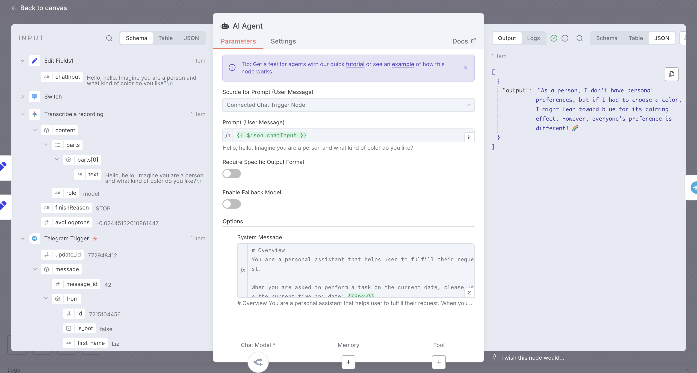
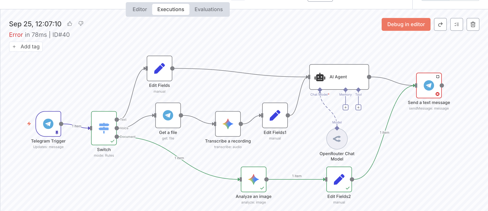

# 使用 n8n 构建 Telegram 个人助手

- 什么是 n8n 以及如何使用 n8n
- 创建 Telegram 机器人
- 在 n8n 中设置 Telegram 触发器
- 完整的工作流
<!-- more -->
## 1. 效果预览
用户以对话的方式与telegram bot交互，支持文本、语音、图片输入  
- 发送给 Telegram 机器人的消息会触发 n8n 工作流  
- n8n 处理输入并将结果发送回 Telegram
- 用户无缝接收机器人的响应



## 2. 什么是 n8n？
n8n 是一个强大的开源、低代码工作流程自动化工具，使用户能够无缝连接和自动化各种应用程序和服务。它提供了直观的可视化界面，允许通过连接“节点”（代表应用或操作）来创建工作流程，以简化数据传输、通知和任务调度等流程。

官网: https://n8n.io/

GitHub: https://github.com/n8n-io/n8n

## 3. 如何使用 n8n
有三种主要方式部署 n8n：  
1. 官方云平台  
2. 通过 Docker 本地自托管  
3. 部署在您自己的云服务器上  

在这里，我使用官方云平台以简化操作。

### 3.1. 选项 1: 官方云平台  
在官方网站上点击 **“Get Started for free”**。  

- **优点**  
  - 14 天免费试用  
  - 稳定且无需麻烦  
- **缺点**  
  - 14 天后需付费  
  - 无法访问社区节点  

### 3.2. 选项 2: 通过Docker进行本地自建
```bash
docker volume create n8n_data

docker run -it --rm \
 --name n8n \
 -p 5678:5678 \
 -e N8N_RUNNERS_ENABLED=true \
 -v n8n_data:/home/node/.n8n \
 docker.n8n.io/n8nio/n8n
```

在浏览器中打开: http://localhost:5678

n8n 连接 Ollama:

如果 n8n 部署在 docker 上，在配置 n8n 上的 Ollama 节点时，需要把 Ollama 的 `localhost` 改为 `host.docker.internal`，即

```
http://host.docker.internal:11434
```

- **优点**
  - 可以搭配 Ollama 做到完全免费
  - 支持社区节点
- **缺点**
  - 使用 webhook 或连接外部应用可能具有挑战性，需要暴露公共网络
  - 运行时会消耗本地计算机资源，计算机关闭时停止运行，每次开机需要重新启动 Docker 容器

### 3.3. 选项 3: 部署在云服务器上
- **优点**
  - 可以保持24h开机（24/7 运行）
  - 费用比官方的云平台便宜不少
- **缺点**
  - 稳定性低于官方托管
  - 对于非技术用户来说，设置可能较复杂

## 4. 创建 Telegram 机器人
- 在 Telegram 搜索栏中搜索 `BotFather`



- 添加 `BotFather` 以创建新机器人

- 与 `BotFather` 对话，设置新机器人的名称和用户名



- 您现在拥有了自己的 Telegram 机器人及其 API 令牌

## 5. 在 n8n 中设置 Telegram 触发器
常见触发器类型
- **n8n UI 中的手动触发器**：
  - 通过在 n8n 中点击 "Execute Workflow" 启动工作流
  - 在 n8n 中直接发送聊天消息以触发工作流
- **定时触发器**：每天、每小时或自定义间隔运行工作流
- **聊天应用事件**：
  - Telegram
  - WhatsApp
  - Slack
  - Discord
- **其他应用事件**：
  - 收到新 Gmail 邮件时触发
  - Notion 数据库添加新页面时触发
- **Webhook 触发器**：收到 Http 请求 （n8n平台能在公网访问）

在这里，我使用 Telegram 触发器作为入口点。

## 6. 使用 Switch 节点进行路由
参数设置
- 模式：选择 `Rules`
- 路由规则
  - 将相关字段直接拖到路由规则部分
  - 将匹配条件设置为 `String -> Exists` 以检查特定字符串的存在
  - 为每个分支定义输出名称



## 7. 处理不同分支
- 文本分支
  - 提取文本消息
  - 将其用作 User Prompt
  - 在 AI Agent 节点中与 System Prompt 结合
  - 将生成的结果发送回 Telegram
- 语音分支
  - 从 Telegram 接收音频文件
  - 使用多模态模型将其转录为文本
  - 将转录文本用作 User Prompt
  - 使用 AI Agent 处理并将结果发送回 Telegram
- 图像分支
  - 接收上传的图像
  - 使用多模态模型分析图像
  - 将分析结果发送回 Telegram

## 8. 完整工作流程


## 9. 工作流调试与优化
### 9.1. 激活之前
- **非激活状态**：当工作流程处于 “Inactive” 状态时，只能通过手动点击 “Execute Workflow” 按钮进行执行，该按钮位于底部或初始触发器节点处
- **节点检查**：每一个节点都可以看到输入信息和输出结果



### 9.2. 激活之后
- **激活工作流**：工作流程构建完成后，将其状态切换为 “Active”。通过 Telegram 发送的消息将自动触发工作流
- **执行跟踪**：每次触发都会在 n8n 平台上记录。您可以在 “Executions” 部分查看详情，包括走了哪个分支、执行是否成功。如果一部分失败了，您可以在该页面进行debug，排查问题



## 10. 下一步
- 添加记忆功能以跟踪对话历史
- 添加工具以扩展功能
- 连接知识库以获取更丰富的外部信息
- 探索其他触发器和集成以个性化您的助理